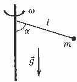
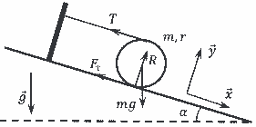

[[Състезания/2/11/2024|◂ 2024]] | [[Състезания/2/11/2025|условия]]

**Задача 1. Въртене около вертикална ос.**

а) От чертежа се вижда, че $T \sin \alpha = m \omega^2 l \sin \alpha$ \[1 т.\] (центростремителната сила е хоризонталната проекция на силата на опън на нишката). Следователно $T = m \omega^2 l$. \[2 т.\]

б) Тъй като $mg = T \cos \alpha$, \[1 т.\] то $\cos \alpha = \frac{mg}{T} = \frac{mg}{m \omega^2 l} = \frac{g}{\omega^2 l}$. \[2 т.\]

в) Тъй като $\cos \alpha = \frac{g}{\omega^2 l} \le 1$, то $\omega \ge \sqrt{\frac{g}{l}}$. Ъгълът $\alpha$ няма да е нула за $\omega > \sqrt{\frac{g}{l}}$. \[1 т.\]

г) Моментът на импулса $L$ на тялото е $L = I \omega$ \[1 т.\] $= m(l \sin \alpha)^2 \omega$ = $m l^2 \omega \left[ 1 - \left( \frac{g}{\omega^2 l} \right)^2 \right]$ при $\omega > \sqrt{\frac{g}{l}}$. \[1.5 т.\] При по-малка ъглова скорост $L = 0$. \[0.5 т.\]

**Задача 2. Цилиндър върху наклонена равнина.**

а) На чертежа вдясно са нарисувани четирите сили, които действат на цилиндъра, и по-удобната координатна система (в която три от силите имат само по една ненулева проекция). \[1 т.\] (за всяка от 4-те сили и за координатната система по \[0.2 т.\])

б) За да бъде цилиндърът в покой, сумата от силите, които му действат, както и сумата от въртящите моменти, които му действат, трябва да е нула. \[0.5 т.\]
Следователно по оста $x$: $mg \sin \alpha = T + F_т$, \[0.5 т.\] по оста $y$: $R = mg \cos \alpha$. \[0.5 т.\] От равенството на въртящите моменти (спрямо центъра на масата): $(T - F_т) \cdot r = 0$, откъдето $T = F_т$. \[0.5 т.\] Тъй като в покой $F_т \le kR$, \[0.5 т.\] то $\frac{mg \sin \alpha}{2} \le kmg \cos \alpha$, откъдето $k \ge \frac{\tan \alpha}{2}$ и $k_{min} = \frac{\tan \alpha}{2}$. \[0.5 т.\]

в) От подусловие б) следва, че $T = \frac{mg \sin \alpha}{2}$. \[1 т.\]

г) Тъй като ускорението е успоредно на наклонената равнина, $mg \sin \alpha - T - F_т = ma$, \[0.3 т.\] $R = mg \cos \alpha$, \[0.2 т.\] $F_т = kR$. \[0.2 т.\] Тъй като горната точка на цилиндъра е неподвижна спрямо равнината, $mg \sin \alpha \cdot r - F_т \cdot 2r = I_п \cdot \epsilon$, \[0.5 т.\] $a = \epsilon \cdot r$. \[0.3 т.\] Замествайки в последните две уравнения, $mg \sin \alpha \cdot r - kmg \cos \alpha \cdot 2r = \frac{3}{2} mr^2 \cdot \frac{a}{r}$, откъдето $a = \frac{2}{3} g (\sin \alpha - 2k \cos \alpha)$. \[0.5 т.\]

д) Използвайки първото уравнение от подусловие г), силата $T$ на опъване на нишката е $T = mg \sin \alpha - F_т - ma = mg \sin \alpha - kmg \cos \alpha - ma$. \[0.5 т.\] Използвайки резултата от г), $T = mg \sin \alpha - kmg \cos \alpha - \frac{2}{3} mg (\sin \alpha - 2k \cos \alpha)$ \[0.5 т.\] $= \frac{1}{3} mg (\sin \alpha + k \cos \alpha)$. \[0.5 т.\]

е) За изминато от цилиндъра разстояние $L$, извършената работа от силата на триене е $A_{тр} = -F_т \cdot 2L = -kmg \cos \alpha \cdot 2L$ (множителят 2 се дължи на факта, че относителното хлъзгане на повърхността на цилиндъра спрямо наклонената равнина е 2 пъти по-голямо от преместването на центъра на цилиндъра). \[0.5 т.\] Промяната $\Delta E_{пот}$ на потенциалната енергия на цилиндъра за това разстояние е $\Delta E_{пот} = -mg \sin \alpha \cdot L$. \[0.5 т.\]
Следователно $b = \frac{A_{тр}}{\Delta E_{пот}} = \frac{-2kmg \cos \alpha \cdot L}{-mg \sin \alpha \cdot L} = \frac{2k}{\tan \alpha}$. Тъй като $k < k_{min} = \frac{\tan \alpha}{2}$, то $0 \le b < 1$. \[0.5 т.\]

*Алтернативно решение:* $b = \frac{A_{тр}}{\Delta E_{пот}} = \frac{\Delta E_{пълна}}{\Delta E_{пот}} = \frac{\Delta E_{кин} + \Delta E_{пот}}{\Delta E_{пот}} = \frac{\Delta E_{кин}}{\Delta E_{пот}} + 1$. $\Delta E_{пот} = -mg \sin \alpha \cdot L$. \[0.5 т.\] $\Delta E_{кин} = \frac{1}{2} I_п \omega^2 = \frac{3}{4} mv^2$, където $v$ е скоростта на центъра на цилиндъра. Тъй като тялото от покой започва да се движи с ускорение $a = \frac{2}{3} g(\sin \alpha - 2k \cos \alpha)$, след изминато разстояние $L$ ще има скорост $v = \sqrt{2aL}$. Така $\Delta E_{кин} = mgL (\sin \alpha - 2k \cos \alpha)$. \[0.5 т.\] Замествайки в уравнението за $b$ се получава $b = \frac{\Delta E_{кин}}{\Delta E_{пот}} + 1 = \frac{mgL(\sin \alpha - 2k \cos \alpha)}{-mg \sin \alpha \cdot L} + 1 = \frac{2k}{\tan \alpha}$. Тъй като $k < k_{min} = \frac{\tan \alpha}{2}$, то $0 \le b < 1$. \[0.5 т.\]

**Задача 3. Потъване или изплаване на капка течност в друга течност.**

а) При движение с постоянна скорост сумата от действащите на капката олио сили е нула, \[0.5 т.\] $F_A = F_g + F_c$, \[0.5 т.\] т.е. $\rho_в \cdot \frac{4}{3} \pi r^3 \cdot g = \rho_о \cdot \frac{4}{3} \pi r^3 \cdot g + 6 \pi \eta_в r v_о$, \[0.5 т.\] откъдето $v_о = \frac{2(\rho_в - \rho_о) g r^2}{9 \eta_в}$ \[1 т.\] $= 0,061 \text{ m/s}$. \[1 т.\]

б) При движение с постоянна скорост сумата от действащите на капката вода сили е нула, \[0.5 т.\] $F_g = F_A + F_c$, \[0.5 т.\] т.е. $\rho_в \cdot \frac{4}{3} \pi r^3 \cdot g = \rho_о \cdot \frac{4}{3} \pi r^3 \cdot g + 6 \pi \eta_о r v_в$, \[0.5 т.\] откъдето $v_в = \frac{2(\rho_в - \rho_о) g r^2}{9 \eta_о}$ \[1 т.\] $= 0,00097 \text{ m/s} = 0,97 \text{ mm/s}$. \[1 т.\]

в) За случая на подусловие а) $Re = \frac{\rho_в v_о r}{\eta_в}$ \[0.5 т.\] $\approx 37 \gg 1$, \[0.5 т.\] следователно формулата на Стокс не е използвана правилно (силата на съпротивление не се подчинява на формулата на Стокс). \[0.5 т.\] За случая на подусловие б) $Re = \frac{\rho_о v_в r}{\eta_о}$ \[0.5 т.\] $\approx 0,0085 \ll 1$, \[0.5 т.\] следователно формулата на Стокс е използвана правилно (силата на съпротивление се подчинява на формулата на Стокс). \[0.5 т.\]