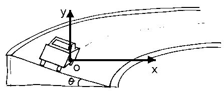

**ЗАДАЧА 1. Полет**

**а)** При движение във вертикално направление:
$v_y(t) = v_0\sin\alpha - gt$ \[0,5 т.\]
$y(t) = h_0 + v_0 \sin\alpha \cdot t - gt^2/2$ \[0,5 т.\]
В най-високата точка $v_y = 0$, откъдето времето на полета е:
$t_H = \frac{v_0\sin\alpha}{g}$ \[0,5 т.\]

Височината в този момент е съответно:
$H = y(t_H) = h_0 + v_0\sin\alpha \frac{v_0\sin\alpha}{g} - \frac{g}{2} \left(\frac{v_0\sin\alpha}{g}\right)^2 = h_0 + \frac{v_0^2\sin^2\alpha}{2g}$ \[0,5 т.\]

**б)** Падането в морето е при $y(T) = 0$ \[0,5 т.\]: $0 = h_0 + v_0\sin\alpha \cdot T - \frac{g}{2}T^2$. \[0,5 т.\]
Това е квадратно уравнение спрямо $T$ \[0,5 т.\]. Вземаме положителния корен \[0,5 т.\] и получаваме:
$T = \frac{v_0\sin\alpha + \sqrt{v_0^2\sin^2\alpha + 2gh_0}}{g}$ \[1 т.\]

**в)** За далечината на полета имаме $L = v_0\cos\alpha T$ \[0,5 т.\]. Заместваме с намереното време от подточка б) \[0,5 т.\] и получаваме: $L = x(T) = v_0\cos\alpha T = v_0\cos\alpha \frac{v_0\sin\alpha + \sqrt{v_0^2\sin^2\alpha + 2gh_0}}{g} =$
$= \frac{v_0\cos\alpha}{g} (v_0\sin\alpha + \sqrt{v_0^2\sin^2\alpha + 2gh_0})$ \[1 т.\]

**г)** Използваме уравнението на траекторията.
От $t = \frac{x}{v_0\cos\alpha}$ \[0,3 т.\]: $y(x) = h_0 + x\text{tg}\alpha - \frac{gx^2}{2v_0^2\cos^2\alpha}$ \[0,3 т.\]
При падане $y(L) = 0$ \[0,3 т.\]: $0 = h_0 + L\text{tg}\alpha - \frac{gL^2}{2v_0^2}(1 + \text{tg}^2\alpha)$ \[0,3 т.\]
Нека $u = \text{tg}\alpha$. Получава се квадратно уравнение спрямо $u$:
$\frac{gL^2}{2v_0^2}u^2 - Lu + \left(\frac{gL^2}{2v_0^2} - h_0\right) = 0$ \[0,3 т.\]
За да съществува реален корен, трябва дискриминантата $D \ge 0$. \[0,3 т.\]
Максималната далечина $L$ съответства на граничния случай $D = 0$. \[0,3 т.\]
След алгебрични преобразувания получаваме: $L_{max} = \frac{v_0}{g}\sqrt{v_0^2 + 2gh_0}$ \[0,3 т.\] и $u = \text{tg}\alpha_{max} = \frac{v_0}{\sqrt{v_0^2 + 2gh_0}}$ \[0,6 т.\]

**ЗАДАЧА 2. Завой**

Ще въведем координатна система с център моментното положение на автомобила, ос $Oy$ вертикална нагоре и ос $Ox$ насочена към центъра на кривината, както е показано на чертежа.
$N_x = N\sin\theta, N_y = N\cos\theta$ и $f_x = f\cos\theta, f_y = f\sin\theta$

**а)** При хоризонтален път $N = mg$ \[0,5 т.\]. Единствената сила към центъра е триенето, следователно: $f = \frac{mv^2}{R}$ \[0,5 т.\]. Условие за неприплъзване: $f \le kN = kmg$ \[0,5т.\]
Следователно $\frac{mv^2}{R} \le kmg \Rightarrow v^2 \le kgR \Rightarrow v_{max} = \sqrt{kgR}$ \[0,5 т.\].

**б)** Без триене действат $mg$ и $N$.
По оста $Oy$: $N\cos\theta = mg$ \[0,5 т.\]. По оста $Ox$: $N\sin\theta = \frac{mv^2}{R}$ \[0,5 т.\].
Делим второто уравнение на първото и получаваме: $\text{tg}\theta = \frac{v^2}{gR} \Rightarrow v_0 = \sqrt{gR\text{tg}\theta}$ \[1 т.\]

**в)** При минимална скорост автомобилът е „склонен“ да се плъзне надолу (към по-ниския край), затова триенето действа нагоре по наклона.
По оста $Oy$ ускорението е 0: $N\cos\theta + f\sin\theta = mg$ \[0,5 т.\]. По оста $Ox$: $N\sin\theta - f\cos\theta = \frac{mv^2}{R}$ \[0,5 т.\]. Замествайки с $f = kN$: $N(\cos\theta + k\sin\theta) = mg \Rightarrow N = \frac{mg}{\cos\theta + k\sin\theta}$ \[0,5 т.\]
$N(\sin\theta - k\cos\theta) = \frac{mv^2}{R}$ \[0,5 т.\]
Комбинираме и получаваме: $\frac{mg}{\cos\theta + k\sin\theta}(\sin\theta - k\cos\theta) = \frac{mv^2}{R}$ \[0,5 т.\]
Съкращаваме $m$ и получаваме:
$v^2 = gR\frac{\sin\theta - k\cos\theta}{\cos\theta + k\sin\theta} \Rightarrow v_{min} = \sqrt{gR\frac{\sin\theta - k\cos\theta}{\cos\theta + k\sin\theta}}$ \[0,5 т.\]

**г)** Спрямо предишната подточка трябва да съобразим, че при висока скорост колата ще се приплъзва навън, следователно триенето ще има противоположна посока:
$N\cos\theta - f\sin\theta = mg$ \[0,5 т.\]
$N\sin\theta + f\cos\theta = \frac{mv^2}{R}$ \[0,5 т.\]
Решението за $N$ и $f$: $N = m(g\cos\theta + \frac{v^2}{R}\sin\theta)$ \[0,5 т.\] и $f = m(\frac{v^2}{R}\cos\theta - g\sin\theta)$ \[0,5 т.\]
На границата на сцепление: $k_{min} = \frac{|f|}{N} = \frac{|\frac{v^2}{R}\cos\theta - g\sin\theta|}{g\cos\theta + \frac{v^2}{R}\sin\theta}$ \[0,5 т.\]
Числено: $v = 216 \text{ mph} = 216 \cdot \frac{1609}{3600} \text{ m/s} \approx 96,54 \text{ m/s}$, $\sin 33^\circ \approx 0,545, \cos 33^\circ \approx 0,839$
Заместваме и получаваме: $k_{min} \approx 0,82$ \[0,5 т.\]

---

**ЗАДАЧА 3. Трупче върху клин**

**а)** Спрямо избраната КС клинът се ускорява наляво, т.е. $\vec{a}_{клин} = (-a_M, 0)$. Ускорението на трупчето спрямо земната повърхност е $\vec{a} = (a_x, a_y)$. Следователно относителното ускорение на трупчето спрямо клина е
$\vec{a}_{rel} = \vec{a} - \vec{a}_{клин} = (a_x, a_y) - (-a_M, 0) = (a_x + a_M, a_y)$. \[1 т.\]

Трупчето остава в контакт с наклонената страна и се движи по нея, затова $\vec{a}_{rel}$ е насочено по наклона. Наклонът сключва ъгъл $\alpha$ с хоризонталата, следователно отношението на компонентите на всеки вектор, паралелен на наклона, е $\text{tg}\alpha$. \[1 т.\]
Следователно $\frac{a_y}{a_x + a_M} = \text{tg}\alpha$.

*Алтернативно решение.* За времето $t$, за което трупчето се спуска от върха до основата на клина, то изминава във вертикална посока разстояние, равно на височината на клина: $h = a_yt^2/2$ \[0,5 т.\] и се премества надясно в хоризонтална посока на разстояние: $s_1 = a_xt^2/2$. Същевременно клинът се премества наляво на разстояние $s_2 = a_Mt^2/2$.
Следователно трупчето се оказва на разстояние $s = s_1 + s_2 = (a_x + a_M)t^2/2$ \[0,5 т.\] от вертикалната стена на клина. Очевидно, че $h$ и $s$ са съответно срещулежащ и прилежащ катет срещу ъгъла $\alpha$, т.е. $h/s = \text{tg}\alpha$, \[0,5 т.\] откъдето получаваме търсеното съотношение $\frac{a_y}{a_x + a_M} = \text{tg}\alpha$ \[0,5 т.\].

**б)** За трупчето (II принцип на Нютон) по осите $x$ и $y$:
$ma_x = N\sin\alpha, ma_y = mg - N\cos\alpha$ \[1 т.\]
За клина по $x$: върху клина действа хоризонталната компонента на реакцията от трупчето $-N\sin\alpha$, а ускорението е наляво $-a_M$, следователно
$M(-a_M) = -N\sin\alpha \Rightarrow N\sin\alpha = Ma_M$ \[0,5 т.\]

От първото уравнение за трупчето и уравнението за клина следва
$ma_x = Ma_M \Rightarrow a_x = \frac{M}{m} a_M$. От кинематичната връзка от а)
$a_y = (a_x + a_M)\text{tg}\alpha = a_M \left(1 + \frac{M}{m}\right)\text{tg}\alpha = a_M \frac{m + M}{m}\text{tg}\alpha$ \[0.5 т.\]
От уравнението по $x$ и клина имаме $N = \frac{Ma_M}{\sin\alpha}$. Замествайки $N$ и $a_y$ в уравнението по $y$:
$mg - \left(\frac{Ma_M}{\sin\alpha}\right)\cos\alpha = m[a_M \frac{m + M}{m}\text{tg}\alpha]$
$mg = a_M(M\text{ctg}\alpha + (M + m)\text{tg}\alpha)$

Преминаваме към $\sin, \cos$ и след привеждане: $a_M = \frac{mg\sin\alpha\cos\alpha}{M + m\sin^2\alpha}$ \[1 т.\]

**в)** От уравнението за клина $N\sin\alpha = Ma_M$ следва $N = \frac{Ma_M}{\sin\alpha}$ \[1 т.\]
Замествайки намереното в подточка б) $a_M = \frac{mg\sin\alpha\cos\alpha}{M + m\sin^2\alpha}$, получаваме
$N = \frac{M}{\sin\alpha} \cdot \frac{mg\sin\alpha\cos\alpha}{M + m\sin^2\alpha} = \frac{Mmg\cos\alpha}{M + m\sin^2\alpha}$ \[1 т.\]

**г)** Относителното ускорение $a_{rel}$ е хипотенуза в триъгълника на относителните ускорения $(a_{x,rel} \text{ и } a_y)$: $a_{rel} = \frac{a_y}{\sin\alpha}$ или $a_{rel} = \frac{a_x + a_M}{\cos\alpha}$ \[1 т.\]
Използваме $a_x + a_M = a_M \left(1 + \frac{M}{m}\right) = a_M \frac{m + M}{m}$:
$a_{rel} = \frac{a_M(M+m)}{m\cos\alpha}$ \[1 т.\]
Заместваме $a_M$:
$a_{rel} = \frac{mg\sin\alpha\cos\alpha}{M + m\sin^2\alpha} \cdot \frac{M + m}{m\cos\alpha} = \frac{(M + m)g\sin\alpha}{M + m\sin^2\alpha}$ \[1 т.\]

*Алтернативно решение.* Спрямо клина трупчето изминава разстояние, равно на хипотенузата $\ell$ на клина, докато се спусне. От закона за равноускорително движение: $\ell = a_{rel}t^2/2$. \[1 т.\] От друга страна, ако разглеждаме движението на трупчето спрямо земята: $h = a_yt^2/2$. \[1 т.\] Като вземем предвид, че $h = \ell\sin\alpha$, изразяваме: $a_{rel} = a_y/\sin\alpha$.
Вземаме предвид получените в предишните точки резултати: $a_y = a_M \frac{m+M}{m}\text{tg}\alpha$ и $a_M = \frac{mg\sin\alpha\cos\alpha}{M + m\sin^2\alpha}$, откъдето получаваме окончателно: $a_{rel} = \frac{(M + m)g\sin\alpha}{M + m\sin^2\alpha}$. \[1 т.\]