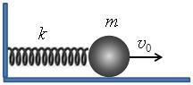
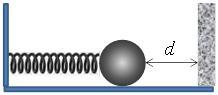

Константи, които можете да използвате във всички задачи:
 - Гравитационна константа, ;
 - Универсална газова константа, ;
 - Число на Авогадро, ;
 - Константа на Болцман, .

Задача 1. Изпаряване на метеорит

Планетата Марс има радиус и ускорение на свободно падане върху
повърхността ѝ . Атмосферата на Марс се състои от въглероден диоксид
(CO2), като атмосферното налягане на повърхността на планетата е , а
средната температура на атмосферата е .

а) Колко е масата M на Марс? (2,0 т.)

б) Колко е плътността на атмосферата върху повърхността на планетата? (3,0 т.)
Поради малката плътност на атмосферата, идващ от Космоса метеорит достига
повърхността на Марс на практика без да изпитва сила на съпротивление. При удара с
твърдата повърхност метеоритът прокопава кратер. Част от отделената при удара
енергия освен това води до наподобяващо взрив изпаряване на метеорита.
в) Разгледайте метеорит, намиращ от Марс на разстояние r, което е много по-голямо от
RM. Метеоритът, първоначално неподвижен спрямо планетата, започва да пада към нея
под действие на гравитационното ѝ привличане. С каква скорост метеоритът ще се
удари в повърхността на планетата? (2,5 т.)

г) В резултат на удара метеоритът напълно се изпарява. Приемете, че метеоритът е
съставен само от желязо (Fe) и 50% от кинетичната му енергия преди удара се
преобразува във вътрешна енергия на отделените железни пари (идеален едноатомен
газ). Колко е температурата на железните пари непосредствено след удара? (2,5 т.)
Използвайте, че моларната маса на въглеродния диоксид е , а
моларната маса на желязото е .

Задача 2. Отскачащо махало
Малко топче с маса е окачено на хоризонтална пружина с коефициент на
еластичност . В началния момент пружината е недеформирана, а на топчето
е придадена начална скорост в посоката, показана на фиг. 2(а), така че то
започва да трепти хармонично. Триенето между топчето и хоризонталната повърхност
се пренебрегва.

а) Пресметнете периода T и амплитудата A на трептенето. (2,5 т.)

б) Определете посоката (наляво или надясно спрямо чертежа) и големината на
скоростта на топчето в момента след началото на трептенето. (4,5 т.)

в) Топчето отново е пуснато да трепти със същата начална скорост и в същата посока,
както е описано по-горе. На разстояние от него обаче е поставена
неподвижна вертикална стена, както е показано на фиг. 2(б). Топчето започва да
отскача еластично от стената, т.е. без кинетичната му енергия да се променя при
ударите със стената. Намерете времето T1 между последователните отскачания на
топчето от стената. (3,0 т.)

Фиг. 2(а)

Фиг. 2(б)

Задача 3. Топлинен двигател

Фиг. 3

На фиг. 3 е показана p-V диаграма на работния цикъл на топлинен двигател. Процесът
a-b е изохорен, b-c - адиабатен, и c-a - изобарен. Работното вещество на двигателя е
идеален едноатомен газ. Абсолютната температура и налягането на газа в състояние a
са съответно и .

а) Колко мола е количеството n на работния газ? (2,0 т.)

б) Пресметнете температурата Tb и Tc на газа съответно в състояние b и c. (4,5 т.)

в) Намерете работата Aдв, която двигателят извършва за един цикъл, и коефициента на
полезно действие на двигателя. (3,5 т.)

Упътване. Използвайте, че за идеален едноатомен газ моларните топлинни капацитети
при постоянен обем и при постоянно налягане са съответно и . В
зависимост от начина на решаване, може да използвате, че .