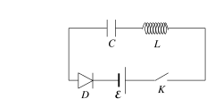

**Задача 1. Окачване на фенер**

Градински фенер с маса $m_1 = 2\ \mathrm{kg}$ е монтиран към стената на къща по начина, показан на фиг. 1. Фенерът виси на лека нишка, закачена към края А на еднородна пръчка с дължина $l = 0,5\ \mathrm{m}$ и маса $m_2 = 1\ \mathrm{kg}$, наклонена по ъгъл $\theta$ спрямо стената на къщата. Краят В на пръчката се опира на стената, без да е закрепен за нея. За да бъде пръчката в равновесие, краят А e прикрепен към стената с лека хоризонтална нишка. Приемете, че земното ускорение е $g = 10\ \mathrm{m/s^2}$.

а) Направете чертеж, на който да изобразите всички сили, действащи на пръчката в
съответните им приложни точки. (1,0 т)

б) Получете израз за силата $T$ на опън на хоризонталната нишка посредством дадените в условието величини. (4,0 т)

в) Получете израз за минималния коефициент на триене $k_{\min}$ между пръчката и стената, така че долният край на пръчката да не се хлъзга. (3,0 т)

г) Нека предположим, че хоризонталната нишка може да издържи максимална сила на опън $T_{\max} = 100\ \mathrm N$ и коефициентът на триене между пръчката и стената е $k=0,6$. Определете интервала от ъгли $\theta$, за които системата е в равновесие. (2,0 т)

**Задача 2. Зареждане на кондензатор**

На фиг. 2 е дадена схема на електрическа верига, с чиято помощ кондензатор може да бъде зареден до напрежение, по-голямо от напрежението на източника.
Тя се състои се от батерия с постоянно ЕДН $\mathcal E = 9,0\ \mathrm{V}$, ключ К, намотка с индуктивност $L = 6,0\ \mathrm{mH}$, кондензатор с капацитет $C=15\ \mathrm{\mu F}$ и диод D, който не позволява на кондензатора да се разреди, след като достигне максималния си заряд. Съпротивлението на ключа, на намотката и на съединителните проводници се пренебрегва.

Диодът е идеален, т.е. има нулево съпротивление в права посока и безкрайно
съпротивление - в обратна посока. Първоначално ключът е отворен, а кондензаторът - напълно разреден. След затваряне на ключа, кондензаторът започва да се зарежда.

а) Нека $q$ е зарядът, натрупан върху кондензатора в момент, преди кондензаторът да се е заредил до максималното си напрежение. Получете израз за електричната
потенциална енергия $W_e$ на кондензатора в този момент. (2,5 т)

б) Получете израз за енергията $W_m$ на магнитното поле в намотката и за тока , който тече във веригата в този момент. (4,0 т)

в) Колко е максималният ток $I_{\max}$, който протича във веригата, докато се зарежда кондензаторът? (1,5 т)

г) До какво максимално напрежение $U_{\max}$ се зарежда кондензаторът? (2,0 т)

**Задача 3. Пневматична пушка**

На фиг. 3 е показана принципната схема на пневматичната пушка. Състои се от цилиндрична цев с площ на канала $S = 3\ \mathrm{mm^2}$, съединена с резервоар с обем $V_0 = 5\ \mathrm{cm^3}$, който е пълен със сгъстен въздух под налягане $p_0 = 2,0.10^5\ \mathrm{Pa}$.

Другият край на канала на цевта е отворен към външния въздух, който се намира при
нормално атмосферно налягане $p_A = 1,0.10^5\ \mathrm{Pa}$. В канала на цевта, непосредствено след резервоара се намира оловна сачма с маса $m=50\ \mathrm{mg}$. Тя се изстрелва, след като клапанът, затварящ резервоара със сгъстен въздух, бъде отворен при натискане на спусъка на пушката. Можете да приемете, че:
- Въздухът е идеален газ с моларен топлинен капацитет при постоянен обем $C_V = \frac52 R$.
- Резервоарът и цевта не провеждат топлина.
- Сачмата затваря плътно отвора на цевта, т.е. не пропуска въздух, и се движи в
канала без триене.

а) Какъв вид термодинамичен процес - изобарен, изохорен, изотермен или адиабатен
протича при разширяването на въздуха в цевта по време на изстрела? Дайте кратка
обосновка (1-2 изречения) на вашия отговор. (1,0 т)

б) Дължината на цевта се подбира така, че сачмата да излезе от отвора с максимална
възможна скорост. Колко е налягането на въздуха в цевта, когато сачмата достига
максималната си скорост? (1,0 т)

в) Колко е дължината $L$ на цевта? (5,0 т)

В следващите подточки не е нужно да запишете аналитичен (буквен) израз за търсената величина, а единствено да получите чрез аргументирани пресмятания числената ѝ стойност.

г) Колко е работата $A'$, която извършва въздухът в цевта, докато сачмата достигне края на цевта? (1,5 т)

д) С каква скорост $v$ сачмата излиза от цевта? (1,5 т)

