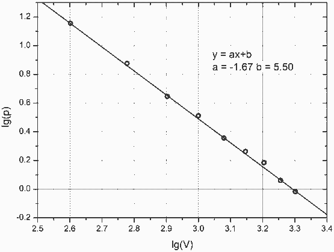
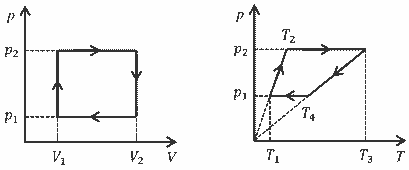

[[Състезания/2/12/2023|◂ 2023]] | [[Състезания/2/12/2024|условия]] | [[Състезания/2/12/2025| 2025 ▸]]

**Задача 1. Адиабатен процес**

а) От уравнението на адиабатния процес $p.V^\gamma = \text{const} = C$, след логаритмуване, се получава $\lg p = \lg C - \gamma \lg V$. Ако се въведат нови променливи $x = \lg V$ и $y = \lg p$, зависимостта $y(x)$ е линейна с наклон $-\gamma$. \[1 т\]

Нанасяме изчислените стойности на новите променливи в празните колони на таблицата. \[1 т\] Чертаем графика по данните за $x$ и $y$ \[1.5 т\] и определяме от нея наклона на получената линейна зависимост: $-\gamma = -1,67$. \[0.5 т\]

За свободния член имаме $\lg C = 5,50$ (или $C = 3,16.10^5 \text{ atm.l}^\gamma$). \[1.5 т\] Следователно показателят на адиабатата е $\gamma = 1,67$. \[0.5 т\]

Възможно е учениците да използват натурален логаритъм, вместо десетичен. В този случай трябва да се провери дали данните в таблицата съответстват на $x = \ln V$ и $y = \ln p$. Тогава за логаритъма на константата се получава $\ln C = 12,7$.

| $V, \text{ l}$ | $p, \text{ atm}$ | $x = \lg V$ | $y = \lg p$ |
| :--- | :--- | :--- | :--- |
| 2000 | 0,96 | 3,301 | – 0,018 |
| 1800 | 1,15 | 3,255 | 0,061 |
| 1600 | 1,53 | 3,204 | 0,185 |
| 1400 | 1,83 | 3,146 | 0,262 |
| 1200 | 2,27 | 3,079 | 0,356 |
| 1000 | 3,25 | 3,000 | 0,512 |
| 800 | 4,43 | 2,903 | 0,646 |
| 600 | 7,51 | 2,778 | 0,876 |
| 400 | 14,3 | 2,602 | 1,155 |

б) Налягането $p_1$ на газа при обем $V_1 = 200 \text{ l}$, е $p_1 = \frac{C}{V_1^\gamma}$ \[1.5 т\] $= 45.4 \text{ atm}$. \[1.5 т\]
(присъждат се същия брой точки за всеки друг начин на намиране на $p_1$ без пресмятане на $C$)

в) Показателят на адиабатата за идеален газ е $\gamma = \frac{C_p}{C_v} = \frac{s+2}{s}$, \[0.4 т\] където $s = 3, 5$ или $6$, съответно за едноатомен, двуатомен или триатомен газ. При $\gamma = 1.67$ намираме $s \approx 3$. \[0.4 т\] Следователно газът е едноатомен, т.е. аргон (Ar). \[0.2 т\]

**Задача 2. Химична реакция**

а) Тъй като в бутилката има общо 3 мола газ, то от уравнението на идеалния газ $pV = nRT$, $p = nRT/V$ \[1 т\] следва, че налягането $p_1$ в бутилката преди да реагират е $p_1 = \frac{3 \cdot 8,314 \cdot 300}{75 \cdot 10^{-3}} = 9,98 \cdot 10^4 \text{ Pa}$ \[2 т\] $= 0.998 \text{ atm}$.

б) Тъй като се образуват два мола вода, \[1 т\] то масата на образувалата се вода е $m = 2\mu_{\text{H}_2\text{O}} = 36.0 \text{ g}$. \[2 т\]

в) Налягането $p_2$ на водните пари в бутилката, след като те са се охладили до $100 ^\circ\text{C}$, е $p_2 = \frac{nRT}{V} = \frac{2 \cdot 8,314 \cdot 373}{75 \cdot 10^{-3}}$ \[2 т\] $= 8,27 \cdot 10^4 \text{ Pa}$ \[2 т\] $= 0.827 \text{ atm}$.

**Задача 3. Работен цикъл на парна машина**

а) Диаграмите изглеждат така:

$T_1 = \frac{p_1 V_1}{R}$, $T_2 = \frac{p_2 V_1}{R}$, $T_3 = \frac{p_2 V_2}{R}$, $T_4 = \frac{p_1 V_2}{R}$. \[4 т\]

б) $T_{\max} = T_3 = \frac{p_2 V_2}{R}$, \[1 т\] $T_{\min} = T_1 = \frac{p_1 V_1}{R}$ \[1 т\]

в) Извършената работа $A$ от газа за един цикъл е $A = (p_2 - p_1) \cdot (V_2 - V_1)$ \[1 т\]

г) Коефициентът на полезно действие е $\eta = \frac{A}{Q}$. \[0.5 т\] Полученото количество топлина е $Q = Q_{T_1 \to T_2} + Q_{T_2 \to T_3}$. От първия принцип на термодинамиката $Q_{T_1 \to T_2} = \Delta U_{1-2} = C_V (T_2 - T_1)$, $Q_{T_1 \to T_2} = \frac{C_V}{R}(p_2 V_1 - p_1 V_1)$. \[1 т\] Пак от първия принцип на термодинамиката $Q_{T_2 \to T_3}$ = $\Delta U_{2-3} + p_2(V_2 - V_1) = C_V(T_3 - T_2) + R(T_3 - T_2)$ = $(C_V + R)(T_3 - T_2) = \frac{(C_V + R)}{R}(p_2 V_2 - p_2 V_1)$. \[1 т\] Следователно $\eta = \frac{(p_2 - p_1) \cdot (V_2 - V_1)}{\frac{C_V}{R}(p_2 V_1 - p_1 V_1) + \frac{(C_V + R)}{R}(p_2 V_2 - p_2 V_1)}$. \[0.5 т\]