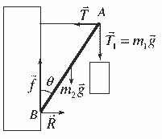

[[Състезания/2/12/2024|◂ 2024]] | [[Състезания/2/12/2025|условия]]

**Задача 1. Окачване на фенер**

а) На пръчката действат следните пет сили:
- Сила на опън $\vec{T}_1$ на вертикалната нишка, приложена в т. $A$, равна на теглото $m_1 \vec{g}$ на фенера.
- Сила на опън $\vec{T}$ на хоризонталната нишка, приложена в т. $A$.
- Сила на тежестта $m_2 \vec{g}$, действаща в центъра на масата, т.е. в средата на пръчката.
- Сила $\vec{R}$ на нормална реакция на стената, приложена в т. $B$.
- Сила $\vec{f}$ на триене, действаща успоредно на стената в т. $B$.
За всяка сила с вярно означена посока и приложна точка по **0,2 т – общо до 1,0 т.**

б) Въртящият момент на приложените върху пръчката сили спрямо т. $B$ е:

$M_1 = m_1 g \ell \sin \theta$ за теглото на фенера **(1,0 т)**

$M_2 = m_2 g (\ell/2) \sin \theta$ за силата на тежестта на пръчката **(1,0 т)**

$M_3 = -T \ell \cos \theta$ за силата на опън на хоризонталната нишка **(1,0 т)**

Приема се и решение, при което знакът на $M_3$ е положителен, а на $M_1$ и $M_2$ – отрицателни.

От условието за равновесие:

$M_1 + M_2 + M_3 = 0$ **(0,5 т)**

получаваме търсения израз за силата на опън:

$T = (m_1 + m_2/2) g \operatorname{tg} \theta$ **(0,5 т)**

в) За да бъде пръчката в равновесие, векторната сума на всички сили, които ѝ действат трябва да бъде нула. Ако разгледаме поотделно силите, действащи хоризонтално и вертикално, получаваме следните връзки между големините на силите:

по $X$: $R = T = (m_1 + m_2/2) g \operatorname{tg} \theta$ **(0,5 т)**

по $Y$: $f = (m_1 + m_2)g$ **(0,5 т)**

За да не се хлъзга пръчката, силата на триене със стената трябва да бъде по-малка от максималната сила на триене при покой:

$f \le kR$, **(1,0 т)**

откъдето намираме, че при даден ъгъл $\theta$ минималният коефициент на триене е:

$k_{\min} = \frac{f}{R} = \frac{m_1 + m_2}{(m_1 + m_2/2) \operatorname{tg} \theta}$ **(1,0 т)**

г) За да не се скъса нишката, е нужно $T \le T_{\max}$, откъдето следва:

$\operatorname{tg} \theta \le \frac{T_{\max}}{(m_1 + m_2/2)g}$ **(0,5 т)**

За да не се хлъзга пръчката е нужно $k \ge k_{\min}$, т.е.

$\operatorname{tg} \theta \ge \frac{m_1 + m_2}{(m_1 + m_2/2)k}$ **(0,5 т)**

Като заместим с числените стойности на параметрите, намираме условието за равновесие:

$2 \le \operatorname{tg} \theta \le 4 \iff 63,4^\circ \le \theta \le 76,0^\circ$ **(1,0 т)**

За верен отговор се приема както вариантът с неравенства за $\operatorname{tg} \theta$, така и вариантът с неравенства за самия ъгъл $\theta$. Ако в крайния отговор е получена или само долната, или само горната граница за $\operatorname{tg} \theta$ ($\theta$), се отнема 0,5 т.

**Задача 2. Зареждане на кондензатор**

а) Енергията на зареден кондензатор е:

$W_e = \frac{1}{2} C U^2$ **(1,0 т)**

Напрежението върху кондензатора е съответно:

$U = \frac{q}{C}$ **(1,0 т)**

Следователно:

$W_e = \frac{q^2}{2C}$ **(0,5 т)**

б) Когато през източника минава заряд, електродвижещите сили извършват работа:

$A^* = \mathcal{E} q$ **(1,0 т)**

От закона за запазване на енергията следва, че тази работа се преобразува в електрична потенциална енергия на кондензатора и енергия на магнитното поле в намотката:

$A^* = W_e + W_m$ **(1,0 т)**

Така за магнитната енергия получаваме следния израз:

$W_m = \mathcal{E} q - \frac{q^2}{2C}$ **(0,5 т)**

Понеже:

$W_m = \frac{LI^2}{2}$ **(1,0 т)**

Получаваме:

$I = \sqrt{\frac{2C\mathcal{E}q - q^2}{LC}}$ **(0,5 т)**

в) От получения израз следва, че най-голям ток протича в момента, когато през веригата е минал заряд:

$q = C\mathcal{E}$ **(0,5 т)**

Така намираме:

$I_{\max} = \mathcal{E} \sqrt{\frac{C}{L}} = 9\text{ V} \cdot \sqrt{\frac{15 \cdot 10^{-6}\text{ F}}{6 \cdot 10^{-3}\text{ H}}} = 0,45\text{ A}$ **(1,0 т)**

(0,5 точки за буквен отговор + 0,5 точки за числена стойност)

г) В момента, когато кондензаторът се зареди максимално, токът във веригата става $I = 0$. Следователно в този момент зарядът на кондензатора е:

$q_{\max} = 2C\mathcal{E}$ **(1,0 т)**

а напрежението съответно:

$U_{\max} = \frac{q_{\max}}{C} = 2\mathcal{E} = 18\text{ V}$ **(1,0 т)**

(0,5 точки за буквен отговор + 0,5 точки за числена стойност)

**Задача 3. Пневматична пушка**

а) Процесът е адиабатен **(0,5 т за посочване на верен отговор)**, защото въздухът в цевта не обменя топлина с околния въздух **(0,5 т за обяснение)**.

б) Сачмата се ускорява, докато налягането в цевта е по-високо от външното налягане **(0,5 т)**. При адиабатно разширение налягането на въздуха в цевта намалява. Следователно сачмата достига максимална скорост, когато налягането в цевта стане равно на атмосферното налягане $p_A = 1,0 \cdot 10^5\text{ Pa}$ **(0,5 т)**.

в) При адиабатен процес е в сила уравнението:

$p_0 V_0^\gamma = p_1 V_1^\gamma$ **(1,0 т)**

където $p_0$ и $V_0$ са съответно налягането и обема на въздуха в резервоара преди изстрела, $p_1 = p_A$ е налягането в края на процеса, а:

$V_1 = V_0 + LS$ **(0,5 т)**

е обемът на въздуха в цевта, когато сачмата достигне изходния отвор. Моларният топлинен капацитет на въздуха при постоянно налягане е:

$C_p = C_V + R = \frac{7}{2} R$ **(1,0 т)**

а показателят на адиабатата е:

$\gamma = \frac{C_p}{C_V} = \frac{7}{5}$ **(1,0 т)**

От уравнението за адиабатния процес получаваме за търсената дължина:

$L = \frac{V_0}{S} \left[ \left( \frac{p_0}{p_A} \right)^{5/7} - 1 \right]$ **(1,0 т)**

Като заместим с числените данни намираме:

$L = \frac{5,0 \cdot 10^{-6}\text{ m}^3}{3,0 \cdot 10^{-6}\text{ m}^2} [2^5/7 - 1] \approx 1,07\text{ m}$ **(0,5 т)**

За верен се приема всеки числен резултат, който се закръгля към 1,1 m.

г) Работата на газ при адиабатен процес е изцяло за сметка на намаляване на вътрешната енергия на газа:

$A' = -\Delta U$ **(0,5 т)**

Вътрешната енергия на $n$ мола идеален газ е:

$U = \frac{s}{2} nRT = nC_V T$

където $s$ е броят на степените на свобода на молекулите. Като вземем предвид, че $C_V = 5/2 R$, т.е. $s = 5$ и като използваме уравнението $pV = nRT$ на Клапейрон-Менделеев, намираме:

$U = \frac{5}{2} pV$ **(0,3 т)**

Следователно работата, извършена от въздуха в цевта е:
$A' = \frac{5}{2} (p_0 V_0 - p_1 V_1)$ **(0,2 т)**

Като вземем предвид, че $p_1 = p_A = 1,0 \cdot 10^5\text{ Pa}$ и $V_1 = V_0 + LS \approx 8,21\text{ cm}^3 = 8,21 \cdot 10^{-6}\text{ m}^3$, намираме:

$A' = 2,5 \cdot (2,0 \cdot 10^5\text{ Pa} \cdot 5 \cdot 10^{-6}\text{ m}^3 - 1,0 \cdot 10^5\text{ Pa} \cdot 8,21 \cdot 10^{-6}\text{ m}^3) \approx 0,447\text{ J}$ **(0,5 т)**

За верен се приема всеки отговор, който се закръгля към 0,45 J.

д) Освен въздухът в цевта, върху сачмата извършва механична работа и външният атмосферен въздух:

$A'' = -p_A \Delta V = 1,0 \cdot 10^5\text{ Pa} \cdot (8,21 \cdot 10^{-6}\text{ m}^3 - 5,0 \cdot 10^{-6}\text{ m}^3) = -0,321\text{ J}$ **(0,5 т)**

Следователно общата работа, извършена от външни сили върху сачмата, е:

$A = A' + A'' = 0,126\text{ J}$ **(0,2 т)**

От връзката $A = \Delta E_k$ между работата на външните сили и промяната на кинетичната енергия имаме:

$A = \frac{mv^2}{2}$ **(0,3 т)**

и окончателно:

$v = \sqrt{\frac{2A}{m}} = \sqrt{\frac{2 \cdot 0,126\text{ J}}{5,0 \cdot 10^{-5}\text{ kg}}} \approx 71\text{ m/s}$ **(0,5 т)**