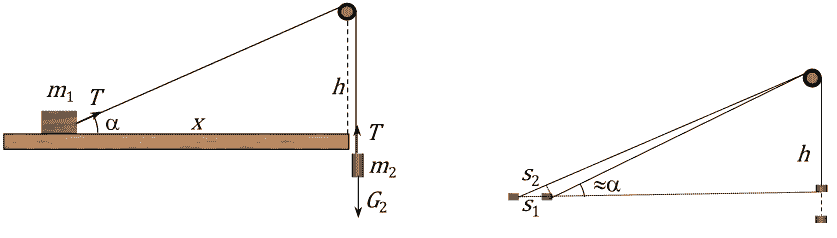
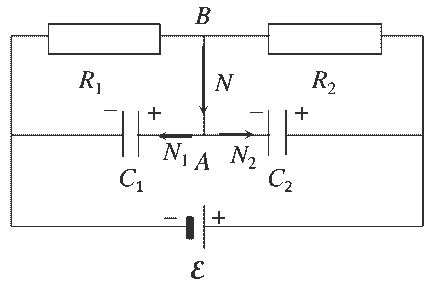

[[Състезания/2/12/2025|◂ 2025]] | [[Състезания/2/12/2026|условия]]

**Задача 1. Ускоряващо се трупче**

а) Дължината на частта на нишката между трупчето и макарата в началния момент е:
(1) $l_0 = \sqrt{h^2 + x^2}$,
а след като трупчето достигне масата:
(2) $l = h$.
Следователно за това време теглилката се спуска надолу на разстояние:
(3) $s = l_0 - l = \sqrt{h^2 + x^2} - h$, **(0.5 т)**
а силата на тежестта извършва работа:
(4) $A = m_2gs = m_2g \left( \sqrt{h^2 + x^2} - h \right)$. **(0.5 т)**
Тъй като началната кинетична енергия на телата е нула и няма триене, кинетичната енергия в крайния момент е равна на работата на силата на тежестта:
(5) $\frac{m_1v_1^2}{2} + \frac{m_2v_2^2}{2} = A$. **(1.0 т)**
В момента, когато трупчето достига ръба на масата, теглилката достига минимална възможна височина, т.е. в този момент:
(6) $v_2 = 0$. **(1.0 т)**
Като използваме израза (4) за работата и условието (6), от уравнение (5) намираме:
(7) $v_1 = \sqrt{\frac{2m_2g(\sqrt{h^2 + x^2} - h)}{m_1}}$. **(1.0 т)**

Като алтернативно решение ученикът може да посочи, че пълната механична енергия на системата се запазва. Тогава вместо уравнение (4) трябва да бъде получен израз за промяната на потенциалната енергия на теглилката $\Delta E_p = -m_2g(\sqrt{h^2 + x^2} - h)$, а вместо уравнение (5) – да бъде записан законът за запазване на енергията.

б) На фигурата вляво са дадени силите, които оказват влияние върху движението на телата от системата.
Трупчето се ускорява под действие единствено на хоризонталната компонента на силата $\vec{T}$ на опън на нишката:
(8) $m_1a_1 = T \cos \alpha$, **(0.5 т)**
където $\alpha$ е ъгълът, който нишката сключва с хоризонта. На теглилката действа сила на тежестта и силата $T$ на опън, насочена вертикално нагоре:
(9) $m_2a_2 = m_2g - T$. **(0.5 т)**
За малък интервал време $\Delta t$, през който ъгълът между нишката и хоризонта на практика не се изменя, можем да приемем, че движението на двете тела е равноускорително. Понеже телата започват да се движат с нулева начална скорост, те изминават път съответно:
(10) $s_1 = \frac{a_1\Delta t^2}{2}$ и **(0.25 т)**
(11) $s_2 = \frac{a_2\Delta t^2}{2}$. **(0.25 т)**
Пътят $s_2$ на теглилката обаче е равен на скъсяването на участъка от нишката, на който е завързано трупчето. От чертежа вдясно е ясно, че за много малки премествания:
(12) $s_2 = s_1 \cos \alpha$, **(0.5 т)**
защото в крайния момент нишката сключва приблизително същия ъгъл $\alpha$ с масата, както в началния момент. Оттук следва, че:
(13) $a_2 = a_1 \cos \alpha$,
което трябва да се докаже. Точките за уравнения (10)–(12) се дават и ако ученикът обоснове, че скоростите на телата удовлетворяват равенството $v_2 = v_1 \cos \alpha$, след което използва, че $v_1 = a_1\Delta t$ и $v_2 = a_2\Delta t$, за да получи връзката (13) между двете ускорения.
Уравненията (8), (9) и (13) образуват система с три неизвестни, съответно $a_1, a_2, T$. Като вземем предвид, че:
(14) $\cos \alpha = \frac{x}{\sqrt{x^2 + h^2}}$
намираме:
(15) $a_1 = \frac{m_2g \cos \alpha}{m_1 + m_2 \cos^2 \alpha} = \frac{m_2gx\sqrt{x^2 + h^2}}{(m_1 + m_2)x^2 + m_1h^2}$ **(1.0 т)**
(16) $a_2 = \frac{m_2g \cos^2 \alpha}{m_1 + m_2 \cos^2 \alpha} = \frac{m_2gx^2}{(m_1 + m_2)x^2 + m_1h^2}$ **(1.0 т)**

Ако дадено ускорение е изразено правилно посредством ъгъла $\alpha$ или друг подходящ ъгъл, но не е представено като явен израз на $x$ и $h$, се отнемат 0.5 точки от оценката за съответния отговор. Ако съотношението (13) е използвано наготово, без доказателство, точките за уравнения (10)–(12) не се дават.

в) Понеже в случая $x^2/h^2 = 10^{-2}$, можем да пренебрегнем $x^2$ в сравнение с $h^2$ в изразите за ускоренията. Тогава за ускорението на трупчето получаваме:
(17) $a_1 \approx \frac{m_2gx}{m_1h}$ **(0.5 т)**

Това означава, че при малко начално отклонение на трупчето от вертикалата, му действа „връщаща” сила към ръба на масата, която се подчинява на закона на Хук:
(18) $F = m_1a_1 \approx \frac{m_2g}{h}x$
с еквивалентен коефициент на еластичност:
(19) $k = \frac{m_2g}{h}$.
Следователно движението на трупчето от началното му положение до ръба на масата е част от хармонично трептене с период:
(20) $T = 2\pi \sqrt{\frac{m_1}{k}} = 2\pi \sqrt{\frac{m_1h}{m_2g}}$ **(0.5 т)**

Точките за уравнения (17) и (20) се дават и за решение, което използва закона за запазване на енергията, за да се обоснове, че движението е част от хармонично трептене. За целта вместо уравнение (17) ученикът трябва да получи, че потенциалната енергия на системата в началното положение е приблизително квадратна функция $E_p \approx 1/2 \cdot m_2gx^2/h$ на отместването, да въведе еквивалентен коефициент на еластичност (19) и да стигне до израза (20).
Тъй като началната скорост е нула, движението на трупчето съответства на преместване от положение с максимално отклонение до равновесното му положение, т.е. отнема четвърт от периода на трептенето:
(21) $t = \frac{\pi}{2} \sqrt{\frac{m_1h}{m_2g}} \approx 1,12 \text{ s}$ **(1.0 т)**
(0.5 точки за буквен израз и 0.5 точки за числен отговор)

**Задача 2. Помпа**
а) От уравнението на Клапейрон-Менделеев:
(1) $pV = nRT_0$ **(1.0 т)**
следва, че първоначално в гумата се съдържат:
(2) $n_0 = \frac{p_0V_r}{RT_0} = \frac{1,0 \cdot 10^5 \text{ Pa} \cdot 2,0 \cdot 10^{-3} \text{ m}^3}{8.31 \text{ J} \cdot \text{mol}^{-1} \cdot \text{K}^{-1} \cdot 300 \text{ K}} = 0,08 \text{ mol}$ **(0.5 т)**
мола въздух, а след като приключи помпането:
(3) $n_1 = \frac{p_1V_r}{RT_0} = 0,48 \text{ mol}$ **(0.5 т)**

б) При всяко движение на буталото нагоре в помпата постъпва еднакво количество въздух при нормално атмосферно налягане:
(4) $n_n = \frac{p_0V_n}{RT_0} (= 0,02 \text{ mol})$, **(0.5 т)**
което при движение на буталото надолу влиза в гумата. За $N$ пълни напомпвания е в сила:
(5) $n_0 + Nn_n \le n_1$, **(1.0 т)**
В случая, броят пълни напомпвания съответства на знака за равенство:
(6) $N = \frac{(p_1 - p_0)V_r}{p_0V_n} = \frac{5 \text{ atm} \cdot 2,0 \text{ l}}{1 \text{ atm} \cdot 0,5 \text{ l}} = 20$ **(1.0 т)**
Алтернативно, ученикът може да получи: $N = (n_1 - n_0)/n_n$ и да използва предварително пресметнатата числена стойност $n_n = 0,02 \text{ mol}$ от уравнение (4).

в) Процесът на помпане е изотермен, което означава, че обмененото количество топлина е:
(7) $Q = n_1RT_0 \ln \frac{V_{kp}}{V_{nach}}$
където $V_{nach}$ е обемът, който $n_1$ мола въздух са заемали преди помпането при нормално атмосферно налягане $p_0$, а $V_{kp} = V_r$ е крайният обем при налягане $p_1$. От закона на Бойл-Мариот за изотермения процес:
(8) $\frac{V_{kp}}{V_{nach}} = \frac{p_0}{p_1}$ **(1.0 т)**
и като използваме израза (3) за броя молове, получаваме:
(9) $Q = p_1V_r \ln \frac{p_0}{p_1} \approx -2150 \text{ J}$ **(1.0 т)**

г) В случая помпането е адиабатно свиване, при което температурата на въздуха се повишава. Нека $T_1$ е крайната температура на въздуха в гумата при налягане $p_1$. От уравнението $pV^\gamma = \text{const}$ (0.5 т) за адиабатен процес следва:
(10) $T^\gamma / p^{\gamma-1} = \text{const}$ **(0.5 т)**
Оттук получаваме:
(11) $T_1 = T_0 \left( \frac{p_1}{p_0} \right)^{\frac{\gamma-1}{\gamma}} \approx 1,67 T_0 \approx 500 \text{ K}$ **(1.0 т)**
Точката се дава или за буквения израз, или за някой от числените отговори. От уравнението на Клапейрон-Менделеев следва:
(12) $n' = \frac{p_1V_r}{RT_1} = n_1 \left( \frac{p_0}{p_1} \right)^{\frac{\gamma-1}{\gamma}} \approx 0,6 n_1 = 0,288 \text{ mol}$ **(0.5 т)**
Точките се дават или за някой от буквените изрази, или за някой от числените отговори. При всяко движение на буталото нагоре в помпата влиза въздух с нормално атмосферно налягане $p_0$ и с температурата $T_0$ на външния въздух. Затова с всяко пълно помпане в помпата, а после и в гумата, постъпва същият брой $n_n$ мола въздух, както в първия случай. Като използваме уравнение (5) и заменим крайния брой молове с $n'$, получаваме:
(13) $N' \le \frac{n' - n_0}{n_n} = 10,4$ **(0.5 т)**
Следователно трябва да бъдат направени $N' = 10$ пълни напомпвания. **(0.5 т)**

**Задача 3. Кондензатори**
а) При отворен ключ двата кондензатора са свързани последователно към източника на напрежение. Еквивалентният капацитет на системата е:
(1) $C = \frac{C_1C_2}{C_1 + C_2}$ **(1.0 т)**
Върху положителните плочи на кондензаторите се натрупва еднакво количество заряд:
(2) $q = C\mathcal{E} = C_1C_2\mathcal{E} / (C_1 + C_2)$ **(1.0 т)**
Тогава напреженията върху кондензаторите съответно са:
(3) $U_1 = \frac{q}{C_1} = \frac{C_2\mathcal{E}}{C_1 + C_2} = 6,0 \text{ V}$ **(1.0 т)**
(4) $U_2 = \frac{q}{C_2} = \frac{C_1\mathcal{E}}{C_1 + C_2} = 4,0 \text{ V}$ **(1.0 т)**
За всеки от отговорите се дават по 0,5 т за буквен израз и 0,5 т за числена стойност.

б) След затваряне на ключа кондензаторите се презареждат поради преминаване на определено количество заряд през ключа. След като върху кондензаторите се установят постоянни напрежения, през ключа престава да тече ток и през двата последователно свързани резистора се установяват еднакъв ток:
(5) $I = \frac{\mathcal{E}}{R_1 + R_2}$ **(1.0 т)**
Напрежението върху кондензаторите $C_1$ и $C_2$ е равно съответно на напрежението върху резисторите $R_1$ и $R_2$:
(6) $U_1' = IR_1 = \frac{R_1\mathcal{E}}{R_1 + R_2} = 3,0 \text{ V}$ **(1.0 т)**
(7) $U_2' = IR_2 = \frac{R_2\mathcal{E}}{R_1 + R_2} = 7,0 \text{ V}$ **(1.0 т)**
За всеки от отговорите се дават по 0,5 т за буквен израз и 0,5 т за числена стойност.

в) След затваряне на ключа зарядът върху положителната плоча на $C_1$ намалява с:
(8) $\Delta q_1 = C_1(U_1 - U_1') = 1,2 \cdot 10^{-8} \text{ C}$. **(0.5 т)**
Това означава, че от т. А към тази плоча преминават:
(9) $N_1 = \Delta q_1 / e = 7,5 \cdot 10^{10} \text{ електрона}$. **(0.5 т)**
Зарядът върху положителната плоча на $C_2$ съответно се увеличава с:
(10) $\Delta q_2 = C_2(U_2' - U_2) = 1,8 \cdot 10^{-8} \text{ C}$. **(0.5 т)**
Съответно зарядът върху отрицателната плоча нараства по абсолютна стойност, т.е. от т. А към нея се преминават:
(11) $N_2 = \Delta q_2 / e = 11,25 \cdot 10^{10} \text{ електрона}$. **(0.5 т)**
Следователно през ключа преминават общо:
(12) $N = N_1 + N_2 \approx 1,9 \cdot 10^{11} \text{ електрона}$. **(0.5 т)**
в посока **от точка B към точка А**. **(0.5 т)**