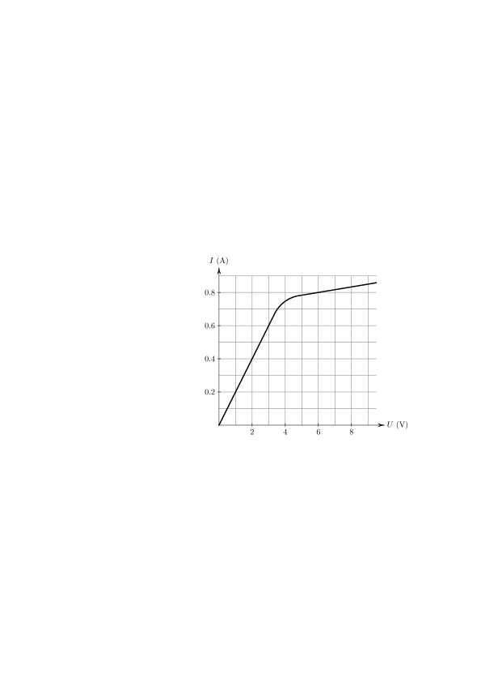

Задача 1. Следващите подусловия са независими.
1.1. Разполагате с две електрически крушки, два ключа и батерия. Всеки ключ
има две положения - "включено" и "изключено". Нарисувайте електрическа верига,
в която единият ключ включва/изключва само една от двете крушки, а другият и
двете. При всяко от натисканията се започва от два изключени ключа. Не може да
правите комбинации от положенията на ключовете. Означете крушките с L1 и L2,
а ключовете с K1 и K2, опишете кога коя крушка свети. (4.5 т.)

1.2. В участък от електричес-
ка верига е свързана стандар- I (A)
тна крушка с нажежаема жич-
ка. Когато крушката изгори та-
зи част от веригата е отворена, 0.8
тъй като жичката се прекъсва.
Има крушки, които са направе-
ни така, че когато жичката им 0.6
прекъсне веригата не се прекъс-
ва, а се дава на късо. Няма да
 0.4
се интересуваме как точно ста-
ва това, просто ще разглеждаме
изгорялата крушка като съеди- 0.2
нителен проводник, който я за-
мества. На фигурата е показана
зависимостта на тока от напре- U (V)
жението за такава крушка. 2 4 6 8
 Две такива крушки са свързани последователно към 6 V батерия. Нарисувайте
електрическата веригата (1 т.) и определете съпротивлението на всяка от крушките.
(2 т.) Една от крушките изгаря, определете съпротивлението на другата. (1.5 т.)
Ако двете крушки са свързани успоредно и едната изгори, какъв ток ще тече през
другата. (1 т.)

Задача 2. При снимането на бързо движещи се обекти е възможно в последствие
те да изглеждат размазани на снимката (удължени в посоката на движение). Ако
това удължение е под определена стойност то не се забелязва и снимката изглежда
нормално. Това зависи от скоростта на движещите се обекти и експозицията на
снимката (времето за което е заснета). Да разгледаме пътник, който се вози във влак
и снима през прозореца. Пътникът има две снимки. Първата е направена при спрял
влак и на нея се виждат локомотив, който не се движи, както и няколко стълба от
електрическата мрежа покрай релсите. Втора снимка е направена когато влакът
се движи. На нея се вижда отново няколко стълба от ел. мрежата и локомотив
 стр. 1 от 2
 подобен този от първата снимка, но този локомотив за разлика от предния е в
 движение. От снимката направена при спрял влак може да се определи диаметъра
 на изображението на стълба dp = 1.5 mm и дължината на локомотива lp = 12 cm.
 От снимката направена в движение се вижда, че диаметърът на стълба е с 10%
 по-голям в сравнение с този от другата снимка, а локомотивът с 3 mm. Времето за
 заснемане на снимката е t = 1/500 s, а реалният диаметър на стълбовете е d = 20
 cm. Определете:
 2.1. скоростта на влака; (3 т.)
 2.2. възможната скорост на локомотива от снимката направена в движение; (3.5 т.)
 2.3. за колко време са се разминали влакът и локомотивът, ако влакът е дълъг
 lв = 80 m? (3.5 т.)

 Задача 3. Дрезината представлява малка количка, която може да се движи по
 железопътни релси. Да предположим, че за да измерим разстоянието от дадена
 гара до дрезина, която се намира на релсите може да използваме омметър. Тъй
 като релсите и колелата на дрезината са метални, ако свържем омметъра към
 релсите ще измерим съпротивлението им. На графиката е показана зависимостта на
 измереното съпротивление, като функция на времето при движението на дрезината.
 Определете:
 3.1. скоростта на дрезината във всеки един от интервалите на графиката, за яснота
 представете резултатите в таблица; (6 т.)
 3.2. разстоянието което е изминала дрезината по време на движението и на какво
 разстояние се намира от първоначалното си положение; (2 т.)
 3.3. средната скорост за периода \[10, 130\] min. (2 т.)
 Указание: омметърът е прибор, който позволява директно измерване на елек-
 трично съпротивление свързано към изводите му. В случая това са железопътните
 релси, за които се знае, че съпротивлението им е пропорционално на дължината.
 Опитно е установено, че релса с дължина 1 km има съпротивление 0.05 $\Omega$.

