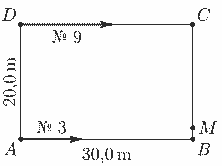
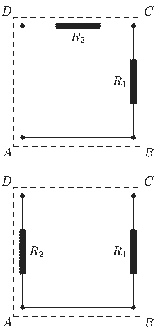

[[Състезания/2/7/2025|◂ 2025]] | [[Състезания/2/7/2026|условия]]

**Зад. 1 а)** Нека двамата се срещат за пръв път в т. $M \notin AD$. Означаваме пътя, изминат от № 3, със $s_1$, а пътя, изминат от № 9, със $s_2$. Тъй като се движат един срещу друг, сумата от изминатите от тях разстояния до първата среща е равна на $s_1 + s_2 = AB + BC + CD = 30 + 20 + 30 = 80 \text{ m}$. По условие знаем, че $s_2 - s_1 = 16 \text{ m}$. От последните две уравнения намираме $s_2 = 48 \text{ m}$ и $s_1 = 32 \text{ m}$. **(1 т.)** След срещата № 3 изминава остатъка от пътя до т. $D$ (разстоянието $s_2 = 48 \text{ m}$) за $t_1 = 36 \text{ s}$, откъдето $v_1 = 48/36 = 4/3 \approx 1,33 \text{ m/s} = 4,8 \text{ km/h}$. **(1 т.)** № 9 изминава остатъка от пътя до т. $A$ (разстоянието $s_1 = 32 \text{ m}$) за $t_2 = 16 \text{ s}$, откъдето $v_2 = 32/16 = 2,0 \text{ m/s} = 7,2 \text{ km/h}$. **(1 т.)**

**Зад. 1 б)** До първата среща двамата изминават общо $s_1 + s_2 = 80 \text{ m}$. За всяка следваща среща (тъй като се движат в противоположни посоки по затворен контур) те трябва да изминат заедно допълнителен път, равен на една обиколка на игрището, $P = 2(AB + BC) = 2(30 + 20) = 100 \text{ m}$. **(0,5 т.)** Общият изминат път до третата среща е $s_3 = 80 + 2 \cdot 100 = 280 \text{ m}$. **(0,5 т.)** Времето до третата среща, $t_3$, се намира от равенството $s_3 = (v_1 + v_2)t_3$: $t_3 = \frac{280}{4/3 + 2} = \frac{280}{10/3} = \frac{280 \cdot 3}{10} = 84 \text{ s}$. **(1 т.)**

**Зад. 1 в)** Времето за една пълна обиколка на № 3 е $T_1 = P/v_1 = 100/(4/3) = 75 \text{ s}$. **(0,5 т.)** Той достига за пръв път т. $D$ в момента $T_0 = (AB + BC + CD)/v_1 = 80/(4/3) = 60 \text{ s}$. **(0,5 т.)** Моментите на преминаване през $D$ в рамките на $4,0 \text{ min} = 240 \text{ s}$ са $t_i = T_0 + iT_1 < 240$. № 9 тръгва от т. $D$ (посока $C \to B \to A \to D$). За време $t_i$ той изминава разстояние $s_i = v_2t_i$, **(0,5 т.)** което също е пресметнато в таблицата по-долу. Всяко разстояние $s_i$ може да се представи като цяло число $n$ по обиколката на игрището $P$, плюс някакъв остатък $x_i$, който определя на какво разстояние се намира № 9 спрямо т. $D$.

| $i$ | 0 | 1 | 2 | |
| :--- | :---: | :---: | :---: | :--- |
| $t_i, \text{ s}$ | 60 | 135 | 210 | **(0,5 т.)** |
| $s_i, \text{ m}$ | 120 | 270 | 420 | |
| $s_i, \text{ m}$ | $1 \cdot 100 + 20$ | $2 \cdot 100 + 70$ | $4 \cdot 100 + 20$ | **(0,5 т.)** |
| Позиция на № 9 след т. $D$ (в посока $C$), m | 20 m | 70 m | 20 m | **(0,5 т.)** |
| Минимално разстояние от № 9 до т. $A$, m | 40 m | 10 m | 40 m | **(2 т.)** |

Както се вижда от таблицата, когато № 3 е в т. $D$, № 9 се намира периодично на минимално разстояние по периметъра $L = 10 \text{ m}$ или $40 \text{ m}$ от т. $A$.

**Зад. 2 а)** Площта на основата на аквариума е $S = L^2 = 30^2 = 900 \text{ cm}^2$. **(0,5 т.)** Обемът на водата е $V_B = m_B/\rho_B = 4200 \text{ cm}^3$. **(0,5 т.)** Поставяме тялото последователно по три начина, така че страните $a, b$ и $c$ да бъдат негови височини. В тези случаи лицата на съответните основи са:
$S_{bc} = bc = S - V_B/h_0 = 900 - 4200/7 = 900 - 600 = 300 \text{ cm}^2$, **(0,5 т.)**
$S_{ac} = ac = S - V_B/h_1 = 900 - 4200/6 = 900 - 700 = 200 \text{ cm}^2$, **(0,5 т.)**
$S_{ab} = ab = S - V_B/h_2 = 900 - 4200/5,6 = 900 - 750 = 150 \text{ cm}^2$. **(0,5 т.)**

Тъй като $bc > ac > ab$, получената подредба съответства точно на условието $a < b < c$. **(0,5 т.)** За да намерим обема на тялото $V = abc$, умножаваме трите уравнения: $(abc)^2 = 300 \cdot 200 \cdot 150 = 9\,000\,000 = 3000^2 = V^2$. **(0,5 т.)** Следователно $V = 3000 \text{ cm}^3$. **(0,5 т.)** Плътността на пластмасата е $\rho = m/V = 3600/3000 = 1,2 \text{ g/cm}^3 = 1200 \text{ kg/m}^3$. **(1 т.)**

**Зад. 2 б)** Като използваме резултата, получен в предното подусловие, определяме страните на тялото: $a = 3000/300 = 10 \text{ cm}$, $b = 3000/200 = 15 \text{ cm}$, $c = 3000/150 = 20 \text{ cm}$. **(0,5 т.)**

---
стр. 1 от 2

**Зад. 2 в)** Тялото е поставено със страна $b = 15 \text{ cm}$ вертикално, т.е. основата му е $S_{ac} = 200 \text{ cm}^2$. Началното ниво на водата е $h_1 = 6 \text{ cm}$. Дебитът е $Q = 3,78 \text{ L/min} = 3780 \text{ cm}^3\text{/min}$. Скоростта на покачване на нивото на водата ще бъде дебитът на водата, разделен на свободната площ в аквариума. Тъй като $b < H$, то в някакъв момент $t_1$ водата ще покрие тялото и площта ще се промени. Това означава, че в този момент и скоростта ще се промени.

Свободната площ на основата е $S_{CB} = S - S_{ac} = 900 - 200 = 700 \text{ cm}^2$. **(0,5 т.)** Скоростта на покачване на нивото е $v_1 = Q/S_{CB} = 3780/700 = 5,4 \text{ cm/min}$. **(1 т.)** Времето за достигане на горния ръб на тялото е $t_1 = (b - h_1)/v_1 = (15 - 6)/5,4 = 9/5,4 = \frac{10}{6} \text{ min} = 100 \text{ s}$. **(0,5 т.)**

От $b = 15 \text{ cm}$ до $H = 36 \text{ cm}$ водата запълва цялата площ на аквариума $S = 900 \text{ cm}^2$. **(0,5 т.)** Скоростта е $v_2 = Q/S = 3780/900 = 4,2 \text{ cm/min}$. **(1 т.)** Времето за запълване на тази част от аквариума е $t_2 = (H - b)/v_2 = (36 - 15)/4,2 = 21/4,2 = \frac{30}{6} \text{ min} = 300 \text{ s}$. **(0,5 т.)**

Общото време за напълване на съда е $t = t_1 + t_2 = 100 + 300 = 400 \text{ s}$ или $6 \text{ min}$ и $40 \text{ s}$. **(0,5 т.)** Това време може да се пресметне и чрез отношението $t = V_п/Q$, където $V_п = L^2H - V - V_B = 32,4 - 3 - 4,2 = 25,2 \text{ L}$ е празният обем в аквариума.

**Зад. 3** От таблицата взимаме стойностите за $I_{BC} = 4 \text{ mA}$ и $U_{BC} = 8 \text{ V}$ и намираме съпротивлението между клеми $B$ и $C$: $R_{BC} = U_{BC}/I_{BC} = 8 \text{ V} / 4 \text{ mA} = 2 \text{ k}\Omega$. **(1 т.)**

Външният резистор $R_0 = 1 \text{ k}\Omega$ и кутията (свързана през клеми $B$ и $C$) са свързани последователно към батерията. Токът през тях е един и същ, а напрежението на батерията $U$ е сбор от напреженията върху отделните елементи. Напрежението върху $R_0$ е $U_{R0} = I_{BC}R_0 = 4 \text{ mA} \cdot 1 \text{ k}\Omega = 4 \text{ V}$. Тогава напрежението на батерията е: $U = U_{R0} + U_{BC} = 4 \text{ V} + 8 \text{ V} = 12 \text{ V}$. **(1 т.)**

Токът през съпротивлението между клеми $A$ и $C$ е $I_{AC} = 4 \text{ mA}$. Тъй като веригата отново е последователна, напрежението върху $R_0$ в този случай е $U'_{R0} = I_{AC}R_0 = 4 \text{ mA} \cdot 1 \text{ k}\Omega = 4 \text{ V}$. Напрежението върху клемите $AC$ (липсващото в таблицата) намираме като извадим напрежението на $R_0$ от това на батерията: $U_{AC} = U - U'_{R0} = 12 \text{ V} - 4 \text{ V} = 8 \text{ V}$. **(0,5 т.)** Съпротивлението вътре в кутията между $A$ и $C$ е $R_{AC} = U_{AC}/I_{AC} = 8 \text{ V} / 4 \text{ mA} = 2 \text{ k}\Omega$. **(1 т.)** Тъй като $R_{AC} = R_{BC} = 2 \text{ k}\Omega$ (и напреженията са равни при еднакъв ток), това означава, че добавянето на участъка $AB$ към веригата не променя напрежението. Следователно между $A$ и $B$ има проводник ($R_{AB} = 0 \Omega$). **(1 т.)**

За клеми $D$ и $A$ токът е $I_{DA} = 2 \text{ mA}$. Напрежението върху $R_0$ сега е $U''_{R0} = I_{DA}R_0 = 2 \text{ mA} \cdot 1 \text{ k}\Omega = 2 \text{ V}$. Липсващото напрежение върху клемите на кутията е $U_{DA} = U - U''_{R0} = 12 \text{ V} - 2 \text{ V} = 10 \text{ V}$. **(0,5 т.)** Съпротивлението между клемите е $R_{DA} = U_{DA}/I_{DA} = 10 \text{ V} / 2 \text{ mA} = 5 \text{ k}\Omega$. **(1 т.)**

Разглеждаме пътя между $D$ и $A$ като последователно свързани елементи (през $C$ и $B$): $D \to C \to B \to A$, тоест двете клеми $D$ и $A$ не са свързани директно. При последователно свързване общото напрежение е сума от напреженията върху отделните участъци: $U_{DA} = U_{CD} + U_{BC} + U_{AB}$. Вече знаем, че $U_{DA} = 10 \text{ V}$ и $U_{AB} = 0 \text{ V}$ (проводник). Напрежението върху участъка $BC$ при този ток ($I = 2 \text{ mA}$) пресмятаме като: $U_{BC} = I_{DA}R_{BC} = 2 \text{ mA} \cdot 2 \text{ k}\Omega = 4 \text{ V}$. Заместваме в равенството за напреженията: $10 \text{ V} = U_{CD} + 4 \text{ V} + 0 \text{ V}$, откъдето намираме $U_{CD} = 6 \text{ V}$. Сега можем да намерим съпротивлението между $C$ и $D$: $R_{CD} = U_{CD}/I_{DA} = 6 \text{ V} / 2 \text{ mA} = 3 \text{ k}\Omega$. **(1 т.)**

От условието $R_1 < R_2$ следва, че $R_1 = 2 \text{ k}\Omega$ (свързан между $B$ и $C$) **(0,5 т.)** и $R_2 = 3 \text{ k}\Omega$ (свързан между $C$ и $D$). **(0,5 т.)** Между $A$ и $B$ има проводник, **(0,5 т.)** а между $D$ и $A$ няма директно свързан елемент. **(0,5 т.)** Схемата е показана на горната фигура. **(1 т.)**

Може да разгледаме и случая, когато токът минава директно през резистор, свързан между $D$ и $A$. В този случай, елементът $R_{DA} = 5 \text{ k}\Omega$. За да бъде това единственият път за тока (и да не се разклонява към $C$), трябва връзката между $C$ и $D$ да е прекъсната (няма елемент между $C$ и $D$). В този случай съпротивленията ще са $R_1 = R_{BC} = 2 \text{ k}\Omega$ и $R_2 = R_{DA} = 5 \text{ k}\Omega$. Схемата на свързване е показана на долната фигура.

**Указание:** дават се точки за което и да е от двете решения.