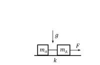

[[Състезания/2/8/2020|◂ 2020]] | [[Състезания/2/8r/2021|решения]] | [[Състезания/2/8/2022| 2022 ▸]]

**Задача 1. Кинематика**

Велосипедист, който се движи равномерно със скорост vв = 10 m/s, се опитва да догони
мотоциклетист. В началния момент мотоциклетът е на разстояние d = 80 m пред велосипеда
и тръгва да се движи с неизвестно постоянно ускорение aм по прав път. Дадено е също така,
че велосипедистът догонва и изпреварва мотоциклетиста за време tи = 10 s след началния
момент.

а) Намерете ускорението aм на мотоциклета и пътя sм , изминат от мотоциклетиста до
момента на изпреварването. \[2,5 т.\]

б) Колко пъти скоростта на велосипеда е по-голяма от скоростта на мотоциклета в момента
на изпреварването? \[1,5 т.\]

в) Колко време t ' след началния момент е необходимо, за да се изравнят скоростите на двете
превозни средства? Какво е тогава разстоянието d ' между велосипеда и мотоциклета? \[2,5 т.\]

г) Определете минималната скорост vв,min < vв , която е необходима на велосипедиста, за да
настигне мотоциклетиста, движещ се както по-горе. За какво време tи,max след началния
момент и след какъв изминат от мотоциклета път sм,max би се случило това застигане? \[3,5 т.\]

**Задача 2. Свободно падане**

Саксия пада от перваз на най-горния етаж на висок блок. Приемете, че земното ускорение е
g = 10 m/s 2 . Съпротивлението на въздуха да се пренебрегне.
а) Нека разстоянието от перваза, от който пада саксията, до земната повърхност е H = 45 m.
За какво време tH саксията ще падне на земята? С каква скорост vH саксията се удря в
земната повърхност? \[2,5 т.\]
При свободното си падане саксията преминава покрай прозорец на по-долен етаж от блока за
време t = 0,1 s. Приемете, че прозорецът е с височина h = 2 m.
б) Намерете времето t0 (от началото на падането), за което саксията достига горната рамка на
прозореца. Определете разстоянието h0 между горната рамка на прозореца и перваза, от
където е паднала саксията. \[5 т.\]
в) С колко процента нараства скоростта на саксията, докато пада покрай прозореца? \[2,5 т.\]

**Задача 3. Трупчета на нишка**

Две трупчета са свързани с безмасова неразтеглива нишка, както е показано на фигурата вляво. Лявото трупче е с неизвестна маса mл , а дясното има маса mд = 600 g. На дясното трупче действа сила, насочена надясно, с неизвестна големина F. Коефициентът на триене между трупчетата и хоризонталната повърхност е k = 0,1. Първоначално дясното трупче се движи с постоянно ускорение a = 1 m/s2 . В даден момент нишката между трупчетата е прерязана и дясното трупче продължава да се движи под действие на силата F, но има ново ускорение a' = 2 m/s2. Може да използвате, че земното ускорение е g = 10 m/s2.

а) Опишете и начертайте всички сили, които действат на двете трупчета преди прерязването на нишката. \[2,5 т.\]

б) Намерете големината на силата F. \[2 т.\]

в) Определете на колко е равна масата mл . \[4 т.\]

г) На колко е равна силата на опън T на нишката по време на движението на системата преди прерязването на нишката? \[1,5 т.\]
