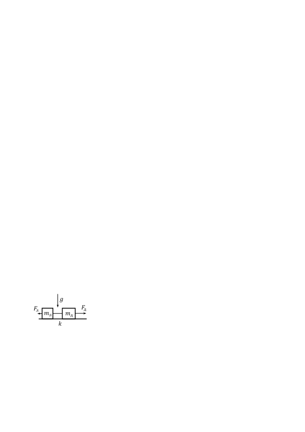

[[Състезания/2/8/2021|◂ 2021]] | [[Състезания/2/8r/2022|решения]] | [[Състезания/2/8/2023| 2023 ▸]]

**Задача 1. Кинематика**

Мотоциклетист, движещ се равномерно със скорост $v_M = 15$ m/s по прав път, се стреми да догони автомобилист. В началния момент автомобилът е на неизвестно разстояние $d$ пред мотоциклета и започва да се движи с постоянно ускорение $a_A = 1\ \mathrm{m/s^2}$. В момента, когато мотоциклетистът изпреварва автомобилиста, изминатият път от автомобила е $s_A = d/2$.

а) Намерете времето $t_\text{изп}$, за което мотоциклетът догонва и изпреварва автомобила. На колко е равен пътят $s_A$, изминат от автомобила до момента на изпреварването? \[3,5 т.\]

б) Каква е скоростта $v_A$ на автомобила в момента на изпреварването? \[1 т.\]

в) Намерете след колко време $t'_\text{изп}$ от началния момент автомобилът на свой ред изпреварва мотоциклета. Колко е изминатият дотогава път $s_A'$ от автомобила? \[3 т.\]

г) Определете колко време $\tau$ (след началния момент) е необходимо на автомобилиста, за да развие двойно по-голяма скорост от тази на мотоциклетиста. Какво е тогава разстоянието между двамата водачи на превозни средства? \[2,5 т.\]

**Задача 2. Свободно падане**

Малко тяло пада (без начална скорост) от неизвестна височина $H$ над земната повърхност. Времето между момента, когато тялото се намира на височина $h=135$ m, и момента на удара на тялото в земната повърхност е $\Delta t = 3$ s. Приемете, че земното ускорение е $g = 10\ \mathrm{m/s^2}$. Съпротивлението на въздуха да се пренебрегне.

а) Намерете първоначалната височина $H$, от която пада тялото. \[4 т.\]

б) Нека да означим с $v_{\text{ср}1}$ средната скорост на тялото над височината $h$, а средната скорост на движение на тялото след това да запишем като $v_{\text{ср}2}$. Определете отношението между двете средни скорости. \[3 т.\]

в) Колко време $t_{100}$ е необходимо на тялото, за да измине последните сто метра от своя път
преди да се удари в земната повърхност? \[2 т.\]

г) С каква скорост $v_\text{кр}$ тялото се удря в земната повърхност? \[1 т.\]

**Задача 3. Теглене на трупчета**

 Две трупчета са свързани с безмасова неразтеглива нишка, както е
 показано на фигурата вляво. Лявото трупче е с неизвестна маса $m_\text{л}$, а  дясното има неизвестна маса $m_\text{д}$, като $m_\text{л} + m_\text{д} = 2$ kg. На лявото  трупче действа сила, насочена наляво, с неизвестна големина $F_\text{л}$. Дясното трупче е теглено надясно от сила с неизвестна големина $F_\text{д}$. Коефициентът на триене между трупчетата и хоризонталната повърхност е $k = 0,1$. Първоначално трупчетата се движат надясно с неизвестно постоянно ускорение , като силата на опън на нишката е $T = 3$ N. В даден момент нишката между трупчетата е прерязана, след което върху трупчета продължават да действат същите сили $F_\text{л}$ и $F_\text{д}$. Новото ускорение на лявото трупче, след като спре и започне да се движи наляво, е $a_\text{л} = 0,5\ \mathrm{m/s^2}$, докато дясното трупче продължава движението си надясно с ново ускорение $a_\text{д} = 3,5\ \mathrm{m/s^2}$.
Използвайте, че земното ускорение е $g = 10\ \mathrm{m/s^2}$.

а) Определете масите $m_\text{л}$ и $m_\text{д}$ на двете трупчета. \[7 т.\]

б) На колко са равни големините на силите $F_\text{л}$ и $F_\text{д}$? \[2 т.\]

в) Намерете големината на първоначалното ускорение $a$. \[1 т.\]
