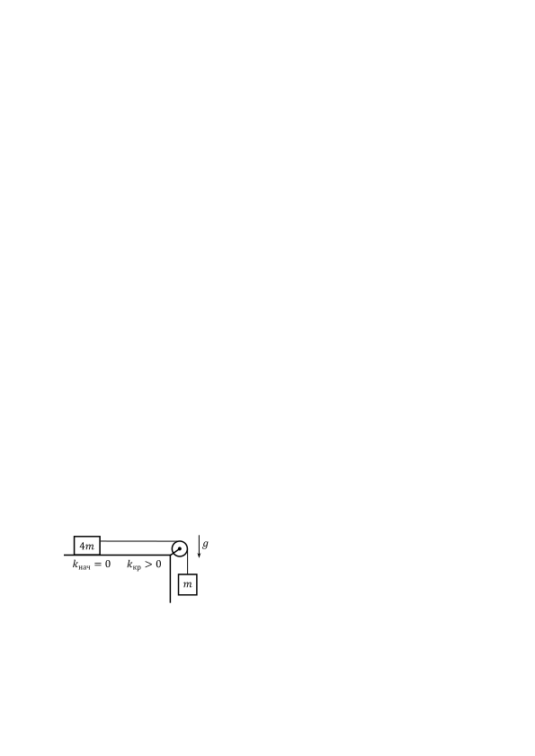

[[Състезания/2/8/2022|◂ 2022]] | [[Състезания/2/8r/2023|решения]] | [[Състезания/2/8/2024| 2024 ▸]]

**Задача 1. Кинематика**

Обект с пренебрежими размери се движи праволинейно и еднопосочно. Първоначално движението е равнозакъснително с начална скорост $v_0 = 20$ m/s в продължение на 3 s. След това обектът се движи равномерно за 6 s с достигнатата скорост $v_3 = 5$ m/s. После движението е равноускорително в продължение на 5 s, при което се развива скорост $v_\text{кр} = 15$ m/s. В последната секунда от движението си обектът се движи равномерно с така достигнатата скорост.

а) Колко е големината на началното ускорение $a_0$ на обекта? Определете ускорението $a_{10}$, след като са изминали 10 s от началото на движението. \[2 т.\]

б) Намерете скоростта $v_2$ на обекта, когато са изминали от началния момент. Колко време $\Delta t$ след това е нужно, за да стане скоростта отново равна на ? \[2,5 т.\]

в) Определете пътя $s_5$, изминат от обекта за първите от движението му. На колко е равен пълният изминат път $s_\text{кр}$ ? \[3,5 т.\]

г) Каква е средната скорост $\bar v_{10}$ на обекта за първите 10 s от движението? \[2 т.\]

**Задача 2. Свободно падане**

Малко топче е пуснато да пада свободно от неизвестна височина $h$ над земната повърхност. След време $T = 1$ s от двойно по-малка височина е пуснато надолу второ малко топче. Дадено е, че когато двете топчета се намират на една и съща височина над земната повърхност, скоростта на първото топче е три пъти по-голяма от скоростта на второто топче. Приемете, че земното ускорение е $g = 10\ \mathrm{m/s^2}$. Съпротивлението на въздуха да се пренебрегне.

а) Определете колко време $t_{12}$ изминава от началния момент (когато е пуснато първото топче) до момента, когато двете топчета се намират на една и съща височина над земната повърхност. \[2 т.\]

б) Намерете първоначалната височина $h$, от която пада първото топче. С каква скорост $v_\text{кр}$ то се удря в земята? \[4 т.\]

в) На каква височина $h_2$ се намира второто топче в момента на удара на първото топче в земната повърхност? Определете скоростта $v_2$ на второто топче в този момент. \[2 т.\]

г) Колко време $\Delta t_\text{уд}$ изминава между ударите на двете топчета в земята? \[2 т.\]

**Задача 3. Трупчета и макара**

Две трупчета с неизвестни маси $m$ и $4m$ са свързани с безмасова неразтеглива нишка, както е показано на фигурата вляво. Нишката е прекарана през неподвижна безмасова макара. Първоначално системата се движи равноускорително с неизвестно ускорение $a$, докато лявото трупче се намира върху гладка област от хоризонталната повърхност (с нулев коефициент на триене). Тогава силата на опън на нишката е $T_\text{нач} = 0,8$ N. След това лявото трупче достига грапава област, където коефициентът на триене между трупчето и повърхността е $k_{кр}>0$ (неизвестен), и системата започва да се движи равномерно. Може да използвате, че земното ускорение е $g = 10\ \mathrm{m/s^2}$. Съпротивлението на въздуха да се пренебрегне.

а) Намерете ускорението $a$ и масата $m$. \[5,5 т.\]

б) Определете на колко е равна силата на опън $T_{кр}$ на нишката при движението с триене и стойността на коефициента на триене $k_{кр}$. \[4,5 т.\]