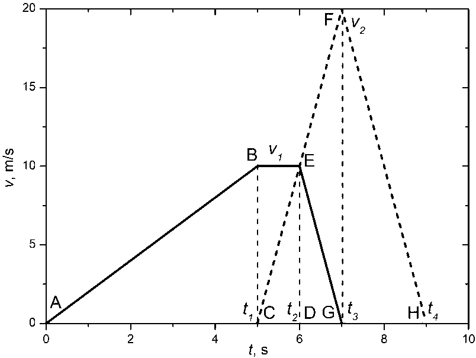
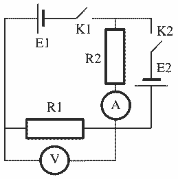

[[Състезания/2/8/2025|◂ 2025]] | [[Състезания/2/8/2026|условия]]

**Задача 1. Движение.**

**а)** Тъй като между моментите $t_1$ и $t_3$ тяло 2 се движи равноускорително и използвайки, че $v_2 = 2v_1$, следва $a = \frac{v_1}{t_2 - t_1} = \frac{v_2}{t_3 - t_1}$, откъдето след опростяване $-t_1 + 2t_2 - t_3 = 0$. (1) От условието, че ускоренията $a_{сп}$, с които двете тела са се движили равнозакъснително, са равни, следва $a_{сп} = \frac{v_1}{t_3 - t_2} = \frac{v_2}{t_4 - t_3}$ и $v_2 = 2v_1$, се получава, че $2t_2 - 3t_3 + t_4 = 0$. (2) От условието, че двете тела са спрели на едно и също място, т.е. те са изминали един и същ път, следва $s_1 = s_2$, $\frac{v_1t_1}{2} + v_1(t_2 - t_1) + \frac{v_1(t_3 - t_2)}{2} = \frac{v_2(t_3 - t_1)}{2} + \frac{v_2(t_4 - t_3)}{2}$. След опростяване $t_1 + t_2 + t_3 - 2t_4 = 0$. (3) След събиране на (1) и (3) се получава $3t_2 - 2t_4 = 0$, откъдето $t_4 = \frac{3t_2}{2} = 9,0 \text{ s}$. \[1 т.\] Замествайки в (2) $t_3 = \frac{2t_2 + t_4}{3} = 7,0 \text{ s}$. \[1 т.\] Накрая замествайки в (1) $t_1 = 2t_2 - t_3 = 5,0 \text{ s}$. \[1 т.\]

**б)** Телата са били най-раздалечени едно от друго на разстояние $s_m = 30 \text{ m}$ в момента $t_2$. Следователно $s_1(t_2) - s_2(t_2) = s_m$, $\frac{v_1t_1}{2} + v_1(t_2 - t_1) - \frac{v_2(t_2 - t_1)}{2} = s_m$, откъдето $v_1 = \frac{2s_m}{t_2}$ \[0.5 т.\] $= 10 \text{ m/s}$. \[0.5 т.\] От дадената връзка $v_2 = 2v_1 = 20 \text{ m/s}$. \[0.5 т.\]

**в)** Ускорението $a_{сп}$ на спиране на двете тела е $a_{сп} = \frac{v_1}{t_3 - t_2} = \frac{v_2}{t_4 - t_3}$ \[0.5 т.\] $= 10 \text{ m/s}^2$. \[0.5 т.\] Ускорението $a_1$, с което тяло 1 достига максималната си скорост, е $a_1 = \frac{v_1}{t_1}$ \[0.5 т.\] $= 2 \text{ m/s}^2$. \[0.5 т.\]

**г)** Изминатото разстояние $s$ от всяко от телата, е $s = \frac{v_2(t_4 - t_1)}{2}$ \[0.5 т.\] $= 40 \text{ m}$. \[0.5 т.\]

Попълнената таблица изглежда така:

| | | | |
| :--- | :--- | :--- | :--- |
| $t_1 = 5,0 \text{ s}$ \[1 т.\] | $v_1 = 10 \text{ m/s}$ \[1 т.\] | $a_{сп} = 10 \text{ m/s}^2$ \[1 т.\] | $s = 40 \text{ m}$ \[1 т.\] |
| $t_3 = 7,0 \text{ s}$ \[1 т.\] | $v_2 = 20 \text{ m/s}$ \[0.5 т.\] | $a_1 = 2,0 \text{ m/s}^2$ \[1 т.\] | |
| $t_4 = 9,0 \text{ s}$ \[1 т.\] | | | |

За фигура с точни графики на зависимостта на скоростта от времето за двете тела \[2.5 т.\] (от които \[0.5 т.\] за оси с величини, единици и мащаб, \[1 т.\] за вярна графика на движението на тяло 1 и \[1 т.\] за вярна графика на движението на тяло 2).

**Алтернативно (геометрично) решение за подусловия а) и б):**
а) След като телата са спрели на едно и също място, то от графиката следва, че площта на четириъгълника $ACEB$ е равна на тази на четириъгълника $EGHF$: $S_{ACEB} = S_{EGHF}$, $\frac{t_1v_1}{2} + \frac{(t_2 - t_1)v_1}{2} = \frac{(t_3 - t_2)v_2}{2} + \frac{(t_4 - t_3)v_2}{2}$. След опростяване $t_2v_1 = (t_4 - t_2)v_2$. Използвайки, че $v_2 = 2v_1$, то $t_4 = \frac{3}{2}t_2$ \[0.5 т.\] $= 9,0 \text{ s}$. \[0.5 т.\] От $\Delta CDE$ и $\Delta CGF$, използвайки отново, че $v_2 = 2v_1$ следва, че $CD = DG$, т.е. $t_2 - t_1 = t_3 - t_2$. От равенството на ускоренията при равнозакъснителното движение следва, че $EG \parallel FH$, откъдето следва, че $CG = GH$, т.е. $t_4 - t_3 = t_3 - t_1$. От получените връзки получаваме, че $t_4 - t_3 = 2(t_3 - t_2)$, откъдето $t_3 = \frac{t_4 + 2t_2}{3} = \frac{7}{6}t_2$ \[0.5 т.\] $= 7,0 \text{ s}$. \[0.5 т.\] Съответно $t_1 = \frac{5}{6}t_2$ \[0.5 т.\] $= 5,0 \text{ s}$. \[0.5 т.\]

б) Тъй като максималното раздалечаване на двете тела е $s_m = S_{ACEB} = \frac{t_2v_1}{2} = 30 \text{ m}$, то $v_1 = \frac{2s_m}{t_2}$ \[0.5 т.\] $= 10 \text{ m/s}$. \[0.5 т.\] От дадената връзка $v_2 = 2v_1 = 20 \text{ m/s}$. \[0.5 т.\]

**Задача 2. Електрическа схема.**

**а)** Съпротивлението $R_1 = \frac{U_1}{I_1}$ \[1 т.\] $= \frac{9,0 \text{ V}}{3,0 \text{ mA}} = 3,0 \text{ k}\Omega$. \[1 т.\] Съпротивлението $R_2 = \frac{E_1 - U_1}{I_1}$ \[1 т.\] $= \frac{12,0 \text{ V} - 9,0 \text{ V}}{3,0 \text{ mA}} = 1,0 \text{ k}\Omega$. \[1 т.\]

**б)** Напрежението $E_2$ на батерията $E2$ е $E_2 = E_1 - U_2$ \[1 т.\] $= 12,0 \text{ V} - 3,0 \text{ V} = 9,0 \text{ V}$. \[1 т.\] Токът $I_2$, който ще показва амперметърът, е $I_2 = \frac{E_2}{R_2}$ \[1 т.\] $= \frac{9,0 \text{ V}}{1 \text{ k}\Omega} = 9,0 \text{ mA}$. \[1 т.\]

**в)** Новото показание $U_3$ на волтметъра е нула (отворен ключ K1). \[1 т.\] $I_3$ не се променя, $I_3 = 9,0 \text{ mA}$. \[1 т.\]

| | | |
| :--- | :--- | :--- |
| $R_1 = 3,0 \text{ k}\Omega$ \[2 т.\] | $E_2 = 9,0 \text{ V}$ \[2 т.\] | $U_3 = 0 \text{ V}$ \[1 т.\] |
| $R_2 = 1,0 \text{ k}\Omega$ \[2 т.\] | $I_2 = 9,0 \text{ mA}$ \[2 т.\] | $I_3 = 9,0 \text{ mA}$ \[1 т.\] |

**Задача 3. Събирателна леща.**

**а)** Построяваме правата $S_1S_2$. \[1 т.\] Тя пресича оптичната ос $P_1P_2$ в центъра на лещата точка $O$. \[0.5 т.\] Така намираме положението на лещата (перпендикулярна на оптичната ос). \[0.5 т.\]

**б)** Построяваме права, успоредна на $P_1P_2$, минаваща през $S_1$. \[1 т.\] Тя пресича лещата в точка $X$. Правата $XS_2$ пресича $P_1P_2$ в задния фокус $F_2$. \[1 т.\] Построяваме права, успоредна на $P_1P_2$, минаваща през $S_2$. \[1 т.\] Тя пресича лещата в точка $Y$. Правата $YS_1$ пресича $P_1P_2$ в предния фокус $F_1$. \[1 т.\]

**в)** Построяваме права $A_1O$. \[1 т.\] Построяваме права, успоредна на $P_1P_2$, минаваща през $A_1$. \[1 т.\] Тя пресича лещата в точка $Z$. Построяваме правата $ZF_2$. \[1 т.\] Правата $A_1O$ пресича $ZF_2$ в образа $A_2$. \[1 т.\]