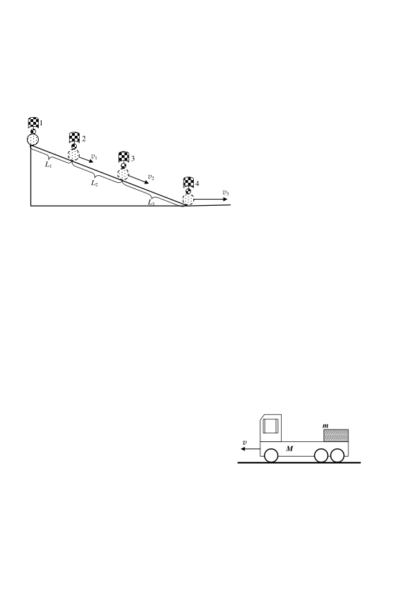
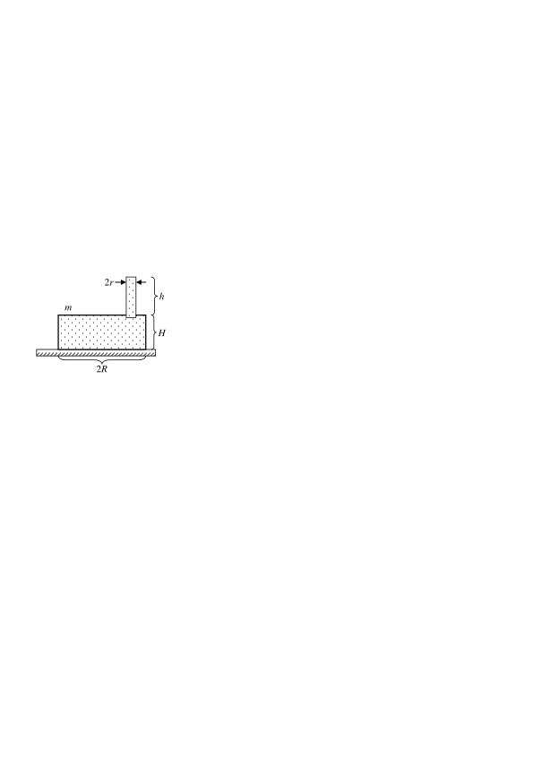

Задача 1. Опит на Галилей.

Топче се спуска без начална скорост по гладка наклонена равнина. През разстояния L1, L2 и L3 са поставени четири камбанки. Когато топчето се удари в камбанка, тя звъни. Първата камбанка издава звук, когато топчето започва своето движение. Разстоянията L1, L2 и L3 са подбрани така, че звънът от камбанките да бъде презедин и същ интервал от време t. Като приемете движението на топчето по наклонената равнина за равноускорително, определете:

А) В какво отношение v1:v2:v3 са скоростите на топчето в края на участъците L1, L2 и L3?

Б) В какво отношение L1:L2:L3 се намират разстоянията между камбанките?

В) Какво означава средна скорост vср на движение? Напишете формулата и единицата за средна
скорост в SI (Международната система единици).

Г) Изразете средната скорост vср на топчето за цялото време на движение по наклонената
равнина чрез L1 и t.

Д) Наклонената равнина преминава в гладък хоризонтален участък. Определете вида на
движението на топчето по гладкия хоризонтален участък, като аргументирате отговора си.

Задача 2. Камиони и автомобили

Задачата се състои от две независими части

Част 1. Да опазим товара!

Върху товарната платформа на камион с маса
M = 2000 kg се намира товар с маса m = 50 kg. v
 M
Камионът се движи с постоянна скорост v = 36 km/h.

А) Намерете теглителната сила F, действаща на камиона, ако двигателят работи с мощност
P = 100 конски сили (1 конска сила = 735 W).

Б) Поради препятствие на пътя, шофьорът на камиона натиска спирачките, така че товарът да
не приплъзва върху платформата. Намерете спирачния път S на камиона, ако коефициентът на
триене между гумите и асфалта е k1 = 0,4.

 1
В) При какво минимално ускорение amin на камиона при спиране, товарът ще се приплъзне
върху платформата? Коефициентът на триене между товара и платформата е k2 = 0,5.
Отбележете всички сили, действащи върху товара.

Част 2. Дали познаваме добре величините работа и енергия?

 Автомобил започва да се движи равноускорително от състояние на покой. Скоростта му
нараства от 0 до v. В кой от двата случая двигателят на автомобилa извършва по-голяма
работа?
Случай 1: Автомобилът увеличава скоростта си от 0 до v/2.
Случай 2: Автомобилът увеличава скоростта си от v/2 до v.
Аргументирайте отговора си.

Задача 3. Повдигаме, потапяме, топим и плаваме

Задачата се състои от две независими части

Част 1. Да повдигнем тенджерата!

 2r
 Обърната тенджера (с дъното нагоре) с маса m, радиус R и
 h
 m височина H, е поставена върху гумена подложка. Отворът на съда
 плътно прилепва към гумената подложка. В дъното на тенджерата е
 H направен отвор с радиус r, в който е поставена лека вертикална
 тръба . През тръбата в тенджерата се налива течност с плътност $\rho$.
 Височината на стълба течност в тръбата е h.
 2R
А) Намерете хидростатичното налягане p1, действащо върху гумената подложка.
Б) Намерете хидростатичното налягане p2, действащо върху дъното на тенджерата.
В) При каква височина h1 на стълба течност в тръбата течността ще започне да изтича под
тенджерата?

Част 2. Коктейл "Айсберг" - чаша вода с лед. Да пишем формули или да пресмятаме?

В чаша с вода плава кубче лед.

А) Как ще се измени (нараства, намалява или остава постоянно) нивото на водата в чашата,
когато кубчето лед се разтопи напълно.

Б) Ще се промени ли отговорът в подусловие А), ако в обема на леденото кубче се намира
коркова тапа?

Уточнение: Плътността на леда е по-малка от плътността на водата. Плътността на корка е по-
малка от плътността на водата и леда.

Задачата може да бъде решена чрез описание и разсъждения (качествено) или чрез пресмятания
(количествено).

 2
