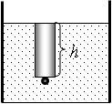
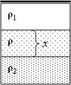

**Във всички задачи може да приемете, че земното ускорение е $g = 10\ \mathrm{m/s^2}$.**

**Задача. 1. Спортен парашутизъм**

Самолет лети хоризонтално с постоянна скорост w. От самолета скачат парашутисти през един и същ интервал от време. Всеки парашутист за много кратко време се ускорява и после пада с постоянна скорост u, след това отваря парашута си и продължава да пада с постоянна, безопасна скорост v. Този процес е запечатан на фотография (фиг. 1). Приемете, че парашутистите падат вертикално и отварят парашутите си на една и съща височина.

А) Безопасната скорост v на парашутист е равна на скростта, която той би имал при свободно падане от височина h = 3 m без парашут. Пресметнете безопасната скорост v? (2 т)

 Фиг. 1

Б) От джоба на парашутист, достигнал вече безопасната скорост, се изплъзва ключ.
Ключът пада върху земната повърхност за време t = 1,2 s. Колко време $\Delta$t след ключа ще се приземи парашутистът? (4 т)

В) Намерете отношението между скоростта на самолета w и скоростта на парашутиста при отворен парашут v (w/v = ?). (1 т)

Г) Намерете отношението между скоростта на самолета w и скоростта на парашутиста при затворен парашут u (w/u = ?). (1 т)

Д) Намерете отношението между скoростите на парашутиста при затворен и отворен
парашут (u/v = ?). (1 т)

Жокер: Използвайте координатната мрежа от фиг. 1.

**Задача 2. Особености на риболова**

Част 1. Петър бил запален рибар. Той използвал за въдицата цилиндрична плувка с
височина h = 25 mm и с плътност $\rho$п = 900 kg/m3. Петър направил два опита, за да тества плувката.

А) Опит 1. Петър закрепил малко тежко топче към плувката и я потопил в прясна вода с плътност $\rho$ = 1000 kg/m3. Оказало се, че плувката потънала изцяло до горния си ръб, както е показано на фиг. 2.

 На каква височина $\Delta$h над повърхността на водата ще се издигне горният край на плувката със закрепеното към нея топче, ако тя бъде потопена в морска вода с плътност $\rho_\text{м}=1034\ \mathrm{kg/m^3}$? (2 т)

Фиг. 2

Б) Опит 2. Петър махнал топчето от плувката и я потопил в широк съд с три несмесващи се течности с плътности съответно $\rho$ 1 = 800 kg/m3 (отгоре), $\rho$ = 1000 kg/m3 (по средата) и $\rho_2$ = 1100 kg/m3 (отдолу), както е показано на фиг. 3. При каква дебелина x на средния слой течност разстоянието между основата на плувката и повърхността на долната течност е d = 5 mm? (4 т)

Фиг. 3

Жокер: Разгледайте два случая:

 1. Плувката плава, като се намира едновременно в трите течности;
 2. Плувката плава, без да е потопена в долната течност.

Част 2. Петър искал да изработи от олово сферична рибарска тежест. За целта той
използвал две еднакви тънкостенни полусфери, всяка с радиус R и с маса m. Горната
полусфера е закрепена неповдижно, а долната е притисната към нея отдолу с вертикална сила F. Границата между двете полусфери е хоризонтална. Плътността на оловото е $\rho_o$.

През малък отвор при върха на горната полусфера в получената сферична кухина е налято разтопено олово, както е показано на фиг. 4. Получете израз за минималната сила F, с която трябва да бъде притисната долната полусфера така, че оловото да не изтече от кухината, преди да се втвърди? (4 т)

**Задача 3. Как се разпределя мощността?**

Малкият Борко си има нова електрическа играчка-автомобилче. Тя представлява
еднороден куб със страна b = 20 cm, като на едната му стена са поставени четири колела. Масата на играчката е m = 500 g. И четирите колела се задвижват едновременно от електродвигател с постоянна механична мощност P = 16 W. Коефициентът на триене между колелата и пода е k = 0,4.

Размерът и масата на колелата може да бъдат пренебрегнати в сравнение с b и m
съответно. Съпротивлението на въздуха и триенето между частите на задвижващия
механизъм също се пренебрегват.

А) Първоначално играчката била преобърната на страничната си стена, както е показано на фиг. 5. Каква минимална работа А трябва да извърши Борко, за да постави автомобилчето с колелата върху пода? (2 т)

Б) След като играчката била поставена с колелата върху пода, Борко започнал да я бута с изключен двигател, при което колелата били блокирани и вместо да се въртят, се хлъзгали по пода. Каква минималната работа А1 трябва да извърши Борко, за да избута амтомобилчето на разстояние d = 1,2 m по пода? (2 т)

В) Каква минимална работа A2 трябва да извърши Борко, за да повдигне автомобилчето на височина d = 1,2 m над пода? (1 т)

Г) Борко поставил автомобилчето на пода с нулева начална скорост, но с включен
двигател и въртящи се колела. Известно време колелата буксували, т.е. приплъзвали се по пода. Колко било ускорението a на автомобилчето, докато колелата буксували? (1,5 т)

Д) След време t0 = 2 s колелата престанали да буксуват, а автомобилчето продължило да се движи напред.

Колко била скоростта v0 на автомобилчето в момента t0?

Каква скорост v1 би достигнало автомобилчето, ако бъде оставено да се движи общо
t1 = 5 s след поставянето му върху пода? Приемете, че след като колелата престанат да буксуват, цялата механична работа на двигателя се изразходва за ускоряване на
автомобилчето. (3,5 т)