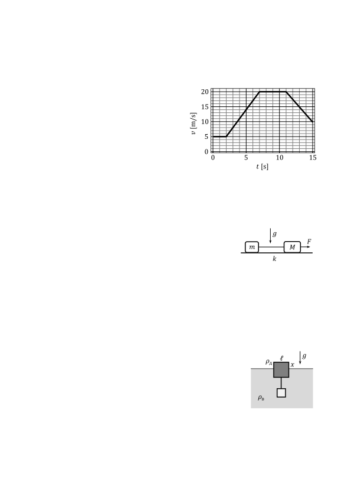

**Задача 1. Кинематика**

Обект с пренебрежими размери се движи праволинейно и еднопосочно. На графиката вдясно е показано как се изменя скоростта на обекта в зависимост от изминалото време.

а) Колко е ускорението $a_5$ на обекта, след като са изминали пет секунди от началото на движението? Определете колко е големината на ускорението $a_{12}$, след като са изминали 12 s от началото на движението. \[2 т.\]

б) Колко време след началото на движението скоростта на обекта става 9 m/s? Намерете скоростта на обекта, когато са изминали 10 s от момента, когато скоростта е 9 m/s. \[3 т.\]

в) Определете пътя $s_5$, изминат от обекта за първите пет секунди от движението му. На колко е равен пълният изминат път $s_{15}$? \[3,5 т.\]

г) Каква е средната скорост $\bar v_{10}$ на обекта за първите 10 s от движението? \[1,5 т.\]

**Задача 2. Трупчета на нишка**

Две трупчета са свързани с безмасова неразтеглива нишка по
начина, показан на фигурата вдясно. Лявото трупче има маса $m = 0,5$ kg, докато дясното е с неизвестна маса $M$. На дясното
трупче действа неизвестна сила $F$, насочена надясно. Системата
се движи по хоризонтална повърхност, като коефициентът на
триене между трупчетата и повърхността е $k = 0,1$. Дадено е, че силата на опън на нишката е три пъти по-малка от силата $F$. Земното ускорение е $g\approx10\ \mathrm{m/s^2}$.

а) Намерете масата $M$ на дясното трупче. \[5 т.\]
В един момент нишката е прерязана, след което ускорението на дясното трупче нараства четири пъти.

б) На колко е равна силата $F$? Определете ускорението на системата преди прерязването на нишката. \[3,5 т.\]

в) Намерете ускоренията $a_m$ и $a_M$ на трупчетата след прерязването на нишката. \[1,5 т.\]

**Задача 3. Хидростатика**

Дървено кубче със страна $l=8$ cm и неизвестна плътност $\rho_\text{д}$ е закачено с тънка безмасова нишка за стъклено кубче с четири пъти по-голяма плътност. Обемът на стъкленото кубче е осем пъти помалък от обема на дървеното кубче. Свързаните кубчета са пуснати да плават в дълбок и широк съд, пълен с вода с плътност $\rho_\text{в} = 1000\ \mathrm{kg/m^3}$, както е показано на фигурата вдясно. Нека да означим с $x$ височината на издигане на дървеното кубче над повърхността на водата. Нишката е прерязана, след което дървеното кубче се издига на двойно по-голяма височина над водата в равновесие. Земното ускорение е $g\approx10\ \mathrm{m/s^2}$.
а) Определете плътността $\rho_\text{д}$ на дървеното кубче и плътността на стъкленото кубче. \[5 т.\]

б) Намерете $x$. На колко е равна силата на опън на нишката преди нейното прерязване? \[3 т.\]

в) Определете ускорението на дървеното кубче веднага след прерязването на нишката. \[2 т.\]

