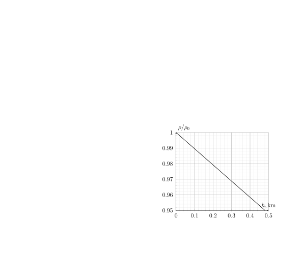

[[Състезания/2/9/2025|◂ 2025]] | [[Състезания/2/9r/2026|решения]]

**Зад. 1 Трупчета и макари (10 т.)**

Трупче с маса $2m$ е поставено върху хоризонтална плоскост. Коефициентът на триене между трупчето и плоскостта е $k$. Трупчето е свързано с нишка за макара, висяща от ръба на плоскостта. Нишката е прехвърлена през малка макара, за да не се трие в ръба. От двете страни на висящата макара са закачени две тежести с маси съответно $m$ и $3m$. Приемете, че $g = 10 \text{ m/s}^2$ и $m = 2 \text{ kg}$. Всички нишки са леки и неразтегливи и всички макари са леки.

Коефициента на триене $k$ е достатъчно голям, така че трупчето да не се движи.
**а)** Определете ускоренията $a_1$ и $a_2$ на двете теглилки. **(4 т.)**
**б)** Определете минималната стойност на коефициента на триене $k_{\min}$, така че трупчето да остава неподвижно. **(2 т.)**

Експериментаторът решил да постави смазка между трупчето и хоризонталната плоскост, при което коефициента на триене станал $k = 3/4$.
**в)** Определете ускоренията на теглилките $a_1, a_2$ и ускорението на трупчето $a$. **(4 т.)**

**Зад. 2 Междузвездни войни (10 т.)**
В отдалечена галактика, Галактическата империя и Земният Алианс следят движенията на противника, използвайки правоъгълна координатна система с начало в столицата на Империята. Разстоянията се измерват в милиони километри ($10^6 \text{ km}$), а времето – в дни (d). Например точка $P(0, 4)$ има координати $(0, 4)$ и се намира на 4 млн. километра от имперската столица.

В някакъв момент Императорът изпраща към имперския ударен флот, разположен в $I(40, 30)$, сигнал със заповед за атака на Земята, намираща се в $E(140, 30)$. Веднага след получаване на заповедта, в момент $t = 0$, имперският флот започва да се ускорява в посока към Земята равномерно с ускорение $a = 0.25 \text{ m/s}^2$ за време $\tau = 4 \cdot 10^5 \text{ s}$, след което продължава движението си с постоянна скорост.

**а)** Колко време $T$ след получаване на заповедта имперският флот ще достигне Земята? **(1.5 т.)**

Когато имперският флот получава заповедта за атака, шпионин на Земния Алианс бяга с малка капсула, движеща се със скорост $v_k = 10^5 \text{ m/s}$, към земният флот, разположен първоначално в $F(80, 60)$. Когато пристига, той известява земното командване за имперската атака, при което командирът нарежда незабавно да поемат курс към планетата $X(80, 30)$, където ще пресрещнат имперския флот. Земният флот се ускорява от покой с постоянно ускорение $a'$ в посока планетата $X$.

**б)** Колко време $\Delta t_1$ след тръгването на имперския флот шпионинът известява земния флот за атаката? **(1 т.)**
**в)** Определете положението (координатите) $(x_1, y_1)$ на имперския флот в момента, когато земният флот започва движението си. **(1.5 т.)**
**г)** Определете минималното ускорение $a'$, което земният флот трябва да има, за да достигне точка $X$ точно едновременно с имперския флот. **(1.5 т.)**

Нека земният флот започнал да се ускорява с $a' = 6 \text{ m/s}^2$, но двигателите му аварират след $\tau' = 7.5 \cdot 10^4 \text{ s}$, след което флотът продължава движението си с постоянна скорост.
**д)** Колко време $\Delta t_2$ след като имперският флот преминава през планетата $X$, земният флот пристига там? **(1.5 т.)**

Земният флот е оборудван с прототипна *лазерна пушка*, чийто „снаряди“ се движат със скоростта на светлината. Обсегът на оръжието е $R = 0.5 \cdot 10^6 \text{ km}$.
**е)** Въпреки аварията на двигателите, възможно ли е земният флот да унищожи имперския флот с лазерното оръжие? **(3 т.)**
**Жокер:** Намерете минималното разстояние между двете флотилии.

**Зад. 3 Последен полет с балон (10 т.)**

Пенсионираните пилоти Алекс и Иван решават да се качат за последен път на балон с горещ въздух. Обемът на балона е $V = 3 \cdot 10^3 \text{ m}^3$, плътността на въздуха на земната повърхност е $\rho_0 = 1.2 \text{ kg/m}^3$, а тази на горещия въздух е $\rho_h = 1.0 \text{ kg/m}^3$. Общата маса на балона и кошницата е $M = 400 \text{ kg}$, а двамата пилоти имат еднаква маса $m = 70 \text{ kg}$. Приемете, че $g = 10 \text{ m/s}^2$.
В началото, балонът е вързан за земята с помощта на въже.

**а)** Каква минимална сила на опън трябва да издържа въжето, за да задържи балона на земята без да се скъса? **(2 т.)**

В някакъв момент въжето се срязва и балонът започва да се издига. Точно в същия момент Алекс стои на кантар в кошницата на балона.
**б)** Определете теглото $P'$, което ще показва кантарът непосредствено след срязването на въжето. Резултатът закръглете до 3 значещи цифри. **(3 т.)**

Балонът се издига в продължение на около час и достига някаква височина $H$.
**в)** Определете височината $H$ с точност $10 \text{ m}$. Резултатът закръглете до 2 значещи цифри. **(3 т.)**

Когато Алекс се насладил достатъчно на гледката горе, решил да слезе по най-бързия възможен начин и скочил с парашут от балона. В резултат балонът се издигнал до нова височина $H'$.
**г)** Определете с точност $10 \text{ m}$ на каква височина $H'$ се е издигнал балонът след като Алекс скочил. Резултатът закръглете до 2 значещи цифри. **(2 т.)**

Приемете, че плътността на въздуха в балона и обема на балона не се променят.
**Жокер:** Използвайте предоставената графика на зависимостта на плътността на въздуха от височината.