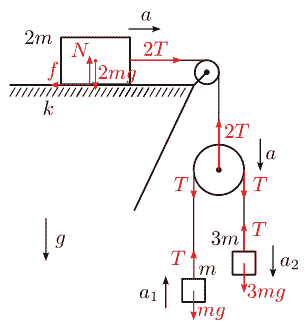
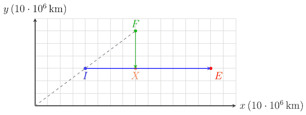

**Решение на зад. 1 – Трупчета и макари**

а) Понеже триенето е достатъчно, че трупчето да не се движи, то макарата също е неподвижна. Тогава очевидно $a_1 = a_2 = a_{12}$ **(1 т.)**. Нека силата на опън на нишката е $T$. Записваме втория закон на Нютон за всяка теглилка:
$\begin{cases} ma_1 = T - mg \\ 3ma_2 = 3mg - T \end{cases} \Rightarrow \begin{cases} ma_{12} = T - mg \\ 3ma_{12} = 3mg - T \end{cases}$ **(1 т.)**
$\Rightarrow a_{12} = a_1 = a_2 = \frac{1}{2}g = 5 \, \text{m/s}^2$ **(2 т.)**

б) На висящата макара действат 3 сили – 2 сили на опън $T$ на прехвърлената през нея нишка и една сила на опън на нишката, от която виси макарата. Понеже макарата е лека, то сумата от силите, които ѝ действат трябва да е 0, откъдето следва, че силата на опън на нишката, от която виси макарата, е $2T$. **(0.5 т.)**
На трупчето действат 2 сили – силата на опън $2T$ на закачената за него нишка и силата на триене $f$. Понеже трупчето е в равновесие, то $f = 2T$. **(0.5 т.)** От закона на Кулон-Амонтон следва $f \le kN$, където $N$ е нормалната реакция на опората, за която $N = 2mg$. **(0.5 т.)** Оттук $k \ge k_{\min} = T/(mg)$.
От предната подточка имаме $T = \frac{3}{2}mg$ и тогава
$\Rightarrow k_{\min} = \frac{3}{2}$ **(0.5 т.)**

в) От условието имаме $k = 3/4$. Понеже тук триенето не е достатъчно, че да задържи неподвижно трупчето, то ще има триене при хлъзгане и следователно $f = kN = \frac{3}{2}mg$. Записваме втория закон на Нютон за всяко тяло в задачата (двете теглилки и трупчето):
$\begin{cases} ma_1 = T - mg \\ 3ma_2 = 3mg - T \\ 2ma = 2T - \frac{3}{2}mg \end{cases}$ **(1 т.)**

Това са 3 уравнения с 4 неизвестни ($a, a_1, a_2, T$) – нужно е още едно уравнение. Това е кинематичната връзка между ускоренията $a, a_1, a_2$, която е следствие от неразтегливостта на нишката свързваща двете теглилки.
От лявата страна на висящата макара, нишката се скъсява с ускорение $a + a_1$, а от дясната нишката се удължава с ускорение $a_2 - a$. Но нишката е неразтеглива и следователно нейната дължина не може да се променя, т.е. с колкото се скъсява едната страна, с толкова трябва да се удължава другата $\Rightarrow a_1 + a = a_2 - a$ **(1 т.)**.

Така се получава системата:
$\begin{cases} T - mg = ma_1 \\ 3mg - T = 3ma_2 \\ 2T - \frac{3}{2}mg = 2ma \\ 2a + a_1 - a_2 = 0 \end{cases}$
Откъдето:
$a_1 = \frac{1}{20}g = 0.5 \, \text{m/s}^2 \quad a_2 = \frac{13}{20}g = 6.5 \, \text{m/s}^2 \quad a = \frac{3}{10}g = 3 \, \text{m/s}^2$ **(2 т.)**

**Решение на зад. 2 – Междузвездни войни**

а) Имперският флот започва движението си от покой. До моментът на спиране на двигателите, флотът ще е изминал разстояние $\frac{1}{2}a\tau^2$ **(0.25 т.)** и вече ще се движи със скорост $v = a\tau$ **(0.25 т.)**. Тогава, понеже $IE = 100 \cdot 10^6 \, \text{km}$, то
$IE = \frac{1}{2}a\tau^2 + (a\tau)(T - \tau)$ **(0.5 т.)** $\Rightarrow T = \frac{1}{2}\tau + \frac{IE}{a\tau} = 12 \cdot 10^5 \, \text{s}$ **(0.5 т.)**

б) За времето $\Delta t_1$ шпионинът изминава разстоянието $IF$ от началното положение на имперския флот до земния флот. Тогава $\Delta t_1 = IF/v_{\text{к}} = IF \cdot 10^{-5} \, \text{s/m}$ **(0.5 т.)**. Така
$\Delta t_1 = \sqrt{(80 - 40)^2 + (60 - 30)^2} \cdot 10^6 \, \text{km} \cdot 10^{-5} \, \text{s/m} \Rightarrow \Delta t_1 = 5 \cdot 10^5 \, \text{s}$ **(0.5 т.)**

в) За времето $\Delta t_1 = 5 \cdot 10^5 \, \text{s} > \tau = 4 \cdot 10^5 \, \text{s}$, имперската флотилия вече е приключила своето ускорение и се е движила време $\Delta t_1 - \tau$ с постоянна скорост $a\tau$ **(0.5 т.)**. В такъв случай, до момента, в който земната флота разбират за атаката, имперската флота ще е изминала разстояние $\frac{1}{2}a\tau^2 + a\tau(\Delta t_1 - \tau) = a\tau\Delta t_1 - \frac{1}{2}a\tau^2$ **(0.5 т.)**. Тоест ще се намира в точка с координати
$\frac{1}{2}a\tau(2\Delta t_1 - \tau) = 30 \cdot 10^6 \, \text{km} \Rightarrow (x_1, y_1) \equiv (70, 30)$ **(0.5 т.)**

г) От момента на тръгване на Земния флот, на имперския флот му остава да измине още $(80 - x_1) \cdot 10^6 \, \text{km} = 10 \cdot 10^6 \, \text{km}$ до планетата $X$. Те се движат със скорост $a\tau = 10^5 \, \text{m/s}$ и следователно им остава $(80 - x_1) \cdot 10^6 \, \text{km}/(a\tau) = 10^5 \, \text{s}$ до $X$ **(0.5 т.)**. За това време земната флотилия трябва да достигне $X$, т.е. да измине разстояние $FX = 30 \cdot 10^6 \, \text{km}$. Понеже започва от покой и се движи с ускорение $a'$, то
$\frac{1}{2}a' \left( \frac{(80-x_1) \cdot 10^6 \, \text{km}}{a\tau} \right)^2 = FX$ **(0.5 т.)** $\Rightarrow a' = \frac{2(FX)a^2\tau^2}{((80-x_1) \cdot 10^6 \, \text{km})^2} = 6 \, \text{m/s}^2$ **(0.5 т.)**

д) За време $\tau' = 7.5 \cdot 10^4 \, \text{s}$ земният флот изминава разстояние
$a'\tau'^2/2 = 16.875 \cdot 10^6 \, \text{km} < FX = 30 \cdot 10^6 \, \text{km}$ **(0.25 т.)**
През останалата част от пътя флотът се движи с постоянна скорост $a'\tau'$ **(0.25 т.)**. В такъв случай земната флота изминава разстоянието до $X$ за време $T'$, за което
$\frac{1}{2}a'\tau'^2 + a'\tau'(T' - \tau') = FX$ **(0.5 т.)** $\Rightarrow T' = \frac{1}{2}\tau' + \frac{FX}{a'\tau'}$
В такъв случай, за времето $\Delta t_2$ имаме:
$\Delta t_2 = T' - \frac{(80-x_1) \cdot 10^6 \, \text{km}}{a\tau} = \frac{1}{2}\tau' + \frac{FX}{a'\tau'} - \frac{(80-x_1) \cdot 10^6 \, \text{km}}{a\tau} = \frac{10^5}{24} \, \text{s} \approx 4170 \, \text{s}$ **(0.5 т.)**

е) Нека $x(t)$ е $x$-координатата на имперската флота, а $y(t)$ е $y$-координатата на земната флота. Тогава разстоянието $r(t)$ между двете е:
$r^2(t) = (80 - x(t))^2 + (y(t) - 30)^2$ **(0.25 т.)**
Нека за улеснение положим, че $t = 0$, когато земната флота пристига при планета $X$. Тогава
$x(t) = 80 + a\tau(t + \Delta t_2)$ **(0.5 т.)** $y(t) = 30 - a'\tau't$ **(0.5 т.)**
И съответно
$r^2(t) = a^2\tau^2(t + \Delta t_2)^2 + a'^2\tau'^2t^2 = (a^2\tau^2 + a'^2\tau'^2)t^2 + 2\Delta t_2 a^2\tau^2t + a^2\tau^2\Delta t_2^2$
Откъдето се получава
$r_{\min} = \frac{a\tau a'\tau' \Delta t_2}{\sqrt{a^2\tau^2 + a'^2\tau'^2}} = \frac{\Delta t_2}{\sqrt{(a\tau)^{-2} + (a'\tau')^{-2}}}$ **(1 т.)**
$r_{\min} = \frac{10^5 \, \text{s}}{24 \sqrt{1^{-2} + 4.5^{-2}} \cdot 10^{-5} \, \text{s/m}} \approx 0.4 \cdot 10^6 \, \text{km}$ **(0.5 т.)**
Както е видно $r_{\min} < R = 0.5 \cdot 10^6 \, \text{km}$, откъдето следва, че земната флотилия ще може да прихване и унищожи имперската. **(0.25 т.)**

**Решение на зад. 3 – Последен полет с балон**

а) Общата маса на балона е $M + 2m + \rho_h V$. На балона му действа Архимедова сила $\rho_0 V g$ **(0.25 т.)** нагоре, силата на опън на въжето $T$ и силата на тежестта $(M + 2m + \rho_h V)g$ **(0.25 т.)** надолу. Понеже балонът е в равновесие **(0.25 т.)**:
$T = \rho_0 V g - (M + 2m + \rho_h V)g$ **(0.25 т.)** $\Rightarrow T = ((\rho_0 - \rho_h)V - M - 2m)g$ **(0.5 т.)**
Или: $T = ((1.2 - 1.0) \cdot 3 \cdot 10^3 - 400 - 2 \cdot 70) \cdot 10 \, \text{N} \Rightarrow T = 600 \, \text{N}$ **(0.5 т.)**

б) След срязването на въжето, на балонът действа некомпенсирана сила нагоре, която води до ускорение $a$. Като от втория закон на Нютон следва
$(M + 2m + \rho_h V)a = \rho_0 V g - (M + 2m + \rho_h V)g$ **(0.5 т.)** $\Rightarrow a = \left( \frac{\rho_0}{\rho_h + \frac{M+2m}{V}} - 1 \right)g$ **(0.5 т.)**
Това означава, че целият балон започва да се издига нагоре с ускорение $a$, включително и пилотът Алекс. Силата, която го ускорява нагоре е нормалната реакция на опората $N'$, т.е. на кантара. Тогава отново от втория принцип:
$ma = N' - mg \Rightarrow N' = m(a + g)$ **(0.5 т.)**
От друга страна, показанието на кантара е $m' = N'/g$ **(0.5 т.)**, откъдето
$m' = \left( 1 + \frac{a}{g} \right)m \Rightarrow m' = \frac{\rho_0}{\rho_h + \frac{M+2m}{V}}m$ **(0.5 т.)**
или $m' = \frac{1.2}{1.0 + \frac{400 + 2 \cdot 70}{3000}} \cdot 70 \, \text{kg} \Rightarrow m' \approx 71.2 \, \text{kg}$ **(0.5 т.)**

в) Балонът ще спре да се издига, когато плътността на въздуха $\rho$ се изравни със средната плътност на балона. Еквивалентно, когато Архимедовата сила се изравни със силата на тежестта на балона. **(1 т.)** Така имаме:
$\rho V = M + 2m + \rho_h V$ **(0.5 т.)** $\Rightarrow \frac{\rho}{\rho_0} = \frac{\rho_h}{\rho_0} + \frac{M + 2m}{\rho_0 V} = \frac{1.0}{1.2} + \frac{400 + 2 \cdot 70}{1.2 \cdot 3000} \approx 0.983$ **(0.5 т.)**
От графиката се получава $H \approx 160 \, \text{m}$. **(1 т.)**
(за $H \in [150, 170] \, \text{m}$ – **(0.5 т.)**; за $H < 150 \, \text{m}$ или $H > 170 \, \text{m}$ – **(0 т.)**)

г) След скока на Алекс, пълната маса на балона е вече $M + m + \rho_h V$ **(0.5 т.)**, откъдето новата височина е при плътност на въздуха от
$\frac{\rho}{\rho_0} = \frac{\rho_h}{\rho_0} + \frac{M + m}{\rho_0 V} \approx 0.964$ **(0.5 т.)**
Отново от графиката се получава $H' = 350 \, \text{m}$. **(1 т.)**
(за $H \in [340, 360] \, \text{m}$ – **(0.5 т.)**; за $H < 340 \, \text{m}$ или $H > 360 \, \text{m}$ – **(0 т.)**)