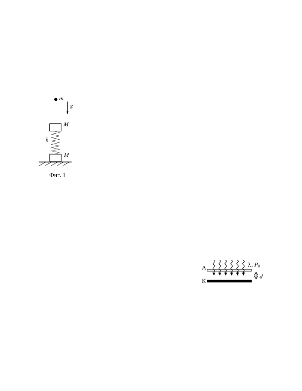
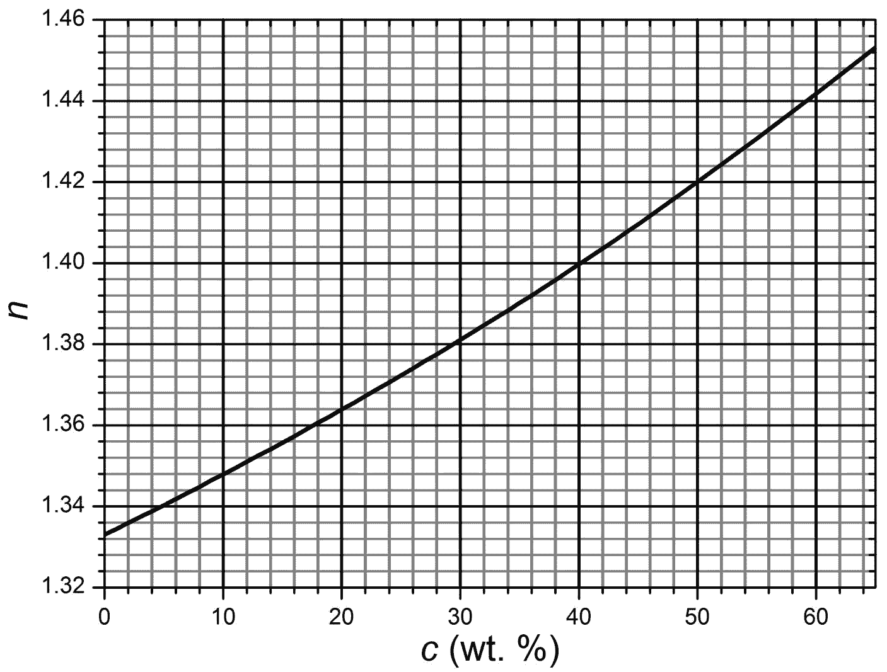
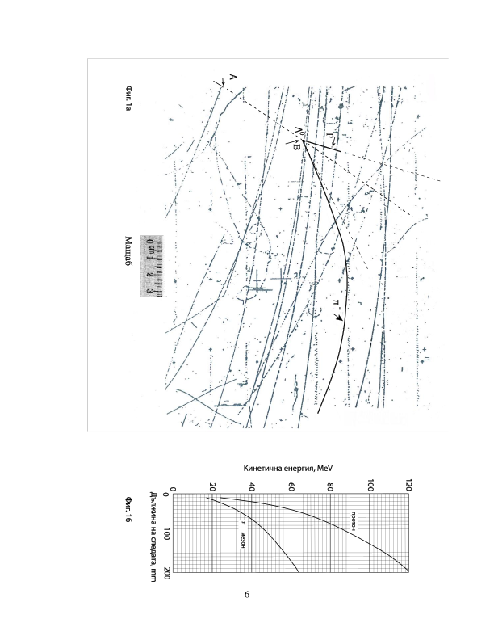

**Задача 1. Трупчета на пружина**

Върху хоризонтална повърхност е поставена система от две трупчета с маси M , свързани с пружина с коефициент на еластичност k и пренебрежима маса, както е показано на фиг. 1. От височина h над  горното трупче е пуснато свободно малко топче с маса m . Приема се, че ударът между топчето и горното трупче е мигновен и идеално еластичен, а земното ускорение е g .

А) Нека височината h е такава, че скоростта на горното трупче става нула преди трупчетата да се ударят. Намерете максималното свиване d на пружината спрямо неразтегнатото й състояние (когато го няма горното трупче). 6 точки

Б) Определете максималната сила на натиск N, която долното трупче оказва на хоризонталната повърхност. 2 точки

В) Ако долното трупче не се отделя от повърхността, каква е амплитудата A на възникващите хармонични трептения? 1 точки

Г) Каква трябва да бъде минималната височина hmin , от която е пуснато топчето, за да може долното трупче да се отдели от хоризонталната повърхност? Намерете големината на скоростта u на средата на пружината в момента на отлепяне на долното трупче от повърхността. 6 точки

**Задача 2. КПД на фотоклетка**

Фотоклетка се състои от два плоски успоредни електрода - катод К с отделителна работа $W = 2.0\ \mathrm{eV}$ и прозрачен анод А, който изцяло пропуска падащата светлина. Площта на електродите е $S = 5\ \mathrm{cm^2}$, а разстоянието между тях е $d = 1\ \mathrm{mm}$. Върху фотоклетката пада сноп монохроматична светлина с дължина на вълната $\lambda = 500\ \mathrm{nm}$ и с мощност $P_0 = 0.01\ \mathrm{W}$.

А) Фотоклетката не е свързана в електрическа верига. Колко е напрежението между
електродите й в този случай? Означете на чертеж полярностите на двата електрода и
пресметнете заряда $Q$, натрупан върху тях. 2,5 точки

Б) Фотоклетката се характеризира с т.нар. "квантова ефективност" $k = N_e/N_\phi$ , която се дефинира като отношението на броя избити от катода електрони $N_e$ към броя паднали фотони $N_\phi$. Максималната теоретично възможна квантова ефективност
на фотоклетка се дава с израза:
$$k = 1 - \frac{\lambda}{\lambda_{\max}}$$
където $\lambda_{\max}$ е червената граница на фотоефекта за катода. Пресметнете квантовата
ефективност на дадената фотоклетка, ако приемете, че тя е равна на максималната
теоретична стойност. 1,5 точки

В) Електродите на фотоклетката са свързани накъсо чрез проводник с нулево съпротивление. Пресметнете тока $I_0$, който тече във веригата в този случай. 3 точки

Г) Когато мощността на падащата светлина е постоянна, фотоклетката е еквивалентна на източник с постоянно електродвижещо напрежение $\mathcal E$ и с определено вътрешно съпротивление r. Определете $\mathcal E$ и r на фотоклетката при дадената мощност на падащата светлина. 3 точки

Д) Към електродите на фотоклетката е свързан консуматор със съпротивление $R$.
Коефициентът на полезно действие (КПД) на фотоклетката се дефинира като
отношението:
$$\eta = \frac{P_R}{P_0}$$
където $P_R$ е мощността на тока през консуматора. При какво съпротивление на
консуматора КПД на фотоклетката е максимален? Изразете максималния КПД чрез
данните от условието и пресметнете неговата стойност. 5 точки
Данни
 - скорост на светлината във вакуум: $c = 3.00\times10^8\ \mathrm{m/s}$;
 - елементарен електричен заряд: $e = 1.60\times10^{-19}\ \mathrm{C}$;
 - електрична проницаемост на вакуума: $\varepsilon_0 = 8.85\times10^{-12}\ \mathrm{F/m}$;
 - константа на Планк: $h = 6.63\times10^{-34}\ \mathrm{J.s}$.

Задача 3. Бипризма на Френел.

На фигурата (мащабът на обектите и разстоянията не са верни!) е дадена
експериментална установка за наблюдаване на двулъчева интерференция. Източник на светлина (натриева лампа) осветява процеп с широчина d (до последното подусловие на задачата широчината на процепа е пренебрежимо малка) с монохроматична светлина с дължина на вълната $\lambda$ = 589,3 nm. Процепът се намира във фокуса на събирателна леща с диаметър D = 10 cm и фокусно разстояние f = 0,90 m. Преминалата през лещата светлина изцяло и равномерно осветява кювета (съд за течност) с височина H = 5,00 cm. Предната стена на кюветата е плоскопаралелна пластинка, а задната е бипризма (две призми с обща основа) със стени, сключващи ъгъл $\theta$ = 0,07186 rad (= 4,117о). Стените на кюветата са от стъкло с показател на пречупване n = 1,5000, а тя е пълна с течност с неизвестен показател на пречупване $n'$. На разстояние L = 0,900 m от бипризмата се намира детектор. Той е от тип CCD, 10,3 Mpx (3936 x 2630 пиксела), има размери 27,00 mm x 18,00 mm, като по-дългият му размер l = 27,00 mm е в равнината на чертежа. Детекторът регистрира
интерференчна картина с широчина b и разстояние $\Delta$x между съседните интерференчни максимуми. По-долу за всички малки ъгли $\omega$ приемете, че $\sin\omega\approx\tan\omega\approx\omega$.

А) Какъв е снопът светлина между лещата и кюветата (разходящ, успореден или сходящ)? 1 точка

Б) Ако върху кюветата пада лъч, успореден на нейната оптична ос (пунктираната линия на чертежа), намерете формула за ъгъла $\varphi$, който преминалият през кюветата лъч сключва с оптичната ос. 2 точки

В) Ако два успоредни снопа кохерентна монохроматична светлина с дължина на вълната $\lambda$ сключват помежду си малък ъгъл $\beta$, какво ще е разстоянието $\Delta$y между съседните максимуми на интерференчната картина, наблюдавана на екран, перпендикулярен на един от сноповете (или на ъглополовящата на ъгъла $\beta$)? 1 точка

Г) Получете формула за разстоянието $\Delta$x между съседните интерференчни максимуми (изразено чрез параметрите на установката), което ще регистрира детекторът. 2 точки

Д) Изчислете критичния показател на пречупване $n'_\text{кр}$ на неизвестна течност, за който
широчината b на интерференчната картина ще е максимална. 1 точка

Е) Нека показателят на пречупване на неизвестната течност $n'$ е по-голям от $n'_\text{кр}$. Изразете широчината b на интерференчната картина чрез дадените параметри. 1 точка

Ж) За две конкретни течности (дестилирана вода с 1,3330 и 65 тегловни % захарен
воден разтвор с 1,4532) изчислете разстоянието $\Delta$x между съседните максимуми на
интерференчната картина, широчината b на интерференчната картина и броя N
интерференчни максимуми, регистрирани от CCD. 3 точки

З) Ако искате да използвате тази установка за измерване на неизвестен показател на
пречупване $n'$ на течности, една възможност е автоматизирано (софтуерно) да се
изчислява броят N на наблюдаваните интерференчни максимуми от CCD. Получете
формула, която изразява чрез N. 1 точка

И) CCD регистрира интереференчна картина с Nx = 300 максимума за захарен воден
разтвор с неизвестна концентрация. Изчислете показателя на пречупване $n'_x$ на този
разтвор и концентрацията му cx, използвайки дадената на фигурата зависимост на
показателя на пречупване на захарни водни разтвори от тяхната масова (тегловна)
концентрация. 1 точка

К) Оценете колко е абсолютната грешка на изчисления показател на пречупване в
подусловие и), ако точността на броя измерени максимуми е $\Delta N = \pm 1$. 1 точка

Л) Оценете грубо до каква максимална стойност на широчината на процепа dmax все още ще се регистрира интерференчна картина от CCD. 1 точка

Задача 4. Определяне на масата на покой на $\Lambda$0 бариона

 Ламбда нула барионът ($\Lambda^0$) е съставен от трите най-леки кварка (uds). Той е
нестабилна електронеутрална частица, която се ражда при взаимодействие между други частици с високи енергии и след това се разпада. Подобни процеси могат да се изследват с мехурчеста камера.

Сноп от отрицателно заредени K - мезони с много голяма енергия (релативистки
сноп) попада в мехурчеста камера, запълнена със смес от органични течности. $K^-$ мезоните взаимодействат с неутрони, които се съдържат в течностите, и протича
реакцията:
$$\tag{1} K^- + n \to \Lambda^0 + \pi^-.$$
Много кратко време след раждането си ламбда барионите се разпадат на протони и пи минус мезони ($\pi^-$):
$$\tag{2} \Lambda^0 \to p + \pi^-.$$
 Фотография на описаните по-горе събития е показана на фиг. 1а (на отделен лист).
$\Lambda^0$ барион се ражда в точка А в резултат на реакцията (1). Той достига по права линия точка B, където се разпада. Заредените частици (K -, p и $\pi$ -) взаимодействат с молекулите на течностите, изпълващи камерата, и се появяват мехурчета, които правят пътя на заредените частици видим - наблюдават се следи (трекове) на частиците. Незаредените частици не оставят следи. Пунктираните линии не са част от оригиналната фотография. Те са дадени за нагледност и да ви помогнат при решаването на задачата. Всички частици се движат в равнината на снимката (листа). Протоните и $\pi$ - мезоните постепенно губят своята кинетична енергия в резултат на взаимодействието с молекулите на средата и накрая спират. На фиг. 1б е показана зависимостта на дължината на пробега (трека) на двете частици от тяхната начална кинетична енергия. Известни са енергията на покой на протона $E_{0p}$ = 938,3 MeV и на $\pi$ - мезона $E_{0\pi}$ = 139,6 MeV.

Като използвате фиг. 1а и фиг. 1б, определете стойностите на изброените по-долу
величини и направете оценка на грешката.

А) Измерете дължините на пробега на протона и на $\pi$ - мезона и определете тяхната
начална пълна релативистка енергия Еp и Е$\pi$ (в единици MeV). 7 точки

Б) Определете (в единици MeV/c, където c e скоростта на светлината) началните импулси pp, p$\pi$ на протона и на $\pi$ - мезона и импулса p$\Lambda$ на $\Lambda^0$ бариона непосредствено преди разпадането му. 5 точки

В) Определете масата на покой на $\Lambda^0$ бариона (в единици MeV/$c^2$). **3 точки**

 Указание. В подусловие А) се изисква определяне на грешките на всички измерени
или пресметнати величини. В другите подусловия приемете, че относителната грешка на пресметнатите величини е 1 %, пресметнете абсолютната грешка на всяка от тези величини и запишете коректно крайните резултати.

*Полезна формула за релативистки импулс:*
$$p = \frac{1}{c}\sqrt{E^2-E_0^2},$$
където $E$ е пълната релативистка енергия на частицата, $E_0$ е нейната енергия на покой, а $c$ е скоростта на светлината.

