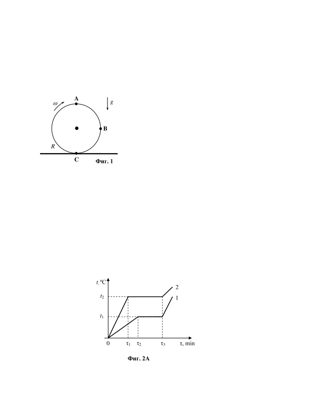
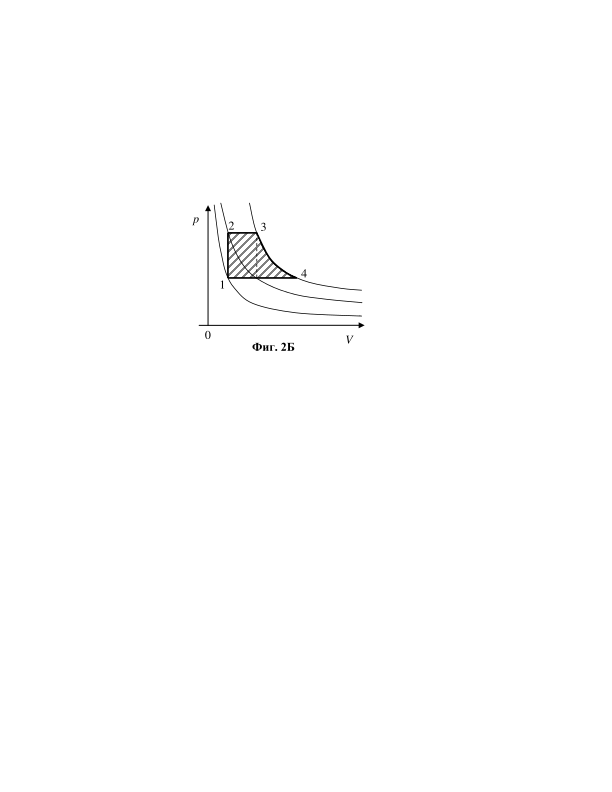
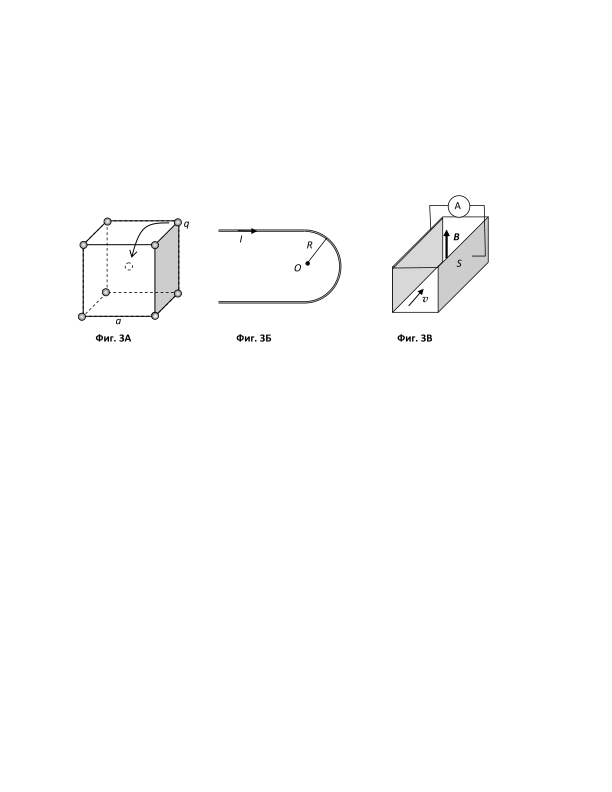
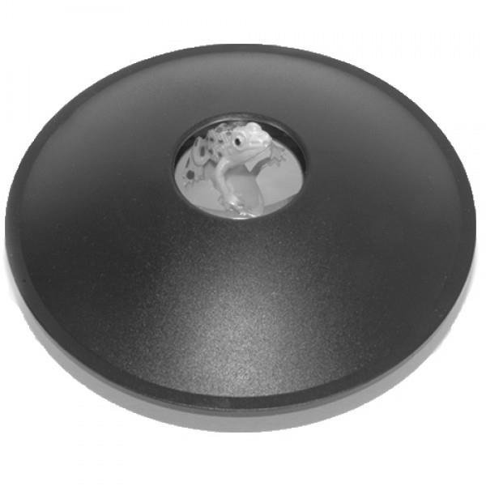

[[Състезания/3/10-12/2015|◂ 2015]] | [[Състезания/3/10-12r/2016|решения]] | [[Състезания/3/10-12/2017| 2017 ▸]]

**Задача 1. Буксуваща гума.**

 Автомобилна гума с външен радиус R буксува върху кална хоризонтална повърхност, при което от всички точки от околната повърхнина на гумата излитат капки. Гумата се върти на едно място с ъглова скорост $\omega$ > g R ), както е показано на фиг. 1. Земното
 ускорение е g . Съпротивлението на въздуха се пренебрегва.

а) Намерете на какво разстояние l от т. C падат на земята капките, които излитат от т. A на фигурата. \[2 т.\]

б) От коя точка излитат капките, чиито траектории биха минали през т. B на чертежа?
 \[5 т.\]

в) Намерете максималната височина на издигане hmax на капките над земната повърхност. \[8 т.\]

**Задача 2. Топлина и работа.**

Част А. Две течности с една и съща маса са затворени в два херметични съда. Те се
нагряват равномерно по един и същ начин. На фиг. 2А са показани графиките на
зависимостта на температурата t на всяка една течност от времето $\tau$ за нагряване.

а) Избройте процесите, които са представени с тези две еднотипни графики. \[1,5 т.\]

б) Сравнете по графиките еднотипните топлинни характеристики на двете течности.

Част Б. На фиг. 2Б е показана p,V - диаграма на цикличен процес 1 - 2 - 3 - 4 - 1 ,
извършван с определено количество идеален газ. Изброените състояния лежат на три различни изотерми. Определете КПД $\eta$ на топлинния двигател, работещ по изобразения цикъл, ако Tmax / Tmin = 3 . Използвайте факта, че работата, извършена от газа при изотермно разширение, е A = BT ln(V f / Vi ) , където B е газовата константа, V f и Vi са съответно крайният и началният обем на газа. Вътрешната енергия на идеалния газ се дава с израза U = (3 / 2) BT . \[7 т.\]

**Задача 3. Електромагнитен коктейл**

Трите подусловия на задачата са независими. Всяко подусловие носи по 5 точки - общо 15 точки за задачата.

А) Осем еднакви точкови заряда q са закрепени във върховете на куб със страна a. Ако
един от зарядите бъде преместен в центъра на куба, както е показано на фиг. 3А, намерете:

- силата, която ще действа на заряда в центъра;

- работата, която трябва да бъде извършена за преместването на заряда в центъра.

Б) Дълъг прав проводник е огънат така, че огънатата част има форма на полуокръжност с радиус R, както е показано на фиг. 3Б. По проводника тече ток I в указаната на чертежа посока.

- Получете израз за магнитната индукция B в центъра на огънатата част.

- Означете на чертеж посоката на магнитната индукция.

В) На фиг. 3В е показана принципната схема на хидродинамичен генератор с морска вода. По канал с правоъгълно напречно сечение тече солена морска вода със скорост v = 1 m/s. Специфичното съпротивление на морската вода е $\rho$ = 0,2 $\Omega \cdot$ m. Страничните стени на канала са две успоредни метални плочи с площ $S = 5\ \mathrm{m^2}$ всяка. В целия обем на канала е създадено еднородно магнитно поле с индукция B = 0,1 T, насочено вертикално нагоре.

Пресметнете тока I, който ще тече в електрическата верига, ако плочите бъдат свързани накъсо с метален проводник с пренебрежимо съпротивление.

**Задача 4. Вълшебни огледала**

Интересна детска играчка е патентована в САЩ през 1972 год. Представлява две допиращи се еднакви вдлъбнати параболични огледала (в решението приемете, че са сферични), които са обърнати с отразяващите си страни едно към друго. Поставени са така, че да лежат хоризонтално (оптичните им оси са вертикални). В средата на горното огледало има направен отвор. Ако през отвора се пусне малък предмет (на снимката е жаба), така че той да лежи в центъра на долното огледало, над повърхността на отвора на горното огледало се наблюдава изключително реалистичен тримерен образ с големина като тази на предмета (виж снимката). Този образ е получен след еднократно отражение на светлината, излъчвана от предмета, от всяко от огледалата. Нека огледалата имат диаметър D, равни фокусни разстояния f, и разстоянието между центровете им е x.

а) Изчислете на колко е равно отношението x/f. За целта приемете, че източникът е
точка, намираща се на разстояние d $\ll$ x над центъра на долното огледало, а образът е
точка, намираща се на същото разстояние d над центъра на горното огледало. (ако
получите 2 решения, приемете по-малката стойност) \[5 т.\]

б) Обяснете какъв е образът - действителен (недействителен), прав (обърнат)?
 \[1 т.\]

в) Ако предметът е малка дясна ръчичка от кукла, обяснете каква ръчичка ще е
образът - дясна или лява? \[1 т.\]

г) Изчислете отношението D/x. \[3 т.\]

д) Опишете как ще изглежда образът на дясната ръчичка, получен от 3 отражения в
огледалата (2 от долното и 1 от горното). Къде ще се намира? Каква ръчичка ще бъде -
дясна или лява? \[2 т.\]

е) На каква височина y трябва да се повдигне горното огледало, така че ако на
дъното на долното се постави лампичка, след 2 отражения от отвора да излиза успореден сноп светлина? \[3 т.\]