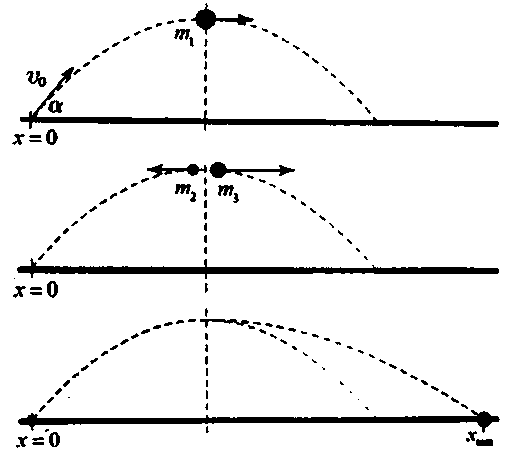
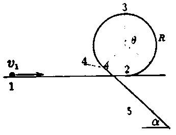
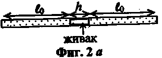
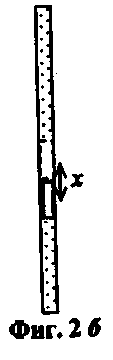

**Задача 1. Механика** 

**Част 1** 

Тяло с маса $m_1$ и с пренебрежним размери е изстреляно подъгъл $\alpha$ спрямо хоризонта със скорост $v_0$. Земното ускорение е $g$. Намерете: 

а) максималната височина $H_{max}$, която достига тялото, и скоростта на тялото $v_{min}$ в момента на достигане на максимална височина. [1т.] 

В момента, когато тялото достига максимална височина, то се пръсва на две парчета с маси $m_2$ и $m_3$, които се разлитат в хоризонтални направления. Тялото с маса $m_2$ пада в точката на изстрелване $x=0$. Намерете: 

б) скоростите на двете тела $v_2$ и $v_3$, непосредствено след взрива. [1т.] 

в) максималното разстояние $x_{max}$, до което достига парчето с маса $m_3$. [3т.] 

**Част 2** 

Тяло с маса $m$ и с пренебрежним размери е поставено на равна хоризонтална повърхност, която продължава в улей с форма на част от окръжност с радиус $R$. Улеят преминава в плоска повърхност, наклонена под ъгъл $\alpha$ спрямо хоризонта. Наклонената повърхност е с коефициент на триене $k$ ($k > \tan \alpha$), а улеят и хоризонталната повърхност са идеално гладки. Земното ускорение е $g$. На тялото е придадена скорост $v_1$. Намерете: 

а) скоростта като функция на ъгъла, $v(\theta)$, в случай, че тялото не-туби контакт с улея; [2т.] θ е ъгълът, който сключва радиус-векторът на тялото с вертикалата. 

б) натиска N(θ) на тялото върху улея като функция на ъгъла θ, в случай, че тялото не губи контакт с улея; [2т.] 

в) минималната скорост v₁, при която тялото ще мине през точка 3; [1т.] 

г) разстоянието L₄₅, което тялото ще измине по наклонената равнина; [3т.] 

д) работите A₅ и Aₙ, които се извършват съответно от силата на тежестта и силата на реакция на опората, при движението на тялото от точка 1 до точка 4. [2т.] 

**Задача 2. Въздушна пружина** 

По средата на тънка цилиндрична тръба с плътно затворени краища се намира капка живак, както е показано на фиг. 2а. От двете страни на капката има въздух с нормално атмосферно налягане $p_0 = 1,0 \cdot 10^5$ Pa и с температура $t_0 = 20^\circ C$, равна на температурата на околната среда. Дължините на двете пълни с въздух части на тръбата са $t_0 = 0,50$ m всяка. Дължината на капката живак е $h = 5,0$ cm. Приемете, че капката има цилиндрична форма, т.е. двете ѝ свободни повърхности са плоски. 

**Основни данни:** 

земно ускорение, $g = 10$ m/s²; 

плътност на живака, $p = 1,36 \cdot 10^4$ kg/m³. 

а) Тръбата бавно се накланя, докато заеме вертикално положение (фиг. 2б). На какво разстояние $x$ спрямо началното си положение ще се премести капката живак? Приемете, че температурата на въздуха остава равна на температурата на околната среда. (7 точки) 

б) С колко ($\Delta t$) трябва да се повиши температурата на въздуха в долната част на тръбата, така че капката отново да застане по средата на тръбата? (3 точки) 

в) Тръбата е върната в хоризонтално положение (вж. фиг. 2а) и е оставена така, докато температурата на въздуха се изравни с температурата на околната среда. След това тръбата е разклатена за кратко време в хоризонтално направление. Определете честотата $v$, с която капката живак продължава да трепти, след като тръбата е оставена в покой. (5 точки) 

Приемете, че: 

- амплитудата на трептене на капката е много по-малка от дължината на тръбата; 

- температурата на въздуха в тръбата не се променя при трептенето на капката. 

**Задача 3. Електрическа схема с диоди и батерии** 

Електрическа схема съдържа амперметър, два диода $D_1$ и $D_2$ (амперметърът и диодите са идеални), три резистора със съпротивление $R_1$, $R_2$ и $R$, и два източника на напрежение. Единият е с фиксирано електродвижещо напрежение $\varepsilon_1$, а стойността $\varepsilon_x$ на електродвижещото напрежение на другия може да се променя в голям интервал, $\varepsilon_x \in [0,+\infty)$. 

а) Получете формула за тока $I$ през амперметъра, изразен чрез параметрите на схемата $(R, R_1, R_2, \varepsilon_1, \varepsilon_x)$. Ако тази формула е различна за различни стойности на $\varepsilon_x$, разгледайте всички възможни случаи и пояснете във всеки отделен случай в какво състояние (запушено или отпушено) е всеки диод [6 т.] 

Схемата е сглобена, като изследователят не знаел конкретните стойности $(R, R_1, R_2, \varepsilon_1)$ на използваните елементи. Направил само 4 измервания (дадени в таблицата). След като начертал данните на графика, той решил, че те са достатъчни за изчисляването на стойностите на $R, R_1, R_2, \varepsilon_1$. 

| $\varepsilon_x, V$ | $I, mA$ |
| ------------------ | ------- |
| 0,0                | 40,0    |
| 12,0               | 45,0    |
| 20,0               | 55,0    |
| 30,0               | 75,0    |

б) Начертайте данните от таблицата на предоставения ви графичен  лист. Като използвате теоретичните резултати от подусловие а), начертайте графиката на зависимостта $I = f(\varepsilon_x)$, $\varepsilon_x \in [0, 30 V]$. [3 т.] 

в) От начертаната графика в подусловие б) изчислете стойностите на $R, R_1, R_2$ и $\varepsilon_1$. [6 т.] 

Всички получени резултати запишете в долната таблица: 

| $I = f(\varepsilon_x, R, R_1, R_2, \varepsilon_1)$ | за $\varepsilon_x \in (?, ?)$, състояние на диоди? (запушен/отпушен) | величина        | изчислена стойност |
| -------------------------------------------------- | -------------------------------------------------------------------- | --------------- | ------------------ |
|                                                    |                                                                      | $R$             |                    |
|                                                    |                                                                      | $R_1$           |                    |
|                                                    |                                                                      | $R_2$           |                    |
|                                                    |                                                                      | $\varepsilon_1$ |                    |

**Задача 4. Задача – оценка.** 

За решаване на задачата-оценка е необходимо да се разбере същността на разглежданото физично явление, да се формулира прост модел на явлението, да се изберат разумни стойности на физичните величини и да се получи числен резултат, който повече или по-малко съответства на реалността. В много случаи е полезно използването на законите за запазване, основните принципи на физиката, както и съображения за размерност. В последния случай, ако търсената величина се изразява чрез произведение от степени на други величини, мерните единици на двете страни на равенството трябва да съвпадат. Оценката в този случай е с точност до неизвестен безразмерен множител, който обикновено е от порядъка на единица. 

**4.1. Трептения с малка амплитуда, която не са хармонични** 

На фиг. 4.1 топче с маса m, което е закачено към пружина с дължина l в неразтегнато вертикално положение, се движи по хоризонтална права. Коефициентът на еластичност на пружината е k, а с x е означено отклонението на топчето от равновесното му положение. 

В случай на малки трептения, когато |x/l|<<1, определете зависимостта на периода T от амплитудата A на трептене. [5 т.] 

Полезна приближена формула: (1+x)α ≈ 1+αx, когато |x|<<1, α – реално число. 

**4.2. Изкуствен лед** 

От голям съд с вода и лед се взима един литър вода и се поставя във фризер, за да се превърне в лед. Температурата на въздуха в помещението е 27°C. Оценете минималното количество електроенергия, което трябва да се изразходва за получаването на леда. Известно е, че специфичната топлина на топене на леда е λ = 335 kJ/kg. [5 т.]

**4.3. Вълни на водна повърхност** 

Повърхността на всяка течност с плътност ρ се стреми 'да заеме своята равновесна форма основно под влияние на два фактора – действащата върху течността сила на тежестта, дължаща се на земното ускорение g, и силите на повърхностно напрежение, които са определени от коефициента на повърхностно напрежение σ. Ако под влияние на външно въздействие повърхността на течността на дадено място се отклони от равновесното си положение, по повърхността на течността възниква вълново движение. 

а) Определете зависимостта на скоростта на вълната u₁ от дължината на вълната λ за т.н. повърхнини гравитационни вълни, когато съществена за формирането на вълните е само силата на тежестта, а дълбочината на течността е много по-голяма от дължината на вълната и не влияе върху вълните. [1,5 т.] 

б) Намерете зависимостта на скоростта на вълната u₂ от дължината на вълната λ за т.н. капилярни вълни, когато за формирането на вълните е определящо само повърхностното напрежение. [1,5 т.] 

в) В общия случай скоростта на вълната u удовлетворява равенството 

$u^2 = u_1^2 + u_2^2.$

Определете характерната дължина на вълната в случая, когато вълните са нито чисто гравитационни, нито чисто капилярни. Направете числена оценка за вода с плътност ρ = 1.10³ kg/m³ и коефициент на повърхностно напрежение σ ≈ 0,1 N/m. Приемете, че земното ускорение е g ≈ 10 m/s². [2 т.]

