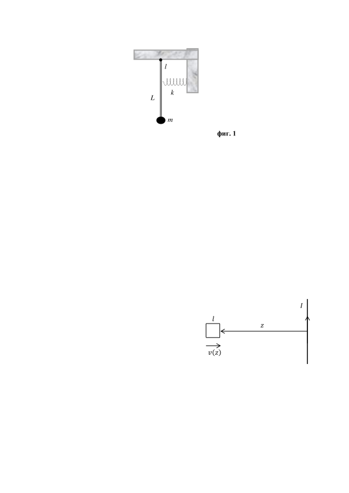

[[Състезания/3/10-12/2018|◂ 2018]] | [[Състезания/3/10-12r/2019|решения]] | [[Състезания/3/11-12/2020| 2020 ▸]]

**Задача 1. Детски "кърлинг"**

Върху хоризонтален прав асфалтов път разстоянието между две точки А и В е l . Дете
рита топка, намираща се в А, с начална скорост v0 под ъгъл спрямо хоризонта. Целта
му е топката да попадне в В.

а) При каква минимална начална скорост топката може да достигне В директно, без да отскача от асфалта? \[2 т\]

б) Началната скорост v0 е такава, че топката не може да достигне директно В, какъвто и да е ъгълът, под който е ритната. Нека тя отскача от асфалта абсолютно еластично, т.е. топката след удара отскача със същата по големина скорост, както преди удара, като ъгълът на падане е равен на ъгъла на отражение. Под какъв ъгъл $\alpha$ спрямо хоризонта трябва да бъде изритана топката така, че да попадне в В на n-тото поред отскачане от асфалта? \[1 т\]

в) За колко време Tn топката ще попадне в В при n-тото докосване на асфалта? \[2 т\]

г) Как детето трябва да променя началния ъгъл $\alpha$, така че топката да достига в В все по-бързо? Изведете формула за най-малкото възможно време Tmin . На какъв вид движение отговаря това минимално време?

В зависимост от начина на решение, можете да използвате приближената формула

$(1 - \varepsilon)^{1/2} \approx 1 - \frac{\varepsilon}{2}$, когато $\varepsilon\ll1$. \[4 т\]

д) Нека приемем, че топката, когато отскача от асфалта, губи част от кинетичната си
енергия. Отношението на кинетичната енергия, непосредствено след отскока на топката от асфалта и на кинетичната енергия непосредствено преди удара в асфалта е рвно на $\kappa$, като $\kappa\ll1$. При удара ъгълът на падане е равен на ъгъла на отражение. Ако детето хвърля топката под ъгъл $\alpha$, какво ще е крайното (максималното) разстояние, което ще достигне тя? \[3 т\]

е) За какво време топката ще измине максималното разстояние? \[3 т\]

**Задача 2. Задача - оценка.**

За решаване на задачата-оценка е необходимо да се разбере същността на
разглежданото физично явление, да се формулира прост модел на явлението, да се
изберат разумни стойности на физичните величини и да се получи числен резултат,
който повече или по-малко съответства на реалността. В много случаи е полезно
използването на законите за запазване, основните принципи на физиката, както и
съображения за размерност. В последния случай мерната единица на величина, която е равна на произведение от величини (всяка на определена степен), трябва да съвпада с нейната мерна единица. Оценката в този случай е с точност до произволен множител от порядъка на единица.

В някои от предложените задачи се иска да определите дадена величина, което
означава да укажете метод за нейното точно получаване. В други задачи се търсят
величини, които трябва да бъдат оценени. В този случай като правило се използва
приближен метод, който бързо води до правилен израз и порядък за търсената
величина.

**2.1. Топлинен двигател**

Един mol идеален газ се използва като работно тяло в топлинен двигател. В
процеса на работа на двигателя зависимостта на налягането на газа p и на неговия
обем V от времето се дават съответно с изразите

$$p(t ) = p_0 (1 - \frac{1}{4}\cos \omega t) ,\quad V (t ) = V_0 (1 - \frac{1}{4}\sin \omega t) .$$

а) Начертайте графиката на цикличния процес, като използвате подходящи
променливи. \[2 т\]

б) Посочете, като аргументирате отговора си, между кои две точки от графиката
на процеса работното тяло ще получава топлина. \[1 т\]

б) Оценете КПД на топлинния двигател. \[3 т\]

**2.2. Комбинирано махало**

Към долния край на лека пръчка с дължина L е прикачено малко тяло с маса m , а
горният ѝ край е окачен неподвижно, така че да се образува математично махало. На
разстояние l от точката на окачване пръчката е прикрепена към пружина с коефициент на еластичност k , като тя е недеформирана в положение на равновесие на махалото (фиг. 1). Намерете честотата на хармоничните трептения на махалото. \[4 т\]

**2.3. Съотношение за неопределеност**

Математично махало с дължина l и маса m извърщва хармонични трептения с
минимална енергия.

а) Като използвате съотношението за неопределеност на Хайзенберг $\Delta x \Delta p \sim\hbar$,
намерете минималната енергия на махалото. \[2 т\]

Ще въведем неопределеност на физична величина $\Delta$A като дължината на интервала, съответстващ на изменението на величината А в съответното квантово състояние.

б) Оценете неопределеността на отклонението на махалото от вертикалата $\Delta\varphi$ и
неопределеността на момента на импулса $\Delta$L в състояние с минимална енергия. \[2 т\]

в) Намерете произведението $\Delta\varphi\Delta L$ и интерпретирайте получения резултат. \[1 т\]

**Задача 3. Движение на проводяща рамка в магнитно поле.**

По безкраен прав проводник тече ток $I$. Квадратна рамка със страна $l$, маса $m$ и съпротивление $R$ (това съпротивление може да измерим, ако разрежем рамката и измерим съпротивлението между двата ѝ края) първоначално се намира безкрайно далеч от проводника и се движи към него със скорост $v_\infty$. Посоката на скоростта е перпендикулярна на безкрайния проводник и лежи в равнината на чертежа. Рамката остава в равнината на чертежа през цялото време. Индуктивността ѝ се пренебрегва.

а) Получете формула за магнитния поток $\Phi(z)$, който пробожда рамката, когато тя се
намира на разстояние от проводника (навсякъде в задачата се приема, че $l\ll z$). \[1 т\]

б) Получете формула за индуцирания ток $I_R(z,v(z))$ в рамката, когато тя се намира
разстояние от проводника. \[2 т\]

в) Получете формула за силата $F(z,v(z))$, която действа на рамката, когато тя се
намира на разстояние от проводника. \[4 т\]

г) Получете формула за скоростта $v(z)$, в която присъстват $v_\infty$ и останалите параметри на задачата (за да бъде формулата по-обозрима, произведение от параметрите може да се бележи с нов символ $A$). \[3 т\]

д) При какво разстояние $z_{\min}$ рамката ще спре? Изразете чрез $v_\infty$ и $A$. \[2 т\]

е) При какво разстояние $z_a$, ускорението на рамката ще е максимално? Ако ,
изчислете стойността на $k$. \[3 т\]

Представете всички отговори в таблица, подобна на дадената:

| величина | формула |
| ------------- | ------- |
| $\Phi$(z) = | |
| IR(z, v(z)) = | |
| F(z, v(z)) = | |
| v(z) = | |
| A = | |
| zmin = | |
| k = | |

Полезна физика и математика:

Индукцията на магнитното поле на безкраен прав проводник,
по който тече ток $I$, на разстояние $z$ от него, е $B(z) = \frac{\mu_0 I}{2\pi z}$

$$ \frac{d}{dx}(y^n) = ny^{n-1} \frac{dy}{dx}; \quad \frac{d}{dt}y(x(t)) = \frac{dy}{dx} \frac{dx}{dt}; $$

$$ f(x + \Delta x) \approx f(x) + \frac{df}{dx} \Delta x $$

$$ \text{Ако } \frac{df(x)}{dx} = \frac{dg(x)}{dx}, \text{ то } f(x) = g(x) + \text{const.} $$

**Задача 4. Слънчева физика**
Интензитетът на слънчевата светлина, която достига земната орбита, е
$I_0 = 1370\ \mathrm{W/m^2}$`(т.нар. слънчева константа). Радиусът на земната орбита е
$r_0 = 1,5.10^{11}$ m. Радиусът на Слънцето е $R_\odot = 7,0.10^8$ m, а масата му - $M\odot = 2,0.10^{30}$ kg.
Подточка а) е независима от останалите подточки на задачата и може да се решава
и след тях!

а) В някои проекти за пътуване до други планети от Слънчевата система се предлага
задвижване на космическите кораби посредством т.нар. слънчеви платна. Слънчевото платно е тънко алуминиево фолио, поставено перпендикулярно на падащите върху него слънчеви лъчи. Космическият кораб се задвижва поради налягането на слънчевата светлина, отразена от платното.

Намерете минималната дебелина d на слънчево платно, при която силата на
светлинното налягане уравновесява гравитационната сила, действаща на платното.
Приемете, че платното отразява напълно падащата светлина. Размерът на платното е
малък в сравнение с радиуса на земната орбита. Плътността на алуминия е
$\rho$ = 2700 kg/m3. \[6 т\]

*Следващите подточки са независими от т. а) и може да бъдат решавани преди нея.*

б) Като използвате данните от условието, оценете температурата Т на повърхността на Слънцето. Приемете, че Слънцето излъчва като абсолютно черно тяло. \[3 т\]

в) Намерете дължината $\lambda_0$ на електромагнитната вълна, при която излъчването на
Слънцето е най-интензивно. \[1 т\]

г) Известно е, че минималният фотонен поток*, който може да предизвика зрително
възприятие в човешкото око, е $\Phi_{\min} \approx 1.10^8$ фотона/(m2.s). Приблизително колко
светлинни години е максималното разстояние $r_{\max}$, на което Слънцето може да бъде
видяно с невъоръжено око? Можете да приемете като приближение, че слънчевата
светлина се състои от фотони с еднаква енергия. \[5 т\]

\*Фотонен поток Ф се нарича броят фотони, които минават за единица време през
единица площ, перпендикулярна на светлинния сноп.

Фундаментални физични константи:
 - скорост на светлината във вакуум, $c = 3,00.10^8$ m/s;
 - гравитационна константа, $G = 6,67.10^{-11}\ \mathrm{m^3/(kg.s^2)}$;
 - константа на Стефан - Болцман, $\sigma = 5,67.10^{-8}\ \mathrm{W/(K^4.m^2)}$;
 - константа на Вин, $b = 2,90.10^{-3}$ m.K;
 - константа на Планк, $h = 6,63.10^{-34}$ J.s.