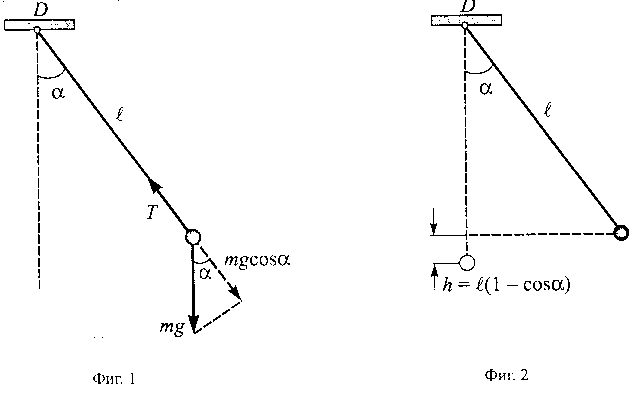
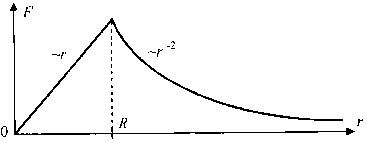
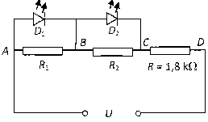

**Задача 1. Сензор за сили**
а) $F_{\text{в}}(\alpha_{\text{max}}) = 0,15\text{ N}$. **1 т.**
$F_{\text{в}}(\alpha = 0) = 1,2\text{ N}$. **1 т.**

б) Времето между два максимума на силата $F_{\text{в}}$ е равно на половината от периода $T$ на люлеене на махалото. От графиката определяме
$T = 1,45\text{ s}$. **1 т.**
Приемаме, че люлеенето на махалото е хармонично трептене.
Дължината на махалото е $l = \frac{gT^2}{4\pi^2} = 52\text{ cm}$. **1 т.**

в) При люлеенето на махалото топчето извършва неравномерно движение по окръжност с радиус $l$. Означаваме с $\alpha$ максималния ъгъл между нишката и вертикалната ос (фиг. 1).

В това най-горно положение топчето е неподвижно и неговото центростремително ускорение е нула. Условието за движение по окръжност има вида
(1) $T - mg \cos\alpha = \frac{mv^2}{l} = 0$. **1 т.**
Тъй като нишката е безмасова, силите на опън в нейните два края са равни:
$F_1 = T = mg \cos\alpha$. **1 т.**
Сензорът измерва вертикалната компонента на тази сила
(2) $F_{\text{1B}} = F_1 \cos\alpha = mg \cos^2\alpha$. **1 т.**
Когато топчето преминава през равновесното си положение, уравнението за движение по окръжност има вида
(3) $T - mg = \frac{mv^2}{l}$. **1 т.**
Скоростта $v$ определяме от закона за запазване на енергията (фиг. 2):
(4) $\frac{mv^2}{2} = mgh = mgl(1 - \cos\alpha)$. **1 т.**
Заместваме $v^2$ от уравнение (4) в уравнение (3) и определяме силата на опъване на нишката: $T = mg(3 - 2\cos\alpha)$. Тази сила е насочена вертикално. Нишката действа на сензора със същата по големина вертикална сила
(5) $F_{\text{2B}} = T = mg(3 - 2\cos\alpha)$. **1 т.**

г) $F_{\text{1B}}$ и $F_{\text{2B}}$ са съответно минималната и максималната стойност на силата $F_{\text{в}}$, която измерва сензорът. Числените стойности се определят от графиката (подусловие а). От уравнения (2) и (5) получаваме
(6) $\frac{F_{\text{2B}}}{F_{\text{1B}}} = \frac{3 - 2\cos\alpha}{\cos^2\alpha}$. **1 т.**
където $\frac{F_{\text{2B}}}{F_{\text{1B}}} = 8$. Това е квадратно уравнение за $\cos\alpha$, което има два корена:
$\alpha_1 = 60^\circ$ **0,5 т.**
$\alpha_2 = 139^\circ$ **0,5 т.**
През цялото време на люлеене на махалото нишката трябва да е опъната. Това означава, че максималният ъгъл на отклонение е $\alpha < 90^\circ$. Следователно вторият корен няма физически смисъл. **1 т.**

д) Масата на топчето определяме от уравнение (5) или (2):
$m = \frac{F_{\text{2B}}}{g(3 - 2\cos\alpha)} = 61\text{ g}$. **1 т.**

е) Амплитудата на люлеене на махалото е голяма ($\alpha = 60^\circ$). Затова люлеенето само с приближение може да се приеме за хармонично трептене. **1 т.**
Забележка. Периодът на махалото при големи ъгли на отклонение е
$T = 2\pi\sqrt{\frac{l}{g}} \left(1 + \frac{1}{16}\alpha^2 + \frac{11}{3072}\alpha^4 + \dots\right)$
За $\alpha = 60^\circ \approx 1\text{ rad}$ периодът е $T \approx 1,065 \left(2\pi\sqrt{\frac{l}{g}}\right)$, т.е. той е с около 6,5% по-голям от периода на математично махало, което трепти с малка амплитуда.

**Задача 2. Пудинг със сливи**
а) Когато електронът се намира на разстояние $r$ от центъра на положително зареденото кълбо при $r < R$, на него му действа Кулонова сила само от частта заряд, намираща се на разстояние $x \le r$. **0,5 т.** Обемната плътност $\rho$ на електричния заряд вътре в кълбото е $\rho = \frac{e}{\frac{4}{3}\pi R^3}$, следователно зарядът на кълбото с радиус $r$ е $q(r) = \rho V(r) = \frac{e}{\frac{4}{3}\pi R^3} \cdot \frac{4}{3}\pi r^3 = e\frac{r^3}{R^3}$. **0,5 т.** Следователно силата $F(r)$, която действа на електрона, когато се намира на разстояние $r$ от центъра на положително зареденото кълбо при $r < R$, е
$F(r) = \frac{eq(r)}{4\pi\varepsilon_0 r^2} = \frac{e^2}{4\pi\varepsilon_0 r^2} \cdot \frac{r^3}{R^3} = \frac{e^2}{4\pi\varepsilon_0 R^3}r$. **1 т.**

б) Зависимостта на силата $F(r)$ от разстоянието $r$ при $r \in [0, \infty]$ изглежда така:

**2 т.**

в) Работата $A$, необходима да се премести неподвижен електрон от центъра на положително зареденото кълбо до безкрайност, е сума на две работи: работата $A_{0-R}$, необходима да се премести електрон от центъра на положително зареденото кълбо до неговата повърхност, и работата $A_{R-\infty}$, необходима да се премести неподвижен електрон от повърхността на кълбото до безкрайност. **0,5 т.** От горната фигура се вижда, че $A_{0-R} = \frac{F_{\text{max}}R}{2} = \frac{F(R)R}{2} = \frac{e^2}{8\pi\varepsilon_0 R}$. **1 т.** Втората работа $A_{R-\infty}$ е равна на $A_{R-\infty} = e\varphi(R) = \frac{e^2}{4\pi\varepsilon_0 R}$. **1 т.**
Следователно, $A_{0-\infty} = A_{0-R} + A_{R-\infty} = \frac{3e^2}{8\pi\varepsilon_0 R}$. **0,5 т.**

г) Радиусът $R$ на кълбото е $R = \frac{3e^2}{8\pi\varepsilon_0 A_{0-\infty}}$. **0,5 т.** = $\frac{3(1,6 \cdot 10^{-19})^2}{8\pi \cdot 8,85 \cdot 10^{-12} \cdot 13,8 \cdot 1,6 \cdot 10^{-19}} = 1,56 \cdot 10^{-10}\text{ m} = 1,56 \AA}$. **1,5 т.**

д) Тъй като силата $F(r)$, която действа на електрона, когато се намира вътре в кълбото, е пропорционална на радиуса $r$, то електронът ще извършва хармонично трептене **0,5 т.** с честота $\nu = \frac{1}{2\pi}\sqrt{\frac{k}{m}} = \frac{1}{2\pi}\sqrt{\frac{e^2}{4\pi\varepsilon_0 R^3 m}}$. **1,5 т.**

е) Дължината на вълната на електромагнитната вълна, ако електронът при трептенето си излъчва такава, е $\lambda = \frac{c}{\nu} = 2\pi c \sqrt{\frac{4\pi\varepsilon_0 R^3 m}{e^2}} = \frac{2\pi c R}{e} \sqrt{4\pi\varepsilon_0 R m}$ **0,5 т.** = $\frac{2\pi \cdot 3 \cdot 10^8 \cdot 1,56 \cdot 10^{-10}}{1,6 \cdot 10^{-19}} \sqrt{4\pi \cdot 8,85 \cdot 10^{-12} \cdot 1,56 \cdot 10^{-10} \cdot 9,1 \cdot 10^{-31}} = 2,31 \cdot 10^{-7}\text{ m} = 231\text{ nm}$. **1 т.** Тази светлина е ултравиолетова. **0,5 т.**

ж) Формулата на Ридберг за енергетичните преходи във водородния атом,
$E_{n,m} = \text{const} \cdot \left(\frac{1}{n^2} - \frac{1}{m^2}\right)$, може да се препише във вида
$\frac{hc}{\lambda_{n,m}} = A_{0-\infty} \left(\frac{1}{n^2} - \frac{1}{m^2}\right)$, а оттам
$\frac{1}{\lambda_{n,m}} = \frac{1}{\lambda_{\text{min}}} \left(\frac{1}{n^2} - \frac{1}{m^2}\right)$, **0,5 т.**
където $\lambda_{\text{min}} = \frac{hc}{A_{0-\infty}} = \frac{6,63 \cdot 10^{-34} \cdot 3 \cdot 10^8}{13,6 \cdot 1,6 \cdot 10^{-19}} = 9,14 \cdot 10^{-8}\text{ m} = 91,4\text{ nm}$. Следователно, за да съществува такъв преход, трябва да съществуват цели числа $n$ и $m$ такива, че $\frac{1}{n^2} - \frac{1}{m^2} = \frac{\lambda_{\text{min}}}{\lambda} = 0,396 \approx \frac{1}{2,53}$. В такъв случай обаче $n$ може да е само 1. **0,5 т.** Но тогава при $m > 1$, $1 - \frac{1}{m^2} \ge 0,75$. **0,5 т.** Излиза, че такъв преход във водородния атом няма. **0,5 т.**

**Задача 3. Светодиод**
а) Когато през диода тече ток $I$, в него се отделя мощност
$P_D = U_D I$. **1 т.**
защото в работен режим напрежението върху диода е равно на напрежението на запалване. От друга страна, напрежението върху резистора е
$U_R = E - U_D = IR$. **1 т.**
Следователно
$P_D = \frac{U_D(E - U_D)}{R}$, **1 т.**
откъдето
$R = \frac{U_D(E - U_D)}{P_D} = 600\ \Omega$. **1 т.**

б) Пълната мощност, която се отделя във веригата, е
$P = EI = \frac{E(E - U_D)}{R}$, **1 т.**
откъдето определяме КПД
$\eta = \frac{P_D}{P} = \frac{U_D}{E} = 0,4$. **1 т.**

в) Когато през светодиода (по-точно p-n прехода) премине един електрон, електричните сили извършват работа:

$A = Ue$. **1 т.**
Съгласно условието, тази работа се трансформира изцяло в енергия на един излъчен фотон
$Ue = h\nu$. **1 т.**
Като вземем предвид, че
$\lambda\nu = c$, **0,5 т.**
получаваме
$\lambda = \frac{hc}{eU} = 6,22 \cdot 10^{-7}\text{ m} = 622\text{ nm}$. **1 т.**
Това е светлина от червената област на спектъра. **0,5 т.**

г) При $U < U_1 = 5\text{ V}$ токът протича само през последователно свързаните резистори, защото диодите са запушени. Падът на напрежение върху $D_1$ в този случай е
$U_{AB} = IR_1 = U \frac{R_1}{R + R_1 + R_2}$. **1 т.**
Когато $U = U_1 = 5\text{ V}$, напрежението върху $D_1$ се изравнява с напрежението на запалване
$U_D = U_1 \frac{R_1}{R + R_1 + R_2}$, **0,5 т.**
откъдето намираме
(1) $(U_1 - U_D)R_1 - U_D R_2 = U_D R$.

Когато $5\text{ V} < U \le U_2 = 10\text{ V}$, диодът $D_1$ свети и напрежението върху него е фиксирано и равно на $U_D$, а в същото време през диода $D_2$ не тече ток. Тогава резисторите $R_2$ и $R$ са свързани последователно и през тях тече ток
$I = \frac{U - U_D}{R + R_2}$. **1 т.**
Напрежението върху $D_2$ е
$U_{BC} = IR_2 = \frac{(U - U_D)R_2}{R + R_2}$.
Когато $U = U_2 = 10\text{ V}$, напрежението върху $D_2$ достига напрежението на запалване:

откъдето получаваме
$U_D = \frac{(U_2 - U_D)R_2}{R + R_2}$, **0,5 т.**
(2) $R_2 = R \frac{U_D}{U_2 - 2U_D} = 600\ \Omega$. **1 т.**

Заместваме получената стойност в уравнение (1) и получаваме съпротивлението на първия резистор
(3) $R_1 = R \frac{(U_2 - U_D)U_D}{(U_1 - U_D)(U_2 - 2U_D)} = 600\ \Omega$. **1 т.**

**Задача 4. Модел на ядро**

а) От изискването обемът на потенциалната яма с форма на куб да е равен на обема на ядрото получаваме
$a = \left(\frac{4\pi}{3} R^3\right)^{1/3} \approx (4,2)^{1/3} r_0$. **1 т.**

б) Енергията на един нуклон се определя с израза
$\varepsilon = U_0 + \frac{p_x^2 + p_y^2 + p_z^2}{2m_N}$. **1 т.**
Като отчетем за всяко независимо движение формулата на Дьо Бройл
$p = \frac{2\pi\hbar}{\lambda}$, **1 т.**
получаваме
$\varepsilon = U_0 + \frac{4\pi^2\hbar^2}{2m_N} \left[\frac{1}{\lambda_x^2} + \frac{1}{\lambda_y^2} + \frac{1}{\lambda_z^2}\right]$. **1 т.**

Съгласно вълновите свойства на частиците възможните стойности на $\lambda_x, \lambda_y, \lambda_z$ следват от формирането на стоящи вълни между всеки две стени на потенциалната яма
$n_x \frac{\lambda_x}{2} = a, n_x = 1, 2, 3, \dots$ **0,5 т.**
$n_y \frac{\lambda_y}{2} = a, n_y = 1, 2, 3, \dots$ **0,5 т.**
$n_z \frac{\lambda_z}{2} = a, n_z = 1, 2, 3, \dots$ **0,5 т.**
Тогава за възможните стойности на енергията на един нуклон получаваме
$\varepsilon_{n_x, n_y, n_z} = U_0 + \frac{\pi^2\hbar^2}{2m_N a^2} (n_x^2 + n_y^2 + n_z^2) = U_0 + 0,31 \frac{\hbar^2}{m_N r_0^2} (n_x^2 + n_y^2 + n_z^2)$. **1,5 т.**

в) Съгласно принципа на Паули в дадено състояние с определени $n_x, n_y, n_z$ могат да се намират най-много два протона с противоположни спинове и два неутрона с противоположни спинове. **1 т.** На енергетичното ниво $\varepsilon_{1,1,1}$ се намират два протона и два неутрона **1 т.**, а на нивото $\varepsilon_{2,1,1} = \varepsilon_{1,2,1} = \varepsilon_{1,1,2}$ — шест протона и шест неутрона **1 т.**, а останалите енергетични нива са празни. **1 т.** Енергията на основното състояние на ядрото на кислорода $^{16}_{8}\text{O}$ е равна на
$E_0 = 16U_0 + 0,31(4,3 + 12,6) \frac{\hbar^2}{m_N r_0^2} \approx -244\text{ MeV}$. **2 т.**

г) Честотата на фотона е
$\nu_{\text{min}} = \frac{-\varepsilon_{2,1,1}}{2\pi\hbar} \approx 3 \cdot 10^{21}\text{ Hz}$, **2 т.**
т.е. фотонът е $\gamma$-квант.