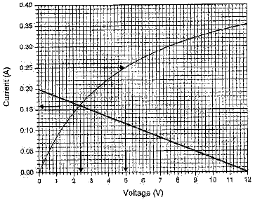

**Задача 1. Разход на гориво**

**а)** За да определим ъгловата скорост на въртене на стрелката, е необходимо да определим количеството гориво, което се изразходва за 1 час (**1 т.**).
При скорост 50 km/h то е 2 литра/час (**1 т.**), а при скорост 130 km/h – 10,4 литра/час (**1 т.**). Пълен резервоар от 40 литра съответства на $120^\circ$ (12 деления). Тогава ъгловата скорост на стрелката ще бъде съответно $(120^\circ / 40) \cdot 2 = 6^\circ$ (6 деления) на час (**1 т.**) при скорост 50 km/h и $(120^\circ / 40) \cdot 10,4 = 31,2^\circ$ (3,1 деления) на час (**1 т.**) при скорост 130 km/h.

**б)** Тъй като съпротивителната сила на въздуха зависи от квадрата на скоростта, по същия начин ще зависи работата (**1 т.**) (и съответно частта от горивото, което отива за преодоляване на въздушното съпротивление при движение с постоянна скорост). Ако означим с $x$ разхода на гориво на 100 km при постоянна скорост на движение, ще получим $x = A + B \cdot v^2$ (**1 т.**). Като заместим със стойностите при 50 и 130 km/h, получаваме система от две уравнения с две неизвестни:
$4 = A + 2500 \cdot B$
$8 = A + 16900 \cdot B$

Откъдето намираме $B = 4/14400$ и $A = 47600/14400$ (**1 т.**) и съответно разходът при 90 km/h ще бъде $x_{90} = 476/144 + (4 \cdot 8100)/14400 = 5,55...$ литра/100 километра (**1 т.**). Разходът на час ще бъде 5 литра на час, а ъгловата скорост на разходомера – $(120^\circ / 40) \cdot 5 = 15^\circ$ (1,5 деления) на час. (**1 т.**)

**в)** За да оценим необходимото количество гориво за работа на място, то е необходимо да свържем скоростта с разхода на гориво за единица време. Тогава стойността на тази функционална зависимост при $v = 0$ ще ни даде разхода на гориво при работещ двигател на спрял автомобил (**1 т.**).
За преодоляване на силата на въздушното съпротивление ($\sim v^2$) ще е необходима мощност $\sim v^3$ (**1 т.**) (която е пропорционална на работата за единица време при постоянна скорост на движение). Така че зависимостта на изразходваното за единица време гориво (означаваме с $y$) ще апроксимираме с $y = C + D \cdot v^3$ (**1 т.**), където $C$ и $D$ са константи, като получената стойност за $C$ ще е оценката за изразходваното гориво при работа на двигател за спрял автомобил.
Ако се прекара бест-фит права през трите точки се получава $y = 1,23 + 5,39 \cdot v^3$, което ни дава разход от 1,23 литра/час за работещ на място двигател. (**2 т.**)
(Алтернативно стойността на $C$ може да получим от две уравнения с две неизвестни с данните за разхода при 50 и 130 km/h – $C = 1,33$ литра/час.)

**Задача 2. Нелинейно съпротивление**
**Част 1.**
**а)** При ток $I_0 = 0,25$ А във веригата от дадената графика се получава, че напрежението върху второто съпротивление е $U_2 = 5,0$ V. От закона на Ом $E = I_0 R_0 - U_2$ се получава: $R_0 = \frac{E - U_0}{I_0} = \frac{12,0 \text{ V} - 5,0 \text{ V}}{0,25 \text{ A}} = 28 \ \Omega$. (**3 т.**)

**б)** От закона на Ом следва: $E = I_2 R_0 + U_2(I_2)$ (с $U_2(I_2)$ бележим напрежението върху втория резистор). Следователно $U_2(I_2) = E - I_2 R_0$. Това е уравнение на права, която при $R_0 = 60 \ \Omega$ пресича осите на волтамперната характеристика в точките $(12 \text{ V}, 0 \text{ A})$ и $(0 \text{ V}, 0,2 \text{ A})$. Пресечната точка на тази права с волтамперната характеристика има координати $(2,4 \text{ V}, 0,16 \text{ A})$. Следователно токът във веригата е $I_2 = 0,16 \text{ A}$, а напрежението върху втория (нелинейния) резистор е $U_2 = 2,4 \text{ V}$. (**4 т.**)

**Част 2.**
**а)** При установено термодинамично равновесие отделеното количество топлина в резистора за единица време ще е равно на разсеяното такова $\frac{E^2}{R_0(1 + \alpha t)} = \beta(t - t_0)$, откъдето се получава квадратно уравнение за температурата $t$: $\alpha t^2 + (1 - \alpha t_0) t - \left( \frac{E^2}{\beta R_0} + t_0 \right) = 0$. Само по-голямото от двете решения има физически смисъл:
$t = \frac{-(1 - \alpha t_0) + \sqrt{(1 - \alpha t_0)^2 + 4\alpha \left( \frac{E^2}{\beta R_0} + t_0 \right)}}{2\alpha}$
След заместване с дадените стойности $t = 77,3^\circ \text{C}$. (**4 т.**)

**б)** от условието на задачата: $\frac{U^2}{R(U)} = \beta(t - t_0)$, а $R(U) = R_0(1 + \alpha t)$. Изразявайки температурата $t$ от второто уравнение и замествайки я в първото, получаваме $\frac{U^2}{R(U)} = \beta \left[ \frac{R(U) - R_0}{R_0 \alpha} - t_0 \right]$. След опростяване се получава следното квадратно уравнение за $R(U)$: $R(U)^2 - R_0(1 + \alpha t_0)R(U) - \frac{U^2 R_0 \alpha}{\beta} = 0$.
Само положителното му решение има физически смисъл:
$R(U) = \frac{R_0(1 + \alpha t_0) + \sqrt{R_0^2(1 + \alpha t_0)^2 + \frac{4 U^2 R_0 \alpha}{\beta}}}{2}$

При достатъчно малки напрежения второто събираемо под радикала ще стане много по-малко от първото събираемо и може да се използва приближена формула:
$R(U) = \frac{1}{2} R_0(1 + \alpha t_0) \left[ 1 + \sqrt{1 + \frac{4 U^2 R_0 \alpha}{\beta R_0^2(1 + \alpha t_0)^2}} \right] \approx$
$\approx \frac{1}{2} R_0(1 + \alpha t_0) \left[ 1 + \left( 1 + \frac{2 U^2 R_0 \alpha}{\beta R_0^2(1 + \alpha t_0)^2} \right) \right] =$
$= R_0(1 + \alpha t_0) \left[ 1 + \frac{\alpha U^2}{\beta R_0(1 + \alpha t_0)^2} \right] = R_0(1 + \alpha t_0) + \frac{\alpha}{\beta(1 + \alpha t_0)} U^2$.

След заместване с дадените стойности: $R(U) = 106,7 \ \Omega + 0,1563 \frac{\Omega}{\text{V}^2} U^2$.
Следователно $A = 106,7 \ \Omega$ и $B = 0,1563 \ \Omega/\text{V}^2$. (**4 т.**)

**Задача 3. Термодинамика на цикличен процес**
**а)** От уравнението на адиабатния процес $pV^\gamma = \text{const}$ с показател на адиабатата $\gamma = 5/3$ (хелият е едноатомен газ) намираме
$p_1 = p_0 \varepsilon^\gamma \approx 3,2 \text{ atm}$. (**1 т.**)
В процеса 4–1 налягането $p$ е пропорционално на обема $V$, т.е. $p/V = \text{const}$ и за налягането $p_2$ получаваме
$p_2 = p_0 \omega = 2 \text{ atm}$. (**1 т.**)

**б)** Работата $A$, която извършва двигателят за един цикъл, е
$A = Q_{in} - Q_{out} = Q_1 - Q_2$. (**0,5 т.**)
Работното вещество получава топлина $Q_1$ при изобарния процес и отдава топлина $Q_2$ при изохорния процес и процеса 4–1. Тогава
$Q_1 = \nu c_p (T_3 - T_2) = \frac{5}{2} p_1 (V_2 - V_1) = \frac{5}{2} p_0 V_0 \varepsilon^{\gamma-1} (\varepsilon \omega - 1) \approx 595 \text{ J}$, (**2 т.**)
където е отчетено, че $c_p = (5/2)R$ и уравнението на състоянието на идеален газ е $pV = \nu RT$.

От друга страна
$Q_2 = Q_{21} + Q_{22}$, (**0,5 т.**)
където
$Q_{21} = \nu c_V (T_3 - T_4) = \frac{3}{2} (p_1 - p_2)V_2 = \frac{3}{2} p_0 V_0 (\varepsilon^\gamma - \omega) \omega$. (**1 т.**)
В процеса 4–1 моларният топлинен капацитет е
$c = c_V + p \frac{\Delta V}{\Delta T} = 2R$, (**1 т.**)
откъдето следва
$Q_{22} = \nu c (T_4 - T_1) = 2(p_2 V_2 - p_0 V_0) = 2 p_0 V_0 (\omega^2 - 1)$. (**1 т.**)
Тогава имаме
$Q_2 = \frac{1}{2} p_0 V_0 (3\varepsilon^\gamma \omega + \omega^2 - 4) \approx 238 \text{ J}$ (**1 т.**)
и извършената от топлинния двигател работа за един цикъл е
$A = \frac{1}{2} p_0 V_0 [\varepsilon^\gamma (5\omega - 3) - 5\varepsilon^{\gamma-1} - \omega^2 + 4] \approx 357 \text{ J}$. (**1 т.**)

**в)** По определение КПД на цикъла е
$\eta = \frac{A}{Q_1} \approx 0,60$. (**1 т.**)

**г)** В хладилния цикъл отнетата топлина от охлажданото тяло е $Q_2$ (топлината, която е получена от работното вещество), а извършената от външен източник работа е $A$. Ефективността на хладилника се дава с израза
$\phi = \frac{Q_2}{A} = \frac{1 - \eta}{\eta} \approx 0,67$. (**2 т.**)
Когато цикълът се използва в топлинна помпа, отдадената топлина на нагряваното тяло е $Q_1$ (топлината, отдадена от работното вещество), а извършената от външен източник работа е $A$. Ефективността на топлинната помпа е
$\psi = \frac{Q_1}{A} = \frac{1}{\eta} \approx 1,67$. (**2 т.**)

**Задача 4. Релативистки свят**
**а)** Времето $t_1$ е интервал от собствено време за часовника в самолета. Времето $t_2$, отчетено в инерциалната отправна система, е
$t_2 = \frac{t_1}{\sqrt{1 - v^2/c^2}}$. (**1 т.**)
Следователно $t_2 > t_1$. (**0,5 т.**)
Спрямо Земята самолетът обикаля Екватора за време
$t_2 = \frac{L}{v}$. (**0,5 т.**)
Следователно времето за една обиколка спрямо часовника в самолета е
$t_1 = \frac{L}{v} \sqrt{1 - v^2/c^2}$.

Оттук получаваме

$\Delta t = t_2 - t_1 = \frac{L}{v} (1 - \sqrt{1 - v^2/c^2})$. (**1 т.**)
Когато $v/c \ll 1$, можем да използваме приблизителното равенство на Бернули: $(1 + x)^n \approx 1 + nx$, където $x = -v^2/c^2$ и $n = 1/2$. Така получаваме
$\Delta t \approx \frac{Lv}{2c^2}$ (**1 т.**)
или
$\Delta t \approx 7 \cdot 10^{-8} \text{ s}$. (**1 т.**)
Периодът на трептене на вълната, която излъчва цезиевият атом, е
$T = \frac{\lambda}{c} \approx 1,07 \cdot 10^{-10} \text{ s}$. (**0,5 т.**)
Следователно разликата във времената на двата часовника отговаря на
$N = \frac{\Delta t}{T} \approx 656$ (**0,5 т.**)
периода на трептене.

**б)** Законите за запазване на импулса и енергията при удара се записват съответно:
$\frac{m_1 v_0}{\sqrt{1 - v_0^2/c^2}} = \frac{m v}{\sqrt{1 - v^2/c^2}}$ (**1 т.**)
$\frac{m_1 c^2}{\sqrt{1 - v_0^2/c^2}} + m_2 c^2 = \frac{m c^2}{\sqrt{1 - v^2/c^2}}$ (**1 т.**)
След като разделим почленно двете уравнения, намираме скоростта на новата частица:
$v = \frac{v_0}{1 + \frac{m_2}{m_1} \sqrt{1 - v_0^2/c^2}}$ (**1 т.**)
За масата в покой на новата частица съответно намираме
$m = \sqrt{m_1^2 + m_2^2 + \frac{2 m_1 m_2}{\sqrt{1 - v_0^2/c^2}}}$ (**1 т.**)
За подкоренния израз е изпълнено неравенството:
$m_1^2 + m_2^2 + \frac{2 m_1 m_2}{\sqrt{1 - v_0^2/c^2}} > m_1^2 + m_2^2 + 2 m_1 m_2 = (m_1 + m_2)^2$. (**1 т.**)
Следователно:
$m > m_1 + m_2$. (**1 т.**)
При нееластичен удар част от кинетичната енергия на частиците се трансформира във вътрешна енергия на новообразуваната частица. Оттук и от еквивалентността между маса и енергия следва, че масата в покой на новата частица е по-голяма от сумата на енергиите в покой на началните частици. (**1 т.**)
Когато $v_0/c \ll 1$ можем да приемем, че без съществена загуба на точност
$v \approx \frac{v_0}{1 + \frac{m_2}{m_1}} = \frac{m_1 v_0}{m_1 + m_2}$, (**0,5 т.**)

което е класическият резултат. За определяне на $\Delta m$ обаче това приближение не е достатъчно. В случая трябва да използваме формулата на Бернули:
$m = \sqrt{m_1^2 + m_2^2 + \frac{2m_1m_2}{\sqrt{1 - v_0^2/c^2}}} \approx \sqrt{m_1^2 + m_2^2 + 2m_1m_2 + m_1m_2 v_0^2/c^2} =$
$= (m_1 + m_2) \sqrt{1 + \frac{m_1m_2}{(m_1 + m_2)^2} v_0^2/c^2} \approx (m_1 + m_2) + \frac{m_1m_2}{2(m_1 + m_2)} v_0^2/c^2$

Следователно:
$\Delta m \approx \frac{m_1m_2 v_0^2}{2(m_1 + m_2)c^2}$. (**1,5 т.**)