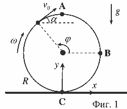
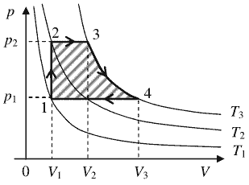
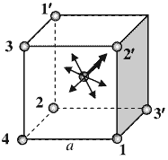
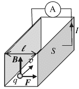

**Задача 1. Буксуваща гума.**

а) Нека въведем Декартова координатна система, както е показано на фиг. 1. При отделянето на капка от повърхността на гумата тя има скорост с големина $v_0 = \omega R$, \[0,5 т.\] която съвпада с линейната скорост на съответната точка от повърхността на гумата, откъдето се отделя капката. Следователно скоростта е тангенциална към околната повърхнина и насочена по посока на въртенето на гумата. Капките, излитащи от т. A, са с уравнения на движение $x = v_0 t$ и $y = 2R - gt^2/2$.
\[0,5 т.\] Капките падат на земята, когато $y = 2R - gt^2/2 = 0$. Това става при $t = 2\sqrt{R/g}$ и $l = v_0 t = 2\omega R \sqrt{R/g}$. \[1 т.\]

б) Нека да параметризираме точките от околната повърхнина на гумата с ъгъла $\varphi$, показан на фиг. 1. Скоростта $v_0$ сключва с хоризонта ъгъл $\alpha = \varphi - 90^\circ$. \[1 т.\]. Уравненията за движение на произволна капка са: $x = R\cos\varphi + v_0 t \sin\varphi$ \[1 т.\] и $y = R(1 + \sin\varphi) - v_0 t \cos\varphi - gt^2/2$. \[1 т.\] Следователно за да може капките да минат през т. B, трябва $x = R\cos\varphi + v_0 t \sin\varphi = R$ и $y = R(1 + \sin\varphi) - v_0 t \cos\varphi - gt^2/2 = R$. \[0,5 т.\]
Заместваме $t$ от първото уравнение във второто и получаваме, че търсената точка е със $\sin\varphi = \frac{4\omega^2 Rg}{4\omega^4 R^2 + g^2}$. \[1 т.\] В същото време се получава, че $\cos\varphi < 0$, т.е. точката лежи наляво от т. A на фиг. 1. \[0,5 т.\]

в) В най-високата точка от своята траектория капките имат нулева вертикална компонента на скоростта, т.е. $v_y = -v_0 \cos\varphi - gt = 0$. \[1 т.\] Като заместим $t$ от това уравнение в уравнението за движение по $y$, получаваме $y_{max} = R(1 + \sin\varphi) + \frac{v_0^2 \cos^2\varphi}{2g}$ за произволна капка. \[2 т.\] Около максималната височина $h_{max} = y_{max}(\varphi_{max})$ винаги има две различни стойности на $\varphi$, за които $y_{max}$ ще бъде едно и също. \[1 т.\] Тези стойности се получават като решение на квадратното уравнение $\frac{v_0^2}{2g} \sin^2\varphi - R \sin\varphi - R - \frac{v_0^2}{2g} + y_{max} = 0$. \[2 т.\]

Единствено в максимума ще има една единствена стойност на $\varphi$ за фиксирано $y_{max}$, т.е. уравнението ще има един двоен корен, което се реализира при нулиране на дискриминантата на квадратното уравнение, откъдето следва, че $h_{max} = R + \frac{v_0^2}{2g} + \frac{gR^2}{2v_0^2} = R + \frac{g}{2\omega^2} + \frac{\omega^2 R^2}{2g}$. \[2 т.\]

**Задача 2. Топлина и работа**

**Част А.** а) Всяка от графиките се състои от три участъка. Първият участък представя процес на нагряване на течността до температурата на кипене. \[0,5 т.\] Вторият, хоризонтален участък, е свързан с кипенето на течността, като нагряването води до изпарението й. \[0,5 т.\] На третия участък цялото количество течност се е изпарило и се наблюдава нагряване на парите. \[0,5 т.\]

б) Хоризонталният участък на графиките се реализира при температурата на кипене на течността – $t_1$ за течността 1 и $t_2$ за течността 2. Както се вижда от фиг. 1 имаме, $t_1 < t_2$. \[0,5 т.\] При нагряване до температурата на кипене, течностите получават количество топлина $Q_1 = P\tau_2$, $Q_2 = P\tau_1$ \[0,5 т.\] съответно. Следователно имаме $\frac{Q_1}{Q_2} = \frac{\tau_2}{\tau_1} > 1$. \[0,5 т.\]
От друга страна са в сила равенствата $Q_1 = mc_1 t_1$, $Q_2 = mc_2 t_2$, \[0,5 т.\] откъдето следва връзката между топлинните капацитети $\frac{c_1}{c_2} > \frac{t_2}{t_1} > 1 \Rightarrow c_1 > c_2$, \[1 т.\] т.е. специфичният топлинен капацитет $c_1$ на първата течност е по-голям от специфичния топлинен капацитет $c_2$ на втората течност.
При температурата на кипене за изпаряване на първата течност е нужно количество топлина $Q'_1 = mr_1 = P(\tau_3 - \tau_2)$, \[0,25 т.\] а за втората – $Q'_2 = mr_2 = P(\tau_3 - \tau_1)$. \[0,25 т.\] Тъй като имаме $\frac{Q'_1}{Q'_2} = \frac{r_1}{r_2} = \frac{\tau_3 - \tau_2}{\tau_3 - \tau_1} < 1, \Rightarrow r_1 < r_2$, \[1 т.\] т.е. специфичната топлина на изпарение $r_1$ на първата течност е по-малка от специфичната топлина на изпарение $r_2$ на втората течност.

В третия участък към даден момент $\tau'$ имаме $Q''_1 = mC_1 \Delta t_1 = P(\tau' - \tau_3)$, $Q''_2 = mC_2 \Delta t_2 = P(\tau' - \tau_3)$, \[0,5 т.\] като $\Delta t_1 > \Delta t_2$. \[0,5 т.\] Тогава получаваме $\frac{Q''_1}{Q''_2} = \frac{C_1 \Delta t_1}{C_2 \Delta t_2} = \frac{\tau' - \tau_3}{\tau' - \tau_3} = 1$, $\frac{C_1}{C_2} = \frac{\Delta t_2}{\Delta t_1} < 1 \Rightarrow C_1 < C_2$, \[1 т.\] т.е. специфичният топлинен капацитет $C_1$ на парите на първата течност е по-малък от специфичния топлинен капацитет $C_2$ на парите на втората течност.

**Част Б.** По определение КПД на топлинен двигател се дава с израза $\eta = \frac{W}{Q}$, \[0,5 т.\] където $W$ е работата, извършена от газа, а $Q$ – получената от него топлина. Според геометричното тълкуване на извършената работа тя се дава с площта на фигурата, оградена от цикличния процес (фиг. 1), т.е. $W = (p_2 - p_1)(V_2 - V_1) + BT_3 \ln\frac{V_3}{V_2} - p_1(V_3 - V_2)$. \[1,5 т.\]
За състоянията, които лежат на една изохора имаме $\frac{p_1}{T_1} = \frac{p_2}{T_2}$, $\frac{p_1}{T_2} = \frac{p_2}{T_3} \Rightarrow T_2 = \sqrt{T_1 T_3}$. \[1 т.\]
От друга страна за състоянията, които лежат на изобарата с налягане $p_1$, можем да запишем $\frac{V_3}{V_2} = \frac{T_3}{T_2} = \sqrt{\frac{T_3}{T_1}}$. \[0,5 т.\]
Следователно, като отчетем уравнението на състояние на идеалния газ $pV = BT$, \[0,25 т.\] имаме $W = \frac{BT_3}{\alpha} \left( \frac{1}{2} \alpha \ln\alpha - (\sqrt{\alpha} - 1) \right)$, \[1 т.\] където $\alpha = T_3/T_1 = T_{max}/T_{min}$. \[0,25 т.\] Газът получава топлина в последователността от процеси $1-2-3-4$. От първия принцип на термодинамиката имаме $Q = U_4 - U_1 + p_2(V_2 - V_1) + BT_3 \ln\frac{V_3}{V_2} = \frac{BT_3}{\alpha} \left( \frac{5}{2} \alpha - \sqrt{\alpha} + \frac{1}{2} \alpha \ln\alpha - \frac{3}{2} \right)$. \[1 т.\]
Следователно за КПД на цикъла получаваме $\eta = \frac{(1/2)\alpha \ln\alpha - \sqrt{\alpha} + 1}{(1/2)\alpha \ln\alpha - \sqrt{\alpha} + 1 + (5/2)(\alpha - 1)} = \frac{1}{1 + \frac{5(\alpha - 1)}{\alpha \ln\alpha - 2(\sqrt{\alpha} - 1)}} \approx 0,15$. \[1 т.\]

**Задача 3. Електромагнитен коктейл**

А) Силите от страна на двойките диаметрално-противоположни заряди 1–1', 2–2', 3–3' взаимно се уравновесяват. \[1 т\]
Следователно на заряда в центъра действа единствено некомпенсираната сила от страна на заряда 4: $F = \frac{kq^2}{r^2} = \frac{4kq^2}{3a^2}$ \[1 т\]
Потенциалът, който създават седемте заряда в центъра е: $\phi_c = \frac{7kq}{r} = \frac{14kq}{a\sqrt{3}}$ \[1 т\]
Зарядите 1', 2', 3' се намират на разстояния $a$, зарядите 1, 2, 3 – на разстояния $a\sqrt{2}$, а зарядът 4 – на разстояние $a\sqrt{3}$ от върха на куба. Следователно потенциалът, който седемте заряда създават във върха, е: $\phi_v = \frac{3kq}{a} + \frac{3kq}{\sqrt{2}a} + \frac{kq}{\sqrt{3}a}$ \[1 т\]
Работата, нужна за преместване на заряда от върха в центъра, е: $A = q(\phi_c - \phi_v) = \frac{kq^2(26\sqrt{3} - 9\sqrt{2} - 18)}{6a}$ \[1 т\]

Б) Всеки от праволинейните участъци 1 и 3 създава магнитна индукция, която е половината от магнитната индукция на безкраен прав проводник: $B_1 = B_3 = \frac{\mu_0 I}{4\pi R}$ \[1 т\]
Разглеждаме малък елемент с дължина $\Delta l$ от кръговия участък 2. По закона на Био-Савар, той създава магнитна индукция: $\Delta B = \frac{\mu_0 I \Delta l}{4\pi R^2}$ \[1 т\]
Общото поле на участъка 2 е сума от полетата, създадени от всички малки елементи: $B_2 = \sum \frac{\mu_0 I \Delta l}{4\pi R^2} = \frac{\mu_0 I}{4R}$ \[1 т\]
където сме използвали, че $\sum \Delta l = \pi R$ е дължината на полуокръжността.
От правилото на дясната ръка установяваме, че и трите участъка създават магнитна индукция в посока от нас към чертежа. Следователна общата магнитна индукция в т. О също е насочена от нас към чертежа. \[1 т\]
Съгласно с принципа за суперпозиция, големината на магнитната индукция е: $B = B_1 + B_2 + B_3 = \frac{\mu_0 I (2 + \pi)}{4\pi R}$ \[1 т\]

В) Разглеждаме токов носител с положителен заряд $q$, който се движи със скорост $v$ заедно с потока вода. На заряда действа магнитна сила: $F = qvB$ \[1 т\]
насочена надясно. При пренасянето на заряда от лявата до дясната пластина силата извършва работа: $A = Fl = qvBl$ \[1 т\]
където $l$ е разстоянието между плочите. Следователно между плочите се индуцира ЕДН: $U = \frac{A}{q} = vBl$ \[1 т\]
Съпротивлението на водата между плочите е: $R = \frac{\rho l}{S}$ \[1 т\]
Следователно, когато свържем плочите с проводник с нулево съпротивление, във веригата протича ток: $I = \frac{U}{R} = \frac{vBS}{\rho} = 2,5 \text{ A}$ \[1 т\]

**Задача 4. Вълшебни огледала**

а) Нека с $a_1$ и $b_1$ бележим разстоянието до предмета и неговия образ, който се получава от горното огледало, а с $a_2$ и $b_2$ бележим разстоянието до източника и образа, който се получава от долното огледало. Образът от отражението в горното огледало е източник за долното. Използвайки формулата за сферично огледало (и конвенцията, че всички разстояния се мерят от върха на огледалото и са положителни, когато са пред огледалото), получаваме следните уравнения: $\frac{1}{a_1} + \frac{1}{b_1} = \frac{1}{f}$ (1) \[0.2 т.\], $\frac{1}{a_2} + \frac{1}{b_2} = \frac{1}{f}$ (2), \[0.2 т.\] $a_1 = x - d$ (3), \[0.2 т.\] $a_2 = -b_1 + x$ (4), \[0.2 т.\] $b_2 = x + d$ (5). \[0.2 т.\] Заместваме $a_1$ от (3) в (1), $a_2$ от (4) в (2) и $b_2$ от (5) в (2). Съответно (1) и (2) могат да се преобразуват до $b_1 = \frac{f(x-d)}{x-d-f}$ (6) и $-b_1 + x = \frac{f(x+d)}{x+d-f}$ (7). Събирайки (6) и (7), получаваме уравнението $x = \frac{2f(x^2-d^2)-2f^2 x}{(x-f)^2-d^2}$. То може да се преобразува до следното уравнение от трета степен: $x^3 - 4fx^2 + (3f^2 - d^2)x + 2fd^2 = 0$. (8) \[2 т.\] При даденото приближение $d \ll x$, можем да го сведем до квадратно уравнение $x^2 - 4fx + 3f^2 = 0$. То има решения $x_1 = f$ и $x_2 = 3f$. \[1.5 т.\] Ще използваме по-малкото решение $x = f$, т.е. $x/f = 1$. \[0.5 т.\]

б) Образът е действителен \[0.5 т.\] и обърнат. В случая „обърнат“ означава обърнат хоризонтално, т.е. завъртян на $180^\circ$. В това можем да се убедим като начертаем пътя на лъчите, идващи от източник, намиращ се леко встрани от главната оптична ос. Иначе спрямо вертикалата източникът е „прав“. \[0.5 т.\]

в) Образът ще е пак дясна ръчичка. Образът ще бъде само транслиран и завъртян спрямо предмета. Въртенето не променя „дясното“ в „ляво“. \[1 т.\]

г) Отношението $D/x$ може да се намери от свойството на сферичната повърхност. Ако разгледаме триъгълник с върхове центъра на кривината на едно от огледалата, средната точка между центровете на двете огледала и точка от ръба на огледалото, този триъгълник е правоъгълен и има страни $2f$, $3f/2$ и $D/2$. \[1 т.\] От Питагоровата теорема намираме $4f^2 = \frac{9}{4}f^2 + \frac{1}{4}D^2$, откъдето $D/x = D/f = \sqrt{7}$. \[2 т.\]

д) Oбразът на дясната ръчичка, получен от 3 отражения в огледалата (2 от долното и 1 от горното), всъщност също се вижда на снимката (в случая жаба). При първото отражение от долното огледало се получава огледален образ със същата големина (сферичното огледало работи като плоско). Нататък задачата е същата, но за „новия“ източник, намиращ се малко под долното огледало. Следователно, образът ще се намира малко под повърхността на горното огледало \[1 т.\] и ще е огледален на горния образ, т.е. ръчичката ще бъде лява. \[1 т.\]

е) След като след 2 отражения от отвора ще излиза успореден сноп светлина, това означава, че междинният образ се намира във фокуса на долното огледало. \[0.5 т.\] Този образ пък ще е на разстояние $f$ от центъра на горното огледало. \[0.2 т.\] Лампичката ще е на разстояние $y+f$ от центъра на горното огледало. \[0.3 т.\] От уравнението за отражение в горното огледало $\frac{1}{y+f} + \frac{1}{y} = \frac{1}{f}$. \[1 т.\] От него се намира $y = \frac{1\pm\sqrt{5}}{2}f$. Взимаме само положителния корен $y = \frac{1+\sqrt{5}}{2}f$. \[1 т.\]
Литература: http://www.optigone.com/