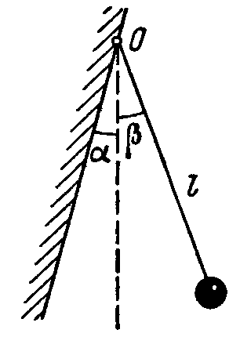

**Задача 1. Трептене на махало** (Иродов 4.20)

Математическо махало с дължина $l$ е окачено в т. О на стена, наклонена под малък
ъгъл $\alpha$ спрямо вертикалата (фиг. 1). Махалото е отклонено от равновесното му
положение на малък ъгъл $\beta$ , като $\beta > \alpha$ , и е пуснато. То достига до стената със скорост
$v$ , удря се в нея и отскача в обратна посока със същата по големина скорост. Получава
се махало, което в дясно се отклонява до ъгъл $\beta$ , а в ляво до ъгъл $\alpha$ .

а) Намерете израз за скоростта $v$ , като отчетете, че при малки ъгли
$\beta = L / l \ll 1$\*, където $L$ е дължината на дъгата, съответстваща на централния ъгъл $\beta$ ,
може да се използва приближението $\sin \beta \approx \beta$ . Запишете резултата чрез $g$ , $l$ , $\alpha$ и $\beta$ .
\[3,5 т.\]

\*Пояснение. Така дефинираният ъгъл се измерва с единицата радиан, като
$90^\circ = \pi/2$ радиана. В приближението $\sin \beta \approx \beta$ ъгълът $\beta$ се измерва в радиани.

б) Получете приближен израз за периода T на махалото. Направете числена
оценка при $\alpha/\beta = 1/ \sqrt{2}$ , ако периодът на махалото при $\alpha > \beta$ е $T_0 = 1\ \mathrm{s}$ .\[6,5 т.\]

Полезна тригонометрична формула: $2\sin^2 \varphi = 1 - cos 2\varphi .$

**Задача 2. Фотонен топлинен двигател**

Работното вещество на топлинен двигател е газ от фотони. Основна величина е
плътността на вътрешната му енергия $u (T ) = aT^4$ (вътрешната енергия на единица
обем), където $a = 4\sigma/c$ , константата на Стефан-Болцман $\sigma \approx 5, 67.10^{-8}\ \mathrm{kg/s^3 .K 4}$ , а
скоростта на светлината във вакуум $c \approx 3.10^8\ \mathrm{m/s}$ . Налягането на газа се дава с израза
$p = (1/ 3)u(T )$ . Работният цикъл на топлинния двигател включва следните процеси:
изотермно разширение 1-2 при температура $T_1$ , като обемът се увеличава два пъти,
изохорно понижаване на температурата 2-3, при което се достига температура $T2$ ,
следва изотермно свиване 3-4 до началния обем $V_1$ и цикълът се затваря с изохорния
процес 4-1. Температурите $T_1$ и $T_2$ съответстват на границите на видимия спектър
400 nm и 700 nm , за които излъчването на абсолютно черно тяло е най-интензивно.

Константата в закона на Вин е $b = 2,90.10^{-3}\ \mathrm{m.K}$

а) На $p,V $- диаграма начертайте цикъла 1-2-3-4-1.\[2 т.\]

б) Определете извършената работа $A'$ от фотонния газ за един цикъл, като я
представите чрез началния обем $V_1$ , умножен по числен коефициент.\[4 т.\]

в) Намерете полученото от газа за един цикъл количество топлина $Q_\text{пол}$ , също
представено чрез началния обем $V_1$ , умножен по числен коефициент. \[2,5 т.\]

г) Пресметнете КПД $\eta$ на топлинния двигател. \[1,5 т.\]

**Задача 3. Еднородна верижка**

Еднородна верижка с маса $m = 0, 2 kg$ и дължина $L = 75 cm$ е прикрепена към трупче с
маса $2m$ , намиращо се върху хоризонталната повърхност на плот на маса, като
половината от верижката виси от плота (фиг. 2). Коефициентът на триене между
трупчето и плота на масата е $\mu = 0,15$ , докато триенето между верижката и плота се
пренебрегва. Първоначално трупчето се удържа неподвижно, след което се пуска.

а) Намерете ускорението a на трупчето в началния момент при пускането му,
силата $T_1$ , с която верижката дърпа трупчето, и силата $T_2$ ,с която провисналата част на
верижката дърпа хоризонталната ѝ част и трупчето. \[5 т.\]

б) Определете скоростта $v$ на трупчето в момента, когато верижката е
достигнала положението, показано на фиг. 3. \[5 т.\]

При извършване на пресмятанията използвайте $g \approx 10\ \mathrm{m/s^2}$ .