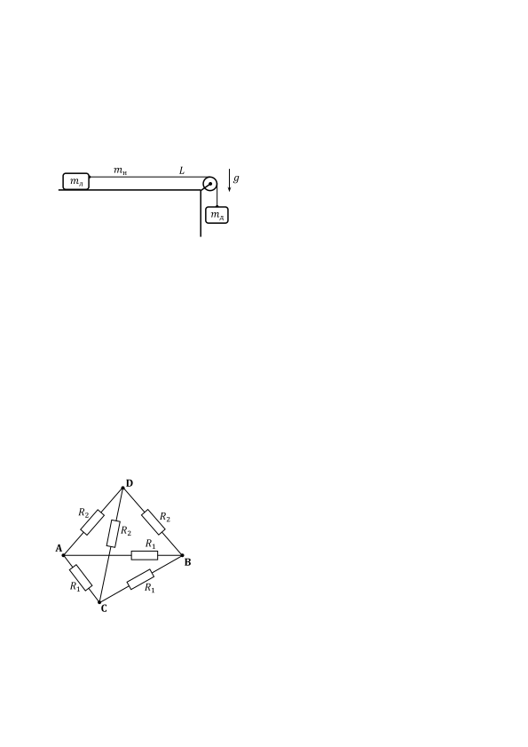

[[Състезания/3/10/2021|◂ 2021]] | [[Състезания/3/10r/2022|решения]] | [[Състезания/3/10/2023| 2023 ▸]]

**Задача 1. Теглилки на масивна нишка**

Две теглилки с неизвестни маси $m_\text{л}$ и $m_\text{д}$ са свързани с еднородна масивна неразтеглива нишка с дължина $L = 2\ \mathrm{m}$, както е показано на фигурата вляво. Нишката (с неизвестна маса $m_\text{н}$) е прекарана през неподвижно окачена безмасова макара с много малък радиус. Отношенията на масите са $m_\text{д} : m_\text{н} : m_\text{л} = 1 : 2 : 3$. Преди системата да започне да се движи, лявата теглилка се намира на неизвестно разстояние от макарата върху гладка хоризонтална повърхност. По време на движението на системата ускоренията на теглилките нарастват. В момента когато лявата теглилка се намира на неизвестно разстояние от макарата, дясната теглилка се откачва от нишката. Дадено е, че в този момент ускорението на лявата теглилка и нишката спада мигновено до първоначалното ускорение $a_\text{нач}$ на системата. След това теглилката с маса $m_\text{л}$ и нишката продължават да се движат ускорително, докато теглилката не стигне до макарата. Тогава лявата теглилка има окончателно ускорение на движение $a_\text{кр}$, равно на ускорението на системата непосредствено преди откачването на дясната теглилка. Може да използвате, че земното ускорение е $g \approx 10\ \mathrm{m/s^2}$. Съпротивлението на въздуха да се пренебрегне.

а) Определете големината на окончателното ускорение $a_\text{кр}$, с което лявата теглилка ще
стигне до макарата. \[2 т.\]

б) На колко е равно разстоянието $d'$? \[4 т.\]

в) Намерете първоначалното ускорение $a_\text{нач}$ на системата. \[2 т.\]

г) Определете първоначалното разстояние $d$ между лявата теглилка и макарата. \[2 т.\]

**Задача 2. Електрическа пирамида**

Шест резистора с неизвестни съпротивления $R_1$ и $R_2$ са свързани по начина, показан на фигурата вляво. Резисторите са разположени по ръбовете на тетраедър (триъгълна пирамида). Точките на свързване на проводниците са във върховете на пирамидата и са означени с A, B, C, D. Дадено е, че еквивалентното съпротивление между точките A и B е двойно по-малко от еквивалентното съпротивление между точките C и D.

а) Намерете отношението $R_2/R_1$. \[6,5 т.\]

б) Ако свържем идеална батерия с дадено електродвижещо напрежение между точките A и B, отделената мощност в цялата верига ще бъде $P$. Определете на колко са равни съпротивленията $R_1$ и $R_2$. \[1,5 т.\]

в) Приемете, че точките A и B са свързани накъсо. Какво съпротивление ще се измери между точките B и C в този случай? \[2 т.\]

**Задача 3. Оптическа призма**

Правилна триъгълна призма от материал с неизвестен показател на пречупване $n$ се намира във въздух с показател на пречупване $1$. Напречното сечение на призмата е равностранен триъгълник с дължина на страната $l = 10\ \mathrm{cm}$. Лазерен лъч влиза в призмата през околна стена почти под прав ъгъл (хлъзгайки се към повърхността ѝ) и успоредно на основите на призмата, както е показано на фигурата вляво. След пречупване лъчът излиза от призмата през съседна околна стена, като излезлият лъч е перпендикулярен на влизащия в призмата лъч.

а) Намерете показателя на пречупване на материала, от който е направена призмата. Може да използвате, че $\sin(\theta - \phi) = \sin\theta\cos\phi - \cos\theta\sin\phi$ за произволни ъгли $\theta$ и $\phi$. \[3,5 т.\]

б) Светлинен лъч пада върху околна стена под ъгъл $\alpha = 30^\circ$, след което минава през срещуположния ръб на призмата, както може да се види на фигурата вляво. На колко е равен ъгълът между ъглополовящата през срещуположния ръб и влезлия в призмата лъч?

Определете разстоянието $x$ от точката, където лъчът пада върху околната стена на призмата, до най-близкия ръб на призмата. \[4 т.\]

в) На колко е рaвен максималният ъгъл на падане $\alpha_{\max}$ на светлинен лъч, така че лъчът да мине през срещуположния ръб на призмата (подобно на лъча от предното подусловие)? Къде трябва да влезе лъчът в призмата при този случай? \[2,5 т.\]