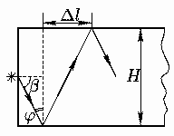
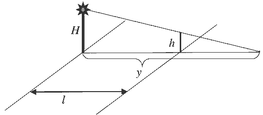
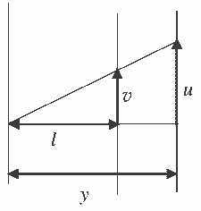
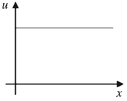
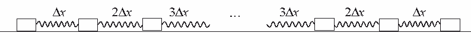

[[Състезания/3/10/2024|◂ 2024]] | [[Състезания/3/10/2025|условия]]

**Задача 1. Студени дни и работа на отоплителна печка с реле**

**А)** При изключен нагревател стаята се охлажда от $t + \Delta t/2$ до $t - \Delta t/2$ за време $T$. Отделеното от стаята в околната среда количество топлина е:
$Q = C\Delta t = \alpha(t - t_0)T,$
откъдето изразяваме времето, през което нагревателят е изключен:
(1) $T = \frac{C\Delta t}{\alpha(t - t_0)}.$ **(1 т)**

При включен нагревател стаята се загрява от $t - \Delta t/2$ до $t + \Delta t/2$ за време $\tau$. За това време нагревателят отделя количество топлина $P_0\tau$ на въздуха в стаята, а стаята губи количество топлина $\alpha(t - t_0)\tau$ в околната среда. От уравнението за топлинен баланс следва:
$C\Delta t = P_0\tau - \alpha(t - t_0)\tau,$
откъдето изразяваме времето, през което нагревателят е включен:
(2) $\tau = \frac{C\Delta t}{P_0 - \alpha(t - t_0)}.$ **(1 т)**

Нека първоначално температурата в стаята е била $t = t_1$, при което $\tau = 2T$. От уравнения (1) и (2) получаваме:
(3) $t_1 = t_0 + \frac{2P_0}{3\alpha}.$ **(1 т)**

Във втория случай, при $t = t_2$, $2\tau = T$ и отчитайки отново (1) и (2):
(4) $t_2 = t_0 + \frac{P_0}{3\alpha}.$ **(1 т)**

Като вземем предвид, че $t_1 - t_2 = \Delta \theta$, получаваме:
(5) $\frac{P_0}{\alpha} = 3\Delta \theta.$

От уравнение (3) намираме:
(6) $t_1 = t_0 + 2\Delta \theta = 16^\circ\text{C},$ **(0.5 т)**
а от уравнение (4):
(7) $t_2 = t_0 + \Delta \theta = 14^\circ\text{C}.$ **(0.5 т)**

**Б)** Нагревателят ще работи непрекъснато, ако отделената от него топлинна мощност е равна или по-малка от мощността на топлинни загуби от стаята:
$P_0 \leq \alpha(t - t_0)$ **(0,5 т)**
т.е., когато е зададена температура:
$t \geq t_0 + \frac{P_0}{\alpha}.$ **(0,5 т)**

Като вземем предвид уравнение (5), намираме:
$t_M = t_0 + 3\Delta \theta = 18^\circ\text{C}.$ **(1 т)**

**В)** От уравнения (1) и (2) в първата подточка следва, че времето между две последователни включвания на нагревателя е:
(2) $\tau + T = \frac{C\Delta t}{P_0 - \alpha(t - t_0)} + \frac{C\Delta t}{\alpha(t - t_0)} = \frac{P_0 C\Delta t}{\alpha(t - t_0)[P_0 - \alpha(t - t_0)]}$ **(1 т)**

Честотата на включванията е максимална, когато изразът $\alpha(t - t_0)[P_0 - \alpha(t - t_0)]$ в знаменателя е най-голям **(1 т)**. За удобство означаваме $x = t - t_0$. Графиката на функцията $y = \alpha P_0 x - \alpha^2 x^2$ е парабола с връх, обърнат нагоре. Върхът на параболата съответства на стойност на променливата $x_{max} = P_0 / (2\alpha) = 3\Delta \theta / 2$. Това означава, че:
$t_4 = t_0 + \frac{3}{2}\Delta \theta = 15^\circ\text{C}.$ **(1 т)**

**Задача 2.**

Максималният ъгъл на падане на лъчите от източника върху лявата повърхност е $\alpha_{max} = 90^\circ$. От закона на Снелиус следва, че максималният ъгъл $\beta_{max}$ на пречупване при навлизане в пластината е такъв, че:
$\sin \beta_{max} = \frac{1}{n}$ **(0,5 т)**
т.е. $\beta_{max}$ съответства на граничния ъгъл за пълно вътрешно отражение между стъклото и въздуха. Съответно минималният ъгъл на падане на лъчите върху горната/долната повърхност е:
$\varphi_{min} = 90^\circ - \beta_{max}$ **(0,5 т)**

Понеже $n = 1,73 > \sqrt{2}$, следва, че:
$\sin \beta_{max} < \frac{1}{\sqrt{2}}$ **(0,5 т)**
Съответно $\beta_{max} < 45^\circ$ **(0,5 т)** и $\varphi_{min} > \beta_{max}$ **(1 т)**. Следователно всички лъчи, падащи върху горната или долната повърхност ще претърпят пълно вътрешно отражение **(1 т)**.

Минималното разстояние $\Delta l$ в хоризонтална посока между две съседни отражения на лъчите от противоположните стени е:
$\Delta l_{min} = H \text{ tg } \varphi_{min} = H \frac{\cos \beta_{max}}{\sin \beta_{max}} = H \sqrt{n^2 - 1}.$ **(1 т)**

Ако $N$ е броят отражения на даден лъч, то:
$(N + \frac{1}{2})\Delta l_{min} \leq L$

Добавката (1/2) се получава защото преди първото отражение лъчът изминава от лявата повърхност разстояние $\Delta l/2$ в хоризонтална посока. Максималният брой отражения е най-голямото цяло число, за което е в сила горното неравенство. Следователно:
$N = \left\lfloor \frac{L}{\Delta l_{min}} - \frac{1}{2} \right\rfloor = \left\lfloor \frac{L}{H\sqrt{n^2 - 1}} - \frac{1}{2} \right\rfloor.$ **(1 т)**

Като заместим с числените данни, получаваме:
$N = 69$ **(0,5 т)**

**Част 2. Поглед отстрани:** Да проверим с каква скорост се движи сянката по направление перпендикулярно на тротоара. За тази цел използваме подобни триъгълници:
$\frac{y - l}{y} = \frac{h}{H}$ **(0,5 т)**
$y = \frac{lH}{H - h} = const$ **(0,5 т)**
т.е. няма преместване в това направление и следователно скорост на сянката в тази посока е равна на нула.

**Поглед отгоре:** Да изследваме скоростта на сянката в направление правата, свързана с тротоара. Нека Иван се е преместил на разстояние $x$ по тротоара, а сянката му на разстояние $s$. От подобни триъгълници следва:
$\frac{x}{s} = \frac{l}{y}$ **(0,5 т)**

Като използваме полученото за $y$ и след елементарни математически преобразувания:
$s = \frac{xH}{H - h}$ **(0,5 т)**

След почленно деление на интервал от време $t$:
$u = \frac{vH}{H - h} = const$ **(1 т)**

**Б)** Графиката $u = u(x)$ е права успоредна на абсцисната ос **(0,5 т)**.

**Задача 3. Пружини**

**Част 1.**
**А)** Понеже имаме 20 кубчета това означава, че те са свързани с 19 пружини. **(0,5 т)**
**Б)** За да се намира едно от тяло в покой, в контекста на задачата, е необходимо „еквивалентната“ сила на еластичност да е равна на силата на триене.
$F_1 - F_2 = k \cdot (\Delta x_1 - \Delta x_2) = \mu mg,$ **(1 т)**
където $\Delta x_1, \Delta x_2$ са деформациите на двете пружини. Поради това максималното удължение на последните крайни пружни (крайна лява и крайна дясна) е:
$\Delta x = \frac{\mu mg}{k}$ **(0,5 т)**

За вторите крайни (втора пружина от дясната страна на веригата и втора лява от лявата страна на веригата) е $2\Delta x$, за третите $3\Delta x$ и т.н. **(0,5 т)**

Понеже имаме 20 тела това означава, че разполагаме с 19 пружини, т.е. 9 двойки плюс една пружина. Максималната сумарна деформация на пружините е:
$\Delta l = 2(\Delta x + 2\Delta x + 3\Delta x + \dots 9\Delta x) + 10\Delta x$ **(0,5 т)**

Използваме формулата:
$1 + 2 + 3 + \dots + N = \frac{N(N + 1)}{2}$

Максималната сумарна деформация е:
$\Delta l = 90\Delta x + 10\Delta x = 100\Delta x$ **(0,5 т)**

Максималната дължина на веригата е:
$l = 19l_0 + 100\frac{\mu mg}{k}$ **(0,5 т)**

**Част 2.**
**А)** Нека разгледаме малък интервал от време $\Delta t$. Понеже макарата се движи с постоянна скорост $v$, то за този интервал от време ще се придвижи надолу $\Delta x = v\Delta t$. Тогава общата деформация на всички пружини трябва да бъде $2\Delta x$. От друга страна пружините се разтеглят с еднаква сила и следователно деформацията на всяка отделна пружина е обратнопропорционална на коефициента на еластичност. Това означава, че пружината с коефициент на еластичност $k$ ще се разтегли с $\Delta x_1$, пружината с $2k$ ще се разтегли $\Delta x_1/2$, пружината с $3k$ ще се разтегли с $\Delta x_1/3$. **(0,5 т)** Поради това:
$\Delta x_1 + \frac{\Delta x_1}{2} + \frac{\Delta x_1}{3} = 2v\Delta t$ **(1 т)**
$\Delta x_1 = \frac{12}{11}v\Delta t$ **(0,5 т)**

От друга страна преместването на т. А за разглеждания интервал от време е равно на деформацията на пружините $k$ и $2k$.
$\Delta x_A = \Delta x_1 + \frac{\Delta x_1}{2} = \frac{3\Delta x_1}{2} = \frac{18}{11}v\Delta t$ **(0,5 т)**
$v_A = \frac{18v}{11}$ **(0,5 т)**
Скоростта е постоянна с времето.

**Б)** Тъй като макарата се движи равномерно, във всеки момент външната сила $F$ трябва да уравновесява удвоената сила $T$ на опън на нишката:
$F = 2T$ **(1 т)**

В момента $t$ след началото на движението макарата се е преместила с $vt$, а пружината с коефициент на еластичност $k$ се е разтегнала с:
$\Delta x_1 = \frac{12}{11}vt$ **(0,5 т)**

Силата на опън на всички нишки е еднаква и равна на силата на еластичност на разтегнатите пружини:
$T = k\Delta x_1 = \frac{12kvt}{11}$ **(0,5 т)**

Следователно външната сила е:
$F = \frac{24kvt}{11}$ **(0,5 т)**
Силата $F$ трябва да нараства линейно с времето $t$. **(0,5 т)**