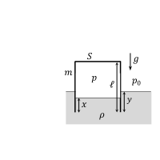
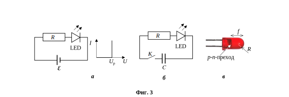

[[Състезания/3/10-12/2019|◂ 2019]] | [[Състезания/3/11-12r/2020|решения]] | [[Състезания/3/11-12/2021| 2021 ▸]]

**Задача 1. Хари Потър играе магьосническата игра "куидич"**

Магьосническата игра "куидич" представлява вид баскетбол, но вместо играчите да са на земята, те летят на летящи магьоснически метли. Хари Потър се намира на височина a от земята с неговата магьосническа метла ("Нимбус 2000" - най-бързата на света по това време). Той вижда своя съотборник - Фред Уизли, на височина b от земната повърхност (b > a). Фред се намира на разстояние l от Хари, мерено по хоризонталата, тоест проекциите на Хари и на Фред върху земната повърхност се намират на разстояние l една от друга. Хари подава топката (специална топка, която се казва "куофъл") на Фред.

(a) Изберете координатна система и в нея напишете закона за пътя и за скоростта на
 движение на куофъла, ако Хари го е хвърлил под ъгъл $\alpha$ с начална скорост v0.
 Считаме, че никаква магия не действа върху куофъла, докато той се движи, а
 единствено законите на физиката, вблизост до земната повърхност със земно
 ускорение g. \[2 т.\]

(b) Ако куофълът попада точно при Фред, а Фред не се е преместил от началното си
 положение, изразете скоростта на куофъла, с която Хари го е хвърлил, чрез $\alpha$, a,
 b и l. \[4 т.\]

(c) От получения израз намерете минималната скорост, с която Хари трябва да
 хвърли куофъла, така че той да попадне точно при Фред. \[4 т.\]
 Упътване: В зависимост от начина на решение можете да намерите максимума
 (минимума) на израз от вида A sin(x) - B cos (x), като го умножите и разделите
 на $\sqrt {A^2 + B^2}$ и отчетете, че съществува ъгъл $\theta$, такъв че $\tan(\theta) = \frac{B}{A}$. По този
 начин: $A \sin(x) - B \cos(x) = \sqrt {A^2 + B^2} \sin (x - \theta)$.

(d) Докажете, че ъгълът на хвърляне при тази минимална скорост е равен на
 половината от тъпия ъгъл, който сключва правата между Хари и Фред с
 вертикалата. \[3 т.\]

(e) Разгледайте частния случай, когато b = a, тоест Хари и Фред летят на една и
 съща височина. Колко е ъгълът $\alpha$ тогава, ако Хари е хвърлил куофъла с
 минималната скорост за да достигне той Фред? \[2 т.\]

**Задача 2. Трептене на варел**

Празен цилиндричен варел с тънки стени, височина l = 1 m, площ на дъното S = 0,5 m2 и маса m = 100 kg е обърнат с отвора надолу и е поставен вертикално в морето, както е показано на фигурата вляво. Изминало е достатъчно дълго време от пускането на варела във водата, така че да се установи термодинамично равновесие. Плътността на морската вода е $\rho = 10^3$ kg/m3 . Приемете, че температурата на водата съвпада с температурата на въздуха извън варела. Атмосферното налягане e $p_0 = 10^5$ Pa. Приемете, че земното ускорение е g = 10 m/s2 . Повърхностното напрежение на водата да се пренебрегне.

а) Колко е равновесното налягане p на въздуха във варела? \[2 т.\]

б) Намерете височината x на водния стълб във вътрешността на варела след
установяването на термодинамично равновесие. \[2 т.\]

в) Определете до каква равновесна дълбочина y ще бъде потопен варелът във водата.
\[2 т.\]

г) Намерете периода T на малките вертикални трептения на варела, като знаете, че за
един период топлообменът между въздуха във варела и околната среда е пренебрежим. Съпротивлението на въздуха и образуването на вълни също да се пренебрегнат. \[6 т.\]

д) Каква сила F трябва да приложим върху дъното на варела, така че то да се изравни с повърхността на морето? Приемете, че въздухът във варела е отново в термодинамично равновесие с морската вода. \[3 т.\]

Упътване: Използвайте, че уравнението на състоянието на въздух при адиабатен
процес е $pV^{7/5}$ = const, където p е налягането на въздуха, а V е обемът на въздуха.
Също така е изпълнено, че $(1 + \alpha)^n \approx 1 + n\alpha$, ако |$\alpha$| $\ll$ 1.

**Задача 3. Светодиод**

Светодиодът (означен като LED на фиг. 3, а) е полупроводников диод, който
излъчва светлина, когато е включен в права посока. Излъчването е резултат от
рекомбинацията (взаимно неутрализиране) на свободните електрони и дупките в p-n-
прехода. На фигурата е дадена и идеализирана волтамперна характеристика на
светодиода. Когато напрежението U е по-малко от определено работно напрежение $U_p$, диодът не свети, а токът I през него е значително по-малък от нормалния работен ток. Диодът започва да свети при $U \ge U_p$ и тогава токът нараства толкова бързо, че при дадения мащаб волтамперната характеристика е практически вертикална права.
Приемете, че при $U \ge U_p$ работата на тока в светодиода се трансформира изцяло в
енергия на излъчената светина.

а) Светодиод с работно напрежение $U_p$ = 2,5 V е свързан към батерия с ЕДН $\mathcal E$ = 4,5 V
и с пренебрежимо вътрешно съпротивление по схемата, показана на фиг. 3, а.
- Колко трябва да бъде съпротивлението R на резистора, така че светодиодът да
 излъчва светлина с мощност P = 50 mW?
- Колко е коефициентът $\eta$ на полезно действие* на тази електрическа верига? \[5 т.\]

б) На фиг. 3, б e показана схема на фотографска светкавица, използваща светодиод с
работно напрежение $U_p$ = 3,0 V. Съпротивлението на резистора е R = 300 $\Omega$, а
капацитетът на кондензатора - C = 200 $\mu$F. Първоначално кондензаторът е зареден до
напрежение $U_0$ = 5 V и се разрежда през светодиода след затваряне на ключа К.
- Определете енергията Е на излъчения светлинен импулс.
- Намерете коефициента $\eta$ на полезно действие на светкавицата.
- До какво начално напрежение трябва да бъде зареден кондензаторът така, че КПД
 на светкавицата да бъде максимален? \[5 т.\]

в) p-n-преходът, където става излъчването, е с толкова малки размери, че може да се
разглежда като точков източник на светлина. За да се получи насочен светлинен сноп, p-n-преходът в светодиода е капсулиран в прозрачен цилиндричен пластмасов корпус, завършващ със сферична повърхност с радиус R (фиг. 3, в). На какво разстояние f от върха на сферичната повърхност трябва да се намира p-n-преходът така, че лъчите, излъчени под малък ъгъл спрямо оста на корпуса, да формират практически успореден сноп, когато напуснат светодиода? Приемете, че показателят на пречупване на пластмасовия корпус е n = 1,5, а на въздуха - единица. \[5 т.\]
* Коефициентът на полезно действие в случая се дефинира като отношение на
излъчената от светодиода светлинна енергия към общата енергия, отделена в
електрическата верига.

Полезна математика: $\sin(\alpha \pm \beta) = \sin \alpha \cos \beta \pm \cos \alpha \sin \beta$. При сравнително малки
ъгли са в сила приблизителните равенства: $\tan \alpha \approx \sin \alpha \approx \alpha$, когато $\alpha$ е изрзен в
радиани.

Задача 4. Физика и техника на ниските температури

В техниката на ниските температури голям проблем е поддържането на ниска температура на едно тяло поради топлообмена с околните тела, имащи по-висока температура. Този топлообмен може да се намали с така наречените "топлинни екрани". Ще разгледаме прост модел на две безкрайни успоредни равнини (тела).
Пространството между тях е вакуумирано и те си обменят топлина само чрез топлинно излъчване. По-топлата равнина се поддържа при температура TH , а по-студената - при температура TL . Нека резултантната получена топлина на единица площ за единица време от по-студената равнина е S(0). Между тези две равнини се вмъкват N допълнителни равнини (тела), успоредни на двете тела. Те се наричат топлинни екрани. След достатъчно дълго време температурите на екраните престават да се променят. В тази ситуация резултантната получена топлина на единица площ за единица време от по-студената равнина е S(N). Всички тела излъчват и поглъщат топлина като абсолютно черни тела.

а) Получете формула за отношението S(0)/S(N). \[4 т.\]

б) Ако N = 2, получете формула за температурите T1 и T2 на двата топлинни екрана 1 и
2 (T1 > T2 ). \[2 т.\]

в) Изчислете стойностите на температурите T1 и T2 от подточка б), ако TH = 300 K, a
TL = 77,4 K. \[1 т.\]

Нека сега разгледаме една по-реалистична ситуация. Охлажданото тяло е плътно медно кълбо с радиус $r_L$ = 10,0 cm. То е поставено в кухината на криостат (хладилник) с температура $T_H$ = 300 K, която също има форма на кълбо, като радиусът на кухината на криостата $r_H$ е много близък до този на медното кълбо ($r_H - r_L \ll r_L$). Пространството между тях е вакуумирано. Медното кълбо се охлажда за сметка на погълнатата топлина при кипенето на течен азот, като температурата му $T_L$ не се променя и съвпада с тази на температурата на кипене на азота, $T_L = T_{liqN_2} = 77,4$ K (т.е. в медното кълбо влиза течен азот, а излиза газ азот при същата температура. Кухините в него, по които минава азотът, имат пренебрежим обем).

г) Изчислете консумацията ($\frac{\Delta V}{\Delta t}$, $\frac{l}{h}$, в литри за час) на течен азот за поддържане на
ниската температура на тялото. \[2 т.\]

д) Изведнъж охлаждането с течен азот спряло и тялото започнало да се стопля. Ако за $\Delta$t = 10 минути температурата му се е повишила с $\Delta$T = 4,55 K, изчислете специфичния топлинен капацитет c(77,4 K) на медта при тази температура. Приемете, че температурата в целия обем на медното кълбо винаги е една и съща и че специфичният топлинен капацитет е константа в този температурен интервал. \[2 т.\]

| T, K | c(T), J/kg.K |
| ---- | ------------ |
| 2,0  | 0,0278       |
| 3,0  | 0,0530       |
| 4,0  | 0,0916       |
| 5,0  | 0,148        |
| 6,0  | 0,228        |
| 7,0  | 0,335        |
| 8,0  | 0,474        |
| 9,0  | 0,651        |
| 10,0 | 0,873        |

Оказало се, че така измереният специфичен топлинен капацитет на медта при тази температура е по-малък от този при стайна температура. Измерванията му при още по-ниски температури показали, че той продължава да намалява с намаляването на температурата. При много ниски температури той зависи от температурата така: $c(T) = a. T + b. T^3$ . Теорията обяснява тази зависимост по следния начин: линейният член се дължи на топлинния капацитет на свободните електрони (електронния газ в метала), а кубичният - на топлинния капацитет на атомните трептения (механичните вълни, разпространяващи се в кристалната решетка на медта). Експерименталните данни за специфичния топлинен капацитет на медта при много ниски (хелиеви) температури са дадени в таблицата вдясно.

е) Като изполвате приложената графична хартия, изчислете графично константите a и b. \[4 т.\]

Фундаментални и материални константи :

константа на Стефан-Болцман $\sigma = 5,67. 10^{-8}\ \mathrm{W.m^{-2}.K^{-4}}$

специфична топлина на изпарение на течния азот $\lambda = 2,01.10^5\ \mathrm{J/kg}$

плътност на течния азот $\rho_{N_2} = 808\ \mathrm{kg/m^3}$

плътност на медта $\rho_{Cu} = 8960\ \mathrm{kg/m^3}$