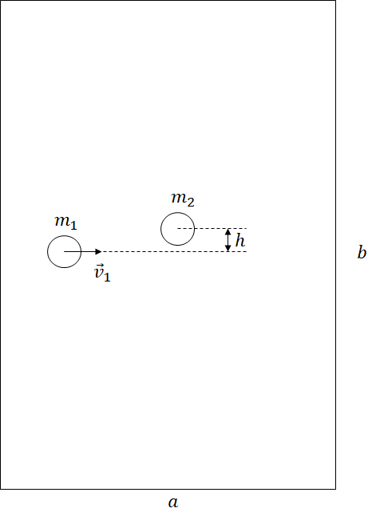
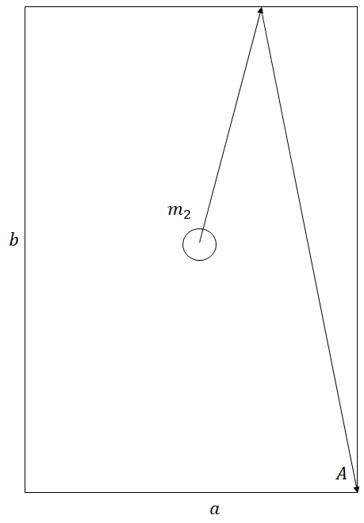
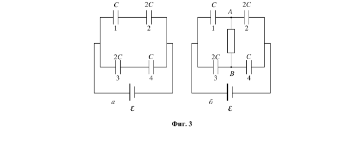
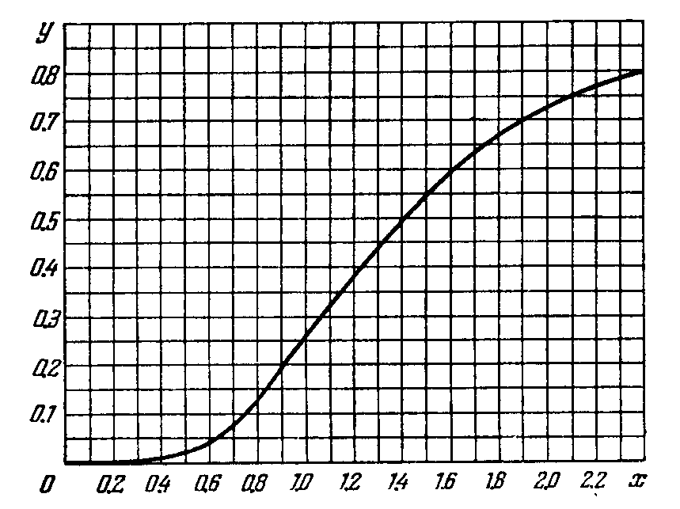

Задача 1. Удар между билиардни топки

 Върху билиардна маса с рамери а и b са разположени две билиардни топки с маси
m1 и m2 , както е показано на фиг. 1. Всяка от топките има радиус R. Разстоянието между
центровете на топките, мерено по вертикалата е h, както е показано на фиг. 1, като h < 2R.
Топката с маса m1 се движи хоризонтално със скорост v1 към неподвижната топка с маса
m2 . Ако считате топките за абсолютно твърди тела и взаимодействието между топките
почти мигновено, намерете:
а) ъгъла $\alpha$ на отскачане на топката с маса m2 след удара спрямо хоризонталната линия (т.е.
спрямо посоката на v1 ). Считайте, че силите на взаимодействие между топките са
централни, т.е. по време на краткия удар силите, с които топките си взаимодействат сочат
по линията, свързваща центровете им. \[1 т.\]

 1
б) големините на скоростите на топките след удара v1' и v2' \[3 т.\]

в) ъгъла $\beta$ на отклонение на топката с маса m1 спрямо хоризонталната ос. Докажете, че ако
 $\pi$
m1 = m2 , то $\alpha$ + $\beta$ = (всички ъгли да се изразят в радиани). \[2 т.\]
 2
 a
г) При какво отношение топката с маса m2 ще се удари в горния ръб на билярдната маса
 b
и ще влезе в джоба (точка А), както е показано на фиг. 2. \[2 т.\]
д) Нека m1 = m и m2 = m (1 - $\varepsilon$ ) , като 0 < $\varepsilon$ 1 , т.е. двете топки са с различни, но почти
 $\pi$
равни маси. Тогава $\beta$ = - $\alpha$ + $\Delta\beta$ , където $\Delta\beta$ е малък ъгъл. Да се намери $\Delta\beta$ , като се
 2
пренебрегнат събираеми от втора и по-висока степен на $\varepsilon$, т.е. , членовете пропорционални
на $\varepsilon$ 2 , $\varepsilon$ 3 ,... се приемат за нула.
Упътване: Използвайте приблизителните формули при x 1: cos x $\approx$ 1 , sin x $\approx$ x (ако x е в
радиани) и (1 - x ) $\approx$ 1 - nx .
 n
 \[3 т.\]

e) Нека сега h = 0 и топката с маса m2 се движи в противоположна посока на v1 със скорост
с големина v 2 . Да се намерят скоростите на топките след челен абсолютно еластичен удар.
 \[4 т.\]

Задача 2. Верига с кондензатори
а) Четири кондензатора, номерирани от 1 до 4, са свързани към източник с ЕДН $\mathcal E$, както е
показано на фиг. 3, а. Капацитетите на кондензаторите са означени на схемата. Определете
заряда върху всеки от кондензаторите. \[4 т.\]

б) Между точките A и В от схемата е свързан резистор с неизвестно съпротивление, както е
показано на фиг. 3, б. Определете заряда qR , който преминава през резистора, докато във
веригата отново се установи равновесие. В каква посока се пренася зарядът през резистора
- от А към В или от В към А? \[6 т.\]
в) Определете количеството топлина Q, което се отделя в резистора, докато през него
протича заряд. Съпротивлението на съединителните проводници във веригата и вътрешното
съпротивление на източника се пренебрегват. \[5 т.\]
Задача 3. Квантови свойства на светлината
Част А. Топлинно лъчение
На фиг. 4 е показана графиката на функцията y ( x) , която показва частта от пълната енергия
на топлинното лъчение, излъчена в спектралния интервал от 0 до x . Тук x = $\lambda$/$\lambda$ max , където
$\lambda$ max е дължината на вълната, съответстваща на максимума на излъчената енергия. По
графиката определете:
 а) дължината на вълната $\lambda$ 0 , която разделя при температура T0 = 3700 K излъчената
енергия на две равни части. \[1 т.\]
 б) частта от пълната излъчена енергия при температура Т = 5000 K , която
съответства на видимата област от 400 nm до 700 nm .
 -3
 При извършване на пресмятанията приемете константата на Вин b $\approx$ 2,90.10 m.K.
[2,25 т.]
 в) Колко пъти излъчената енергия при температура T = 5000 K с дължина на
вълната $\lambda \geq$ 700 nm е по-голяма от тази, излъчена при T0 = 3700 K . \[1,75 т.\]

 
 Фиг. 4

Част Б. Налягане на светлината
Върху плоска повърхност на стъклена пластина с показател на пречупване n = 1, 5 от вакуум
пада, перпендикулярно на повърхността, монохроматичен светлинен сноп с интензитет
J = 100 kW/m 2 . Скоростта на светлината във вакуум е c = 3, 0.108 m/s .
 а) Като използвате сведения за единиците на физичните величини, запишете най-общ
израз за налягането P върху стъклената повърхност. \[3 т.\]
 б) При достигане на стъклената повърхност падащият светлинен сноп се
трансформира в отразен сноп и в преминал сноп (стъклото е прозрачна среда, в която
поглъщането на лъчение се пренебрегва). Като използвате квантовите представи за
светлината, т. е. светлинният сноп е съвкупност от фотони с определена енергия и импулс,
определете силата f (по посока и големина), която действа на единица площ от
разделителната стъклена повърхност. За целта намерете изменението на общия импулс на
светлинния сноп след взаимодействието му със стъклената повърхност, като отчетете, че
коефициентът на отражение от нея е
 ⎡ n -1 ⎤
 2

 R=⎢ ⎥ , \[7 т.\]
 ⎣ n +1⎦
т. е. с вероятност R фотон се отразява от стъклената разделителна повърхност.

Задача 4. Бета-разпадане на неутрона
Когато неутронът е свободен (извън ядро), той е нестабилен. Неговото време на
полуразпадане е 611 s, като той се разпада на протон, електрон и антинеутрино:
$^1_0n\to^1_1p+e^-+\tilde\nu_e$.
Първоначално съществуването на (анти)неутриното не е било известно. В тази задача като
единица за енергия да се използва MeV, за импулс - MeV/c (c - скоростта на светлината във
вакуум), за скорост - единици c, а за маса - MeV/c 2
Част А
Нека допуснем, че антинеутрино не съществува и неподвижен неутрон се разпада само на
протон и електрон.
а) Получете формула и изчислете стойността на импулса pe на електрона, получен при
реакцията на разпадане. \[3 т.\]
б) Получете формула и изчислете стойността на пълната енергия Ee и на кинетичната
енергия Ekin e на електрона, получен при разпадането на неутрона. \[2.5 т.\]
в) Получете формула и изчислете стойността на скоростта vp на протона (в единици c и в
m/s), получен при разпадането. \[2.5 т.\]

Част Б

Нека сега разгледаме реалната ситуация, когато при разпадането на неподвижен неутрон се
получава протон, електрон и антинеутрино (приемете, че масата на покой на неутриното е
нула).
г) Определете възможната минимална кинетична енергия Ekin e min и възможната
максимaлна кинетична енергия Ekin e max на електрона при това разпадане. \[1 т.\]
д) Разгледайте частния случай 1, когато след разпадане електронът остава неподвижен.
Колко е енергията E$\nu$1 на антинеутриното и колко е скоростта на протона vp1 (в единици c
и в m/s)? \[3 т.\]
e) Разгледайте частния случай 2, когато след разпадане протонът остава неподвижен. Колко
е енергията E$\nu$2 на антинеутриното и колко е скоростта на електрона ve2 (в единици c и в
m/s)? \[3 т.\]
Фундаментални и материални константи и полезни формули :
маса на неутрона mn = 939,5656 MeV/c2
маса на протона mp = 938,2723 MeV/c2
маса на електрона me = 0,510999 MeV/c 2
скорост на светлината c = 2,99792458.108 m/s
Формули от релативистката механика:
Ако m0 е масата на покой на едно тяло, m - релативистката му маса, E0 е енергията му на
покой, E - пълната му релативистка енергия, Ekin е неговата кинетична енергия, p -
релативисткия му импулс, а v - скоростта му, то:
 m0
m= 2
 ; E0 = m0 c 2 ; p = mv ; E 2 = E0 2 + p2 c 2 ; Ekin = E - E0
 $\sqrt$1-(v)
 c

 5
