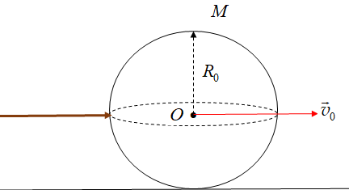
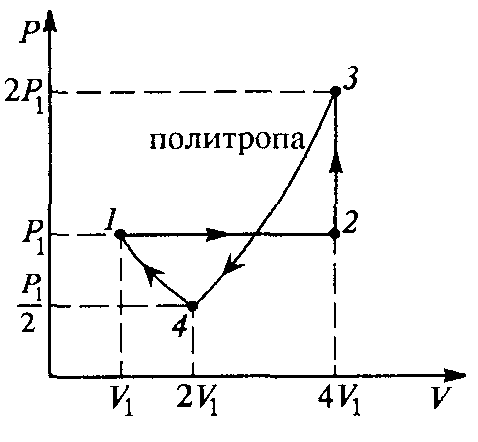
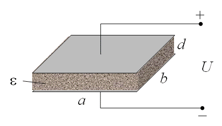

Задача 1. Теория на билиардните топки
 Да разгледаме удар на билиардна топка с щека. Масата на топката е M , радиусът ѝ
е R0 , началната скорост на центъра O на масате на топката веднага след удара е v0 , а
коефициентът на триене при хлъзгане е k , земното ускорение е g. Инерчният момента на
 2
топката спрямо ос, минаваща през центъра на масита O е I = MR02 . Топката се намира
 5
върху хоризонтална повърхност. По време на удара щеката упражнява върху топката за
много кратко време сила, насочена успоредно на щеката.

Фиг. 1

Фиг.2
а) Централен удар. Нека по време на удара щеката е насочена хоризонтално към центъра
O на топката, както е показано на фиг. 1. Да се определи след колко време $\tau$0 , топката ще
започне да се търкаля без хлъзгане. Каква е скоростта v на топката в този момент? \[3 т.\]
б) Нецентрален удар. Нека по време на удара щеката е насочена хоризонтално, но на
височина h над хоризонталната екваториална равнина на топката, както е показано на
фиг. 2. Да се намери височината h0 , при която веднага след удара топката започва да се
търкаля без хлъзгане. \[3 т.\]
в) Да се определи след колко време $\tau$1 топката ще започне да се търкаля без хлъзгане, ако
h > h0 . Да се намери скоростта v1 на центъра на масата O на топката в този момент. \[4 т.\]

г) Да се определи след колко време $\tau$ 2 топката ще започне да се търкаля без хлъзгне, ако
h < h0 . Да се намери скоростта v2 на центъра на масата O на топката в този момент. \[4 т.\]

д) Опишете качествено какво би се случило в случаите в) и г), ако преди билярдната топка
да започвне да се търкала, се удари с друга билярдна топка със същата маса M, намираща
се в покой. Приемете, че между двете топки не действат сили на триене.
 Опишете движението на двете топки и когато h < 0 , т.е. щеката удря първата топка
под централната хоризонтална екваториална равнина. \[1 т.\]

Задача 2. Топлинна машина

Задачата се състои от две независими части.

Част А.

Работното вещество на топлинна машина е един mol
двуатомен идеален газ. Работният цикъл на машината е
показан на фиг. 2. Той включва следните по вид процеси: 1-2
изобарен, 2-3 изохорен, 3-4 политропен*, 4-1 изотермен. За
политропния процес с идеален газ е в сила съотношението
PV n = const , където:
 C -C
 n= P .
 CV - C 

Фиг. 2

Тук C е топлинният капацитет на газа при политропния процес, а CP и CV са топлинните
капацитети съответно при изобарния и при изoхорния процес.
 а) Пресметнете стойността на C . \[2,5 т.\]
 б) Докажете какъв по вид е работния цикъл - цикъл за работа на топлинен двигател
или цикъл за работа на хладилна машина (топлинна помпа). \[5,5 т.\]
 в) Определете, в зависимост от доказаното в пункт б), или възможния КПД $\eta$ на
топлинния двигател или коефициентите на ефективност $\varphi$ на хладилника и $\psi$ на
топлинната помпа. \[2 т.\]
*Пояснение. Политропен се нарича всеки процес с идеален газ, при който топлинният
капацитет C на газа е постоянен, т.е. C = const .

Част Б. Оценете максималната работа Wmax , която може да се получи, ако топлинен
двигател използва като охладител айсберг с обем V = 1 km3 и плътност $\rho$ = 0,9 g/cm3 , а
като нагревател - водата в океана. Приемете, че специфичната топлина на топене на леда е
$\lambda$ = 335 kJ/kg , температурата на айсберга е 0$^\circ$C , а температурата на водата в океана е
20$^\circ$C . \[5 т.\]

Задача 3. Диелектрик в електростатично поле
 Кондензатор се състои от две успоредни правоъгълни метални плочи със страни
a = 2,0 cm и b = 1,0 cm, намиращи се на разстояние d = 1,0 mm една от друга. Между
плочите е поставена правоъгълна пластинка от диелектрик с относителна диелектрична
проницаемост $\varepsilon$ = 5,0 , която заема изцяло пространствотно между плочите (фиг. 3, а).

Пластинката може да се хлъзга без триене в направление на страната a. Плочите на
кондензатора са свързани към източник на постоянно напрежение U = 100 V.
а) Запишете израз и пресметнете капацитета C0 на така конструирания кондензатор. \[2,0 т\]
б) Диелектричната пластинка е отместена на разстояние x успоредно на страната a (x < a),
както е показано на фиг. 3, б. Получете израз за капацитета C(x) на кондензатора като
функция на отместването на пластинката. \[2,0 т\]
в) В началото диелектричната пластина е поставена изцяло в кондензатора (вж. фиг. 3, а),
след което е извадена напълно от него. Какво количество заряд минава през източника
на напрежение при изваждането на пластинката? Направете и схема на електрическата
верига, като означите посоката, в която минава зарядът през източника. \[3,0 т\]
г) При изваждане на пластината от кондензатора, върху нея действа постоянна
електрична сила F , която се стреми да я "върне" обратно в кондензатора (вж. фиг. 3, б).
Получете израз за големината F на тази сила и я пресметнете числено. \[5,0 т\]
Упътване. Връщащата електрична сила е резултат от взаимодействието между зарядите
върху плочите на кондензатора и електричните диполи в диелектрика. Затова
непосредственото пресмятане на F чрез закона на Кулон е сложна задача. Вместо това
проследете енергетичните промени, които настъпват в електрическата верига при
изваждането на диелектричната пластинка от кондензатора.
д) Две вертикални успоредни метални плочи са частично потопени в съд с машинно
масло. На каква максимална височина h може да се издигне маслото между плочите, ако
към тях бъде приложено електрично напрежение, както е показано на фиг. 3, в? \[3,0 т\]
Плътността на маслото е $\rho$ = 900 kg/m3 , а относителната му диелектрична проницаемост е
$\varepsilon$ = 2,5 . Полето на електричен пробив на въздуха е Eв = 3,0.106 V/m, а на маслото -.
Eм = 1,5.107 V/m Земното ускорение е. Капилярните сили, действащи на маслото се
пренебрегват. Приемете, че маслото не може да достигне горния ръб на плочите.

Фиг. 3 а

Полезнни константи:
 - електрична константа (проницаемост на вакуума), $\varepsilon_0$ = 8,85.10-12 F/m ;
 - земно ускорение, g = 9,8 m/s2.

Задача 4. "Воден" експеримент на Физо (Fizeau)
а) Използвайки дадените Лоренцови трансформации, получете релативисткия закон за
събиране на скоростите.
Лоренцови трансформации:

 , , където и са координатите на едно събитие в системите

 и . се движи спрямо със скорост в посока ( ). Скоростите на движещо се
тяло в двете системи бележете с и . е скоростта на светлината във вакуум. \[3 т\]
б) Получете приближена релативистка формула за събиране на скоростите, когато ,
но и са релативистки скорости. \[3 т\]
в) В средата на XIX век е проведен експеримент, проверяващ стойността на скоростта на
светлината в движещи среди,
изследвайки промяната на една
интерференчна картина. Принципната
схема на експеримента е дадена на
фигурата. Сноп светлина от източник се
разделя от полупрозрачното огледало BS.
След това с помощта на огледало M двата
снопа преминават по две еднакви тръби,
по които тече вода със скорост . В
горната тръба светлината се движи срещу
течението на водата, а в долната - по течението на водата. След това с помощта на още
едно огледало M и още едно полупрозрачно огледало BS двата снопа се събират отново.
Образуваната интерференчна картина се наблюдава с око. Интерференчната картина
представлява успоредни максимуми и минимуми с различна интензивност, като лесно се
разпознава нулевият максимум (най-яркият) и неговото положение. Показателят на
пречупване за неподвижна вода е . Получете ефективните показатели на пречупване и
 за светлината в движещата се вода в долната и горната тръба, изразени чрез и .
\[2 т\]
г) Нека дължината на хоризонталните части на тръбата (там където минава светлината) е
 . Приемете, че опитът се прави с монохроматична светлина с дължина на вълната (това
е дължината на вълната във вакуум). При каква скорост на водата в тръбите
интерференчната картина ще се измести на максимума в сравнение със случая на
неподвижна вода. \[4 т\]
д) Какво ще бъде изместването на интерференчната картина, ако водата тече в обратна
посока - картината ще се измести в същата посока или в противоположна посока? \[1 т\]
e) Нека 1,50 m, 3,00.108 m/s, 500 nm, 1,333. Изчислете при каква скорост
 на водата интерференчната картина ще се измести с 1 максимум. \[2 т\]

 4
