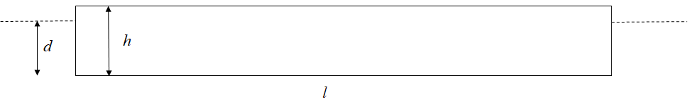
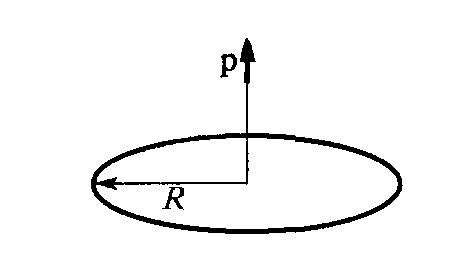

[[Състезания/3/11-12/2022|◂ 2022]] | [[Състезания/3/11-12r/2023|решения]] | [[Състезания/3/11-12/2024| 2024 ▸]]

**Задача 1. Падъл**

Момче с маса m седи по средата на падъл (плаваща дъска) с дебелина $h$,
дължина $l$ и широчина $w$ (в направление, перпендикулярно на чертежа). Момчето
държи тежка медицинска топка с маса m1 . Плътността на дъската (падъла) е $\rho_0$ , а
плътността на водата е $\rho$ . Във всички части от задачата приемете, че: 1) дъската е
достатъбно дебела и горната ѝ повърхност винаги остава над водата; 2) силата на
съпротивление, с която водата действа на падъла, се пренебрегва.

а) Като направите баланс на силите отделно върху системата "момче-топка" и отделно върху дъската, намерете дълбочината $d$, на която потъва дъската. \[4 т\]

б) Момчето хвърля топката към предния край на дъската от нулева височина спрямо
горната ѝ повърхност. Векторът $\vec v_1$ на началната скорост на топката спрямо брега
сключва ъгъл ъгъл $\theta$ с хоризонта. При каква максимална големина $v_{1\max}$ на началната
скорост топката ще падне върху дъската, а не - извън нея? Намерете хоризонталната
компонента на скоростта на системата "дъска-момче", след като топката е хвърлена с
тази максимална скорост. \[4 т\]

в) Нека момчето хвърля топката с произволна скорост $v_1$ под ъгъл $\theta$ спрямо хоризонта. Докажете, че след хвърлянето системата "дъска-момче" ще извършва трептене във вертикално направление. Намерете периода на това трептене. \[3 т\]

г) Нека означим с $\vec v_{12}$ вектора на началната скорост на топката спрямо отправната
система "дъска-момче", а с $\vec v_2$ - скоростта на тази системата спрямо брега. Ако
пренебрегнете малкото трептене на дъската във вертикално направление, направете
чертеж, на който са начертани скоростта v1 на топката спрямо брега и дефинираните
по-горе скорости $\vec v_2$ и $\vec v_{12}$ . Каква е връзката между тези три вектора? \[1 т\]

д) Покажете, че ъгълът $\theta_1$ между вектора $\vec v_{12}$ и хоризонта, е по-малък от $\theta$ . Ако
приемете, че масата на системата "дъска-момче" е много по-голяма от масата на
топката, намерете ъгъла $\Delta\theta$ = $\theta$ - $\theta_1$ , като използвате приблизителните равенства $\mathrm{tg} x\approx x$ и $(1 + x )^\alpha \approx 1 + \alpha x$ , валидни при $|x|\ll1$ и за произволна степен $\alpha$. Изразете
отговора посредством $\theta$ и дадените в условието параметри. \[3 т\]

**Задача 2. Трептене на точков електричен дипол** (Заикин 8.78)

Електричен заряд Q = 1 $\mu$C е разпределен равномерно по тънък метален пръстен с
радиус R = 1 cm . Точков електричен дипол с маса m = 1 g и диполен момент $\vec p = q\vec\delta$ ,
$|\vec p| = 10^{-12}$ C.m , насочен по оста на пръстена, се движи по тази ос, без да променя
ориентацията си (вж. фигурата). Влиянието на силата на тежестта е пренебрежимо.

а) Получете израз за потенциалната енергия $U$ на дипола като функция на разстоянието $z$ между дипола и центъра на пръстена. \[4 т\]

б) Начертайте качествено графиката на функцията $U(z)$. \[5 т\]

в) При какви начални условия (начално положение и начална скорост) диполът ще
извършва движение с характер на трептене? \[2 т\]

г) Определете периода на хармоничното трептене на дипола. \[4 т\]

**Упътване.** Като модел на точков дипол можем да разглеждаме неутрална система от два точкови заряда , които се намират на разстояние $\delta \ll R$ . Векторът $\vec \delta$ е насочен от
отрицателния към положителния точков заряд. Константата в закона на Кулон е:
$$ k = 1 (4\pi\varepsilon_0 ) = 9.10^9\ \mathrm{N.m^2 C^2}.$$
При определен начин на решаване на задачата може да се окаже полезна приближената формула:
$$ (1 + x )^\alpha \approx 1 + \alpha x + \frac{ \alpha(\alpha - 1)}{2}x^2 ,\quad x\ll1.$$
Ако при анализ на даден сложен израз членът, пропорционален на х, е различен от
нула, можем да не отчитаме квадратичния член. Когато линейният член е равен на
нула, съществен се оказва членът, пропорционален на $х^2$.

**Задача 3. Магнитно махало**

На разстояние $b$ над неподвижен дълъг праволинеен проводник се намира подвижен проводник с дължина $l$ и маса $m$, който e закачен на две вертикални проводящи пръчки с дължина и пренебрежима маса. Цялата рамка може да се върти (люлее като махало) около проводяща хоризонтална ос, минаваща през горните краища на двете вертикални пръчки. Неподвижният проводник и рамката над него са свързани последователно към източник на напрежение (не е показан на фигурата) така, че по тях тече еднакъв по големина ток $I$ в противоположна посока, както е показано на фигурата (вдясно - поглед отпред; вляво - поглед отстрани). Големината на тока може да се регулира плавно.

Земното ускорение е $g$. В решението използвайте само означенията за величини,
разстояния и ъгли, дадени на фигурата и по-долу в текста. Ефектите, свързани с
електромагнитна индукция, се пренебрегват.

а) При каква големина $I_1$ на тока подвижният проводник ще бъде в безтегловност
(силата на опън на вертикалните проводници ще бъде нула)? \[2 т\]

б) Получете формула за кръговата честота $\omega_0$ на малките трептения* на подвижния проводник около най-ниското му положение, когато по него тече ток $I$. \[3 т\]

\*т.е. когато проводникът трепти, пръчките, на които е окачен, се отклоняват на малки
ъгли от вертикалата.

в) При каква големина $I_2$ на тока честотата ще стане нула? Изразете тока $I_2$ чрез
тока $I_1$. \[1 т\]

г) При достатъчно голям ток $I_\alpha$ подвижният проводник може да се отклони встрани и
да бъде в равновесие при произволен ненулев ъгъл $\alpha$. Получете формула за $I_\alpha$.
Получете формули за граничните случаи $I_0 = I_\alpha(\alpha\to 0)$ и $I_\pi = I_\alpha(\alpha\to\pi)$. \[3 т\]

д) При каква големина $I_3$ на тока подвижният проводник ще бъде в безтегловност в
най-горното си положение ($\alpha = \pi$, силата на опъване на вертикалните проводници ще бъде нула)? Изразете тока $I_3$ чрез тока $I_\pi$. \[1 т\]

е) Получете израз за кръговата честота $\omega_\alpha$ на малките трептения на подвижния проводник, когато равновесното му положение е на даден ъгъл $\alpha$ спрямо вертикалата (за по-компактен отговор, вместо ъгъла $\alpha$, използвайте съответния му ъгъл $\beta$) \[4 т\]

ж) При каква стойност на ъгъла $\alpha$ кръговата честота ще има максимална стойност $\omega_{\alpha,\max}$? Колко ще бъде $\omega_{\alpha,\max}$? \[1 т\]

**Задача 4. Билеща на Бийе**

а) Точков източник S на монохроматична светлина с дължина на вълната $\lambda = 650\ \mathrm{nm}$ се намира на разстояние от тънка събирателна леща с фокусно разстояние $f = 5,0\ \mathrm{cm}$ и диаметър $D = 1,0\ \mathrm{cm}$, върху оптичната ѝ ос (фиг. 4-1).

На какво растояние $b$ зад лещата трябва да бъде поставен екран, така че върху
него да се получи образ на източника? \[2,0 т\]

б) Лещата е разрязана по диаметъра си в равнина, перпендикулярна на чертежа. Двете ѝ половини са отдалечени на разстояние $h = 1,0\ \mathrm{mm}$ една от друга, симетрично спрямо оста, на която се намира източникът (фиг. 4-2). Зад празнината между полу-лещите е поставена преграда, която не пропуска светлина. Върху екрана се наблюдават два образа на източника.

Начертайте хода на лъчите, от които се формират двата образа. Колко е разстоянието $d$ между образите? \[4,0 т\]

в) Екранът е отдалечен на разстояние $L = 1,00\ \mathrm{m}$ от разрязаната на две леща. В центъра на екрана се набллюдава интерференчна картина, която се състои от редуващи се тъмни и светли ивици.

Колко е разстоянието $\Delta x$ между последователните светли ивици? \[4,0 т\]

Общо колко интерференчни максимума се наблюдават върху екрана? \[5,0 т\]

*Внимание! На фигурите различните размери са дадени в различен мащаб.*