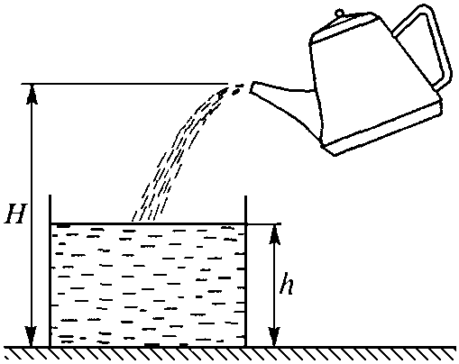
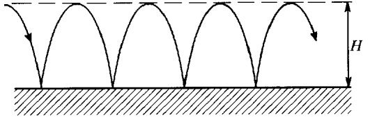
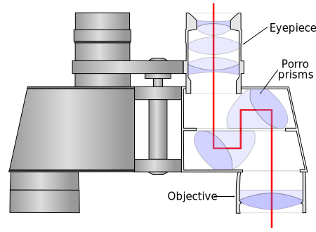
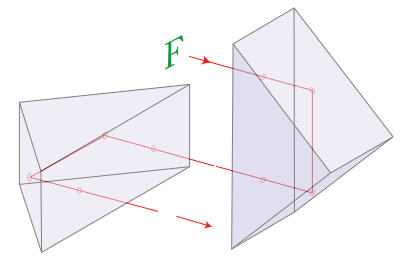

[[Състезания/3/11-12/2023|◂ 2023]] | [[Състезания/3/11-12r/2024|решения]] | [[Състезания/3/11-12/2025| 2025 ▸]]

**Физични константи, които можете да използвате във всички задачи:**

| Земно ускорение               | $g = 9,81 \, \text{m} \cdot \text{s}^{-2}$                                                        |
| ----------------------------- | ------------------------------------------------------------------------------------------------- |
| Гравитационна константа       | $\gamma = 6,67 \times 10^{-11} \, \text{m}^3 \cdot \text{kg}^{-1} \cdot \text{s}^{-2}$            |
| Маси на частиците             |                                                                                                   |
| – електрон                    | $m_e = 9,109 \times 10^{-31} \, \text{kg}$                                                        |
| – протон                      | $m_p = 1,673 \times 10^{-27} \, \text{kg}$                                                        |
| – неутрон                     | $m_n = 1,675 \times 10^{-27} \, \text{kg}$                                                        |
| Елементарен електричен заряд  | $e = 1,60 \times 10^{-19} \, \text{C}$                                                            |
| Константа на Кулон            | $k_C = 9,00 \times 10^9 \, \text{N} \cdot \text{m}^2 \cdot \text{C}^{-2}$                         |
| Електрична константа          | $\varepsilon_0 = \frac{1}{4\pi k_C} \approx 8,85 \times 10^{-12} \, \text{F} \cdot \text{m}^{-1}$ |
| Магнитна константа            | $\mu_0 = 4\pi \times 10^{-7} \, \text{T} \cdot \text{m} \cdot \text{A}^{-1}$                      |
| Скорост на светлината         | $c = 3,00 \times 10^8 \, \text{m} \cdot \text{s}^{-1}$                                            |
| Константа на Планк            | $h = 6,63 \times 10^{-34} \, \text{J} \cdot \text{s}$                                             |
| Редуцирана константа на Планк | $\hbar = \frac{h}{2\pi} = 1,05 \times 10^{-34} \, \text{J} \cdot \text{s}$                        |
| Атомна единица за маса        | $1 \, \text{u} = 1,66 \times 10^{-27} \, \text{kg} = 931,5 \, \text{MeV} \cdot c^{-2}$            |
| Универсална газова константа  | $R = 8,31 \, \text{J} \cdot \text{mol}^{-1} \cdot \text{K}^{-1}$                                  |
| Число на Авогадро             | $N_A = 6,02 \times 10^{23} \, \text{mol}^{-1}$                                                    |
| Константа на Болцман          | $k_B = \frac{R}{N_A} = 1,38 \times 10^{-23} \, \text{J} \cdot \text{K}^{-1}$                      |
| Константа на Ридберг          | $R_H = 1,097 \times 10^{7} \, \text{m}^{-1}$                                                      |

**Задача 1. Гюлетласкач**

 Гюлетласкач хвърля гюле от височина $h$ над земята под ъгъл $\theta$ спрямо хоризонта.

а) Ако приемете, че $h = 0$ m , докажете, че максималната далечина на полета се получава при ъгъл на хвърляне $\theta_0$ = 45 . \[4,0 т\]

б) Намерете оптималния ъгъл на хвърляне $\theta_1$ за максимална далечина на полета, ако
h $\neq$ 0 m . Докажете, че при $v_0^2\gg2gh$ , $\theta_1 \approx \theta_0$ . \[6,0 т\]

в) Нека е изпълнено условието $v_0^2\gg 2gh$ . Тогава $\theta_1$ = $\theta_0$ + $\delta$ , където $\delta$ 1 rad. Намерете приблизителен израз за $\delta$ и пресметнете $\theta_1$ в градуси, в случай, че $h = 2$ m (обикновено гюлетласкачите са високи хора!) и $v_0 = 14$ m/s . \[5,0 т\]

**Упътване:** Използвайте, че $\mathrm{tg} x \approx \sin x \approx x$ , ако $|x| \ll1$ rad и  $(1 + x )^\alpha \approx 1 + \alpha x$, ако $|x|\ll1$.

**Задача 2.** Задачата се състои от четири независими части, които може да се решават в
произволен ред.

Фиг. 2.1

Фиг. 2.2

А. Тяло с маса m = 0,5 kg и начална скорост $v_0 = 1,5$ m/s се движи по хоризонтална
права под действие на променлива сила F (t ) , чиято графика е показана на фиг. 2.1.
Максималната стойност на силата $F_{\max} = 2$ N се достига в средата на времевия интервал, като времето на действие е $t_0 = 6$ s . Определете:

а) изменението на скоростта $\Delta$v под действие на силата F ; \[2,5 т\]

б) работата A , извършена от силата F . \[1,0 т\]

Б. (Заикин 14.5) Намерете зависимостта от времето на силата F , действаща върху дъното с площ S на цилиндрична чаша, в която се налива вода от чайник (фиг. 2.2). Известно е, че в чашата всяка секунда се налива постоянно количество вода с обем Q. Плътността на водата е $\rho$ , а земното ускорение - g . Водата се излива от чучура на чайника от височина H над дъното на чашата. (2,5 т.)

 Фиг. 2.3

 Фиг. 2.4

В. Четири еднакви метални пластини, всяка с площ S , се намират във въздух на
разстояние d една от друга (фиг. 2.3). Външните пластини са свързани с тънък проводник.

а) Начертайте графиката на хода на потенциала, след като пластината 1 е получила заряд q , а пластината 2 - заряд -q . Координатната система изберете с ос x , насочена перпендикулярно на пластините и с ос y , насочена успоредно на пластините, като
 началото на системата е върху пластината А. \[1,75 т\]

 б) Намерете капацитета на системата между точките 1 и 2. \[3,0 т\]

Г. Ултрастудени неутрони с постоянна хоризонтална скорост, преминават един по един над хоризонтална пластина, наречена "неутронно огледало". Те се отразяват абсолютно еластично от нея и по такъв начин извършват периодично движение (фиг. 2.4). Движението под действие на силата на тежестта има квантов характер.

а) Покажете, че движението на неутрона се свежда до движение в потенциална яма
 и начертайте графиката на потенциалната енергия. \[1,75 т\]

б) Намерете минималната височина $z_{\min}$ над огледалото, при която неутронът
 преминава над него и енергията му $E_{\min}$ в ямата. \[2,5 т\]

**Задача 3. Поглъщане в звездните атмосфери**

Дълго време било загадка защо звездните атмосфери имат непрекъснат спектър на поглъщане във видимия диапазон, при условие, че водородният атом (основната съставна част на звездната атмосфера) има само няколко спектрални линии на поглъщане за видимата светлина.

Фиг. 3

а) Колко на брой са линиите на поглъщане на водородния атом във видимия диапазон и какви са съответните им дължини на вълната? \[3,0 т\]

б) Колко е минималната енергия на фотон, който може да йонизира водородния атом?
В кой диапазон от електромагнитния спектър се намира този фотон? \[1,0 т\]
 Едва към средата на XX в. било установено, че поглъщането на видима светлина в
звездната атмосфера се дължи на отрицателни водородни йони H- и е резултат от тяхната фотодисоциация:
$$H^-+\text{фотон}\to H + \text{свободен електрон},$$
при която се образува неутрален водороден атом и свободен електрон. На фиг. 3 е
илюстриран схематично моделът на Бор за отрицателния водороден йон. Протонът е
неподвижен в центъра на йона, а двата електрона обикалят с еднаква по големина скорост v по обща траектория с радиус r, намирайки се в диаметрално противоположни точки.

в) Като използвате II принцип на механиката, изразете скоростта на електроните като
функция на радиуса на орбитата. \[2,5 т\]

г) Като вземете предвид, че на всеки електрон съответства вълна на дьо Бройл, получете израз за радиуса $r_n$ $(n = 1, 2, \dots)$ на "разрешените" орбити на електроните. \[2,5 т\]

д) Получете израз и пресметнете $E_1$ - пълната енергия на йона $H^-$ в неговото основно състояние, т.е. на първата разрешена орбита. Представете отговора в джаули и в електронволти. \[4,0 т\]

е) Колко е минималната енергия $E_{dis}$ на фотон, който може да предизвика фотодисоциация на водородния йон? В кой диапазон на спектъра се намира този фотон. \[2,0 т\]

*Упътване.* За ваше удобство може да изразите някои от крайните отговори посредством т.нар. "редуцирана константа на Планк" или "h-черта": $\hbar = h/(2\pi) = 1,05.10^{-34}\ \mathrm{J.s}$.

**Задача 4. Галилеев телескоп и съвременен бинокъл**

Галилеев телескоп (далекогледна тръба) е съставен от събирателна леща с фокусно
разстояние $f_\text{об}$ за обектив и разсейвателна леща с фокусно разстояние $f_\text{ок}$ за окуляр. Всички получени резултати онагледете с подходящи чертежи.

а) Колко е разстоянието $d$ между двете лещи? \[1,0 т\]

б) Ако ъгълът между две звезди на небето е $\alpha$, то ъгълът между техните образи, гледани през телескопа, е $\beta$. Отношението $\Gamma = \beta/\alpha$ се нарича ъглово увеличение на телескопа.

Колко е $\Gamma$? \[1.5 т\]

Колко е оптичната сила $\Phi$ на телескопа? \[1,0 т\]

в) Ако за Галилеев телескоп са дадени $d$ и $\Gamma$, изразете чрез тях $f_\text{об}$ и $f_\text{ок}$. \[1,0 т\]

г) Оригиналният телескоп на Галилей е имал дължина на тръбата $d = 932\ \mathrm{mm}$ и увеличение $\Gamma = 20,4\times$. Изчислете фокусните разстояния $f_\text{об}$ на обектива и $f_\text{ок}$ на окуляра. \[1,0 т\]

д) Когато око гледа през окуляра на оригиналния телескоп на Галилей, диаметърът на зеницата е $l = 5\ \mathrm{mm}$. Колко е максималният диаметър $D$ на лещата на обектива, така че всички лъчи, които влизат през него, да влизат и в зеницата? \[1,0 т\]

е) Телескопът на Галилей е настроен така, че да се вижда ясно на "безкрайност". На какво разстояние $x$ трябва да се измести окуляра и в каква посока, така че да се виждат ясно предмети на разстояние $s = 50$ m. Изчислете в два случая:
1) образите на предметите са на безкрайност; \[1,0 т\]
2) образите на предметите са на същото разстояние, като самите предмети. \[2,5 т\]

ж) Съвременните бинокли не са Галилееви телескопи, а техният окуляр също е
събирателна леща (или няколко лещи за намаляване на аберациите, вж. фигурата). Тогава обаче би се наблюдавал обърнат образ. За да се "изправи" образът едно възможно решение е между обектива и окуляра да се вмъкнат така наречените "призми на Поро" (вж. фигурата). Това са две идентични правоъгълни равнобедрени призми. Те са ориентирани така, че ръбовете при върховете им да са перпендикулярни. Обяснете работата на тези призми, ако предположите че на първата пада успореден сноп с напречно сечение под формата на буквата F. Нарисувайте на фигурата как изглежда тази буква след преминаване през първата призма (т.е. между двете призми) и как изглежда след преминаване през втората призма. \[1,0 т\]

з) Наличието на много елементи в бинокъла ще доведе до много нежелани отражения от повърхностите на всички елементи в него и появата на много допълнителни "паразитни образи" и "паразитен светлинен фон". Това може частично да се потисне, ако всички повърхности на елементите (те всички са от стъкло с показател на пречупване $n$) се покрият с подходящ тънък слой с дебелина $h$ от вещество с показател на пречупване $n'$, така че отраженията на границата въздух - слой и на границата слой - стъкло взаимно да се потиснат в резултат на деструктивна интерференция. Намерете формули за $h$ и $n'$ при следните предположения: 1. Всички повърхности са плоски; 2. Светлината пада перпендикулярно на повърхностите; 3. Коефициентът на отражение между две среди с показатели на пречупване и е ; 4. Този коефициент и на двете повърхности на тънкия слой; 5. Повърхностите се осветяват с монохроматична светлина с дължина на вълната . \[2,5 т\]

Изчислете минималната дебелина $h'$ и показателя на пречупване $n'$ при $n = 1,50$ и
$\lambda$ = 580 nm. \[0,5 т\]

и) Всички съвременни бинокли имат такива противоотражателни покрития. Повърхностите на лещите им обаче изглеждат странно оцветени в червено-виолетов нюанс. Обяснете качествено причината за това оцветяване? \[1,0 т\]
