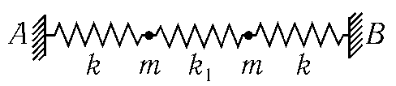
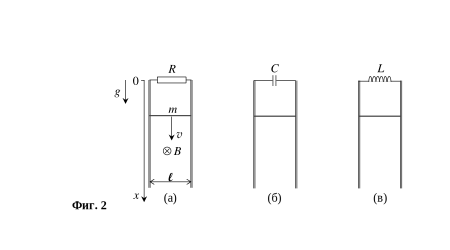

[[Състезания/3/11-12/2024|◂ 2024]] | [[Състезания/3/11-12r/2025|решения]]

Физични константи, които можете да използвате във всички задачи:

|                               |                                                                             |
| ----------------------------- | --------------------------------------------------------------------------- |
| Земно ускорение               | $g = 9,81 \text{ m.s}^{-2}$                                                 |
| Гравитационна константа       | $\gamma \equiv G = 6,67.10^{-11} \text{m}^{3}.\text{kg}^{-1}.\text{s}^{-2}$ |
| Маси на частиците             |                                                                             |
| - електрон                    | $m_e = 9,109.10^{-31} \text{ kg}$                                           |
| - протон                      | $m_p = 1,673.10^{-27} \text{ kg}$                                           |
| - неутрон                     | $m_n = 1,675.10^{-27} \text{ kg}$                                           |
| Елементарен електричен заряд  | $e = 1,60.10^{-19} \text{ C}$                                               |
| Константа на Кулон            | $k_C = 9,00.10^9 \text{ N.m}^2.\text{C}^{-2}$                               |
| Електрична константа          | $\varepsilon_0 = 1/4\pi k_C \approx 8,85.10^{-12} \text{ F.m}^{-1}$         |
| Магнитна константа            | $\mu_0 = 4\pi.10^{-7} \text{ T.m.A}^{-1}$                                   |
| Скорост на светлината         | $c = 3,00.10^8 \text{ m.s}^{-1}$                                            |
| Константа на Планк            | $h = 6,63.10^{-34} \text{ J.s}$                                             |
| Редуцирана константа на Планк | $\hbar = h/(2\pi) = 1,05.10^{-34} \text{ J.s}$                              |
| Атомна единица за маса        | $1 \text{ u} = 1,66.10^{-27} \text{ kg} = 931,5 \text{ MeV.c}^{-2}$         |
| Универсална газова константа  | $R = 8,31 \text{ J.mol}^{-1}\text{K}^{-1}$                                  |
| Число на Авогадро             | $N_A = 6,02.10^{23} \text{ mol}^{-1}$                                       |
| Константа на Болцман          | $k_B = R/N_A = 1,38.10^{-23} \text{ J.K}^{-1}$                              |
| Константа на Ридберг          | $R_H = 1,097.10^7 \text{ m}^{-1}$                                           |

**Задача 1. Трептяща система**

На фиг. 1 е показана система от две частици с равни маси $m$, които са свързани с три пружини с коефициент на еластичност $k$ на двете крайни пружини и $k_1$ на средната пружина. Частиците може да се движат само по правата $AB$.

В състояние на равновесие пружините са недеформирани. При отклонение на частиците от равновесие системата започва да трепти, като енергията ѝ остава постоянна. Ще означим с $x_1$ и $v_1$ съответно отклонението на лявата частица от равновесното ѝ положение и нейната скорост, а с $x_2$ и $v_2$ съответно отклонението и скоростта на дясната частица.

а) Изразете енергията $E$ на системата чрез отклоненията на частиците и чрез техните скорости. \[0,75 т\]

б) Нека $X_C$ и $V_C$ са съответно отклонението и скоростта на центъра на масата на системата, а $x$ и $v$ - съответно относителното отместване и относителната скорост на първата частица спрямо втората частица. Запишете енергията $E$ чрез отклоненията $X_C$ и $x$ и скоростите $V_C$ и $v$. \[3,25 т\]

в) Получете законите $X_C(t)$ и $V_C(t)$, по които се изменят във времето отклонението на центъра на масите и неговата скорост, а така също законите $x(t)$ и $v(t)$ за изменение на относителното отклонение и на относителната скорост. Опишете движението на двете частици, в случаите, когато трептят хармонично с еднаква честота? \[4,00 т\]

г) Намерете отклоненията $x_1(t)$ и $x_2(t)$ на частиците, ако в началния момент отклонението на първата частица е $x_1(0) = a$, на втората - $x_2(0) = 0$, а началните им скорости са нулеви: $v_1(0) = v_2(0) = 0$. \[4,00 т\]

д) За отклоненията $x_1(t)$ и $x_2(t)$, намерени в т. г), получете приблизителни изрази при $k_1 \ll k$. Какъв е физическият смисъл на получените резултати? \[3,00 т\]

Полезни тригонометрични формули

$$ \cos(A + B) \pm \cos(A - B) = \begin{cases} 2 \cos A \cos B \\ -2 \sin A \sin B \end{cases} $$

Приближена формула: $(1+x)^\alpha \approx 1 + \alpha x$ при $|x| \ll 1$.

**Задача 2. Жичка върху релси**

Права метална жичка с маса $m$ може да се хлъзга без триене по две вертикални метални релси, на разстояние $\ell$ една от друга, като през цялото време се намира в идеален електрически контакт с тях (фиг. 2 - а, б, в). Системата се намира в еднородно магнитно поле с индукция $B$, перпендикулярна на равнината, образувана от релсите. Във всички подточки на задачата можете да приемете, че:

1) В началния момент жичката се намира в горния край на релсите (т.е. $x_0 = 0$) и е оставена да се хлъзга надолу по тях с нулева начална скорост.

2) релсите са достатъчно дълги, така че в разглежданите интервали от време жичката не достига техния долен край;

3) електричното съпротивление на жичката и на релсите се пренебрегва.

а) Между горните краища на релисите е свързан резистор със съпротивление $R$ (фиг. 2 а)

- Разгледайте момент, в който жичката е достигнала скорост $v$. Получете израз за индуцираното електродвижещо напрежени $\mathcal{E}$ в електрическата верига, образувана от жичката, релисите и резистора в този момент. \[3,0 т\]

- Получете израз за граничната скорост $v_t$ която достига жичката след достатъчно дълго време. \[3,0 т\]

б) Вместо резистор, между горните краищата на релисите е свързан първоначално незареден кондензатор с капацитет $C$ (фиг. 2 б). Докажете, че в този случай жичката ще се движи равноускорително и получете израз за нейното ускорение $a$. \[4,0 т\]

в) В последния случай между горните краища на релисите е свързна намотка с индуктивност $L$ и с пренебрежимо електрично съпротивление (фиг. 2 в). След като жичката бъде освободена, тя започва да трепти във вертикално направление. Намерете периода $T$ и амплитудата $A$ на това трептене. \[5,0 т\]

**Задача 3. Налягане на слънчевата светлина**

а) Изкуствен спътник с маса $m$ обикаля около звезда с маса $M$ по кръгова орбита с радиус $r_1$. Да предположим, че изведнъж гравитационната константа намалее до стойност $\gamma'$, помалка от познатата ви таблична стойност $\gamma$. На какво максимално разстояние $r_2$ би се отдалечил спътникът от звездата, движейки се по новата си орбита? \[3,0 т\]

б) Нека, когато спътникът се намира на разстояние $r_2$ от звездата, гравитационната константа изведнъж наново възстанови първоначалната си стойност $\gamma$. На какво минимално разстояние $r_3$ ще се доближи спътникът до звездата? Сравнете $r_3$ и $r_1$. \[2,0 т\]

в) Нека спътникът има напречно сечение $S$ и поглъща напълно падащата върху него светлина от звездата. Енергията, падаща за единица време върху единица площ от сечението на спътника, когато той се намира на разстояние $r_1$ от звездата, е $W(r_1) = \frac{\Delta E}{\Delta t \Delta S}$. Ако гравитационната константа е $\gamma$, покажете, че резултантната сила (сума на гравитационната сила и силата, дължаща се на налягането на светлината), действаща на спътника (ако той се намира на произволно разстояние $r$ от звездата), е еквивалентна на гравитационна сила с ефективна гравитационна константа $\gamma'$. Изразете $\gamma'$ чрез $\gamma$ и дадените величини. \[2,0 т\]

г) Първоначално спътник се движи около Слънцето по кръгова с радиус $r_1 = 150.10^6$ km и период $T = 365$ дни. Масата на спътника е $m = 100$ kg, а напречното му сечение е пренебрежимо малко. В даден момент от спътника се разгъва напълно отразяваща повърхност с форма на квадрат със страна 10,0 m, насочена винаги към Слънцето.

Известно е, че $W(r_1) = 1360 \text{ W/m}^2$. Изчислете отношението на разстоянията $r_2/r_1$ (виж подусловие a)). \[2,0 т\]

д) Когато спътникът достига разстоянието $r_2$, отразяващата повърхност се сгъва и прибира напълно, така че сечението на спътника става отново пренебрежимо малко. Изчислете отношението на разстоянията $r_3/r_1$ (виж подусловие б)). \[2,0 т\]

**е)** Оказва се, че спътниците, обикалящи около Земята, летят по бавно променящи се орбити. За спътници, обикалящи около Земята на ниски орбити (на разстояние от земната повърхност $h < 700 \text{ km}$) основната причина за тази промяна е силата на челно съпротивление от атмосферата, която води до бавно "падане" на спътника. За спътници, летящи на по-високи орбити ($h > 700 \text{ km}$) обаче основната причина за промяна на орбитата е налягането на слънчевата светлина. Нека си представим, че спътник лети по кръгова орбита с височина над земната повърхност $h \approx 1000 \text{ km}$. Равнината на орбитата на този спътник съвпада с равнината на орбитата на Земята около Слънцето. Обяснете качествено причината за промяната на орбитата на спътника и нарисувайте на чертеж посоката на промяната на орбитата ("новата" орбита или "новите" орбити) и нейното (тяхното) положение (и ориентация) спрямо старата орбита и посоката Земя-Слънце. Мащабът на разстоянията може да не е спазен. \[2,0 т\]

**ж)** Нашето Слънце се е образувало от облак от газ и прах чрез гравитационно уплътняване. В един момент плътността в центъра на облака става достатъчно голяма, за да протичат ядрени реакции, и той се превръща в звезда и започва да свети. Тогава слънчевата светлина ще започне да "издухва" далеч от Слънцето всички частици с радиус, по-малък от някакъв критичен $r_{кр}$. Приемете, че частиците са сферични с плътност $\rho = 2000 \text{ kg/m}^3$, и че поглъщат напълно падащата светлина (с $W(r_1) = 1360 \text{ W/m}^2$ виж подусловие г)). Изчислете $r_{кр}$. \[2,0 т\]

**Задача 4 Разширяващата се Вселена**

а) Нека в условно избран начален момент след момента на Големия взрив, разстоянието между две галактики е $r$. В произволен друг момент $t$, поради разширяването на Вселената, разстоянието между галактиките е $R(t) = a(t)r$, където $a(t)$ е универсална за цялата Вселена функция, наречена **мащабиращ множител**. Докажете закона на Хъбъл: $v(t) = H(t)R(t)$, където $v(t)$ е относителната скорост на двете галактики една спрямо друга в момента $t$, а $H(t)$ е зависещата от времето константа на Хъбъл. Изразете $H(t)$ чрез мащабиращия множител и неговата производна $\dot{a}(t)$ по времето. \[3,0 т\]

б) Във Вселената има три вида "материя", за които ще приемем, че изпълват равномерно пространството: (1) тежка материя, т.е. изграденото от масивни частици вещество със зависеща от времето плътност $\rho_m(t)$; (2) излъчване с плътност $\rho_r(t)$ и (3) т.нар. тъмна
енергия с независеща от времето плътност на масата $\rho_\Lambda$. Нека изберем една от двете галактики за неподвижно начало $O$ на координатната система и да разгледаме движението на другата галактика спрямо нея. Като използвате законите на Нютоновата механика, изразете "ускорението", т.е. втората производна $w = \ddot{a}(t)$ на мащабиращия множител по времето чрез моментната му стойност $a(t)$, фундаментални константи и общата плътност на материята $\rho(t) = \rho_m(t) + \rho_r(t) + \rho_\Lambda(t)$.

\[3,0 т\]

в) Ако приемете, че масата на тежката материя във Вселената се запазва, докажете, че нейната плътност се мени с времето по закона:

$$ \rho_m(t) = A/a(t)^3, $$

където $A$ е независеща от времето константа. Ако приемете, че във Вселената има само тежка материя, докажете, че константата на Хъбъл е свързана с плътността на тежката материя и с мащабиращия множител чрез уравнението:

$$ H(t)^2 = \frac{8\pi G}{3} \rho_m(t) - \frac{k}{a(t)^2}$$

(т.нар. уравнение на Фридман), където $G$ е гравитационната константа, а $k$ е неизвестна константа. Определете как се разширява Вселената, т.е. как се променя с времето мащабиращия множител $a(t)$, ако $k=0$. Какво е възможното бъдеще на Вселената в зависимост от различните стойности на константата $k$?
\[5,0 т\]

От Общата теория на относителността следва (не се опитвайте да го докажете), че при наличие на излъчване и тъмна енергия уравнението на Фридман се обобщава, просто като се замести плътността на тежката материя с общата плътност $\rho(t)$ на всички форми на материя:

$$ H(t)^2 = \frac{8\pi G}{3} \rho(t) - \frac{k}{a(t)^2} $$

г) Чрез методи на квантовата механика се доказва, че плътността на излъчването се мени с времето по закона: $\rho_r(t) = B/a(t)^4$, където $B$ е независеща от времето константа. Как би се разширявала Вселената, ако в нея имаше само излъчване (тоест няма тежка материя и тъмна енергия) и $k=0$. Ако има и тежка материя, на кои етапи от развитието на Вселената има превес излъчването, и на кои - тежката материя?
\[2,0 т\]

д) Съществуването на тъмната енергия е хипотеза, която обяснява ускорителното разширяване на Вселената. Прието е плътността на тъмната енергия да се представя във вида: $\rho_\Lambda = \Lambda/(8\pi G) = \text{const}$, където $\Lambda > 0$ е т.нар. космологична константа. На кои етапи от развитието на Вселената доминира тъмната енергия? Как би се разширявала Вселената, ако в нея имаше само с тъмна енергия и ако $k=0$.
