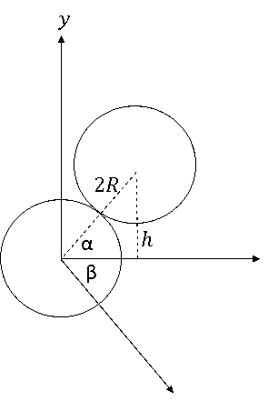

[[Състезания/3/11-12/2020|◂ 2020]] | [[Състезания/3/11-12r/2021|решения]] | [[Състезания/3/11-12/2022| 2022 ▸]]

**Задача 1. Удар между билиардни топки**

а) Ще насочим оста x по хоризонталата, а оста y - по вертикалата, както е показано
на фигурата. От правоъгълния триъгълник намираме

$$ \sin \alpha = \frac{h}{2R}, \quad \cos \alpha = \sqrt{1 - \frac{h^2}{4R^2}} \qquad [1 т.] $$

б) Написваме закона за запазване на импулса по оста x и по оста y, както и закона за
запзване на енергията:

(1) $m_1v_1 = m_2v_2'\cos\alpha + m_1v_1'\cos\beta$  \[0,5 т.\]

(2) $m_2v_2'\sin\alpha = m_1v_1'\sin\beta$  \[0,5 т.\]

(3) $\frac{1}{2}m_1v_1^2 = \frac{1}{2}m_1v_1'^2 + \frac{1}{2}m_2v_2'^2$  \[0,5 т.\]

От (1) и (2) намираме

(4) $v_1'\sin\beta = \frac{m_2}{m_1}v_2'\sin\alpha$,  \[0,5 т.\]

(5) $v_1'\cos\beta = v_1 - \frac{m_2}{m_1}v_2'\cos\alpha$.  \[0,5 т.\]

Заместваме (4) и (5) в уравнение (3) и като отчетем, че $v_1'^2 = (v_1'\sin\beta)^2 + (v_1'\cos\beta)^2$, получаваме

$$ (6) \quad v'_2 = \frac{2v_1 \cos \alpha}{1 + \frac{m_2}{m_1}} = \frac{2v_1}{1 + \frac{m_2}{m_1}} \sqrt{1 - \frac{h^2}{4R^2}}. \quad [1 т.] $$
Аналогично получаваме $v'_1$:

$$ (7) \quad v'_1 = \frac{v_1}{1 + \frac{m_2}{m_1}} \sqrt{1 - \frac{m_2}{m_1}}^2 + \frac{m_2}{m_1} \frac{h^2}{R^2} \quad [0,5 т.] $$
в) Можем да намерим $\beta$ като заместим (6) и (7) в (4), при което получаваме

$$ (8) \quad \sin \beta = \frac{m_2}{m_1} \frac{h}{R} \sqrt{1 - \frac{h^2}{4R^2}} \cdot \frac{1 - \frac{m_2}{m_1}}{1 - \frac{m_2}{m_1}} \frac{h^2}{R^2} \quad [1,75 т.] $$
При $m_2 = m_1$, имаме $\sin \beta = \sqrt{1 - \frac{h^2}{4R^2}} = \cos \alpha$. Така получаваме $\alpha + \beta = \frac{\pi}{2}$.

От другa страна намираме.
$$\quad \frac{a}{b} = 3 \frac{\cos \alpha}{\sin \alpha} = 3 \sqrt{\left(\frac{2R}{h}\right)^2 - 1}. \quad [0,25 т.] $$

$$ (13) \quad \text{Тъй като } \beta = \frac{\pi}{2} - \alpha + \Delta \beta, \text{ получаваме} $$

$$ \sin\left(\frac{\pi}{2} - \alpha + \Delta \beta\right) = \cos(\alpha - \Delta \beta) = \cos\alpha\cos\Delta\beta + \sin\alpha\sin\Delta\beta \approx \cos\alpha + \Delta\beta\sin\alpha \quad [1 т.] $$

$ \text{Като заместим в (9), намираме:} $

$$ \Delta \beta \approx \frac{\varepsilon}{2} \frac{\cos\alpha}{\sin\alpha} = \frac{\varepsilon}{2} \sqrt{\left(\frac{2R}{h}\right)^2 - 1}. \quad [1 т.] $$

$$m_1 v_1 - m_2 v_2 = m_1 v_{1x}' + m_2 v_{2x}' \tag{1 т.}$$

$$\frac{1}{2} m_1 v_1^2 + \frac{1}{2} m_2 v_2^2 = \frac{1}{2} m_1 v_{1x}'^2 + \frac{1}{2} m_2 v_{2x}'^2 \tag{1 т.}$$

Системата от двете уравнения се решава, като изразим от първото $v_{2x}',$ т. е.

$$v_{2x}' = \frac{m_1}{m_2} v_1 - v_2 - \frac{m_1}{m_2} v_{1x}'$$

и заместим във второто, при което получаваме квадратно уравнение за $v_{1x}'$;

$$\left( 1 + \frac{m_1}{m_2} \right) v_{1x}'^2 - 2v_{1x} \left( \frac{m_1}{m_2} v_1 - v_2 \right) - 2v_1 v_2 - \left( 1 - \frac{m_1}{m_2} \right) v_1^2 = 0.$$

Една четвърт от дискримантата на това уравнение е точен квадрат:

$$\frac{1}{4} D = (v_1 + v_2)^2.$$

Оттук намираме корените на квадратното уравнение. Единият корен $v_{1x}' = v_1$ дава $v_{2x}' = -v_2$, което съответства на ситуацията преди удара. Другият корен е

$$v_{1x}' = \frac{m_1 - m_2}{m_1 + m_2} v_1 - \frac{2m_1}{m_1 + m_2} v_2, \qquad [1 т.]$$

при което обучаваме

$$v_{2x}' = \frac{2m_1}{m_1 + m_2} v_1 + \frac{m_1 - m_2}{m_1 + m_2} v_2. \qquad [1 т.]$$

**Задача 2. Верига с кондензатори**

Задачата може да бъде решена изцяло с материал от задължителната подготовка от 9. и 10. клас, но може да се използват и формулите за еквивалентен капацитет и за енергия на зареден кондензатор.

а) Поради симетрията на веригата е ясно, че:

$$q_1 = q_4 \text{ и } q_2 = q_3 \qquad [1 т.]$$

Тъй като кондензаторите 1 и 2 (3 и 4) са свързани последователно към източника, следва, че върху тях има равни заряди (какъвто заряд се втича върху положителната плоча на 1, такъв заряд изтича от отрицателната плоча на 2). Следователно:

$$q_1 = q_2 \text{ и } q_3 = q_4 \qquad [1 т.]$$

Така получаваме, че върху четирите кондензатора има еднакъв заряд $q_0$. Сумата от напреженията върху последователно свързани елементи във веригата е равна на напрежението на източника:

$$\frac{q_0}{C} + \frac{q_0}{2C} = \mathcal{E}, \qquad [1 т.]$$

откъдето намираме заряда върху кондензаторите:

$$q_0 = \frac{2}{3} C \mathcal{E}. \qquad [1 т.]$$

б) Преразпределянето на зарядите между кондензаторите продължава, докато напрежението върху резистора стане равно на нула.

От симетрията на получената верига следва, че напреженията върху четирите кондензатора стават равни на $U = \mathcal{E}/2$. Следователно новите заряди върху кондензаторите са, както следва:

$$q_1 = q_4 = CU = \frac{C\mathcal{E}}{2} \qquad [1 \text{ т.}] \quad q_2 = q_3 = 2C \times U = C\mathcal{E} \qquad [1 \text{ т.}] $$

Оттук следва, че след свързването на резистора, от т. $A$ към отрицателната плоча на кондензатора 1 протича заряд $q_0 - q_1 = C\mathcal{E}/6$ (1 т.), а към положителната плоча в кондензатора 2 - заряд $q_2 - q_0 = C\mathcal{E}/3$ (1 т.). От закона за запазване на заряда следва, че през резистора от т. $B$ към т. $A$ се пренася заряд:

$$q_R = \frac{1}{6}C\mathcal{E} + \frac{1}{3}C\mathcal{E} = \frac{1}{2}C\mathcal{E}. \qquad [1 \text{ т.}] $$

в) Преди да бъде свързан резисторът, напреженията върху кондензаторите 1 и 3 са съответно:

$$U_1 = \frac{q_0}{C} = \frac{2}{3}\mathcal{E}; \qquad [1 \text{ т.}] \quad U_3 = \frac{q_0}{2C} = \frac{1}{3}\mathcal{E}, \qquad [1 \text{ т.}] $$

а напрежението между $A$ и $B$:

$$U_{AB} = U_1 - U_2 = \frac{1}{3}\mathcal{E}. \qquad [1 \text{ т.}] $$

Следователно напрежението върху резистора се променя от $U_{AB}$ в началото до 0, след като във веригата се установи равновесие. Това означава, че зарядът през резистора се пренася при средно напрежение:

$$U_{cp} = \frac{U_{AB} + 0}{2} = \frac{1}{6}\mathcal{E}. \qquad [1 \text{ т.}] $$

Отделеното в резистора количество топлина е равно на работата на електричните сили при пренасяне на заряда през резистора:

$$Q = q_R U_{cp} = \frac{1}{12}C\mathcal{E}^2. \qquad [1 \text{ т.}] $$

**Задача 3. Квантови свойства на светлината**

**Част А.** а) От графиката на функцията $y(x)$ намираме

$$y = \frac{1}{2} \text{ при } x_0 \approx 1,41. \qquad [0,5 \text{ т.}] $$

От закона на Вин следва $\lambda_{\text{max}} = \frac{b}{T_0}$, при което получаваме

$$\lambda = \lambda_{\text{max}} x_0 = x_0 \frac{b}{T_0} \approx 1,11 \mu\text{m}. \qquad [0,5 \text{ т.}] $$

б) При $T = 5000 \text{ K}$ имаме

$$ \lambda_{\text{max}} = \frac{b}{T} \approx 0,58 \mu \text{m}, \qquad [0,25 \text{ т.}] $$

откъдето следва

$$ x_1 = \frac{\lambda_1}{\lambda_{\text{max}}} = \frac{0,40}{0,58} \approx 0,69, \quad [0,5 \text{ т.}] \quad x_2 = \frac{\lambda_2}{\lambda_{\text{max}}} = \frac{0,70}{0,58} \approx 1,21. \qquad [0,5 \text{ т.}] $$

Така по графиката намираме

$$ y(x_1) \approx 0,07, \quad y(x_2) \approx 0,38, \qquad [0,5 \text{ т.}] $$

при което се получава

$$ \Delta y = y(x_2) - y(x_1) \approx 0,38 - 0,07 \approx 0,31, \qquad [0,5 \text{ т.}] $$

т. е. това е частта от пълната излъчена енергия във видимата част на спектъра.

в) При $T_0$ имаме $\lambda_{\text{max}}' = \frac{b}{T_0} \approx 0,784 \mu \text{m} [0,25 \text{ т.}]$, при което намираме

$$ x' = \frac{0,700}{0,784} \approx 0,893, \quad y(x') \approx 0,18. \qquad [0,5 \text{ т.}] $$

Като използваме закона на Стефан-Болцман получаваме

$$ \frac{P''}{P'} = \left( \frac{T}{T_0} \right)^4 \frac{1 - y(x_2)}{1 - y(x')} = \left( \frac{5}{3,7} \right)^4 \frac{1 - 0,38}{1 - 0,18} \approx 2,5. \qquad [1 \text{ т.}] $$

**Част Б.** а) Ще преобразуваме мерната единица на интензитета на светлината. Така имаме

$$ [J] = \frac{W}{m^2} = \frac{J}{\text{s.m}^2} = \frac{\text{N.m}}{\text{s.m}^2} = \frac{\text{N}}{\text{m}^2} \times \frac{\text{m}}{\text{s}} = [P] \times [u], \qquad [1 \text{ т.}] $$

където $[P]$ е единицата за налягане, а $[u]$ - единицата за скорост. Следователно можем да запишем

$$ [P] = \frac{[J]}{[u]}. \qquad [1 \text{ т.}] $$

В задачата скоростта на снопа е $u = c$ във вакуум $[1 \text{ т.}]$ и $u = c/n \sim c$ $[1 \text{ т.}]$ в стъклото. По този начин стигаме до израз за налягането

$$ P = \frac{J}{c} f(n), \qquad [1 \text{ т.}] $$

където $f(n)$ е число, зависещо от показателя на пречупване.

б) Нека приемем, че снопът се състои от фотони с енергия $\varepsilon = h\nu [0,5 \text{ т.}]$. Тогава като въведем броя фотони $N$, които попадат върху единица площ за единица време, имаме

$J = Nh\nu$, \[0,5 т.\]

Тъй като от една страна е изпълнено равенството $v = c/\lambda [0,5 \text{ т.}]$, а импулсът $p$ на фотона е $p = h/\lambda [0,5 \text{ т.}]$, за импулса на снопа намираме израза

$$ Np = \frac{J}{c}. \qquad [0,5 \text{ т.}] $$

Този сноп като достигне повърхността на пластината се разделя на две части: едната образува отразен сноп, който отнася импулс

$N_1 p = RNp = R \frac{J}{c} \qquad [0,5 \text{ т.}]$

а втората образува преминал сноп, който отнася импулс

$N_2 p_2 = N_2 \frac{h}{\lambda_2} = N_2 np = (1-R)nNp = (1-R)n \frac{J}{c} \qquad [1 \text{ т.}]$

Във векторен вид съответните импулси са

$\mathbf{p}_0 = N\mathbf{p}, \quad \mathbf{p}_1 = -RN\mathbf{p} = -R\mathbf{p}_0, \quad \mathbf{p}_2 = (1-R)nN\mathbf{p} = (1-R)n\mathbf{p}_0. \qquad [0,75 \text{ т.}]$

При отсъствие на поглъщане изменението на импулса на снопа след взаимодействието със стъклената пластина е

$\Delta \mathbf{p} = \mathbf{p}_1 + \mathbf{p}_2 - \mathbf{p}_0 = \mathbf{p}_0 \left[ (n-1) - (n+1)R \right], \qquad [0,75 \text{ т.}]$

т. е. имаме

$\Delta \mathbf{p} = \mathbf{p}_0 \frac{2(n-1)}{(n+1)} = \mathbf{f}' . \qquad [0,5 \text{ т.}]$

По третия закон на Нютон търсената сила е $\mathbf{f} = -\mathbf{f}'$. Следователно намираме за големината на силата

$f = |\Delta \mathbf{p}| = \frac{2(n-1)}{n+1} \frac{J}{c} \approx 133 \mu \text{Pa}, \qquad [0,5 \text{ т.}]$

а посоката на силата $\mathbf{f}$ е противоположна на вектора $-\mathbf{p}_0$, т. е. противоположна на посоката на падащия светлинен сноп. [0,5 т.]

**Задача 4. Бета-разпадане на неутрона**

**Част А.** а) Нека означим с $p_p$ импулса на протона. Тогава от закона за запазване на импулса следва $p_p = p_e$. (1) \[0,3 т.\] От закона за запазване на енергията имаме

$(2) \quad m_n c^2 = \sqrt{m_p^2 c^4 + p_p^2 c^2} + \sqrt{m_e^2 c^4 + p_e^2 c^2}. \qquad [0,7 \text{ т.}]$

Замествайки (1) в (2), $m_n c^2 - \sqrt{m_p^2 c^4 + p_e^2 c^2} = \sqrt{m_e^2 c^4 + p_e^2 c^2}$. След повдигане на квадрат имаме

$m_n^2 c^4 - 2m_n c^2 \sqrt{m_p^2 c^4 + p_e^2 c^2} + m_p^2 c^4 + p_e^2 c^2 = m_e^2 c^4 + p_e^2 c^2. \qquad [0,5 \text{ т.}]$

Като съкратим на $p_e^2 c^2$ и преобразуваме, намираме

$c^4(m_n^2 + m_p^2 - m_e^2) = 2m_n c^2 \sqrt{m_p^2 c^4 + p_e^2 c^2}. \qquad [0,5 \text{ т.}]$

След съкращаване на $c^2$ и повдигане на квадрат

$c^4(m_n^2 + m_p^2 - m_e^2)^2 = 4m_n^2(m_p^2 c^4 + p_e^2 c^2).$

След ново съкращаване на $c^2$ и преобразуване, окончателно намираме

$(3) \quad p_e = c \sqrt{\frac{(m_n^2 + m_p^2 - m_e^2)^2}{4m_n^2} - m_p^2}. \qquad [0,5 \text{ т.}]$

След заместване със зададените стойности получаваме

$p_e = 1,18725 \text{ MeV/c.} \qquad [0,5 \text{ т.}] \quad (6)$

б) Използвайки (3), пълната енергия на електрона е

$E_e^2 = E_{e0}^2 + p_e^2 c^2 = m_e^2 c^4 + c^2 \left( \frac{(m_n^2 + m_p^2 - m_e^2)^2}{4m_n^2} - m_p^2 \right) c^2. \qquad [0,5 \text{ т.}] \quad (7)$

Като приведем към общ знаменател, намираме

$$E_e^2 = \frac{c^4}{4m_n^2} \left( 4m_n^2 m_e^2 + (m_n^2 + m_p^2 - m_e^2)^2 - 4m_n^2 m_p^2 \right). $$

След разкриване на скобите, съкращаване и ново групиране на членовете, имаме

$$E_e^2 = \frac{c^4}{4m_n^2} (m_n^2 - m_p^2 + m_e^2)^2, $$

откъдето следва

$(4) \quad E_e = \frac{c^2}{2m_n} (m_n^2 - m_p^2 + m_e^2) [1 \text{ т.}] = 1,29255 \text{ MeV.} \qquad [0,5 \text{ т.}] \quad (8)$

Кинетичната енергия $E_{kin e}$ на електрона, получен при разпадането, е

$E_{kin e} = E_e - E_{e0} = 1,29255 \text{ MeV} - 0,510999 \text{ MeV} = 0,781551 \text{ MeV.} \qquad [0,5 \text{ т.}] \quad (9)$

в) Тъй като $p_p = \frac{m_p v_p}{\sqrt{1 - \left(\frac{v_p}{c}\right)^2}}$, то след повдигане на квадрат и умножаване по знаменателя, имаме

$$p_p^2 \left( 1 - \left(\frac{v_p}{c}\right)^2 \right) = m_p^2 v_p^2, $$

откъдето намираме

$v_p^2 = \frac{p_p^2}{m_p^2 + \frac{p_p^2}{c^2}}, \qquad [0,5 \text{ т.}] \quad (10)$

$(5) \quad \frac{v_p}{c} = \frac{1}{\sqrt{\left(\frac{m_p c}{p_p}\right)^2 + 1}} [1 \text{ т.}] = 1,26536 \cdot 10^{-3}, \qquad [0,5 \text{ т.}] \quad (11)$

$v_p = 3,79344 \cdot 10^5 \text{ м/с.} \qquad [0,5 \text{ т.}] \quad (12)$

**Част Б.** г) Тъй като след разпадането импулсът и енергията се разпределят между 3 частици (протон, електрон и антинеутрино), кинетичната енергия на електрона $E_{kin e}$ може да има всички стойности в някакъв интервал от енергии в зависимост от посоките на импулсите на трите частици. \[0,2 т.\] Минималната кинетична енергия $E_{kin e min} = 0$, защото е възможна ситуация, при която след разпадането електронът остава неподвижен, а протонът и неутриното се движат в противоположни посоки. \[0,4 т.\] Максималната кинетична енергия е $E_{kin e max} = E_{kin e}$ (получена в подусловие б)), защото е възможна ситуация, в която образувалото се неутрино има безкрайно малка енергия и импулс, при което тази ситуация ще съвпада с тази, описана в Част А. \[0,4 т.\]

д) В случая 1, когато след разпадането електронът остава неподвижен, законите за запазване на импулса и енергията изглеждат така:

$$(6) \quad p_p = p_v, $$

$$(7) \quad m_n c^2 = m_e c^2 + \sqrt{m_p^2 c^4 + p_p^2 c^2} + p_v c. $$

Ако сравним (6) и (7) с (1) и (2), се забелязва, че те описват подобни ситуации. Сегашната ситуация преминава в тази от подусловие а), ако се направи формалната замяна $e \to v$ и $m_n \to m_n - m_e$. Следователно можем направо да използваме отговора (4), правейки посочените замени:

$$E_v = \frac{c^2}{2(m_n - m_e)} ((m_n - m_e)^2 - m_p^2) [1 \text{ т.}] = 0,781975 \text{ МеV.} \quad [0,5 \text{ т.}] $$

Скоростта на протона $v_{p1}$ също не е нужно да се получава наново, защото може да се използва отговорът (5):

$$\frac{v_p}{c} = \frac{1}{\sqrt{\left(\frac{m_p c}{p_p}\right)^2 + 1}} = \frac{1}{\sqrt{\frac{m_p^2 c^4}{E_v^2} + 1}} [1 \text{ т.}] = 8,33420.10^{-4} \quad [0,3 \text{ т.}],$$
$$v_{p1} = 2,49853.10^5 \mathrm{m/s}. \quad [0,2 \text{ т.}] $$

е) В случая 2, когато след разпадането протонът остава неподвижен, законите за запазване на импулса и на енергията изглеждат така

$(8) \quad p_e = p_v,$

$$(9) \quad m_n c^2 = m_p c^2 + \sqrt{m_e^2 c^4 + p_e^2 c^2} + p_v c. $$

Ако сравним (8) и (9) с (1) и (2), се вижда, че те описват подобни ситуации. Сегашната ситуация преминава в тази от подусловие а), ако се направи формалната замяна $e \to v, p \to e$ и $m_n \to m_n - m_p$. Следователно можем направо да използваме отговора (4), правейки посочените замени:

$$E_v = \frac{c^2}{2(m_n - m_p)} ((m_n - m_p)^2 - m_e^2) [1 \text{ т.}] = 0,545699 \text{ МеV.} \quad [0,5 \text{ т.}] $$

Скоростта на електрона $v_{e2}$ също не е нужно да се извежда отново, защото може да се използва отговор (5):

$$\frac{v_e}{c} = \frac{1}{\sqrt{\left(\frac{m_e c}{p_e}\right)^2 + 1}} = \frac{1}{\sqrt{\frac{m_e^2 c^4}{E_v^2} + 1}} [1 \text{ т.}] = 0,729933 [0,3 \text{ т.}], v_{e2} = 2,18829.10^8 \text{ м/с.} [0,2 \text{ т.}] $$

маса на неутрона $m_n = 939,5656 \text{ МеV/с}^2$

маса на протона $m_p = 938,2723 \text{ МеV/с}^2$

маса на електрона $m_e = 0,510999 \text{ МеV/с}^2$

скорост на светлината $c = 2,99792458.10^8 \text{ м/с}$
