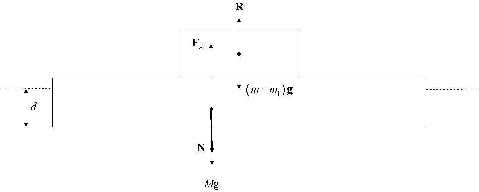
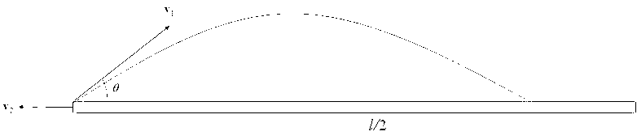
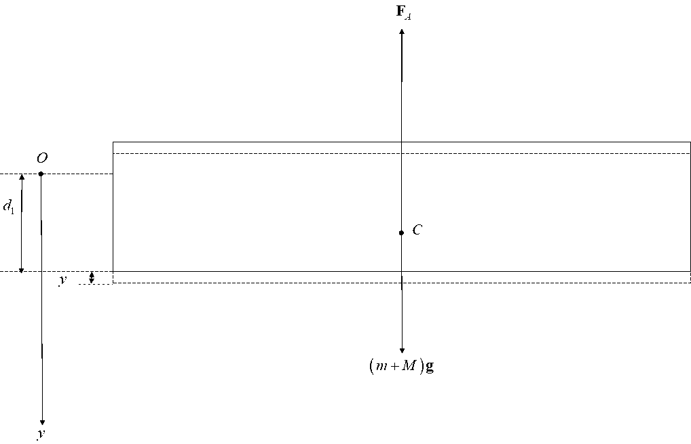
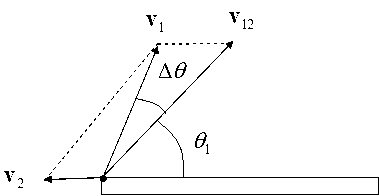
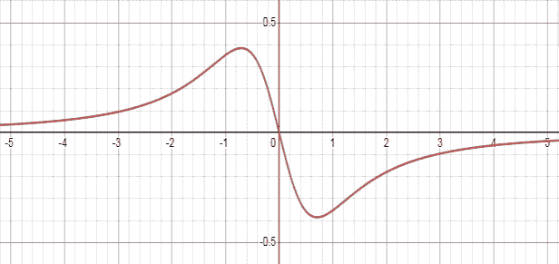
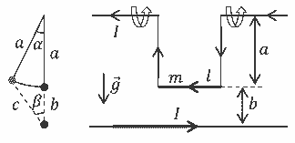
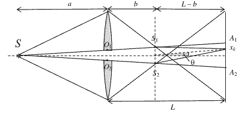

[[Състезания/3/11-12/2022|◂ 2022]] | [[Състезания/3/11-12r/2023|решения]] | [[Състезания/3/11-12/2024| 2024 ▸]]

**Задача 1. Падъл**

а) Силите са дадени на фигурата. Центърът на масата на дъската и центърът на масата на системата 'момче-топка' са отместени хоризонтално, за да не се претрупва чертежът. Масата на дъската е $M$, а земното ускорение $\mathbf{g}$, Архимедовата сила е $\mathbf{F}_A$, реакцията на дъската е $\mathbf{R}$. Натискът, с който момчето действа на дъската е $\mathbf{N}$. От третия принцип на Нютон следва $\mathbf{R} = -\mathbf{N}$, т.е. за големините на силите, имаме

$R = N \qquad (1)$

Балансът на силите ни дава:

$(m + m_1)g = R \qquad (2)$

$Mg + N = F_A, \qquad (3)$

а за Архимедовата сила имаме:

$F_A = \rho lwd. \qquad (4)$

Решаването на горната система уравнения, като отчетем, че:

$M = \rho_0 lwh \qquad (5)$

дава:

$d = \frac{\rho_0}{\rho} h + \frac{m + m_1}{\rho lw}. \qquad (6)$

б) На чертежа е показана половината от дъската, защото момчето е седнало по средата.
С $v_1$ сме обозначили скоростта на топката, а с $v_2$ - скоростта на системата 'момче-
дъска' (момчето не е начертано за простота на чертежа).

От закона за запазване на импулса имаме:

$m_1v_1\cos\theta-(m+M)v_2=0 \quad (7)$

Нещо повече, при $v_1 = v_{1\max}$, топката ще падне точно в края на дъската, а при $v_1 > v_{1\max}$, топката ще падне във водата, извън дъската. В такъв случай, при $v_1 = v_{1\max}$ имаме:

$l/2 - v_1\cos\theta = v_2t \quad (8)$

Където $t$ е времето за полет на топката. Както е известно от кинематиката, времето за полет е:

$t = \frac{2v_1\sin\theta}{g} \quad (9)$

Решавайки горната алгебрична система и използвайки (5), получаваме:

$v_{1\max} = \sqrt{\frac{gl}{2\sin 2\theta}\frac{m + \rho_0wlh}{m + m_1 + \rho_0wlh}} \quad (10)$

Когато $v_1 = v_{1\max}$ за $v_2$ получаваме (използвайки (7)),

$v_2 = \frac{m_1\cos\theta}{m + \rho_0wlh}\sqrt{\frac{gl}{2\sin 2\theta}\frac{m + \rho_0wlh}{m + m_1 + \rho_0wlh}} \quad (11)$

в) На чертежа са показани всички сили, които действат върху системата 'момче-дъска', като новото ѝ равновесно положение, след като е олекнала с $m_1$, е означено с $d_1$. Избираме оста $Oy$ вертикално надолу с начало в новото равновесно положение. Написвайки втория закон на Нютон, получаваме:

$(m+M)g - \rho g(d_1 + y)lw = (m+M)a_y \quad (12)$

От условието за равновесие знаем, че:

$(m+M)g - \rho gd_1lw = 0 \quad (13)$

Използвайки това условие, както и уравнение (5), уравнение (12) се опростява до:

$a_y = -\frac{\rho g l w}{m + \rho_0 l w h} y \quad (14)$

Коефициентът на пропорционалност между $a_y$ и $y$ е свързан с кръговата честота на трептенето: $a_y = -\omega^2 y$. Оттук получаваме честотата на трептене и съответно периода:

$T = \frac{2\pi}{\omega} = 2\pi \sqrt{\frac{m}{\rho g l w} + \frac{\rho_0}{\rho} \frac{h}{g}} \quad (15)$

г) Търсената връзка е очевидно:

$\mathbf{v}_1 = \mathbf{v}_{12} + \mathbf{v}_2 \quad (16)$

а съответният чертеж е даден вдясно:

д) От чертежа е ясно, че $\theta > \theta_1$. Като разложим векторите по компоненти, получаваме:

$v_{12} \cos \theta_1 = v_1 \cos \theta + v_2 \quad (17)$

$v_{12} \sin \theta_1 = v_1 \sin \theta \quad (18)$

Като разделим двете уравнения, получаваме:

$\operatorname{tg} \theta_1 = \frac{v_1 \sin \theta}{v_1 \cos \theta + v_2} \quad (19)$

Като използваме условието (7), както и факта, че $\theta_1 = \theta - \Delta \theta$, то имаме:

$$ \operatorname{tg}(\theta - \Delta \theta) = \frac{\sin \theta}{\cos \theta + \frac{m_1}{m + M} \cos \theta} = \operatorname{tg} \theta \frac{1}{1 + \frac{m_1}{m + M}} \approx \operatorname{tg} \theta \left(1 - \frac{m_1}{m + M}\right) \quad (20) $$

Сега развиваме по формулата: $\operatorname{tg}(\alpha - \beta) = \frac{\operatorname{tg} \alpha - \operatorname{tg} \beta}{1 + \operatorname{tg} \alpha \operatorname{tg} \beta}$ и използвайки приблизителните равенства, получаваме

$$ \operatorname{tg}(\theta - \Delta \theta) \approx \operatorname{tg} \theta - \frac{\Delta \theta}{\cos^2 \theta} \quad (21) $$

Като сравним (20) с (21), получаваме:

$$ \Delta \theta \approx \frac{m_1}{m + M} \cos^2 \theta \quad (22) $$

**Задача 2. Трептене на точков електричен дипол**

а) Първи начин. Малък участък от пръстена, разглеждан като точков електричен заряд, създава върху оста на пръстена електрично поле с потенциал

$$ \Delta \varphi = k \frac{\Delta q}{\sqrt{R^2 + z^2}}. \quad [1 \text{ т.}] $$

Като сумираме потенциалите, създадени от всички малки участъци на пръстена, намираме

$$ \varphi(z) = k \frac{Q}{\sqrt{R^2 + z^2}}, \quad [0,5 \text{ т.}] $$

където оста $0z$ е насочена вертикално нагоре. За потенциалната енергия на дипола намираме

$$ U(z) = q\varphi(z + \delta) - q\varphi(z). \quad [1 \text{ т.}] $$

Като отчетем, че $\varphi(z + \delta) - \varphi(z) = \varphi'(z)\delta$ и пресметнем:

$$ \varphi'(z) = -kQ \frac{z}{(R^2 + z^2)^{3/2}}, \quad [1 \text{ т.}] $$

потенциалната енергия придобива вида

$$ U(z) = -kQ \frac{pz}{(R^2 + z^2)^{3/2}} \quad [0,5 \text{ т.}] $$

или алтернативно:

$$ \varphi(z + \delta) \approx kQ \frac{1}{(R^2 + z^2 + 2z\delta)^{1/2}} \approx kQ \left[ \frac{1}{\sqrt{R^2 + z^2}} - \frac{z\delta}{(R^2 + z^2)^{3/2}} \right], \quad [1 \text{ т.}] $$

и за потенциалната енергия получаваме отново

$$ U(z) = -kQ \frac{pz}{(R^2 + z^2)^{3/2}} \quad [0,5 \text{ т.}] $$

б) Потенциалната енергия на дипола е отрицателна при $z > 0$ (дипольт се намира над пръстена) \[0,5 т.\] и положителна при $z < 0$ (дипольт се намира под пръстена) \[0,5 т.\].
Около $z = 0$ потенциалната енергия намалява линейно \[0,5 т.\], докато при $z \to -\infty$ клони към нула чрез положителни стойности \[0,5 т.\], а при $z \to \infty$ клони към нула чрез отрицателни стойности \[0,5 т.\].

При $z_1 = -R/\sqrt{2}$ \[0,5 т.\] потенциалната енергия на дипола има максимум

$U_{\text{max}} = \frac{4kpQ}{3^{3/2}R^2}, \qquad [0,25 \text{ т.}]$

докато при $z_2 = R/\sqrt{2}$ \[0,5 т.\] - има минимум

$U_{\text{min}} = -U_{\text{max}}. \qquad [0,25 \text{ т.}]$

или алтернативно:

Тъй като потенциалната енергия е нечетна функция на $z$, при $z_1 = -a$ \[0,5 т.\] потенциалната енергия на дипола има максимална стойност $U_{\text{max}}$, докато при $z_2 = a$ \[0,5 т.\] - има минимална стойност

$U_{\text{min}} = -U_{\text{max}}. \qquad [0,5 \text{ т.}]$

Графиката на потенциалната енергия на дипола

$f(x) = \frac{R^2}{kQp} U(z) = -\frac{x}{(1+x^2)^{3/2}}$

като функция на $x = z/R$ е показана на фигурата. \[1 т.\]

в) Трептене е възможно, когато движението се извършва около минимума на потенциалната енергия, т.е. при енергия на дипола $\varepsilon < 0$ \[0,5 т.\]. Следователно началното положение трябва да е $z_0 > 0$ \[0,5 т.\], а началната скорост трябва да удовлетворява условието

$\varepsilon = \frac{mv_0^2}{2} - kQ \frac{pz_0}{(R^2 + z_0^2)^{3/2}} < 0, \qquad [0,5 \text{ т.}]$

откъдето следва

$v_0 < \sqrt{\frac{2}{m} \frac{kpQz_0}{(R^2 + z_0^2)^{3/2}}}. \qquad [0,5 \text{ т.}]$

г) Дипольт извършва хармонични трептения при малко отклонение от равновесното положение, когато потенциалната енергия може да се апроксимира с израза

$U(z) \approx U_{\text{min}} + \frac{1}{2} U''(z_2)(z - z_2)^2. \qquad [0,5 \text{ т.}]$

Тогава периодът на хармоничното трептене е

$T = 2\pi \sqrt{\frac{m}{U''(z_2)}}. \qquad [0,5 \text{ т.}]$

След двукратно диференциране на потенциалната енергия намираме

$U''(z) = kQp \frac{4z}{(R^2 + z^2)^{5/2}} \left[ 1 + 5 \frac{R^2 - 2z^2}{R^2 + z^2} \right], \quad [1 т.]$

$U''(z_2) = \frac{4^2}{3^{5/2}R^4} kQp, \quad [1 т.]$

откъдето следва

$T = \frac{3^{5/4}\pi R^2}{2} \sqrt{\frac{m}{k p Q}} \approx 0,2 \text{ s.} \quad [1 т.]$

или алтернативно:

Дипольт извършва хармонични трептения при малко отклонение от равновесното положение, когато потенциалната енергия може да се апроксимира с израза

$U(z) \approx U_{\text{min}} + \frac{1}{2} K(z - z_2)^2. \quad [0,5 т.]$

Тогава периодът на хармоничното трептене е

$T = 2\pi \sqrt{\frac{m}{K}}. \quad [0,5 т.]$

Ще запишем потенциалната енергия във вида

$U(z) = -kQp \frac{(z-a) + a}{\left\{R^2 + \left[(z-a) + a\right]^2\right\}^{3/2}} = -kQp \frac{\left[(z-a) + a\right]}{\left(R^2 + a^2\right)^{3/2}} \left\{1 + \frac{2a(z-a)}{R^2 + a^2} + \frac{(z-a)^2}{R^2 + a^2}\right\}^{-3/2}. \quad [0,5 т.]$

Като използваме формулата от условието на задачата, можем да получим

$\left\{1 + \frac{2a(z-a)}{R^2 + a^2} + \frac{(z-a)^2}{R^2 + a^2}\right\}^{-3/2} \approx 1 - \frac{3a(z-a)}{R^2 + a^2} + \frac{3(z-a)^2}{2(R^2 + a^2)^2}(4a^2 - R^2), \quad [0,5 т.]$

при което имаме

$U(z) \approx \frac{kQpa}{(R^2 + a^2)^{3/2}} + \frac{kQp(2a^2 - R^2)}{(R^2 + a^2)^{5/2}}(z-a) + kQp \frac{3a(3R^2 - 2a^2)}{2(R^2 + a^2)^{7/2}}(z-a)^2. \quad [0,5 т.]$

Тъй като изразът с $(z-a)$ не трябва да присъства, намираме $a = R/\sqrt{2}$ \[0,5 т.\]. Тогава имаме

$K = \frac{4^2}{3^{5/2}R^4} kQp, \quad [0,5 т.]$

откъдето следва

$T = \frac{3^{5/4}\pi R^2}{2} \sqrt{\frac{m}{k p Q}} \approx 0,2 \text{ s.} \quad [0,5 т.]$

**Задача 3. Магнитно махало**

**а)** За да бъде подвижният проводник в безтегловност, силата на тежестта му трябва да е равна на магнитната сила на отблъскване, $mg = Bl_1 l$. \[0,5 т.\] Тъй като

$B = \frac{\mu_0 l_1}{2\pi b}, [0.5 \text{ т}] \text{то } mg = \frac{\mu_0 l_1^2 l}{2\pi b}, [0.5 \text{ т}] \text{откъдето } l_1 = \sqrt{\frac{2\pi mgb}{\mu_0 l}}. [0.5 \text{ т}]$

**б)** При отклонение на малък ъгъл на подвижния проводник възвръщата тангенциална сила, която му действа, е $F_B = mg \sin \alpha - B l \sin (\alpha + \beta)$. \[0,5 т.\] При малки ъгли $F_B \approx mg \alpha - B l (\alpha + \beta)$. Тъй като $\alpha \approx b \beta$, $\beta = \alpha \frac{a}{b}$. Замествайки в израза за силата, $F_B \approx mg \alpha - B l \left(\alpha + \alpha \frac{a}{b}\right) = \left[mg - B l \frac{a+b}{b}\right] \alpha$. \[0,5 т.\] Съответно възвръщащият въртящ момент е $M_B = \left[mg - B l \frac{a+b}{b}\right] \alpha \alpha = D \alpha$. \[0,5 т.\] Тъй като възвръщащият въртящ момент е пропорционален на ъгъла на отклонение, движението ще е хармонично трептене с кръгова честота $\omega_0 = \sqrt{\frac{D}{ma^2}} = \sqrt{\frac{mg - B l \frac{a+b}{b}}{ma}} = \sqrt{\frac{g}{a} - \frac{\mu_0 l^2 l(a+b)}{2\pi mab^2}} [1.5 т.]$

**в)** Честотата $\omega_0$ ще стане нула, когато $\frac{g}{a} = \frac{\mu_0 l_2^2 l(a+b)}{2\pi mab^2}$, откъдето $I_2 = \sqrt{\frac{2\pi mgb}{\mu_0 l} \frac{b}{a+b}}$, \[0,5 т.\] $I_2 = I_1 \sqrt{\frac{b}{a+b}} [0.5 т.]$

**г)** Когато подвижният проводник се намира в равновесие при някакъв ъгъл на отклонение от вертикалата $\alpha$, тангенциалните компоненти на силата на тежестта и магнитната сила трябва да са равни: $mg \sin \alpha = B l \alpha l \sin (\alpha + \beta)$ или $mg \sin \alpha = \frac{\mu_0 l \alpha^2}{2\pi c} l \sin (\alpha + \beta)$. \[0,5 т.\] Така $I_\alpha = \sqrt{\frac{2\pi mgc}{\mu_0 l} \frac{\sin \alpha}{\sin(\alpha + \beta)}}$. \[0,5 т.\] От синусовата теорема за триъгълника на чертежа $\frac{c}{\sin \alpha} = \frac{a+b}{\sin[\pi - (\alpha + \beta)]} = \frac{a+b}{\sin(\alpha + \beta)}$. \[0,3 т.\] Замествайки в горната формула $I_\alpha = \sqrt{\frac{2\pi mgc^2}{\mu_0 l(a+b)}}$. \[0,5 т.\] От косинусовата теорема за триъгълника на чертежа $c^2 = \alpha^2 + (\alpha + b)^2 - 2\alpha(\alpha + b) \cos \alpha$. \[0,2 т.\]

$I_\alpha = \sqrt{\frac{2\pi mg[\alpha^2 + (\alpha + b)^2 - 2\alpha(\alpha + b)\cos\alpha]}{\mu_0 l(a+b)}}$. \[0,5 т.\] В граничните случаи: $I_\alpha(\alpha \to 0)$, $I_0 = \sqrt{\frac{2\pi mgb^2}{\mu_0 l(a+b)}} = I_2$; \[0,2 т.\] $I_\alpha(\alpha \to \pi)$, $I_\pi = \sqrt{\frac{2\pi mg(2\alpha + b)^2}{\mu_0 l(a+b)}}$. \[0,3 т.\]

**д)** Подвижният проводник ще бъде в безтегловност в най-горното си положение, когато силата на тежестта му е равна на магнитната сила на отблъскване:

$mg = B l_3 l = \frac{\mu_0 l_3^2 l}{2\pi(2a+b)}$, \[0,2 т.\] откъдето $I_3 = \sqrt{\frac{2\pi mg(2a+b)}{\mu_0 l}}$, \[0.5 т.\] $I_3 = I_\pi \sqrt{\frac{a+b}{2a+b}}$ \[0,3 т.\]

**е)** Когато равновесното положение на подвижния проводник е на ъгъл $\alpha$ спрямо вертикалата, тангенциалните компоненти на силата на тежестта $mg$ и на магнитната сила $F_M$ са равни, $mg \sin \alpha = F_M \sin (\alpha + \beta)$. Отклонявайки подвижния проводник на малък ъгъл $\Delta \alpha$ от равновесното му положение, възвръщащата сила ще бъде $F_B = mg \sin (\alpha + \Delta \alpha) - F_M \sin (\alpha + \Delta \alpha + \beta + \Delta \beta)$. Използвайки че ъглите $\Delta \alpha$ и $\Delta \beta$ са малки, $F_B = mg \sin \alpha \cos \Delta \alpha + mg \cos \alpha \sin \Delta \alpha - F_M \sin (\alpha + \beta) \cos (\Delta \alpha + \Delta \beta) - F_M \cos (\alpha + \beta) \sin (\Delta \alpha + \Delta \beta)$, $F_B \approx mg \sin \alpha + mg \cos \alpha \Delta \alpha - F_M \sin (\alpha + \beta) - F_M \cos (\alpha + \beta) \sin (\Delta \alpha + \Delta \beta)$. Съкращавайки първия и третия член в сумата, $F_B \approx mg \cos \alpha \Delta \alpha - F_M \cos (\alpha + \beta)$. $(\Delta \alpha + \Delta \beta)$. \[0,5 т.\] От чертежа може да се получи, че $\Delta \beta = \Delta \alpha \frac{a}{c} \cos (\alpha + \beta)$. \[0,5 т.\]

Замествайки в израза за силата, $F_B \approx mg \cos \alpha \Delta \alpha - F_M \cos (\alpha + \beta)$. $(\Delta \alpha + \Delta \alpha \frac{a}{c} \cos (\alpha + \beta)) = \{mg \cos \alpha - F_M \cos (\alpha + \beta) \} \left[ 1 + \frac{a}{c} \cos (\alpha + \beta) \right] \Delta \alpha$. \[0,5 т.\] Нека първо опростим този израз. Магнитната сила $F_M = mg \frac{\sin \alpha}{\sin(\alpha + \beta)}$. От синусовата теорема отношението $\frac{a}{c} = \frac{\sin \beta}{\sin \alpha}$. Замествайки тези два израза в израза за силата, $F_B \approx mg \left\{ \cos \alpha - \frac{\sin \alpha}{\sin(\alpha + \beta)} \cos (\alpha + \beta) \right\} \left[ 1 + \frac{\sin \beta}{\sin \alpha} \cos (\alpha + \beta) \right] \Delta \alpha$. \[0,5 т.\] Правим следните тригонометрични преобразувания: Изразът в квадратните скоби се преобразува така:

$1 + \frac{\sin \beta}{\sin \alpha} \cos (\alpha + \beta) = \frac{\cos \beta \sin (\alpha + \beta)}{\sin \alpha}$. \[0,5 т.\] Тогава $F_B \approx mg \left\{ \cos \alpha - \frac{\sin \alpha}{\sin(\alpha + \beta)} \cos (\alpha + \beta) \right\} \Delta \alpha$, $F_B \approx mg \left[ \cos \alpha - \cos (\alpha + \beta) \cos \beta \right] \Delta \alpha$. Сега изразът в квадратните скоби може да се опрости така: $\cos \alpha - \cos (\alpha + \beta) \cos \beta = \sin \beta \sin (\alpha + \beta)$. \[0,5 т.\] Така $F_B \approx mg \sin \beta \sin (\alpha + \beta) \Delta \alpha$. Съответно възвръщащият въртящ момент е $M_B \approx mg \sin \beta \sin (\alpha + \beta) \alpha \Delta \alpha$. Използвайки отново синусовата теорема $(\frac{a}{\sin \beta} = \frac{a+b}{\sin(\alpha+\beta)})$, $M_B \approx mg (\sin \beta)^2 (\alpha + b) \Delta \alpha$. \[0,5 т.\] Тъй като въртящият момент е пропорционален на отклонението от равновесното положение, движението ще е трептене с кръгова честота

**ж)** Кръговата честота $\omega_\alpha$ ще има максимална стойност, когато ъгълът $\beta$ има максимална стойност. Това ще се случи, когато отсечката $c$ е допирателна към окръжността. \[0,2 т.\] Тогава $\sin \beta = \frac{a}{\alpha+b}$, а $\cos \alpha = \frac{a}{\alpha+b}$. \[0,3 т.\] Замествайки $\omega_{\alpha \max} = \sqrt{\frac{g}{a+b}}$. \[0,5 т.\]

**Задача 4. Билеща на Бийе**

а) От формулата за тънка леща:

$$ \frac{1}{a} + \frac{1}{b} = \frac{1}{f} \qquad [1,0 \, \text{т}] $$

намираме:

$$ b = \frac{af}{a-f} = 7,5 \, \text{cm}. \qquad [1,0 \, \text{т}] $$

б) Двете половини пречупват лъчите като две отделни събирателни лещи с еднакво фокусно разстояние $f$, но с успоредни оптични оси, отместени на разстояние $h$, една от друга. Всяка от тях фокусира лъчите от източника на еднакво разстояние $b$ от лещата, в точки, отместени спрямо оста, на която се намира източникът. На фигурата, за всяка полу-леща е показан ходът на два лъча, формиращи съответния образ на източника. Образите се намират на пресечните точки между лъчите $SO_1$ и $SO_2$, минаващи през оптичните центрове на двете половини, с екрана (вертикалната пунктирана линия)

За правилно построен чертеж: \[2,0 т\]

При липсващи елементи: лъчите $SO_1$ и $SO_2$ или лъчите, които се пречупват от лещата, се отнемат по 0,5 т.

От подобието на триъгълниците $SO_1O_2$ и $SS_1S_2$ получаваме пропорцията:

$$ \frac{S_1S_2}{O_1O_2} = \frac{a+b}{a}.$$
\[1,0 т\]

Като вземем предвид, че $O_1O_2 = h$ и $S_1S_2 = d$, намираме:

$$ d = \frac{(a+b)h}{a} = 1,5 \cdot 10^{-3} \text{ m} = 1,5 \text{ mm}.$$
\[1,0 т\]

в) Двата образа са кохерентни източници на вълни, подобно на процените в опита на Юнг. Разтоянието от източниците до екрана е $L_1 = L - b = 92,5 \text{ cm}$. Тъй като $d \ll L_1$, условието за максимум от порядък $k$ може да се запише:

$$ d \sin \theta_k = k\lambda, \qquad \text{[1,0 т]} $$

където $\theta_k$ е дефинираният на фигурата ъгъл. Ако изберем върху екрана вертикална ос $x$ с начало в нулевия максимум, тогава координатата на $k$-тия максимум е:

$$ x_k = L_1 \tan \theta_k. \qquad \text{[0,5 т]} $$

Тъй като $\lambda \ll d$, за максимуми от сравнително малък порядък е изпълнено приближението на малки ъгли: $\sin \theta_k \approx \tan \theta_k \approx \theta_k / \text{rad}$. Тогава получаваме:

$$ x_k \approx L_1 \sin \theta_k = k \frac{L_1 \lambda}{d}, \qquad \text{[1,0 т]} $$

което означава, че максимумите следват през практически равни разстояния:

$$ \Delta x = x_{k+1} - x_k = \frac{L_1 \lambda}{d} = \frac{0,925 \text{ m} \cdot 6,50 \cdot 10^{-7} \text{ m}}{1,5 \cdot 10^{-3} \text{ m}} \approx 4,0 \cdot 10^{-4} \text{ m} = 0,4 \text{ mm}. \qquad [1,5 т] $$

Краищата $A_1$ и $A_2$ на интерференчната картина върху екрана съответстват на лъчите, които минават през оптичните центрове $O_1$ и $O_2$ на двете полу-лещи. От подобието на триъгълниците $SO_1O_2$ и $SA_1A_2$ получаваме пропорцията:

$$ \frac{A_1A_2}{O_1O_2} = \frac{L+a}{a}. \qquad \text{[1,0 т]} $$

Като вземем предвид, че $O_1O_2 = h$ и означим с $W = A_1A_2$ широчината на интерференчната картина, намираме:

$$ W = \frac{(L+a)h}{a} \approx 7,67 \cdot 10^{-3} \text{ m} = 7,67 \text{ mm}. \qquad \text{[1,0 т]} $$

Тъй като максимумите са разположени симетрично спрямо нулевия, е изпълнено условието:

$x_k \le \frac{W}{2}$, \[1,0 т\]

т.е. максималният порядък на интерференчен максимум е:

$k_{\text{max}} = \left\lfloor \frac{W}{2\Delta x} \right\rfloor = 9$, \[1,0 т\]

където $\lfloor\dots\rfloor$ означава цяла част. Като вземем предвид и нулевия максимум, намираме че общият брой максимуми е:

$N = 2k_{\text{max}} + 1 = 19$. \[1,0 т\]
