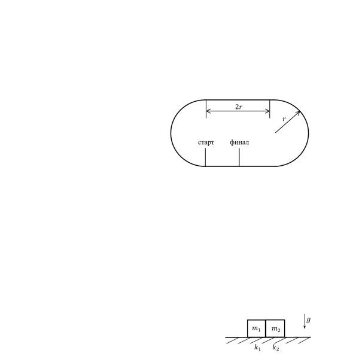

[[Състезания/3/8/2018|◂ 2018]] | [[Състезания/3/8r/2019|решения]] | [[Състезания/3/8/2020| 2020 ▸]]

**Задача 1. Мотоциклети.**

Мотоциклетна писта има форма на стадион. Тя съдържа две полуокръжности с радиус r = 200 m и два прави отсечки с дължина 2r. Стартът е в началото на едната права отсечка, а финалът - в средата на същата старт финал отсечка. Посоката на обикаляне е обратна на часовниковата стрелка. Два мотоциклета се състезават по пистата. В участъците със завои те се движат със скорост v0 = 144 km/h. Стартът е
"летящ" със скорост v0 . През първата половина на правите участъци първият мотоциклет се движи равноускорително с ускорение a1 , като достига максимална скорост v1 = 180 km/h. През втората половина на правите участъци той се движи равнозакъснително със същото по големина ускорение a1 , като намалява скоростта си отново до v0 .

а) Изчислете ускорението a1 . \[2 т.\]

б) Изчислете времето T1 за една обиколка на първия мотоциклет. \[2 т.\]

Вторият мотоциклет прави една обиколка за време T2 = 47,0 s. По правите участъци се движи по същия начин, но с друго по големина ускорение a2 .

в) Изчислете максималната скорост v2 на втория мотоциклет. \[1,5 т.\]

г) Изчислете ускорението a2 , с което вторият мотоциклет се движи по правите участъци. \[1,5 т.\]

След като направи 10 пълни обиколки, вторият мотоциклет финишира.

д) Къде по пистата се намира в този момент първият мотоциклет (направете схема и
отбележете мястото) и с каква скорост v3 се движи? \[3 т.\]

**Задача 2. Хлъзгащи се тела.**

Две тела с форма на кубчета се хлъзгат по хоризонтална повърхност. Земното ускорение е g. Масата на първото тяло е m1 , а на второто е m2 . Коефициентът на триене на първото тяло с повърхността е k1 , а на второто тяло с повърхността е k2 , като k1 > k2 . Ако първото тяло се хлъзга свободно по повърхността, то се движи с
ускорение a1 . Ако второто тяло се хлъзга свободно по повърхността, то се движи с
ускорение a2 . Ако двете тела се движат свободно по повърхността, като са допрени и
първото тяло е пред второто, те се движат с ускорение a.

а) Получете формула как a зависи от a1 , a2 , m1 и m2 . \[3 т.\]

б) Получете формула за силата T, с която второто тяло натиска първото, когато се хлъзгат свободно заедно. Формулата да съдържа само a1 , a2 , m1 и m2 . \[2 т.\]

Измерва се спирачният път на телата при една и съща начална скорост. Първото тяло
изминава път s1 , докато спре; второто - s2 . Когато двете тела се движат заедно, допрени едно до друго, и първото е преди второто, спирачният път е s.

в) Получете формула как s зависи от s1 , s2 , m1 и m2 . \[3 т.\]

г) Получете формула как зависи отношението на масите x = m1 от отношенията на спирачните пътища y = s2 и z = s . Каква е стойността на x, ако y = 3 и z = 2? \[2 т.\]

**Задача 3. Капка и мехурче.**

Когато тяло се движи сравнително бавно в среда (газ или течност), на него му действа
сила на съпротивление, която е пропорционална на скоростта му. Ако тялото има
сферична форма, силата е F = 6$\pi\eta$rv, където r е радиусът на тялото, v - неговата
скорост, а $\eta$ се нарича вискозитет на средата.
a) Каква е мерната единица на вискозитета $\eta$? \[1 т.\]
Мехурче въздух с радиус r изплава в бутилка с олио с постоянна скорост. Плътността на олиото е $\rho_0$ , земното ускорение е g, вискозитетът на олиото е $\eta$.
б) Получете формула за скоростта v на мехурчето. Плътността на въздуха е много по-
малка от плътността на олиото. \[2 т.\]
Капка вода с радиус r потъва в бутилка с олио с постоянна скорост. Плътността на водата е $\rho$.
в) Получете формула за скоростта v1 на водната капка. \[2 т.\]
г) Нека мехурчето въздух и водната капка имат равни радиуси. Скоростта на мехурчето е v = 29 mm/s, а на капката - v1 = 2,5 mm/s. Изчислете плътността $\rho_0$ на олиото.
Плътността на водата е $\rho$ = 1,00 g/cm3. \[2 т.\]
д) Изчислете вискозитета $\eta$ на олиото, ако радиусът на мехурчето е r = 1,00 mm. Земното ускорение е g = 9,8 m/s2. \[2 т.\]
е) Изчислете с каква скорост v2 ще изплава мехурче с два пъти по-малък радиус. \[1 т.\]

Обем на кълбо: $V = \frac43\pi r^3$