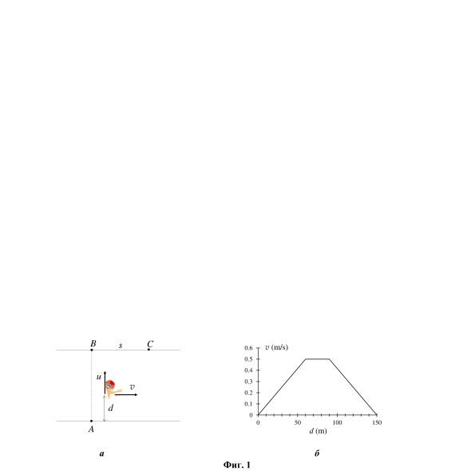
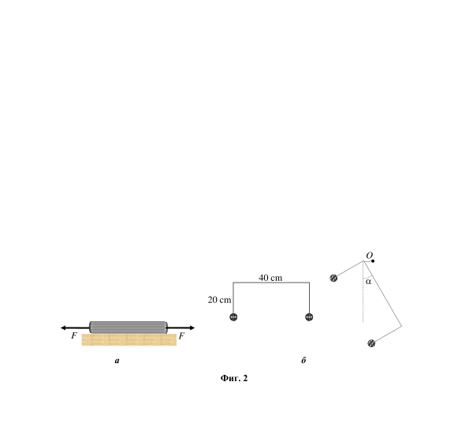
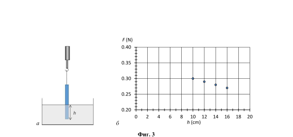

[[Състезания/3/8/2019|◂ 2019]] | [[Състезания/3/8r/2020|решения]] | [[Състезания/3/8/2021| 2021 ▸]]

Във всички задачи от темата приемете, че земното ускорение е $g = 10\ \mathrm{m/s^2}$.

Задача 1. Преплуване на река

Плувец, намиращ се в точка А, решава да преплува от единия до дугия бряг на река с
широчина $L = 150\ \mathrm{m}$ (фиг. 1, а). Скоростта на плувеца в спокойна вода е $u = 0,75\ \mathrm{m/s}$.
Ако реката беше неподвижна, плувецът би попаднал в т. В на другия бряг, намираща се срещу точката А. Поради течението на реката обаче, плувецът достига другия бряг в т. С, намираща се на определено разстояние от т. B по посока на течението.
А) Определете разстоянието , ако приемете, че скоростта на течението е $v = 0,5\ \mathrm{m/s}$ и е постоянна по цялата широчина на реката. (2 точки)
Б) В действителност течението е най-бързо по средата на реката, а близо до бреговете водата е практически неподвижна. На фиг. 1, б е показана графика на зависимостта на скоростта $v$ на течението от разстояниието d до първия бряг. Намерете разстоянието $s$, на което ще бъде отнесен плувецът в този случай. (8 точки)

**Задача 2. Механичен коктейл**

Двете подусловия на задачата са независими едно от друго
А) Две книги, всяка с по 100 листа\*, са поставени така, че всеки лист на едната книга се намира между два листа на другата книга, с изключени на първия лист на едната книга и последния лист на другата книга (фиг. 2, а). Листата са правоъгълни с размери 20 cm $\times$ 30 cm и с повърхнинна плътност\** 50 g/m2. Коефициентът на триене между листата е k = 0,6. Книгите се намират върху гладка хоризонтална повърхност.

Каква минимална хоризонтална сила F трябва да бъде приложена към всяка от книгите, така че те да бъдат отделени една от друга? (6 точки)
\* Приемете, че книгите нямат корици. Не бъркайте лист със страница - един лист има
две страници.

\** Повърхнинна плътност е масата на единица площ от лист хартия. Обикновено се
измерва в грамове на квадратен метър.
Полезна формула: Сумата на първите N естествени числа е:
$$1+2+\dots+N = \frac{N(N+1)}{2}$$

Б) Две еднакви малки метални топчета са свързани с тел, огъната под формата на
буквата "П", както е показано на фиг. 2, б - вляво. Масата на телта е пренебрежима в
сравнение с масата на топчетата. Размерите на телта са показани на фигурата.
Телта е окачена на пирона О, забит в стената (фиг. 2, б - вдясно). Какъв ъгъл $\alpha$ с
вертикалата сключва дългата страна на телта, когато топчетата се намират в
равновесие? (4 точки)

Задача 3. Опит с линийка

Правоъгълна пластмасова линийка с дължина $l = 50\ \mathrm{cm}$ е окачена на куката на силомер посредством лека нишка (фиг. 3, а). Долният край на линийката е потопен в
съд с вода. Показанието F на силомера е отчетено при няколко различни дълбочини h
на потапяне на линийката във водата, като данните са представени с точки на
графиката, показана на фиг. 3, б. Като използвате данните от графиката, определете
плътността на пластмасата, от която е направена линийката. Ще плава или ще потъне
линийката във водата, ако нишката бъде прерязана?
 (10 точки)

Приемете, че плътността на водата е $\rho = 1000\ \mathrm{kg/m^3}$.

