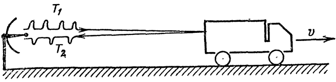

[[Състезания/3/8/2021|◂ 2021]] | [[Състезания/3/8r/2022|решения]] | [[Състезания/3/8/2023| 2023 ▸]]

Задача 1. Локация и движение

Част А. На фиг. 1 е показана локаторна станция, която изпраща последователно светлинни импулси през интервали от време T1 . Отразените от автомобила импулси се връщат назад към локаторната станция през равни интервали от време T2 . Определете скоростта на автомобила, като я изразите посредсдтвом T1, T2 и скоростта на сметлината c. \[4,5 т.\]

 Фиг. 1

Част Б. От база се изстрелват последователно по една и съща права две ракети с еднаква скорост. Локаторна станция в базата изпраща светлинни импулси през равни интервали от време T1 . Всеки светлинен импулс, отразен от първата ракета, попада в локаторната станция едновременно със следващия излъчен от нея импулс, отразен от втората ракета. Отразените импулси винаги попадат в локаторната станция през равни интервали от време T2 .

а) Определете времето, за което светлинен импулс изминава разстоянието между ракетите по посока на движението им и в обратна посока на движението им. \[3,5 т.\]

б) Намерете разстоянието l между ракетите. \[2,0 т.\]

Пояснение. При разпространението си част от светлинния импулс може да се отрази от първоначално достигнатата от него ракета, а останалата част ше се отрази, когато достигне следващата ракета.

Задача 2. Движение на система от тела

На фиг. 2 е показана система от две тела, които са свързани с неразтеглива нишка с пренебрежима маса. Нишката действа с еднаква сила на опън върху телата. Всички повърхности са гладки и телата се движат без триене. Масата на макарите се пренебрегва. Трупчето 1 с маса m1 = 150 g , което се намира над L-образната рама 2 с маса m2 = 1,65 kg , започва да се движи без начална скорост от височина h = 1,25 m , като през Фиг. 2 цялото време се допира в рамата.

а) Покажете, че вертикалното ускорение а1 на тялото 1 и хоризонталното ускорение а2 на двете тела (трупчето и L-образната рама) са свързани с равенството a1 = 2a2 . \[3 т.\]

б) Намерете силата на опън Т на нишката. \[4 т.\]

в) Определете времето, за което тялото 1 изминава разстоянието h. \[3 т.\]

Приемете земното ускорение за g = 10 m/s 2 .

Задача 3. Плаващи кубчета лед

 В първия от три цилиндрични съда с вода се пуска кубче чист лед, във втория - кубче лед със замразено в него дървено топче, а в третия - кубче лед със замразено в него желязно топче. И трите кубчета плават във водата частично потопени. Как ще се измени нивото на водата във всеки от цилиндричните съдове, след като ледът се разтопи - ще се повиши, няма да се измени, ще се понижи? Обосновете отговора си. \[10 т.\]