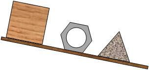
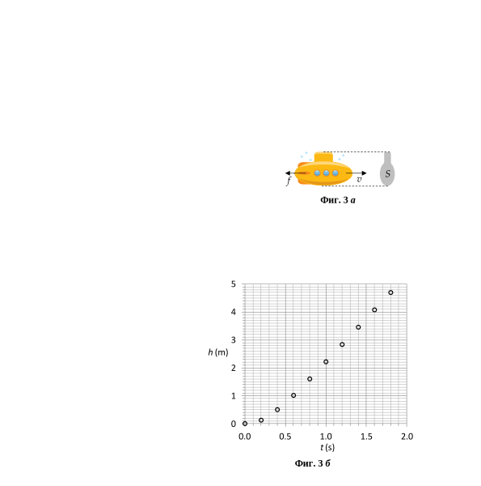

[[Състезания/3/8/2022|◂ 2022]] | [[Състезания/3/8r/2023|решения]] | [[Състезания/3/8/2024| 2024 ▸]]

**Задача 1. Равновесие** (задачата се състои от две независими части)

**Част 1.** На хоризонтална дъска са поставени три тела - дървено кубче, шестоъгълна гайка и триъгълна призма. Дъската започва да се накланя бавно, както е показано на фиг. 1 (а), докато заеме вертикално положение. В какъв ред ще започнат да се търкалят трите тела по дъската? Обосновете отговора си и го илюстрирайте с подходящ чертеж.

Приемете, че триенето между телата и дъската е толкова голямо, че когато дъската се
накланя, всяко от телата първо се преобръща и започва да се търкаля по нея, без да се хлъзга по повърхността ѝ. Телата са отместени едно спрямо друго в направление,
перпендикулярно спрямо чертежа, така че дори по-горно тяло да започне да се търкаля по-рано, то няма да се удари в телата под него.

**Част 2.** Парче тел с дължина 24 cm е огънато по средата под ъгъл , така че образува
рамка с формата на латинската буква "L". Едната половина на рамката се намира върху хоризонтална маса, а другата половина - виси надолу, както е показано на фиг. 1 (б). На какво максимално разстояние x от ръба на масата може да бъде отместен върхът на рамката (вж. фигурата), без тя да се наклони или преобърне?

 Фиг. 1

**Задача 2. Трупчета и макари**

Лека макара има два улея с различен радиус, съответно $R_1 = 4\ \mathrm{cm}$ и $R_2 = 5\ \mathrm{cm}$, както е показано на фигурата. Макарата може да се върти без триене около неподвижна хоризонтална ос O. Около двата улея са намотани тънки леки нишки, на чиито свободни краища от различни страни спрямо оста са окачени две теглилки, 1 и 2, с еднаква маса $m = 0,1\ \mathrm{kg}$.

В началния (нулев) момент теглилките са неподвижни и се намират на еднаква височина $h = 0,5\ \mathrm{kg}$ над хоризонтален под. След това теглилките са оставени да се движат, при което една от тях започва да се спуска надолу, а другата - да се издига нагоре. Приемете, че по време на движението на теглилките: 1) никоя от нишките не се размотава изцяло; 2) теглилката, която се издига, не се удря в макарата.

а) Коя от двете теглилки започва да се спуска и коя - да се издига? Обосновете
отговора си. \[1,5 т\]

б) Нека в определен момент скоростите на теглилките са и съответно. Изразете
отношението чрез дадените в условието величини. \[2,0 т\]

в) Определете скоростите на теглилките в момента, когато движещата се надолу
теглилка достига пода? \[5,5 т\]

г) На каква максимална височина hmax над пода се издига другата теглилка? \[1,0 т\]
В тази задача можете да приемете, че $g\approx 10\ \mathrm{m/s^2}$.

**Задача 3. Потъване**

На тяло, движещо се в течност или газ, освен изтласкващата сила, действа и сила на съпротивление $f$ в посока, противоположна на посоката на неговата скорост $v$, както е илюстрирано на фиг. 3 a. Големината на силата на съпротивление зависи от скоростта на тялото по закона:

$$f = C\rho_0 v^2 S,$$

където е плътността на течността, а $S$ е лицето на напречното сечение на тялото, т.е.
лицето на фигурата, която бихме виждали, ако гледаме срещу движещото се към нас
тяло, както е показано на фиг. 3 а. Коефициентът $C$ се нарича коефициент на челно
съпротивление и зависи от конкретната форма на тялото.

Метално кълбо с радиус $R$ и с плътност $\rho$ e пуснато да потъва с нулева начална скорост в течност с по-малка плътност $\rho_0$. Ако течността е достатъчно дълбока, кълбото достига определена гранична скорост $v_\text{г}$, след което продължава да се движи равномерно. Приемете, че в началния момент кълбото е изцяло потопено в течността.

а) Определете ускорението на кълбото в момента, когато е пуснато да потъва. \[2,5 т\]

б) Получете израз за граничната скорост , която достига кълбото. \[2,5 т\]
В точки а) и б) изразете търсените величини посредством $\rho$, $\rho_0$, $R$, земното ускорение $g$ и коефициента $C$ на челно съпротивление на кълбото.
в) В басейн е пуснато да потъва метално кълбо с радиус $R=10\ \mathrm{cm}$. На фиг. 3 б са дадени експериментално измерени данни за дълбочината на горния край на кълбото в различни моменти от време , преди кълбото стигне дъното. Като използвате данните от графиката, определете приблизително плътността $\rho$ на метала и коефициента на челно съпротивление на кълбото. \[5,0 т\]

**Данни и полезни формули:**

Земно ускорение, $g=10\ \mathrm{m/s^2}$;
Плътност на водата, $\rho_0 = 1000\ \mathrm{kg/m^3}$;
Лице на кръг: и обем на кълбо: $V = (4/3)\pi R^3$.