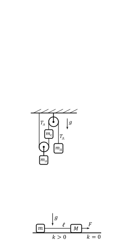
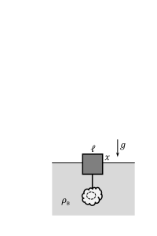

[[Състезания/3/8/2024|◂ 2024]] | [[Състезания/3/8r/2025|решения]]

**Задача 1. Вертикално движение (задачата се състои от две независими части)**

Част I Малка топка е пусната свободно от височина $9h$. След като топката изминава
разстояние $d$, втора топка е пусната без начална скорост от височина $h$. На колко трябва да е равно $d$, така че топките да паднат на земята по едно и също време? \[2,5 т.\]
Част II Три теглилки са окачени на две безмасови макари чрез безмасови неразтегливи нишки, както е показано на фигурата вляво.
Масата на средната теглилка е $m_\text{с} = 0,3\ \mathrm{kg}$, докато лявата и дясната теглилки са с неизвестни маси $m_\text{л}$ и $m_\text{д}$. Първоначално средната теглилка се движи нагоре с ускорение $a_\text{с} = 2\ \mathrm{m/s^2}$. След това лявата и дясната теглилки са разменени, при което средната теглилка започва да се движи надолу със същото ускорение. Може да използвате, че земното ускорение е $g\approx 10\ \mathrm{m/s^2}$. Съпротивлението на въздуха да се
пренебрегне.

а) Определете масите $m_\text{л}$ и $m_\text{д}$ на крайните теглилки. \[5,5 т.\]

б) На колко са равни силите на опън $T_\text{л}$ и $T_\text{д}$ на лявата и дясната нишка преди размяната на теглилките? \[1 т.\]

в) Намерете силите на опън $T_\text{л}'$ и $T_\text{д}'$ на лявата и дясната нишка след размяната. \[1 т.\]

**Задача 2. Трупчета на нишка**

Две малки трупчета с неизвестни маси са свързани с безмасова неразтеглива нишка с дължина $l = 2\ \mathrm{m}$ по начина, показан на фигурата вляво. Отношението на масите
е $M/m = 2$. Първоначално трупчетата са в покой. В даден момент на дясното трупче започва да действа неизвестна сила $F$, насочена надясно. Отначало системата се придвижва на разстояние $s=l/2$ по хоризонтална повърхност, като коефициентът на триене между трупчетата и повърхността е $k = 0,1$. След това дясното трупче стига до гладък участък, където коефициентът на триене става равен на нула, а силата на опън на нишката нараства с $50\%$. Нишката не издържа на по-голямата сила на опън и се къса в момента, когато дясното трупче е изминало разстояние $s'=l/4$ върху гладкия участък. Земното ускорение е $g\approx 10\ \mathrm{m/s^2}$.
а) Намерете ускорението $a$ на трупчетата преди достигане до гладкия участък. Колко е ускорението на системата, след като дясното трупче достигне гладкия участък? \[5 т.\]
б) На колко е равна скоростта $v_\text{сп}$
на дясното трупче в момента, когато лявото трупче спира да се движи? Определете разстоянието $d_\text{сп}$ между трупчетата в този момент. \[5 т.\]

**Задача 3. Кинематика и хидростатика (задачата се състои от две независими части)**

Част I Двама мотоциклетисти се състезават на писта, съставена от два успоредни прави участъка (с една и съща дължина $L = 0,5\ \mathrm{km}$), съединени с къси 180-градусови завои на двата си края. Мотоциклетистите тръгват от единия край на пистата (с нулева начална скорост), движат се равноускорително с ускорения $a_\text{1у} = 9\ \mathrm{m/s^2}$ и $a_\text{2у} = 8\ \mathrm{m/s^2}$, след което бият спирачки (движейки се равнозакъснително с ускорения $a_\text{1з} = 10\ \mathrm{m/s^2}$ и $a_\text{2з} = 12\ \mathrm{m/s^2}$), за да завият на другия край с пренебрежимо малка скорост. Движението в обратната посока е аналогично, след което двамата продължават по същия начин да обикалят по пистата до края на състезанието.
а) Намерете времената $T_1$ и $T_2$, за които мотоциклетистите изминават половин обиколка (от единия край на пистата до другия). \[2,5 т.\]
б) Колко е разстоянието $d$ между мотоциклетите $t = 7\ \mathrm{min}$ след началото на състезанието?
Приемете, че разстоянието между правите участъци е пренебрежимо малко. \[1,5 т.\]
в) С колко метра по-бързият мотоциклетист е изпреварил по-бавния $t'=20\ \mathrm{min}$ след началото на състезанието? \[1,5 т.\]

Част II Куб със страна $l = 10\ \mathrm{cm}$ и неизвестна плътност $\rho_\text{к}$ е закачен с тънка безмасова нишка за неправилно тяло от материал с шест пъти по-голяма плътност. Общият обем $V$ на тялото е неизвестен (в тялото има кухина с неизвестен обем $V'$). Сумарната
маса на куба и тялото е $M = 2\ \mathrm{kg}$. Свързаните предмети са пуснати да плават в дълбок и широк съд, пълен с вода с плътност $\rho_\text{в} = 1\ \mathrm{g/cm^3}$, както е показано на фигурата вляво. С $x = l/2$ сме означили височината на издигане на куба над повърхността на водата. След това в горната част на неправилното тяло е пробит малък отвор, така че кухината се напълва с вода. Кубът има нова височина $y = l/3$ на издигане над водата в равновесие.
а) Определете целия обем $V$ на неправилното тяло и обема $V'$ на кухината. \[2 т.\]
б) Намерете плътността $\rho_\text{к}$ на куба. \[1 т.\]
в) С колко процента нараства силата на опън на нишката, след като кухината се напълва с вода? \[1,5 т.\]
