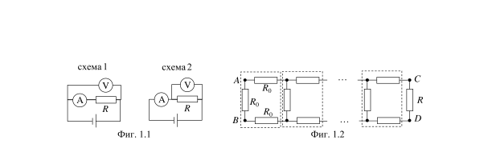
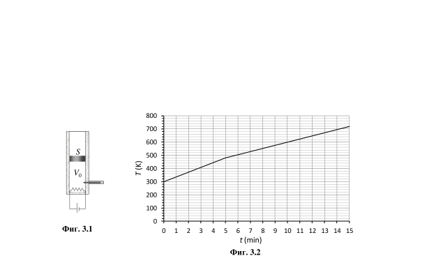

[[Състезания/3/9/2023|◂ 2023]] | [[Състезания/3/9r/2024|решения]] | [[Състезания/3/9/2025| 2025 ▸]]

**Задача 1. Електрически микс**

Задачата се състои от две независими части, които може да решавате в ред, който
предпочитате.

**Част 1. Объркани измервания**

Иван и Гергана правили в клас лабораторно упражнение на тема "Опитно определяне на съпротивлението на резистор". Разполагали с резистор с неизвестно съпротивление R, източник на постоянно напрежение, волтметър и амперметър. Иван свързал схема №1, показана на фиг. 1.1, и отчел показания на волтметъра и на амперметъра съответно U1 = 9,2 V и I1 = 11,5 mA. Гергана свързала схема №2 и установила, че показанията на двата уреда са съответно U2 = 8,9 V и I2 = 12,0 mA. След като не могли да разберат защо в двата случая се получават различни резултати, учителката им подсказала, че волтметърът и амперметърът не са идеални прибори, а имат определено вътрешно съпротивление, т.е. измервателните уреди може да се разглеждат като консуматори, всеки със свое характерно съпротивление. \[5,0 т\]

Като използвате данните от двете измервания, пресметнете вътрешното съпротивление RA на амперметъра, вътрешното съпротивление RV на волтметъра и неизвестното съпротивление R на резистора.

**Част 2. Електрическо "Лего"**

Конструктор тип "Лего" се състои от еднакви елементи (секции), съдържащи по три еднакви резистора със съпротивление R всеки, свързани под формата на буква "П" (фиг. 1.2). Елементите може да се свързват помежду си в редица по начина, показан на фигурата. Многоточията на фигурата означават, че може да се свързват произволен брой секции. Резистор с какво съпротивление R трябва да бъде свързан към изходните клеми C и D на последния елемент така, че еквивалентното съпротивление между свободните краища А и В на първия елемент да не зависи от броя на свързаните елементи? \[5,0 т\]

**Задача 2. Център на тежестта на трапец**

В тази задача трябва да определите положението на центъра на тежестта на две тела с неправилна форма, т.е. две несиметрични тела. В зависимост от начина на решаване на задачата, можете да използвате факта, че потенциалната енергия на тяло с маса M и с произволни размери и форма се дава с израза $E_\Pi = Mgh_G$, където е височината на неговия център на тежестта.

а) В краищата A и В на пръчка с дължина и с пренебрежима маса са поставени малки топчета с маса m и 2m съответно (фиг. 2.1). На какви разстояния $l_1$ и $l_2$ от А и В съответно се намира центърът G на тежестта на това тяло? Размерът на топчетата се пренебрегва в сравнение с дължината на пръчката. \[2,0 т\]

б) От твърд картон е изрязана плоска пластина ABCD с форма на правоъгълен трапец с размери AB = 2a и CD = AD = а, както е показано на фиг. 2.2. Определете координатите $x_G$ и $y_G$ на центъра G на тежестта на пластината спрямо координатна система с оси x и y съответно по страните АВ и AD.. \[8,0 т\]

**Задача 3. Вътрешна енергия на газ**

На фиг. 3.1 е показана схема на експериментална постановка за изследване на топлинните свойства на газове. В дълъг цилиндър с площ на основата се намира леко подвижно бутало с пренебрежима маса, което се допира плътно до стените на цилиндъра. В цилиндъра са монтирани електрически нагревател със съпротивление  , който може да бъде включен към източник на напрежение , и термометър, с чиято помощ се измерва температурата на газа в цилиндъра. Обемът на нагревателя и на термометъра е пренебрежимо малък. Топлообменът между стените на цилиндъра и околния въздух не се отчита.

Първоначално под буталото се намира хелий с обем $V_0 = 1 l$, температура $T_0 = 300\ \mathrm K$ и налягане $p_0 = 1,0.10^5\ \mathrm{Pa}$, равно на налягането на външния въздух. Нагревателят е включен към източника на напрежение в продължение на 15 минути. На фиг. 3.2 e показана графика на зависимостта на температурата T на хелия от времето t след включването на нагревателя.

а) Оказва се, че до момента $t_1 = 5\ \mathrm{min}$ буталото остава неподвижно в цилиндъра. Колко е максималната сила на триене $f_{\max}$ между буталото и стените на цилиндъра? \[4,5 т\]

б) След петата минута газът започва да се разширява, като много бавно избутва буталото към края на тръбата. Колко е обемът $V_2$ на газа в крайния момент $t_2 = 15\ \mathrm{min}$? \[2,0 т\]

в) Колко е промяната $\Delta U$ на вътрешната енергия на хелия за цялото време, през което е включен нагревателят? \[3,5 т\]