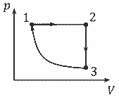
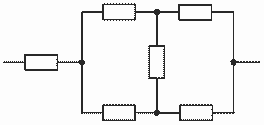
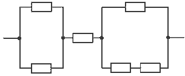
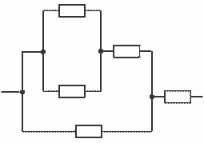

[[Състезания/3/9/2018|◂ 2018]] | [[Състезания/3/9/2019|условия]] | [[Състезания/3/9/2020| 2020 ▸]]

**Задача 1. Хлъзгащо се трупче**

**а)** Върху двете хоризонтални повърхности трупчето се движи равнозакъснително с ускорение $a$, породено от силата на триене при хлъзгане $f = kN = kmg$, откъдето $a = kg$.

\[0,5 т.\] Изминатият от трупчето път върху горния хоризонтален участък е $l_1 = v_0 t_1 - \frac{kgt_1^2}{2}$

\[0,5 т.\], където $t_1$ е времето за достигане на склона. Крайната скорост на трупчето върху горната хоризонтална повърхност е $\frac{v_0}{2} = v_0 - kgt_1$ \[0,5 т.\], т.е. $t_1 = \frac{v_0 - v_0/2}{kg} = \frac{v_0}{2kg}$. \[0,5 т.\]

Като заместим $t_1$ в израза за пътя, ще получим, че $l_1 = \frac{3v_0^2}{8kg}$. \[0,5 т.\] След спускането по склона, трупчето се движи равнозакъснително с начална скорост $v'_0$, т.е. крайната му скорост по долния хоризонтален участък е $v'_0 / 3 = v'_0 - kgt_2$ \[0,5 т.\], където $t_2$ е съответното време за движение. Следователно $t_2 = \frac{v'_0 - v'_0/3}{kg}$. \[0,5 т.\] Дадено е, че $t_2 = 2t_1 = \frac{v_0}{kg}$, откъдето $v'_0 = \frac{4v_0}{3}$.

\[0,5 т.\] Оттук следва, че по долната хоризонтална повърхност трупчето изминава път $l_2 = v'_0 t_2 - \frac{kgt_2^2}{2} = \frac{4v_0^2}{3kg} - \frac{v_0^2}{2kg} = \frac{5v_0^2}{6kg}$. \[0,5 т.\] За изминатото разстояние по горния хоризонтален участък получаваме: $l_1 = \frac{3v_0^2}{8kg} = \frac{9 l_2}{20} = 9$ м. \[1 т.\]

**б)** Силата на триене при хлъзгане извършва обща работа $A_{\text{тр}} = -kmg(l_1 + l_2)$ \[0,5 т.\], откъдето $k = \frac{A_{\text{тр}}}{mg(l_1 + l_2)} = -\frac{20 A_{\text{тр}}}{29 mg l_2} = 0,2$. \[1 т.\]

**в)** От израза за изминатия път по долния хоризонтален участък следва, че началната скорост $v_0 = \sqrt{\frac{6 k g l_2}{5}} = \sqrt{-\frac{24 A_{\text{тр}}}{29 m}} \approx 6,9$ м/с. \[1 т.\]

**г)** При спускането на трупчето по склона се запазва неговата механична енергия: $E_1 = E_{\text{к1}} + E_{\text{п1}} = \frac{m v_1^2}{8} + mgh = \frac{m v_0'^2}{2} = \frac{8 m v_0^2}{9} = E_{\text{к2}} = E_2$, където величините с индекс “1” се отнасят за момента непосредствено преди спускането, а величините с индекс “2” се отнасят за трупчето в подножието на склона. \[1 т.\] Оттук получаваме, че височината на склона е $h = \frac{55 v_0^2}{72 g} \approx 3,7$ м. \[1 т.\]

**Задача 2. Топлинен двигател**

**а)** Процесите са представени на $p - V$ диаграмата вляво. \[1,5 т.\]

**б)** Процесът 1-2 представлява изобарно разширение на газа, така че тогава той получава топлина: $Q_{12} > 0$. \[0,5 т.\] При процеса 2-3 газът изстива изохорно, т.е. губи топлина: $Q_{23} < 0$. \[0,5 т.\] Процесът 3-1 включва изотермно свиване, което означава, че газът отдава топлина: $Q_{31} < 0$. \[0,5 т.\]

**в)** Приетата от газа топлина по време на цикъла е топлината, получена при изобарния процес: $Q_1 = Q_{12} = U_2 - U_1 - A_{12} = \frac{3B(T_2 - T_1)}{2} + p_1(V_2 - V_1)$, като сме използвали първия принцип на термодинамиката. \[1,5 т.\] С $U_1$ и $U_2$ означаваме вътрешните енергии на газа в състояния (1) и (2), а с $A_{12}$ – работата на външните сили за разширяване на газа при постоянно налягане ($p_1 = p_2$). Като приложим закона за изобарния процес, получаваме за количеството топлина $Q_1 = \frac{3B\Delta T}{2} + \frac{p_1 V_1 T_2}{T_1} - p_1 V_1 = \frac{3B\Delta T}{2} + B T_2 - B T_1 = \frac{3B\Delta T}{2} + B\Delta T = \frac{5B\Delta T}{2}$. \[1,5 т.\] Работата, извършена от газа за един цикъл, е $A' = A'_{12} + A'_{31} = -A_{12} - A_{31} = p_1(V_2 - V_1) - A_{31} = B\Delta T - A_{31}$. \[1 т.\] КПД на двигателя е $\eta = \frac{A'}{Q_1} = \frac{2(B\Delta T - A_{31})}{5B\Delta T}$ \[1 т.\], откъдето следва, че $\Delta T = \frac{2A_{31}}{(2-5\eta)B} \approx 64$ К. \[2 т.\]

**Задача 3. Електрически вериги**

**а)** Като отчетем, че идеалният волтметър има безкрайно голямо съпротивление, еквивалентна схема на най-горната електрическа верига от условието на задачата е представена на фигурата вляво. \[1 т.\] Последователно на най-левия резистор е свързан балансиран Уитстонов мост – поради симетрията не е възможно да тече ток през вертикално свързания резистор в средата на моста, откъдето следва, че може да го отстраним от веригата. \[1 т.\] Съпротивлението, което ще се измери между краищата на веригата в този случай, е $R_{\text{г}} = R + \frac{2R \cdot 2R}{2R + 2R} = R + R = 2R$. \[1,5 т.\]

**б)** Еквивалентната схема за тази верига е изобразена на фигурата вляво. \[0,5 т.\] Двата най-леви успоредно свързани резистора са свързани последователно на средния резистор и на друга група от успоредно и последователно свързани резистори. Следователно, общото съпротивление на тази верига е $R_{\text{с}} = \frac{R \cdot R}{R+R} + R + \frac{2R \cdot R}{2R+R} = \frac{R}{2} + R + \frac{2R}{3} = \frac{13R}{6}$. \[2 т.\]

**в)** В този случай еквивалентната схема е дадена на фигурата вляво. \[1,5 т.\] Електричното съпротивление между краищата на веригата е равно на $R_{\text{д}} = R \left( \frac{R \cdot R}{R+R} + R \right) / \left( \frac{R \cdot R}{R+R} + R + R \right) + R = R \left( \frac{3R}{2} \right) / \left( \frac{5R}{2} \right) + R$, т.е. $R_{\text{д}} = \frac{3R}{5} + R = \frac{8R}{5}$. \[2,5 т.\]