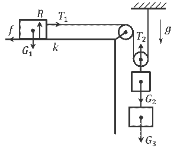
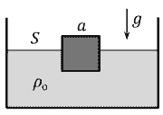
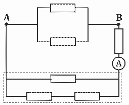
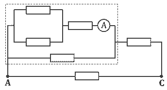

[[Състезания/3/9/2020|◂ 2020]] | [[Състезания/3/9/2021|условия]] | [[Състезания/3/9/2022| 2022 ▸]]

**Задача 1. Трупчета и макари**

**а)** Първоначално на трупчето с маса $m_1$ действа силата на тежестта $G_1 = m_1g$ надолу, реакцията на опората $R = G_1$ нагоре, силата на опън $T_1$ надясно и силата на триене $f = kR = km_1g$ наляво. \[0,5 т.\] На трупчетата с маси $m_2$ и $m_3$ действат сили на тежестта $G_2 = m_2g$ и $G_3 = m_3g$, но силата на опън от страна на подвижната макара е $T_2 = 2T_1$ (поради факта, че макарите са безмасови). \[0,5 т.\] След срязването на нишката трупчето с маса $m_3$ вече не е част от системата и останалите две трупчета се движат равномерно, т.е. без ускорение. Новите сили на опън ще означим с $T_1'$ и $T_2' = 2T_1'$. Като приложим II принцип на Нютон след прерязването на нишката, ще получим: $T_1' - km_1g = 0$ \[0,5 т.\] (за трупчето с маса $m_1$) и $m_2g - T_2' = m_2g - 2T_1' = 0$ \[0,5 т.\] (за трупчето с маса $m_2$). От двете уравнения следва, че $\frac{m_2}{m_1} = 2k = 0,4$. \[1 т.\]

**б)** По условие $T_1' = \frac{T_1}{2}$, откъдето $T_1 = 2T_1' = 2km_1g$. \[0,5 т.\] От II принцип на Нютон за движението на лявото трупче преди срязването на нишката се получава, че $m_1a_1 = T_1 - km_1g$ \[0,5 т.\], откъдето $a_1 = kg \approx 2 \text{ m/s}^2$ \[1 т.\]. Може да се съобрази, че $a_1 = 2a_2$, тъй като трупчето с маса $m_1$ изминава двойно по-голям път от трупчето с маса $m_2$, а пътят е пропорционален на ускорението при движение без начална скорост. \[0,5 т.\] Оттук следва, че $a_2 = \frac{a_1}{2} = \frac{kg}{2} \approx 1 \text{ m/s}^2$. \[0,5 т.\]

**в)** От II принцип на Нютон за движението на десните трупчета преди срязването на нишката се получава: $(m_2 + m_3)a_2 = (m_2 + m_3)g - T_2$. \[0,5 т.\] Като използваме, че $m_2 = 2km_1$, $a_2 = \frac{kg}{2}$ и $T_2 = 2T_1 = 4km_1g$, ще получим след опростяване, че $\frac{m_3}{m_1} = \frac{2k(k+2)}{2-k} = \frac{22}{45} \approx 0,5$. \[1,5 т.\]

**г)** Скоростта на лявото трупче в момента на прерязването на нишката е $v_1 = \sqrt{2a_1d} = \sqrt{2kgd}$, а скоростта на десните трупчета е $v_2 = v_1/2 = \sqrt{kgd/2}$. \[1 т.\] Сумарната кинетична енергия на системата в момента на прерязването е $E_{\text{к}} = \frac{m_1v_1^2}{2} + \frac{(m_2+m_3)v_2^2}{2} = \frac{k(2+k)gdm_1}{2-k} \approx 0,3 \text{ J}$. \[1 т.\]

**Задача 2. Хидростатика**

Когато кубчето плава само в олио, от закона на Архимед следва, че $\rho_ca = \rho_o(a - h_o)$. \[1 т.\] От условието за плаване само във вода имаме, че $\rho_ca = \rho_w(a - h_w)$. \[1 т.\] След изливането на олио върху водата се получава, че $\rho_ca = \rho_od_o + \rho_wd_w$, където с $d_o$ сме означили дебелината на слоя олио, а с $d_w$ – дълбочината на потапяне на кубчето във водата под олиото. \[1 т.\] От условието, че дълбочината на потапяне на кубчето във водата намалява наполовина след наливането на олиото, следва съотношението $d_w = \frac{a-h_w}{2}$, т.е. $a - h_w = 2d_w$. \[0,5 т.\] Може да се съобрази също така, че $d_o + h = a$. \[0,5 т.\] От горните уравнения следва, че $d_o = \frac{\rho_wd_w}{\rho_o}$ \[0,5 т.\], откъдето $d_w = \frac{\rho_o(a-h)}{\rho_o+\rho_w}$ \[0,5 т.\]. Плътността на кубчето е $\rho_c = \frac{2\rho_wd_w}{a} = \frac{2\rho_w\rho_o(a-h)}{a(\rho_o+\rho_w)} \approx 0,57 \text{ g/cm}^3$. \[1 т.\] От първото уравнение по-горе се вижда, че $\rho_o(a - h_o) = 2\rho_wd_w = \frac{2\rho_w\rho_o(a-h)}{\rho_o+\rho_w}$ \[0,5 т.\], откъдето $h_o = a - \frac{2\rho_w(a-h)}{\rho_o+\rho_w} = \frac{2h\rho_w-a(\rho_w-\rho_o)}{\rho_o+\rho_w} \approx 1,8 \text{ cm}$ \[1 т.\]. От друга страна $h_w = a - 2d_w = \frac{2h\rho_o+a(\rho_w-\rho_o)}{\rho_o+\rho_w} \approx 2,2 \text{ cm}$. \[1 т.\] Обемът на налятото олио е $V_o = d_o(S - a^2) = \frac{\rho_w(a-h)(S-a^2)}{\rho_o+\rho_w} \approx 120 \text{ cm}^3$. \[1,5 т.\]

**Задача 3. Електрическа верига**

**а)** Електрическата верига може еквивалентно да се представи по начина показан на фигурата вляво. \[1 т.\] Еквивалентното съпротивление на резисторите, оградени от пунктирания правоъгълник, е $\frac{(2R)R}{2R+R} = \frac{2R}{3}$. \[0,5 т.\] Последователно на тях е свързан амперметърът и още един резистор. Съпротивлението, което ще се измери между точките **A** и **B**, е равно на $R_{AB} = \frac{\frac{R}{2}(\frac{2R}{3}+R)}{\frac{R}{2}+\frac{2R}{3}+R} = \frac{5R}{13}$. \[1 т.\] Ако подадем напрежение $U_{AB}$ между точките **A** и **B**, през амперметъра ще протече ток $I_1 = \frac{U_{AB}}{\frac{5R}{3}} = \frac{3U_{AB}}{5R}$. \[1 т.\]

**б)** Електрическата верига може също така да се представи, както е показано на фигурата вляво. \[1,5 т.\] В този случай еквивалентното съпротивление на резисторите, оградени от пунктирания правоъгълник, е $\frac{R(R+\frac{R}{2})}{2R+\frac{R}{2}} = \frac{3R}{5}$. \[1 т.\] Съпротивлението между точките **A** и **C** е равно на $R_{AC} = \frac{R(R+\frac{3R}{5})}{2R+\frac{3R}{5}} = \frac{8R}{13}$. \[1 т.\] Ако подадем напрежение $U_{AC}$ между точките **A** и **C** в тази верига, през горните пет резистора ще протече ток $I_{\text{г}} = \frac{U_{AC}}{\frac{8R}{5}} = \frac{5U_{AC}}{8R}$. \[1 т.\] Напрежението върху оградената част от веригата ще бъде $U_{\text{огр}} = U_{AC} - I_{\text{г}}R = \frac{3U_{AC}}{8}$. \[1 т.\] Токът през амперметъра ще е $I_2 = \frac{U_{\text{огр}}}{\frac{3R}{2}} = \frac{2U_{\text{огр}}}{3R} = \frac{U_{AC}}{4R}$. \[1 т.\]