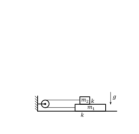
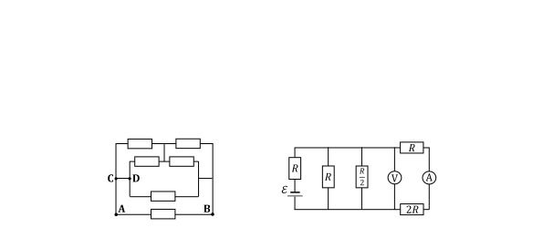

[[Състезания/esenno/10/2019|◂ 2019]] | [[Състезания/esenno/10r/2022|решения]] | [[Състезания/esenno/10/2023| 2023 ▸]]

Задача 1. Трупчета на нишка

Две трупчета (с неизвестни маси m1 и m2 ) са свързани с безмасова неразтеглива нишка, както е показано на фигурата вляво. Трупчетата са едно върху друго, като коефициентът на триене между трупчетата и между долното трупче и хоризонталната повърхност е един и същ k (неизвестен). Нишката е прекарана през неподвижно окачена безмасова макара. Може да използвате, че земното ускорение е g $\approx$ 10 m/s2 . Съпротивлението на въздуха да се пренебрегне.

а) Дадено е, че ако дърпаме горното трупче надясно със сила F, то силата на опън Tг на нишката е двойно по-голяма от силата на опън Tд на нишката, когато дърпаме долното трупче надясно със същата сила F, т.е. Tг = 2Tд . В двата случая трупчетата се движат спрямо макарата с едно и също по големина ускорение a. Изразете силата F и големината на ускорението a на трупчетата чрез масите m1 и m2 , коефициента на триене k и земното ускорение g. \[4,5 т.\]

б) Нека първоначално дърпаме горното трупче със силата F от предното подусловие. В даден момент силата на дърпане спада до силата Fр , при която системата се движи равномерно. В този момент силата на опън на нишката намалява три пъти. Намерете отношението m2 /m1 на масите на трупчетата. \[2 т.\]

в) Докато системата се движи равномерно по начина, описан в предното подусловие,
нишката е прерязана и горното трупче започва да се движи спрямо макарата с ускорение a' = 4 m/s2 . Определете коефициента на триене k. На колко е равно ускорението a от първото подусловие? \[2,5 т.\]

г) Ако масата на долното трупче е m1 = 1 kg, пресметнете стойностите на силите F и Fр от предните подусловия. \[1 т.\]

Задача 2. Трептяща система

 Теглилка с неизвестна маса m е поставена в съд с
 k M неизвестна маса M, който е закачен за безмасова
 F
 m пружина с неизвестен коефициент на еластичност k,
 както е показано на фигурата вляво. Съдът може да
се хлъзга без триене по хоризонталната повърхност. В началото системата се намира в
равновесие, като пружината е разтегната с $\Delta$x0 = 8 cm при неизвестна приложена сила F.
Началната еластична потенциална енергия на пружината е Eп0 = 320 mJ. След като
външната сила F престава да действа, механичната система започва да трепти хармонично.
Сцеплението между теглилката и дъното на съда е достатъчно голямо, за да не се движи
теглилката спрямо съда. Известно е, че максималното ускорение на съда по време на
трептенето е amax = 2 m/s2 . Съпротивлението на въздуха да се пренебрегне.

а) Намерете коефициента на еластичност k на пружината. \[1 т.\]

б) Определете големината на силата F. \[1 т.\]

в) Каква е максималната скорост vmax на движение на съда по време на трептенето? \[3,5 т.\]

В положението на максимално свиване на пружината теглилката е мигновено дръпната извън
съда. След това съдът продължава да трепти хармонично с наполовина по-малък период.

г) Намерете на колко са равни масите m и M. \[2,5 т.\]

д) Определете скоростта v ' на съда (след премахването на теглилката), когато пружината е
наполовина разтегната спрямо нейното максимално разтегнато състояние. \[2 т.\]

Задача 3. Електрически вериги (задачата се състои от две независими части)

Част I В електрическата верига на фигурата по-горе вляво всички резистори са с еднакво съпротивление R0 . Да се намери съпротивлението RAB между точките A и B. Колко пъти ще нарастне съпротивлението между точките A и B, ако премахнем проводника между точките C и D? \[3,5 т.\]

Част II Батерия с неизвестно електродвижещо напрежение $\mathcal E$, пет резистора с неизвестни съпротивления (R, 2R и R/2), идеален амперметър и идеален волтметър са свързани по начина, представен на фигурата по-горе вдясно. Токът през амперметъра е I = 0,1 A, а напрежението измерено от волтметъра е U = 3 V.

а) Намерете стойностите на R и $\mathcal E$. Какъв е токът I$\mathcal E$ , който протича през батерията? \[4 т.\]

б) Ако откачим амперметъра, с колко процента ще намалее токът през батерията? \[2,5 т.\]