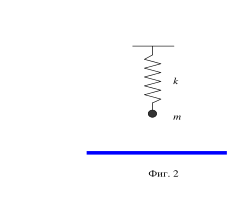

[[Състезания/esenno/10/2022|◂ 2022]] | [[Състезания/esenno/10r/2023|решения]] | [[Състезания/esenno/10/2024| 2024 ▸]]

Задача 1. Електричен дипол

Електричен дипол наричаме система от два електрични заряда q и -q , които се
намират на малко разстояние l един от друг. Той се характеризира с величината
електричен диполен момент p = ql , насочен от отрицателния към положителния заряд.

а) Намерете силата F1 (по големина и посока), с която положителен точков заряд
Q действа на дипол, разположен на разстояние r >> l , ако диполният момент p е насочен
по съединяващата ги права. Разгледайте двете възможни ориентации на дипола.
Разстоянието r между точковия заряд и дипола е разстоянието между точковия заряд и
средата на разстоянието между двата заряда на дипола. (3 т.)

б) Получете израз за интензитета E на електричното поле на разстояние r >> l на
електричен дипол с диполен момент p = ql в точка, лежаща върху правата, по която е
насочен диполният момент. Всеки заряд на дипола създава независимо от другия
електрично поле, а интензитетът на полето на дипола е векторна сума от интензитетите
им. Как зависи посоката на интензитета на полето от ориентацията на дипола върху
правата? Разстоянието r се отчита от средата на отсечката, съединяваща зарядите. (2,5 т.)

в) Определете силата F12 (по големина и посока), с която електричен дипол с
диполен момент p1 = q1l1 действа на дипол с диполен момент p2 = q2l2 , когато те са
ориентирани по съединяващата ги права. Разстоянието r >> l1 , l2 е разстоянието от средата
на първия дипол до средата на втория дипол. (4,5 т.)

Задача 2. Електрическа верига (Козел 2.4.5)

На фиг. 1 е показана схемата на електрическа верига. Напреженията E 0 и E1 на
източниците, както и съпротивленията R0 , R1 , R2 , R3 , са известни.

а) Намерете израз за тока I 0 през съпротивлението R0 . Зависи ли посоката на тока
от конкретните стойности на параметрите на участващите елементи. (5,5 т.)

б) Определете токовете I 2 , I 3 (съответно течащи през резисторите R2 и R3) и
посочете посоките им в зависимост от конкретните стойности на параметрите на
елементите във веригата. (3 т.)

в) Получете изрази за токовете I 0 , I 2 , I3 при R0 = R2 = R3 = R . (1,5 т.)

Задача 3. Пружинно махало

А. Вертикално пружинно махало с коефициент на
еластичност $\kappa$0 = 40 N/m и маса m = 100 g е закачено над
k хоризонтална метална равнина. Когато на тялото с маса
m се придаде електричен заряд q = 1 $\mu$C, махалото
m
започва да трепти с амплитуда a = 1 cm. Зарядът на
махалото индуцира в металната равнина електричен
заряд. Взаимодействието на заряда q със заряда на
металната равнина може да се опише като
Фиг. 2 взаимодействие на заряда q със заряд q' със същата
големина, който е разположен в мястото на огледалния
образ на заряда q спрямо равнината.

а) Определете периода T0 на незареденото пружинно махало. (2 т.)

б) Какъв е знакът на заряда q' ? (1 т.)

в) Определете честотата на хармоничните трептения на зареденото вертикално
пружинно махало. (7 т.)
Указание. Константата в закона на Кулон k = 9.109 N.m2 /C2 .