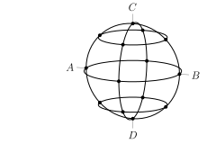

Задача 1. Цилиндър с радиус R е закрепен така, че оста му е хоризонтална. Около
цилиндъра е навита тънка неразтеглива нишка с пренебрежимо малка маса. За
свободния край на нишката е вързано топче с маса m (виж фигурата), което може
да се люлее като математично махало. Първоначалната дължина на нишката, из-
мервана от цилиндъра до топчето е L0 (L0 $\gg$ R). Започваме да развиваме нишката
с по една навивка, като след всяко развиване измерваме периода на махалото.
Първото измерване на периода е при дължина на нишката L0 . В таблицата под
фигурата са записани някои от измерените стойности за периода T , съответстващ
на броя развити навивки n. Приемете, че земното ускорение е g = 9.8 m/s2 .
1.1. Изразете периода на махалото T като функция на n. (1 т.) Използвайте получе-
ната функция, за да намерите линейна зависимост, от която могат да се определят
стойностите на L0 и R. (1 т.)
1.2. Пресметнете стойностите на новите променливи, получени от линейната зави- n T, s
симост, запишете ги в таблица (2 т.) и начертайте графика на функцията (4 т.).
Определете L0 и R от графиката. (2 т.)

 Забележка: фигурата е ориентировъчна, размерите на изобразените предмети
не са в мащаб, а върху цилиндъра има достатъчно нишка за развиване. Трептенията са хармонични при всяка дължина на нишката.

Задача 2. Силата на взаимодействие между два точкови заряда се описва от за- 10 3.00
кона на Кулон, а всяко заредено тяло може да представи като съвкупност от 11 3.07
достатъчно голям брой точкови заряда. Това ни позволява да изследваме взаи- 12 3.19
модействията между заредени тела с различни форми, не само между точкови 13 3.26
заряди. Нека разгледаме тънък пръстен с радиус R, които е равномерно зареден 14 3.33
с общ заряд Q. Пръстенът е разположен така, че оста му е хоризонтална.

2.1. Намерете силата, която действа на точков заряд q0 намиращ се на разстояние x по оста на
пръстена, спрямо центъра му. Изразете F като функция на x. (5 т.)

2.2. Пресметнете интензитета на електричното поле E(x), създавано от пръстена, в точката
където се намира q0 . (1 т.) Получете израз за E при x $\gg$ R. (1 т.)

2.3. Към най-високата част на пръстена връзваме непроводяща нишка с пренебрежимо малка
маса. На другия край на нишката закрепяме заряда q0 , който има маса m. Намерете дължината
на нишката L0 , при която q0 ще остане на оста на пръстена и ще бъде в равновесие. (3 т.) Земното
ускорение е g.

Задача 3. От проводник с напречно сечение S и специфично
съпротивление $\rho$ е направена "сфера" с радиус r. Сферата се
състои от четири меридиана (всеки два съседни са взаимно
перпендикулярни), екватор и два еднакви паралела такива, че пресечните им точки с меридиана CAD разделят дъгите $\overgroup{CA}$ и $\overgroup{AD}$ на по две равни части.

3.1. Пресметнете съпротивлението RCD на "сферата" между
точки C и D. (3 т.)

3.2. Пресметнете съпротивлението RAB на "сферата" между точ-
ки A и B. (7 т.)