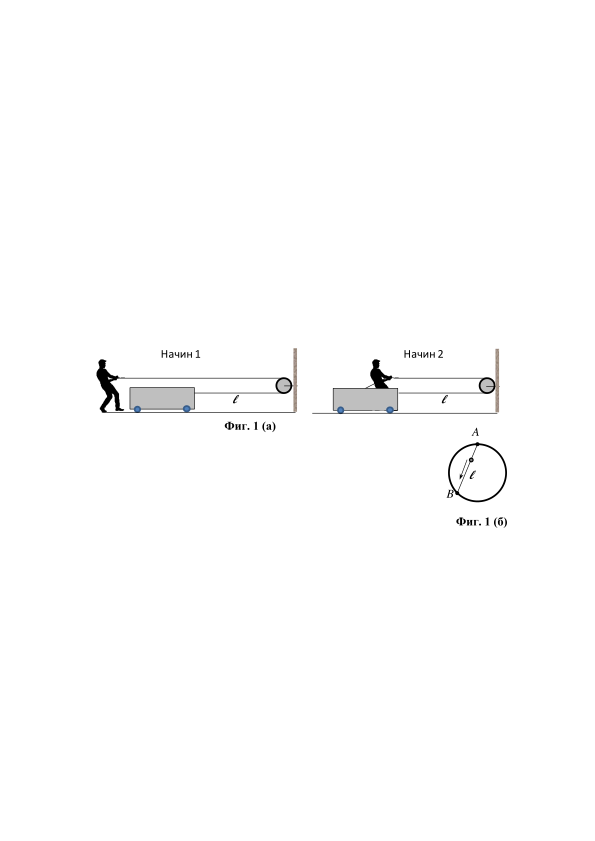
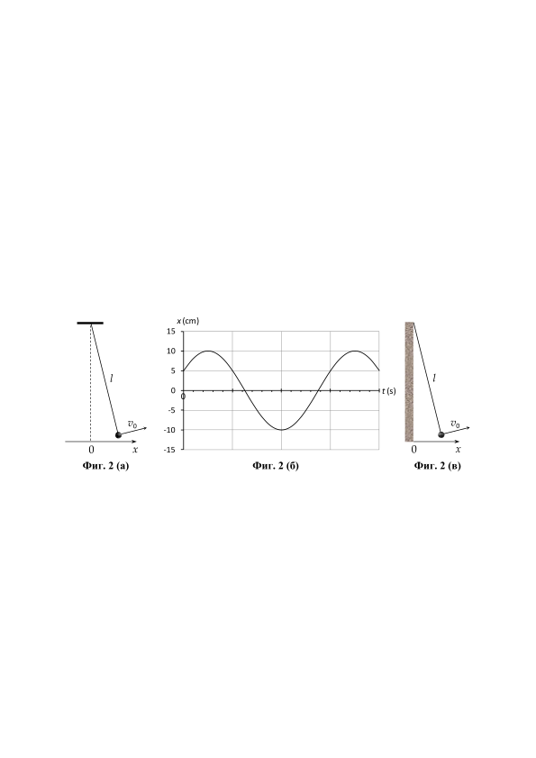

Задача 1. Бързо, по-бързо, най-бързо
а) Към натоварена с пясък количка с обща маса
е завързано дълго въже,
което преминава през свободно въртяща се макара, закрепена на стена на разстояние
от количката (фиг. 1 (а)). Работник с маса
трябва да придвижи количката до
стената, като дърпа свободния край на въжето със сила
. За целта той може
да постъпи по два начина: 1) да дърпа въжето, докато стои неподвижен на земята; 2) да
се качи на количката и дърпайки въжето да се "вози" на нея до стената.
При кой от двата начина на придвижване количката ще стигне до стената по-бързо?
Докажете отговора си с прeсмятания. Приемете, че при търкаляне на колелата на
количката по земята им действа сила на триене с коефициент
.
\[5,0 т\]

б) Между най-високата точка А от вертикален обръч с радиус
и
друга точка B от обръча е опъната тънка метална жичка с дължина
(
). На жичката е нанизано леко мънисто, което може да се
хлъзга по нея без триене. При каква дължина на жичката мънистото
ще стигне от т. А до т. В за най-малко време, ако започне да се хлъзга
без начална скорост?
\[3,0 т\]

в) Алпинист трябва да се придвижи между две вертикални скали на разстояние една
от друга, като се хлъзга по опънато между скалите въже. Колко трябва да бъде
разликата между височините на двата края на въжето, така че алпинистът да стигне
до другата скала за най-малко време? Колко е това минимално време? Приемете, че
въжето не се огъва от тежестта на алпиниста и хлъзгането е без триене. \[2,0 т\]
Задача 2. Махало
На фиг. 2 (а) е изобразено математично махало с дължина на нишката
. В
началния момент (
) махалото е отклонено от равновесното му положение и на
окаченото тяло е придадена начална скорост
в показаната на фигурата посока. На
фиг. 2 (б) е дадена графика на зависимостта на отклонението
на окаченото тяло
спрямо вертикалата, минаваща през точката на окачване, от времето за определен
интервал след началото на движението.
1

а) На графиката от фиг. 2 (б) няма нанесени числени стойности по абсцисата. На колко
секунди съответства едно малко скално деление от абсцисата?
\[2,0 т\]
б) Като използвате модела от фиг. 2 (а), начертайте схематично положението на
махалото и посоката на скоростта му в момента
.
[2,5 т]
в) На колко е равна началната скорост
на окаченото тяло?
[3,5 т]
г) Вместо на тавана, махалото е окачено на твърда вертикална стена, както е показано
на фиг. 2 (в). То е отклонено на същото разстояние и е пуснато да се люлее със същата
начална скорост, както в случая, показан на фиг. 2 (а). При удар със стената окаченото
тяло отскача в противоположна посока със скорост, два пъти по-малка от скоростта, с
която се е движило преди удара. Определете времето , изминало от началния момент
до момента на петия поред удар със стената.
[2,0 т]
Указания
$\cdot$ Всички крайни числени отговори в тази задача закръгляйте до две значещи
цифри, например
,
или
.
$\cdot$ Акo
, може да използвате следната приблизителна формула за
коренуване
, която дава резултат с точност до втория знак след
десетичната запетая.

Задача 3. Парен локомотив
От опит знаете, че водата в отворен
към атмосферата съд се изпарява напълно
след достатъчно дълго време. Ако съдът
обаче е затворен, изпаряването продължава докато водните пари в съда достигнат определена максимална плътност .
Тогава казваме, че в съда има наситени
водни пари. На фиг. 3 (а) е показана
графика на зависимостта на плътността
на наситените водни пари от температурата на водата, а на фиг. 3 (б) - на
налягането
, което наситените водни
пари упражняват върху стените на съда.

При решаването на задачата, трябва да
използвате както данните от двете
графики, така и следните константи:
$\cdot$ специфична топлина на изпарение
на водата,
;
$\cdot$ нормално атмосферно налягане,
;
$\cdot$ специфична топлина на изгаряне на
въглищата*,
.

* Специфичната топлина на изгаряне на дадено гориво е количеството топлина, което
се отделя при изгаряне на единица маса от горивото.

На фиг. 3 (в) е илюстриран един цикъл от работата на парна машина, подобна на
машините, които били използвани в парните локомотиви в миналото. В голям котел (не
е показан на фигурата) се намира вода, която се загрява от изгарящи въглища до
температура
. Получената в котела наситена пара минава през клапана К1 и
попада в цилиндъра (1) с обем
, в който се движи буталото (2). Парата избутва
буталото от левия до десния край на цилиндъра. След това клапанът К1 се затваря, а се
отваря клапанът К2, през който парата бързо излиза в атмосферата и буталото се връща
отново в левия край на цилиндъра. После К2 отново се затваря, К1 се отваря и цикълът
на работа на машината се повтаря. При движението си между двата края на цилиндъра,
буталото задвижва колелата (3) на локомотива посредством лоста (4). Радиусът на
колелата е
и при движението на локомотива те се търкалят по релсите, без
да се хлъзгат по тях. Може да приемете, че в котела и в цилиндъра няма въздух, а само
пара. Извън цилиндъра има въздух при нормално атмосферно налягане.
а) Каква маса m вода се изпарява в котела за един работен цикъл на машината? [1,5 т]
б) Каква маса
вода трябва да побира котелът, за да може локомотивът да измине
разстоянието
от София до Бургас, без да се долива вода?
[1,5 т]
в) Каква минимална маса
въглища е нужна за това пътуване?
[1,5 т]
г) Колко е коефициентът на полезно действие на парната машина? Изразете отговора
в проценти?
[3,0 т]
д) Колко е полезната механична мощност P на парната машина, ако локомотивът се
движи с постоянна скорост
?
[2,5 т]

3

