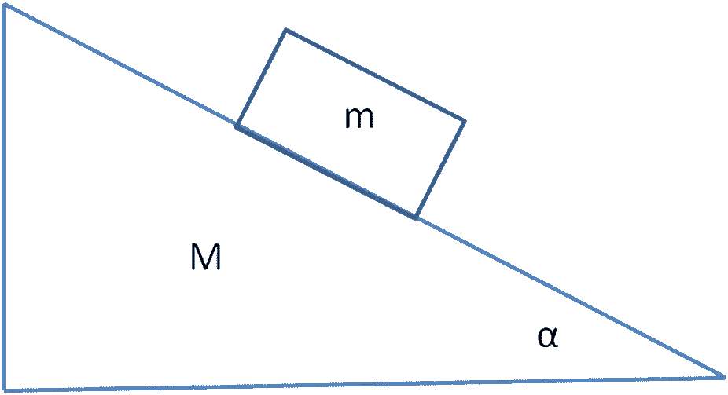
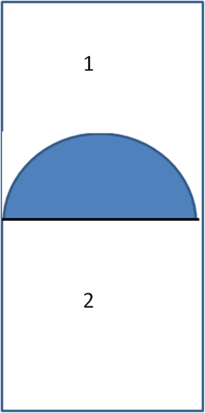

1. Върху хоризонтална равнина се намира триъгълна призма с маса M . Върху стената й, която
 сключва с хоризонта ъгъл $\alpha$ , е поставено трупче с маса m . Силите на триене между двете
 тела и между призмата и хоризонталната повърхност са пренебрежимо малки.

 Фиг. 1а

 Определете:
a) големините на ускоренията, с които ще се движат призмата и трупчето (по 4 точки за всяко от
 двете ускорения)
б) силата на взаимодействие между призмата и трупчето (2 точки)
2. Цилиндър, който има дъно с радиус r и височина 6r , е разделен на две части с помощта на
 бутало с форма на полукълбо, което може да се движи в цилиндъра без триене. Плоскостта
 на буталото е винаги перпендикулярна на оста на цилиндъра. От двете страни на буталото
 се намира въздух с различни температури. Ако цилиндърът се постави вертикално така, че
 изпъкналата част на буталото да е надолу, то заема равновесно положение, при което
 изпъкналата му част слиза до дъното на цилиндъра, без да се опира в него (виж Фиг. 2а). Ако
 цилиндърът се преобърне и пак е вертикален, равновесното положение на буталото е такова,
 че плоската му част се намира на средата на цилиндъра (виж Фиг. 2б).
a) Определете отношението на масите на въздуха в двете части на съда, ако отношението на
температурата на въздуха в страната, ограничена с изпъкналата част на буталото, към
температурата на въздуха от другата страна на буталото е n . По време на опита температурата
на въздуха от двете страни на буталото се поддържа еднаква и постоянна. (7 точки)
б) Колко пъти трябва да се повиши температурата на въздуха, ограничен с плоската страна на
буталото, за да заеме то равновесно положение, при което изпъкналата му част да се издигне до
дъното на цилиндъра, без да се допира до него (виж Фиг. 2в). (3 точки)

 Фиг. 2а Фиг. 2б Фиг. 2в

Указание: Приемете, че силата, с която газа, действащ върху изпъкналата част на буталото
 2
страна, е F1 = p1$\pi$ r , където p1 е налягането на газа. Уравнението за състоянието на идеален
 m
газ (уравнение на Клапейрон) има вида: pV = nRT = RT , където p е налягането, V е обема,
 M
T е температурата на идеалния газ, n е количеството вещество, m е масата на газа, M е
моларната маса на газа и R = 8, 413 J ( mol $\cdot$ K ) е универсалната газова константа.
3. Експериментално установените честоти на спектралните линии на водородния атом се
 задават с помощта на формулата $\displaystyle\nu_{nm} = R\left(\frac{1}{n^2}-\frac{1}{m^2}\right), n < m$, където R = 3,29 $\cdot$ 1015 Hz , а n
 и m са цели положителни числа. Величината R е наречена константа на Ридберг.
 Използвайки атомния модел на Бор:
a) изведете формула за радиусите на стационарните орбити на електрона във водородния атом.
(3 точки)
б) пресметнете числената стойност на радиуса на първата стационарна орбита на електрона във
водородния атом (радиуса на Бор). (1 точка)
в) изведете формула за енергиите на електрона на различните стационарни орбити във
водородния атом. (3 точки)
г) пресметнете числената стойност на енергията на електрона на първата стационарна орбита
във водородния атом. (1 точка)
д) използвайки резултатите от точките в) и г), пресметнете стойността на константата на
Ридберг.
(2 точки)
Указание: Използвайте следните стойности на физични константи: константата на Планк е
h = 6,62 $\cdot$ 10 -34 J $\cdot$ s , елементарния електричен заряд е e = 1,60 $\cdot$ 10 -19 C , масата на електрона е
 ( )
me = 9,11 $\cdot$ 10 -31 kg , и електричната константа е $\varepsilon$ 0 = 8,85 $\cdot$ 10 -12 C 2 / N $\cdot$ m 2 .
 Приемете, че на кръгова стационарна орбита се нанасят цяло число дължини на вълната
 h
на Дьо Бройл, т.е е в сила съотношението 2$\pi$ r = n
 , където r е радиуса на стационарната
 p
орбита, p = meu е импулса на електрона с маса me и скорост u , h е константата на Планк и n
е цяло положително число.
