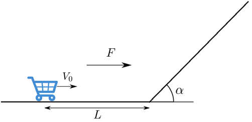

[[Състезания/esenno/11/2015|◂ 2015]] | [[Състезания/esenno/11r/2016|решения]] | [[Състезания/esenno/11/2017| 2017 ▸]]

**Задача 1. Механика**

Количка с маса $m$ е поставена върху повърхност, както е показано на фиг. 1. Повърхността се състои от хоризонтална и наклонена под ъгъл $\alpha = 45^\circ$ равнини. Духа вятър, който действа на количката с постоянна сила $F$ в хоризонтално направление. Земното ускорение е $g = 10 \text{ m/s}^2$. Разстоянието между количката и началото на наклонената повърхност е $L = 1 \text{ m}$. Намерете числен и аналитичен израз за:

а) началната скорост $V_0$, която трябва да се придаде на количката, така че тя да се качи по склона на височина $H = 1 \text{ m}$ при $F = 5 \text{ N}$ и $m = 2 \text{ kg}$; [3 т.]
б) скоростта на количката $V_2$, когато тя достига до основата на наклонената равнина преди изкачването; [2 т.]
в) максималното разстояние $L_{\text{max}}$, до което се връща количката назад по хоризонталната равнина след спускане; [2 т.]
г) времето $\tau$, за което количката достига максималната височина. [3 т.]

**Забележка:** Приемете, че триенето в системата, размерите на количката и инерчният момент на колелата са пренебрежими.

**Задача 2. Електричество**

На фиг. 2 а са показани 12 проводника, формиращи куб. Върховете на куба са означени с цифрите от 1 до 8. Проводниците имат следните съпротивления: $R_{12} = R_{14} = R_{15} = 1\ \Omega$, $R_{23} = R_{47} = R_{56} = 12\ \Omega$, $R_{26} = R_{34} = R_{57} = 8\ \Omega$, $R_{38} = R_{68} = R_{78} = 3\ \Omega$. Батерия с напрежение $U = 12$ волта е свързана към точки 1 и 8. Намерете:

а) съпротивлението между точки 1 и 8; [3 т.]

б) отделената топлина за единица време от веригата; [1 т.]

в) тока във всеки проводник. [3 т.]

Част от проводниците са заменени с еднакви кондензатори с капацитет $C = 15 \text{ mF}$, както е показано на фиг. 2 б. Намерете:

г) заряда и електростатичната енергия на всеки кондензатор, след като във веригата се установи постоянен ток. [3 т.]

**Упътване:** Точки с равни потенциали могат да се свържат с проводник с нулево съпротивление.

**Задача 3. Оптика**

**Част 1**
Крушка с мощност $P_1$ свети с нажежаема жичка, която представлява цилиндър с дължина $L_1$ и радиус $r_1$. Трябва да се изработи нова крушка с цилиндрична жичка от същия материал, която има същото работно напрежение, излъчва светлина с идентично спектрално разпределение, но има мощност $n P_1$.

а) Какви са дължината $L_2$ и радиусът $r_2$ на новата жичка? [4 т.]

**Упътване:** Приемете, че температурата е равномерно разпределена по обема на жичката и че жичката не излъчва от двата си края (сеченията).

**Част 2**
Слънчевата константа $k$ характеризира количеството слънчева радиация, което попада на перпендикулярна на слънчевите лъчи повърхност с площ $1 \text{ m}^2$ за време 1 секунда на разстояние $1 \text{ AU}$ (средното разстояние между Земята и Слънцето). Стойността ѝ е приблизително $k = 1300 \text{ W/m}^2$. Намерете:

б) с каква мощност $P$ излъчва Слънцето? [2 т.]

в) каква част от Слънчевата маса, $\Delta M/M_\odot$, се превръща в радиация, като приемете, че Слънцето свети $T \approx 10^9$ години и има маса $M_\odot \approx 2 \times 10^{30} \text{ kg}$? [2 т.]

Звездната величина е астрономическа мярка за яркостта на небесните обекти. Слънцето има звездна величина $m_\odot \approx -27$, а обекти със звездна величина 6 се считат за невидими за невъоръжено човешко око. Звездната величина се пресмята по следната формула:
$$m_1 - m_2 = -2.5 \log_{10} \left( \frac{I_1}{I_2} \right)$$
където $I_1$ и $I_2$ са интензитетите в две различни точки от пространството (мерени във $\text{W/m}^2$), а $m_1$ и $m_2$ са съответните звездни величини.

г) Намерете на какво разстояние в единици AU трябва да се отдалечим от Слънцето, за да не го виждаме? [2 т.]

**Упътване:** $1 \text{ AU} = 1.5 \times 10^8 \text{ km}$. Приемете, че Земната атмосфера не поглъща светлина. Скоростта на светлината във вакуум е $c = 3 \times 10^8 \text{ m/s}$.